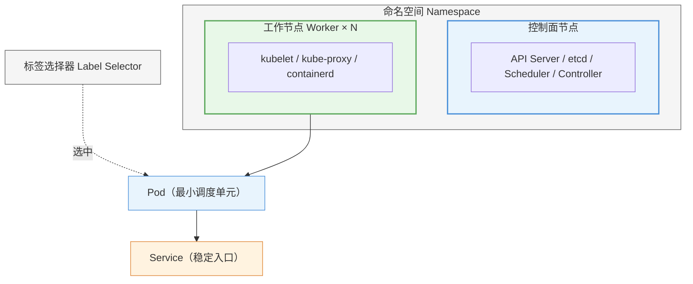
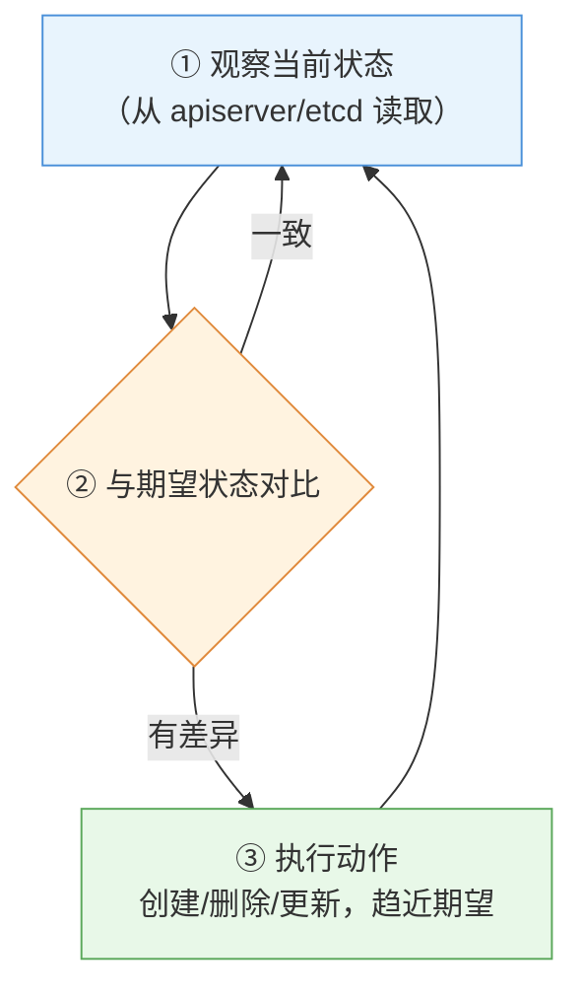
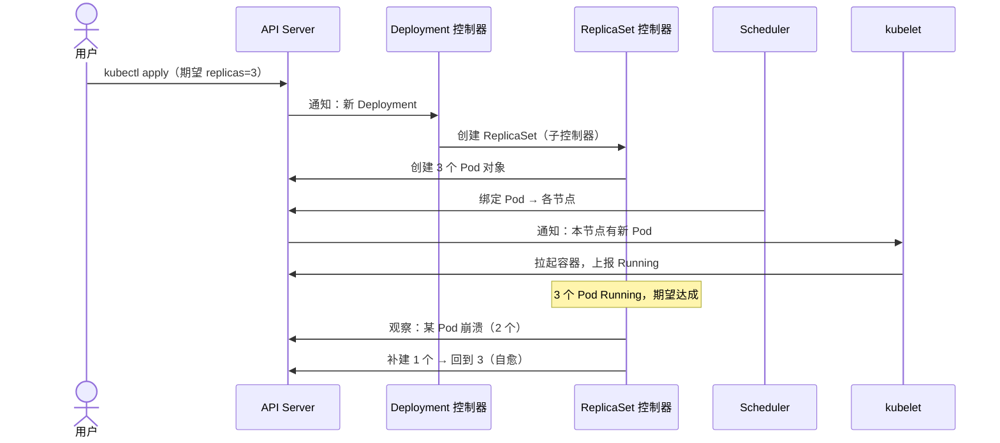
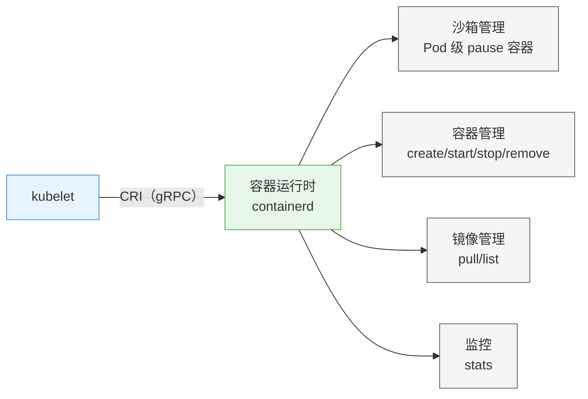
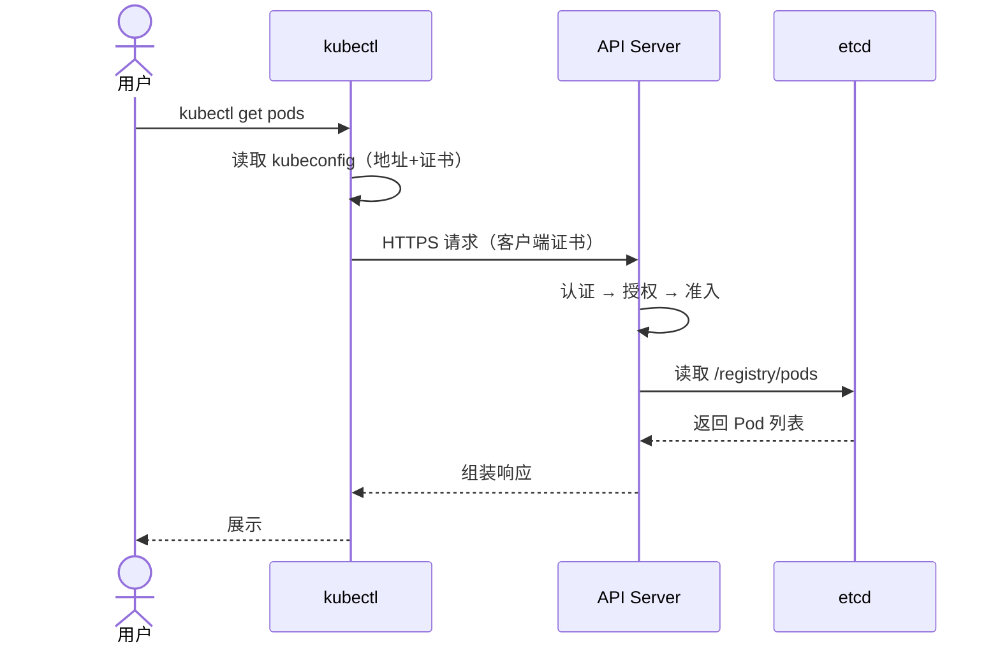
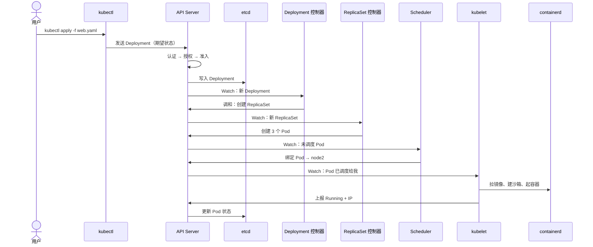

# 第 2 章 Kubernetes 概述与架构

> 配套实验手册：《Kubernetes 实验手册》（manual/ 目录）。**本章把核心概念与架构机制讲透**——这是整门课的知识起点；动手实验（创建、配置、排障）安排在第 3 章起的各章及实验手册中，但**重要概念会在后续反复出现、逐步加深**，本章奠定完整图景。本章 2.9 节提供 Killercoda 在线沙盒演练，让概念先落地为直观印象。

## 学习目标

学完本章，你应该能够：

1. 用一段话说明 Kubernetes 是什么、解决什么、核心承诺是什么
2. 完整解释 6 个核心概念（集群/节点、Pod、工作负载、Service、命名空间、标签选择器）——不是"听说过"，而是能讲清原理
3. 深刻理解**命令式 vs 声明式**两种操作方式的本质区别与各自适用场景
4. 解释**控制循环**：期望状态与当前状态如何被持续调和（自愈与弹性的根源）
5. 详细讲解控制面四组件（apiserver/etcd/scheduler/controller-manager）各自**做什么、怎么做、为什么**
6. 详细讲解数据面三组件（kubelet/kube-proxy/容器运行时）各自职责与工作机制
7. 说清组件间**通信的全流程**（一次请求的旅程、TLS 安全、端口）
8. 完整理解对象模型：Group/Version/Kind 与 metadata/spec/status 每部分的含义
9. 熟练 kubectl 高频命令与 kubeconfig 上下文切换
10. 在 Killercoda 沙盒完成集群观察、Pod 创建、自愈验证、Service 与扩缩容演练

---

## 2.1 Kubernetes 是什么

### 2.1.1 定义与来历

**Kubernetes（K8s）** 是一个开源的**容器编排平台**——自动化容器的**部署、扩缩容、调度、网络、存储与自愈**。

- 名字：希腊语"舵手 / 领航员"；"K8s"是 K + 中间 8 个字母 + s 的缩写（kubernetes）
- 出身：由 Google 发起，源自其内部使用了十几年的集群管理系统 **Borg**（K8s 常被称为"开源版 Borg"）
- 2015 年捐赠给 **CNCF**（云原生计算基金会），现为 **CNCF 毕业项目**（Graduated，2018 年 3 月首个毕业项目）——同为 CNCF 毕业项目的还有 Prometheus（2018）、containerd（2019）等
- 当前事实标准：AWS(EKS)、Azure(AKS)、GCP(GKE)、阿里云(ACK)、华为云(CCE) 全部提供托管 Kubernetes

### 2.1.2 它解决什么（承接第 1 章痛点）

第 1 章讲过：Docker 擅长"跑一个容器"，但**运维一群容器**时有一堆问题。Kubernetes 针对每个痛点给出了机制：

| 单机容器痛点 | Kubernetes 的机制 | 本章/后续位置 |
|---|---|---|
| 容器崩了、机器挂了没人管 | **自愈**：控制器自动重建、节点故障驱逐 | §2.3 控制循环、第 5 章 |
| 流量波动需要扩缩容 | **弹性**：手动 scale + 自动 HPA | §2.9 演练、第 7 章 |
| 容器 IP 每次重启都变 | **Service**：稳定虚拟 IP + DNS 名 | §2.2.4、第 9 章 |
| 多副本流量如何分发 | **负载均衡**：Service + kube-proxy | §2.5.2、第 9 章 |
| "进程活着"不等于"服务可用" | **探针**：readiness/liveness 健康检查 | 第 4 章 |
| 容器删除数据丢失 | **持久化**：PV/PVC、StorageClass | 第 10 章 |
| 配置和密码散落在各处 | **ConfigMap / Secret** | 第 8 章 |
| 多个环境、多团队资源混用 | **命名空间 + 配额** | §2.2.5、第 7 章 |

### 2.1.3 核心承诺（设计宣言）

- **声明式，而非命令式**：你描述"最终要什么"，Kubernetes 负责"如何达成并持续维持"
- **自愈**：系统永不停止地把自己调和到期望状态——崩溃、驱逐、扩容都自动处理
- **可移植**：同样的集群和应用可以跑在裸机、虚拟机、任意公有云上
- **可扩展**：通过 CRD（自定义资源）、Operator、CNI/CSI 插件机制无限演进——K8s 不只是编排器，更是一个"可编程的平台底座"

---

## 2.2 六个核心概念详解

> 本节的每个概念都会**讲清原理**（不满足于一句话定义）；"怎么创建、怎么配"的实操在第 3 章起的各章，但概念本身现在就要完整建立。

### 2.2.1 集群与节点

**集群（Cluster）** 是一组机器的集合，Kubernetes 在这组机器上调度容器，对外呈现为一个整体。

**节点（Node）** 是集群中的一台机器（物理机或虚拟机）。按角色分两类：

- **控制面节点（Control Plane / 旧称 master）**：运行集群的**管理组件**（§2.4），相当于"大脑"。默认不运行业务容器（有污点保护，第 6 章讲污点）。生产环境通常部署 2-3 个控制面节点做高可用。
- **工作节点（Worker Node）**：运行**业务容器**的机器，数量按需扩展。

每个节点上都有固定的三件套：**kubelet**（节点代理）、**kube-proxy**（网络转发）、**容器运行时**（如 containerd）。节点通过 kubelet 定期向控制面上报心跳，控制面据此判断节点是否健康（`Ready`/`Ready`）。

> 判断集群规模：`kubectl get nodes` 显示所有节点及状态；这是排障的第一步（第 16 章）。

### 2.2.2 Pod：最小调度单元

**Pod 是 Kubernetes 调度的最小单位**——不是容器。理解这一点是全书基础。

**Pod 的组成**：一个 Pod 包含**一个或多个容器**，这些容器被 Kubernetes 打包在一起，共享：

- **同一个网络命名空间**：共享一个 IP（Pod IP）和端口空间——容器间用 `localhost` 通信
- **同一个 UTS 命名空间**：共享主机名
- **共享存储卷**：Pod 级卷可以被内部所有容器挂载
- **同一个生命周期**：一起创建、一起销毁（Pod 是"逻辑主机"）

**为什么需要 Pod**：有些应用需要"多个进程紧密协作、同生共死"（如主应用 + 日志采集 sidecar、Web + 代理）。把它们放在一个 Pod 里，共享网络和存储，比两个独立容器更容易管理。

**Pod IP**：每个 Pod 获得一个集群内唯一的 IP（本课程约定网段 `10.244.x.x`，由 CNI 网络插件分配，第 9 章）。**注意 Pod IP 是临时的**——Pod 重建 IP 就变，这是 Service 存在的原因。

**Pod 的生命周期**（概览，第 4 章展开）：

```text
Pending（已创建未调度）→ Running（容器运行中）→ Succeeded/Failed（正常/异常退出）
                                        └→ 被删除（Terminating）
```

**无状态 vs 有状态**：Pod 本身"无状态"（删了数据即失，第 1 章镜像分层已解释）；需要持久数据时挂卷（第 10 章）。

> **核心认知**：以后看到"调度、扩缩、自愈"都发生在 **Pod 级别**——控制器管理的是"多少个 Pod 处于期望状态"。

### 2.2.3 工作负载控制器（Workload Controllers）

控制器（Controller）是"管理 Pod 的 Pod"。你几乎从不直接创建裸 Pod，而是声明"我要这种 Pod、要 N 个、怎么更新"，由控制器负责维持。

**Deployment**（最常用）——管理**无状态多副本**应用：

- 通过 **ReplicaSet** 维护固定数量的副本（`replicas: 3` = 始终 3 个）
- 支持**滚动更新**与**回滚**（更新镜像版本时逐批替换，不中断服务）
- 支持**扩缩容**（`kubectl scale`、HPA 自动扩）
- 自愈：副本崩溃自动重建（§2.3 实例）

**StatefulSet**——管理**有状态、有序**应用（数据库等）：

- 每个 Pod 有**稳定且有序**的标识（`web-0`、`web-0`、`web-0`）
- 稳定的网络标识（DNS 名）与稳定的存储绑定（每个 Pod 独立 PVC）
- 部署/缩容**按顺序**进行（先 0 后 1...）

**DaemonSet**——保证**每个节点恰好运行一个**副本：

- 典型用途：网络插件（calico-node）、监控采集器（node-exporter）、日志采集（filebeat）
- 新节点加入集群，DaemonSet 自动在新节点上创建副本

**Job**——保证**一次性任务成功完成**：

- 跑一次（如数据迁移、批处理），成功（`Completed`）即结束
- `backoffLimit` 控制失败重试次数

**CronJob**——按 **cron 表达式定时**触发 Job：

- 如每天凌晨备份：`schedule: "0 2 * * *"`

> 选择口诀：**无状态用 Deployment、有状态用 StatefulSet、每节点守护用 DaemonSet、一次性用 Job、定时用 CronJob**。各控制器的完整实验在实验手册（实验 03）。

### 2.2.4 Service：稳定入口

**问题**：Pod IP 是临时的（重建即变），且多副本时"该访问哪个 IP"？

**Service 的答案**：提供一个**稳定的虚拟 IP（ClusterIP）+ DNS 名**，自动把流量负载均衡到后端 Pod。

**工作方式**：

1. 你创建 Service，声明 `selector`（选哪些 Pod 作为后端，按标签匹配，§2.2.6）
2. Kubernetes 为 Service 分配一个**稳定的虚拟 IP**（ClusterIP，如 `10.96.x.x`）——**这个 IP 不会变**
3. kube-proxy（§2.5.2）在每个节点上写入转发规则：发往 ClusterIP 的流量 → 随机分发到后端 Pod
4. 集群 DNS（coredns）把 Service 名解析为 ClusterIP——**应用用名字访问，不关心 Pod IP**

**Service 的类型**（第 9 章完整实验）：

| 类型 | 作用域 | 说明 |
|---|---|---|
| ClusterIP（默认） | 集群内 | 只允许集群内部访问，默认类型 |
| NodePort | 集群外 | 在每个节点上开一个端口（30000-32767），外部通过 `节点IP:端口` 访问 |
| LoadBalancer | 集群外 | 云厂商负载均衡器（依赖云环境） |
| ExternalName | 外部 | 把 Service 名映射为集群外域名（DNS CNAME） |
| headless（`clusterIP: None`） | 集群内 | 不要虚拟 IP，DNS 直接返回所有后端 Pod IP |

> **核心认知**：Pod 会死会变，**Service 是稳定的**——所以应用之间、外部访问都通过 Service，而不是直接连 Pod。

### 2.2.5 命名空间（Namespace）

**命名空间**把集群**逻辑隔离**成多个虚拟集群：

- **资源隔离**：Pod/Service/Deployment 等资源名在命名空间内唯一（同名不同命名空间互不冲突）
- **权限隔离**：RBAC 可以按命名空间授权（第 11 章）
- **配额隔离**：每个命名空间可设资源配额（第 7 章 ResourceQuota）
- **场景**：dev/test/prod 各一个命名空间，或每个团队一个

**内置命名空间**：

| 命名空间 | 用途 |
|---|---|
| `default` | 默认；没指定时资源都放这里 |
| `kube-system` | **系统组件**（apiserver/etcd/coredns 等，§2.4/2.5 的组件都在这里） |
| `kube-public` | 公开信息（集群内所有用户可读） |

> 操作：`kubectl get ns` 查看；`kubectl get ns` 指定命名空间；`kubectl get ns` 表示所有命名空间。

**注意**：命名空间隔离的是"名字"与"权限"，**不隔离网络**（跨命名空间的 Pod 默认可以互通；要隔离用 NetworkPolicy，第 9 章）。

### 2.2.6 标签与选择器（Label & Selector）

**标签（Label）** 是附加在对象上的**键值对**，如：

```text
app=web    env=prod    tier=frontend    version=v1.2
```

**标签的用途**：Kubernetes 的"关联机制"全靠标签——控制器选 Pod、Service 选后端、调度选节点（第 6 章），全部通过标签匹配。

**选择器（Selector）** 按标签筛选对象，两种写法：

- 等值：`kubectl get pods -l app=web`（=、!=）
- 集合：`kubectl get pods -l 'app in (web,api)'`（in/notin/exists）

**Selector 在 yaml 中的样子**（Deployment 用它管自己的 Pod，Service 用它选后端）：

```yaml
# Deployment 里：selector 匹配它管理的 Pod 模板标签
selector:
  matchLabels:
    app: web
```

```yaml
# Service 里：selector 决定哪些 Pod 是后端
selector:
  app: web
```

**标签 vs 注解（Annotation）**：

- **标签**：结构化键值对，**可被选择器选中**（用于关联/筛选）
- **注解**：任意键值对（可含长文本），**不能被选择器选中**（只做元数据说明，如版本说明、负责人）

> 记忆：**标签是"身份证号"（能被查），注解是"备注栏"（只能看）**。

### 2.2.7 六个核心概念关系图

<!-- 原 ASCII 图已转为 Mermaid -->


> 读图要点：**命名空间是逻辑边界**（包含控制面与工作节点上的所有资源）；Pod 运行在工作节点上，是调度的最小单元；Service 为 Pod 提供稳定入口；标签选择器把控制器/Service 与 Pod 关联起来——六概念的三个关系（包含、运行、关联）一图看清。

---

### 2.2.8 设计指南：企业级命名与标签规范

> 小团队随性命名没问题；**多人/多团队协作时，没有规范的命名与标签，集群就是"命名空间垃圾场"**——本小节给出可直接落地的生产基线。

**Kubernetes 官方推荐标签**（所有工作负载建议携带，Helm/监控/成本分析工具都识别它们）：

```yaml
metadata:
  labels:
    app.kubernetes.io/name: order-service      # 应用名
    app.kubernetes.io/version: "1.2.3"         # 版本号
    app.kubernetes.io/component: api           # 组件角色（api/worker/ui）
    app.kubernetes.io/part-of: e-commerce      # 所属系统
    app.kubernetes.io/managed-by: helm         # 管理工具
  annotations:
    team: trade-team                           # 负责团队（告警路由）
    oncall: zhangsan@example.com               # 值班联系人
    cost-center: "BU-001"                      # 成本中心（计费）
```

**命名空间命名规范**：

```text
格式：{团队/业务域}-{环境}
示例：order-dev / order-prod / infra-monitoring / shared-middleware
禁止：纯数字/无意义缩写、超过 63 字符（K8s 限制）、下划线（DNS 不兼容）
```

**对象命名规范**：

| 对象 | 格式 | 示例 |
|---|---|---|
| Deployment | `{app}-{component}` | `{app}-{component}`、`{app}-{component}` |
| Service | `{app}-{component}-svc` | `{app}-{component}-svc` |
| ConfigMap | `{app}-{用途}-config` | `{app}-{用途}-config` |
| Secret | `{app}-{用途}-secret` | `{app}-{用途}-secret` |
| Ingress | `{app}-{component}-ingress` | `{app}-{component}-ingress` |
| PVC | `{app}-{component}-data` | `{app}-{component}-data` |

> 决策逻辑：**命名是给"人"看的（可检索）、标签是给"机器"用的（可筛选）**——命名统一便于运维沟通与故障定位，标签齐全让监控/成本/权限工具自动工作。

---

## 2.3 命令式 vs 声明式，与控制循环 ⭐

> 这是全书最重要的两个设计思想。**先讲透"两种操作方式"，再讲"系统如何维持状态"**——理解它们，就理解了 Kubernetes 与"传统运维脚本"的根本区别。

### 2.3.1 命令式 vs 声明式：两种操作哲学

**命令式（Imperative）**——"告诉我**怎么做**"

- 你一步步下达具体指令，系统**只执行，不记忆**
- 例（传统方式）：`docker run nginx`、`docker run nginx`、`docker run nginx`
- 特点：直接、快速、适合临时操作；但**不记录意图**——下次还要重新敲一遍

**声明式（Declarative）**——"告诉我**要什么**"

- 你提交一份**期望状态**的描述（YAML），系统自己决定怎么做、并**持续维持**
- 例：`kubectl apply -f web.yaml`（yaml 里写着"3 个副本、镜像 nginx:1.27"）
- 特点：意图明确、可版本化（yaml 即代码）、可重复、**系统持续保证状态**（自愈）

**三种具体操作模式**（kubectl 层面）：

| 模式 | 方式 | 特点 | 例子 |
|---|---|---|---|
| 命令式命令 | `kubectl run/scale/delete` | 最快，但无状态记录 | `kubectl run/scale/delete` |
| 命令式对象 | `kubectl create/replace -f file.yaml` | 把 yaml 当"一次性指令"，覆盖执行 | `kubectl create/replace -f file.yaml` |
| **声明式对象** | `kubectl apply -f file.yaml` | **推荐**：以文件为唯一事实来源，可重复应用 | `kubectl apply -f file.yaml` |

**为什么生产用声明式（apply）**：

1. **意图即代码**：yaml 文件就是"配置即代码"，进 Git 版本管理、可 review、可回滚
2. **幂等**：同一份 yaml 反复 `apply` 结果一致——这是 CI/CD 的基础
3. **可自愈**：系统记住这份期望状态，任何偏离都被自动修复（下面控制循环）
4. **对比 `create` vs `create`**：`create` 在资源已存在时报错（只能建一次）；`create` 幂等更新（可反复执行）——所以**生产标准是 `create`**

> **一句话**：命令式是"手把手教系统做"，声明式是"给系统一张目标图，让它自己达成并守住"。

### 2.3.2 期望状态与当前状态

- **期望状态（Desired State）**：你在 YAML 的 `spec` 里声明的目标——"要 3 个副本、镜像 nginx:1.27"
- **当前状态（Current State）**：集群里实际发生的情况——"现在只有 2 个副本"、或"有个 Pod 崩溃了"

Kubernetes 把期望状态**持久化在 etcd 里**（§2.4.2），然后**永不停止地**把当前状态向期望状态调和。

### 2.3.3 控制循环（Control Loop）：自愈与弹性的根源

每个控制器（Controller）内部都在执行同一个无限循环：

<!-- 原 ASCII 图已转为 Mermaid -->


> 读图要点：**循环永不停止**——"一致"不是终点而是回到观察；"有差异"才执行动作。这就是自愈（删了补）与弹性（改期望即扩缩）的共同引擎。

**控制器的内部组成**（以 Deployment 控制器为例）：

- **Informer / Reflector**：监听 apiserver，收到"对象变化"事件（如 Pod 被删）
- **WorkQueue**：把待处理的对象放入队列
- **Worker**：取出对象，对比期望（spec）与当前（status），执行调和动作
- 调和后更新 status（如"当前副本数 3/3"）

> 所有控制器（deployment、replicaset、daemonset、job、namespace...）都是这个模式——**理解了控制循环，就理解了整个系统的自愈机制**。

### 2.3.4 实例走查：Deployment 如何保证"3 个副本"

<!-- 原 ASCII 图已转为 Mermaid -->


> 读图要点：**职责分层**（Deployment 管 RS → RS 管数量 → Scheduler 管落点 → kubelet 管运行）与**一切通过 apiserver**（没有组件直连）；"自愈"就是 RS 观察到副本数偏离后补建。

**要点**：

- **职责分层**：Deployment 管 ReplicaSet → ReplicaSet 管 Pod 数量 → scheduler 管落点 → kubelet 管运行
- **一切通过 apiserver**：控制器不直接碰 Pod，只读写 apiserver 的对象（§2.6）
- **弹性的来源**：`kubectl scale` 或 HPA 只是**修改了期望状态**（replicas 3→5），剩下的调和由控制器自动完成

---

## 2.4 控制面组件详解

> 控制面是集群的"大脑"。四个组件**各司其职、只与 apiserver 通信**（§2.6 展开通信机制）。本节逐个讲清"做什么、怎么做、为什么"。

### 2.4.1 kube-apiserver：集群的唯一入口

**地位**：整个集群的**大门**——所有请求（kubectl、各组件、Pod 内服务、控制台）都先到这里。设计原则是"**所有组件不直接互访，只通过 apiserver 交互**"（星型拓扑），这让认证、授权、审计集中在一点。

**一次请求在 apiserver 内部的完整流程**（这是理解 apiserver 的关键）：

```text
客户端请求（kubectl / 组件 / Pod）
   │
   ▼
① 认证 Authentication：你是谁？
   - 校验客户端证书（X.509）/ Token / 用户名密码
   - 通过 → 得到身份（user + group）
   │
   ▼
② 授权 Authorization：你能干什么？
   - 基于身份的 RBAC 检查（第 11 章）
   - 如"user 能否 get pods in namespace default"
   │
   ▼
③ 准入控制 Admission：请求合法吗？
   - 一组插件按顺序检查/修改请求（如 LimitRange 校验资源、PSA 检查 Pod 安全）
   - 可拒绝（Forbidden/validation 错误）——第 12 章
   │
   ▼
④ 持久化：写入 etcd（§2.4.2）
   │
   ▼
⑤ 返回结果 + 通知关注者（Watch 机制）
```

**apiserver 的另外两个关键能力**：

- **Watch（监听）机制**：各控制器通过 apiserver 的 Watch API **订阅**资源变化（"Pod 被删了"），这是控制循环的"眼睛"（§2.3.3）
- **API 发现**：`kubectl api-resources`、`kubectl api-resources` 都来自 apiserver 的发现接口

**为什么它是唯一入口**：集中管控 = 一处认证授权、一处审计、一处限流。即使 etcd 挂了，apiserver 的缓存也能让"读"暂时可用——所以排障时"apiserver 起不来 = 集群完全不可用"。

### 2.4.2 etcd：集群的状态存储

**地位**：集群的"数据库"——**所有对象的期望状态与当前状态都存这里**（Pod、Service、ConfigMap、Secret 的完整定义）。**丢了 etcd = 丢了整个集群**（第 3 章专门讲备份，CKA 必考）。

**存储内容**（键值对，按路径组织）：

```text
/registry/pods/default/nginx
/registry/deployments/default/web
/registry/secrets/default/mysql-pass
...
```

**技术要点**：

- **分布式一致性**：基于 **Raft 共识算法**——多节点 etcd（生产通常 3 个）之间通过投票保证数据一致；**需要奇数个节点**（3/5/7），因为 Raft 要求多数派（2/3、3/5）才能提交
- 数据**落盘**在 etcd 数据目录；Secret 等敏感数据**默认明文存储**（可配静态加密，实验手册（实验 09） Lab 9 实操）
- 客户端端口 **2379**（apiserver 用它读写），节点间通信端口 **2380**（仅 etcd 集群内部）
- **注意**：etcd 只存**集群状态**，不存应用数据（应用数据在 PV 里，第 10 章）

**为什么单独一个组件存状态**：控制面组件（scheduler/controller）**无状态**——它们可以从 etcd 读全量状态、崩溃重启后靠 etcd 恢复。etcd 是"集群的记忆"，其他都是"读记忆的人"。

### 2.4.3 kube-scheduler：调度器

**职责**：决定**新创建的 Pod 落在哪个节点上**。它不运行容器，只做"分配决策"。

**两阶段调度**（这是理解调度的关键）：

```text
新 Pod（Pending）进入调度队列
   │
   ▼
阶段一：过滤（Filtering / Predicates）——排除不合适的节点
   检查项举例：
   - 节点资源够吗？（可用 CPU/内存 ≥ Pod 的 requests，第 7 章）
   - 节点满足 Pod 的 nodeSelector / 亲和要求吗？（第 6 章）
   - 节点污点 Pod 能容忍吗？（第 6 章）
   - 端口冲突吗？磁盘压力？年龄？
   → 得到"候选节点集合"
   │
   ▼
阶段二：打分（Scoring / Priorities）——在候选中选最优
   打分因素举例：
   - 节点剩余资源越均衡分越高（资源均衡）
   - 与已有同应用 Pod 分散开（Pod 反亲和，第 6 章）
   - 亲和偏好（第 6 章）
   → 得分最高者胜出
   │
   ▼
调用 apiserver：把 Pod 绑定（bind）到选中节点 → kubelet 接手
```

**为什么需要专门的调度器**：把"放哪"从"怎么跑"中分离——调度策略可插拔、可自定义（自定义调度器）、可预测。

> 排障关联：Pod 一直 `Pending`，十有八九是调度阶段失败——用 `Pending` 看 Events 的 `Pending` 原因（第 16 章）。

### 2.4.4 kube-controller-manager：控制器集合

**职责**：运行**集群内置的各类控制器**，每个控制器负责调和一类资源（都是 §2.3 控制循环的实例）。

**内置控制器举例**（不止这些）：

| 控制器 | 盯什么 |
|---|---|
| Deployment 控制器 | Deployment 的副本/更新状态 |
| ReplicaSet 控制器 | 副本数量（创建/删除 Pod） |
| DaemonSet 控制器 | 每节点一个副本 |
| Job 控制器 | 一次性任务完成 |
| CronJob 控制器 | 定时触发 |
| Namespace 控制器 | 命名空间删除（先清空内容） |
| Service 控制器 | Service/Endpoints 更新 |
| Node 控制器 | 节点健康、驱逐（Node Lifecycle） |
| 各类 GC 控制器 | 垃圾回收（删除级联等） |

**为什么合并成一个进程（controller-manager）**：每个控制器逻辑上独立，但打包成一个二进制方便部署与升级（kubeadm 安装时只需管一个 Pod）。

> 排障关联：你想"删个 Pod 它又回来了"——不是魔法，是某个控制器在调和（用 `kubectl get <controller类型>` 看谁在管）。

### 2.4.5 cloud-controller-manager（云环境）

**职责**：对接**云厂商 API**（AWS/Azure/GCP/阿里云等）：

- 云负载均衡器（LoadBalancer Service 的创建/删除）
- 云路由（节点网络）
- 云磁盘（存储集成）

**裸机/教学集群没有它**——本课程 3 节点 kubeadm 集群不含此组件。知道它是"云环境的适配器"即可。

---

## 2.5 数据面组件详解

> 数据面（节点侧）是"执行者"：真正跑容器、转流量、报状态。三个组件缺一不可。

### 2.5.1 kubelet：节点上的"Kubernetes 代理"

**地位**：每个节点上的核心代理——**管理该节点所有 Pod 的生命周期**，并持续向控制面上报节点状态。

**kubelet 做什么**（收到 apiserver 的 Pod 调度指令后）：

```text
apiserver 通知: "Pod X 调度到本节点"
   │
   ▼
① 从 apiserver 读取 Pod 定义（spec）
   │
   ▼
② 通过 CRI（§2.5.3）调用容器运行时：
   - 创建 Pod 沙箱（pause 容器，§2.5.3）
   - 拉取镜像（若本地没有）
   - 创建并启动应用容器
   - 挂载卷、配置网络
   │
   ▼
③ 持续监控：
   - 执行探针（liveness 失败 → 重启容器；readiness 失败 → 摘除流量）
   - 采集容器资源使用（cAdvisor，供 kubectl top / HPA）
   │
   ▼
④ 心跳上报：定期（默认每 10s）向 apiserver 上报节点状态
   - 超过 grace period（默认 40s）无心跳 → 控制面判定节点 NotReady（第 16 章）
```

**关键点**：

- kubelet 是"节点侧唯一与 apiserver 对话的人"（容器运行时只听 kubelet 的）
- **节点 Ready 与否取决于 kubelet 心跳**——排查"节点 NotReady"= 排查 kubelet（第 16 章）
- 静态 Pod（static pod，kubelet 直接从 `/etc/kubernetes/manifests/` 读的 Pod，如 etcd/apiserver 自身）由 kubelet 直接管理，不经调度器（第 3 章安装时能看到）
- 端口 **10250**：apiserver 用 HTTPS 访问它（kubelet 的 API）

### 2.5.2 kube-proxy：Service 的"交通警察"

**职责**：实现 **Service 的负载均衡**——把发往 Service 虚拟 IP 的流量，转发到后端的某个 Pod。

**工作机制**（基于 Linux 内核）：

```text
应用访问 Service: http://10.96.x.x:80（ClusterIP）
   │
   ▼
进入节点内核（iptables 或 IPVS）
   │
   ▼
kube-proxy 提前写好的规则匹配到这个 Service IP
   │
   ▼
按规则随机/轮询选择后端 Pod IP（Endpoints 列表）
   │
   ▼
DNAT 改写目标地址 → 转发到 Pod 容器
```

- **iptables 模式**（默认）：为每个 Service 写 iptables 规则；请求在规则里随机命中一个后端（随机，不是加权轮询）
- **IPVS 模式**：内核级负载均衡，支持更多算法（rr/wrr/lc 等），性能更好、规则更少
- kube-proxy 监听 apiserver 的 Service/Endpoints 变化，**自动更新规则**——所以 Pod 增删时转发规则跟着变

> **性能根因（iptables vs IPVS）**：iptables 是**线性链表（O(n)）**——请求要逐条遍历规则匹配，Service 越多越慢；IPVS 是**哈希表（O(1)）**——直接查表命中。这就是"Service 数量大了，IPVS 明显优于 iptables"的底层原因（第 9 章展开）。

> **核心认知**：kube-proxy 只做"转发"，**不做服务发现**（发现靠 DNS/coredns）；它也不是代理进程——**规则写进内核，流量不经过 kube-proxy 进程**（性能关键）。

### 2.5.3 容器运行时与 CRI

**职责**：真正"跑容器"的引擎——**containerd**（本课程）或 CRI-O。

**CRI（Container Runtime Interface）**：kubelet 与运行时之间的**标准接口**（gRPC）：

<!-- 原 ASCII 图已转为 Mermaid -->


> 读图要点：kubelet 是唯一指挥者，**通过 CRI 标准接口**驱动 containerd 的四类能力——沙箱（Pod 级）、容器、镜像、监控；运行时只听 kubelet 的，这就是"节点侧唯一对话者"的体现。

**pause 容器（沙箱）**：每个 Pod 最先创建的一个"占位容器"（镜像 `pause`）——它持有 Pod 的网络命名空间等共享资源，应用容器"挂靠"进来。**Pod 的 IP 属于 pause 容器**，删 pause = 整个 Pod 消亡。

**OCI 标准**：镜像格式与运行时行为遵循 OCI（Open Container Initiative）标准——所以第 1 章学的 Docker 镜像（也符合 OCI）能被 containerd 直接使用；Docker 与 containerd 的差异主要在"守护进程架构"（Docker 多一层 daemon，containerd 更轻、更贴近 K8s）。

> 第 1 章容器原理（命名空间/cgroups/镜像分层）就是在这里被"执行"的——kubelet 通过 CRI 让 containerd 用这些内核机制跑起容器。

---

## 2.6 组件通信全流程

> 理解"一次操作背后的旅程"，就理解了集群内部如何协作。**所有通信都走 apiserver**（星型拓扑），且**全链路 HTTPS + 双向 TLS 证书**。

### 2.6.1 旅程一：`kubectl get pods` 读请求

<!-- 原 ASCII 图已转为 Mermaid -->


> 读请求短：**kubectl → apiserver → etcd → 回来**。注意 kubectl 通常走 apiserver 缓存（watch 已同步），不每次都打 etcd。

### 2.6.2 旅程二：`kubectl apply -f web.yaml` 创建 Deployment

<!-- 原 ASCII 图已转为 Mermaid -->


**协作要点**：

- 每一步都是"**写对象 → 通知关注者 → 下一个组件处理**"，全程通过 apiserver 的 Watch 传递
- 没有任何两个组件直连（scheduler 不告诉 kubelet"我调给你了"，而是改 Pod 对象的 `nodeName` 字段，kubelet watch 到才动手）
- **这就是声明式**：每个组件只负责自己那一小段，靠"对象状态"接力

### 2.6.3 通信安全：TLS 双向证书与端口

**双向 TLS（mTLS）**：通信双方都持有证书，互相验证身份。

- 集群有一个 **CA（Certificate Authority）**（第 3 章安装时生成）
- **每个组件有自己的证书**（apiserver、kubelet、etcd 各有证书对），由 CA 签发
- kubectl 连接用 **kubeconfig 里的客户端证书**（`kubernetes-admin`）
- 没有证书的请求在认证阶段（§2.4.1 ①）就被拒绝

**关键端口速查**：

| 组件 | 端口 | 谁连它 |
|---|---|---|
| kube-apiserver | 6443 | 所有组件 + kubectl |
| kubelet | 10250 | apiserver（上报/下发） |
| etcd 客户端 | 2379 | apiserver |
| etcd 节点间 | 2380 | etcd 节点互连 |
| kube-scheduler | 10259 | 健康检查（本地） |
| kube-controller-manager | 10257 | 健康检查（本地） |

> 排障关联："connection refused 到 6443" = apiserver 挂了；"节点 NotReady" 先查 10250（kubelet）——第 16 章。

---

## 2.7 对象模型详解

> "一切皆对象"——理解对象结构就是理解 Kubernetes 的"语法"。

### 2.7.1 Group / Version / Kind：如何定位一个资源

每个 API 对象由三个要素唯一定位：

```yaml
apiVersion: <group>/<version>   # 如 apps/v1、networking.k8s.io/v1、batch/v1
kind: <Kind>                    # 如 Deployment、Service、Pod
```

- **Group（API 组）**：资源的分类。**核心组（core）最特殊**——它没有组名，`apiVersion` 只写版本（`apiVersion`），如 Pod/Service/ConfigMap 都在核心组。其他组：`apiVersion`（Deployment/StatefulSet/DaemonSet）、`apiVersion`（Job/CronJob）、`apiVersion`（Ingress/NetworkPolicy）、`apiVersion`（Role）、`apiVersion`（HPA）...
- **Version（版本）**：`v1`（稳定，生产可用）、`v1`（测试）、`v1`（实验）
- **Kind**：资源类型名（首字母大写驼峰）。**同名 Kind 可能存在于不同组**（如 `apps/v1` 与 `apps/v1` 都有 Job？——不，Job 只在 batch；但 NetworkPolicy 在 networking.k8s.io 和 extensions 都有过历史版本）

**查看方式**：

```bash
kubectl api-resources          # 列出所有资源及其 group/version/短名
kubectl explain pod            # 查看 Pod 对象的字段结构（写 yaml 的字典）
kubectl explain deployment.spec   # 深入查看某字段
```

### 2.7.2 metadata：对象的"身份"

`metadata` 由用户编写，描述对象是谁：

| 字段 | 作用 |
|---|---|
| `name` | 名称（**命名空间内唯一**；必须符合 DNS 命名规范：小写字母/数字/`name`） |
| `namespace` | 所属命名空间（§2.2.5；集群级资源如 Node/PV 无此字段） |
| `labels` | 标签（§2.2.6，可被选择器选中） |
| `annotations` | 注解（非结构化元数据，不能被选择器选中） |
| `uid` | 系统分配的唯一标识（不可变；与 name 不同，name 可删了重建但 uid 不会重复） |
| `resourceVersion` | 对象的版本号（用于并发控制/乐观锁，一般不需要手写） |
| `creationTimestamp` | 创建时间（系统填） |

### 2.7.3 spec 与 status：期望 vs 当前

- **`spec`**：由**用户**编写——描述**期望状态**（要什么）
- **`status`**：由**系统**维护——描述**当前状态**（实际怎样），用户**不写**它

> 记忆：`spec` 是"心愿单"，`spec` 是"体检报告"。控制器对比两者来调和（§2.3）。

```bash
kubectl get pod nginx -o yaml
# 上半部分 spec：你写的期望
# 下半部分 status：系统填的实际（phase、podIP、conditions...）
```

### 2.7.4 完整示例：Deployment 对象逐字段

```yaml
apiVersion: apps/v1                 # 定位：apps 组的 v1 版本
kind: Deployment                    # 类型：Deployment
metadata:                           # 身份
  name: web                         # 名称（default 命名空间内唯一）
  namespace: default                # 命名空间
  labels:                           # 标签（本对象自己的标签）
    app: web
spec:                               # 期望状态（用户写）
  replicas: 3                       # 期望副本数 → 控制循环维护
  selector:                         # 选择器：管哪些 Pod
    matchLabels:
      app: web
  template:                         # Pod 模板：描述"要的 Pod 长什么样"
    metadata:
      labels:
        app: web                    # Pod 的标签（必须匹配上面的 selector）
    spec:
      containers:
      - name: nginx
        image: nginx:1.27           # 镜像
        ports:
        - containerPort: 80
# status 由系统填：availableReplicas、conditions 等
```

> 这四层结构（apiVersion/kind/metadata/spec）是**所有对象**的统一骨架——学会看一个，就会看所有。

---

## 2.8 kubectl 与 kubeconfig

### 2.8.1 kubectl 命令体系

kubectl 是操作 Kubernetes 的唯一命令行工具，统一格式：

```bash
kubectl <动词> <资源类型> [名称] [选项]
```

**高频动词**：

| 动词 | 作用 | 示例 |
|---|---|---|
| `get` | 查看资源列表（`get` 更多列、`get` 完整对象） | `get` |
| `describe` | 查看资源**详细状态 + 事件**（排障首选） | `describe` |
| `apply` | **声明式**创建/更新（幂等） | `apply` |
| `create` | 命令式对象创建（已存在会报错） | `create` |
| `run`/`run` | 命令式命令（快速创建 Pod/Service） | `run` |
| `delete` | 删除 | `delete` |
| `explain` | 查看字段结构（写 yaml 的字典） | `explain` |
| `logs` | 查看容器日志 | `logs` |
| `exec` | 进入容器执行命令（**v1.36 需 `exec` 分隔**） | `exec` |
| `scale` | 扩缩容 | `scale` |
| `label`/`label` | 打标签/注解 | `label` |
| `config` | 管理 kubeconfig/上下文 | `config` |

**常用选项**：`-n <ns>` 指定命名空间、`-n <ns>` 所有命名空间、`-n <ns>` 标签筛选、`-n <ns>` 从文件、`-n <ns>` 持续监听、`-n <ns>` 输出格式。

### 2.8.2 kubeconfig 与上下文

**kubeconfig**（默认 `~/.kube/config`）是 kubectl 的"通讯录 + 身份证"，三段结构：

```yaml
clusters:      # 集群：连哪个 apiserver（地址 + CA 证书）
- cluster:
    server: https://192.168.0.11:6443
    certificate-authority-data: <CA base64>
  name: kubernetes
users:         # 用户：用什么身份（客户端证书 / token）
- name: kubernetes-admin
  user:
    client-certificate-data: <证书 base64>
    client-key-data: <私钥 base64>
contexts:      # 上下文：集群 + 用户 + 命名空间的组合
- context:
    cluster: kubernetes
    user: kubernetes-admin
    namespace: default
  name: kubernetes-admin@kubernetes
current-context: kubernetes-admin@kubernetes   # 当前使用哪个上下文
```

**多集群/多身份切换**（CKA 考试高频操作）：

```bash
kubectl config get-contexts       # 查看所有上下文（* 标记当前）
kubectl config use-context 名字    # 切换
kubectl config current-context    # 看当前
```

> 为什么重要：生产上你可能有"开发集群/生产集群/只读账号/管理员账号"——靠上下文切换，而不是反复改文件。实验手册（实验 09） Lab 1-5 专门演练用户证书 + 上下文。

---

## 2.9 【沙盒演练】Killercoda：零成本接触真实集群

> **设计意图**：装集群要 90 分钟且受网络影响（第 3 章）。**本章先在 Killercoda 免费沙盒"玩"一个现成集群**——把 §2.2-2.8 的概念（组件、Pod、自愈、Service、scale）变成亲手操作的印象。等第 3 章搭好自有集群，一切就都眼熟了。

### 2.9.1 环境准备（5 分钟）

1. 浏览器打开 **https://killercoda.com/playgrounds/scenario/kubernetes**
2. 用 **GitHub 账号**注册登录（无 GitHub 可用国内邮箱，激活邮件可能稍慢）
3. 点击 **Start** 启动——约 1 分钟后右侧出现终端（已预装 kubectl 并连好集群）
4. 场景最长运行 **1 小时**，到期重置；演练约 30 分钟可完成

> 沙盒是**单节点集群**（控制面即唯一节点）。若 `kubectl get nodes` 看到节点带 `kubectl get nodes` 污点导致 Pod 无法调度，先执行：
> `kubectl taint nodes --all node-role.kubernetes.io/control-plane-`

### 2.9.2 演练 1：认识集群与组件（3 分钟）

```bash
kubectl get nodes -o wide          # 节点：NAME/STATUS/ROLES/VERSION
kubectl get pods -A                # 所有命名空间的 Pod
kubectl get pods -n kube-system    # 只看系统组件
```

**观察点**（对照 §2.4/2.5 架构）：
- `kubectl get pods -n kube-system` 里每个 Pod 就是一个组件：`kubectl get pods -n kube-system`、`kubectl get pods -n kube-system`、`kubectl get pods -n kube-system`、`kubectl get pods -n kube-system`（控制面）、`kubectl get pods -n kube-system`（数据面）、`kubectl get pods -n kube-system`（DNS）、`kubectl get pods -n kube-system` 或 `kubectl get pods -n kube-system`（CNI 插件）
- **架构图上的每个方块，在这里都是一个真实运行的 Pod**——这是全章最有"落地感"的一步

### 2.9.3 演练 2：describe 一个组件（5 分钟）

```bash
kubectl describe pod -n kube-system kube-apiserver-<节点名>
```

**观察点**：
- `Containers` 段：apiserver 镜像与**启动参数**（能看到 `Containers` 等——对应 §2.4.1）
- `Events` 段：Pod 创建时间线（Scheduled → Pulled → Created → Started）
- 这就是所有排障都要用的 `describe` 的标准动作

### 2.9.4 演练 3：创建第一个 Pod，看 spec vs status（5 分钟）

```bash
kubectl run nginx --image=nginx:1.27     # 命令式
kubectl get pods -o wide                  # 看 IP、节点
kubectl describe pod nginx
kubectl get pod nginx -o yaml             # 重点：上半 spec（你写的）+ 下半 status（系统填的）
```

**观察点**：
- `READY 1/1`、状态 `READY 1/1`、IP `READY 1/1`、所在节点
- `kubectl get pod nginx -o yaml`：亲眼看到 §2.7.3 的"spec 心愿单 vs status 体检报告"

### 2.9.5 演练 4：体验自愈（5 分钟）⭐

```bash
# 裸 Pod：删了不会重建（没有控制器管它）
kubectl delete pod nginx
kubectl get pods            # nginx 没了

# Deployment 管的 Pod：删了自动重建（有控制器，§2.3 控制循环）
kubectl create deployment web --image=nginx:1.27 --replicas=2
kubectl get pods -o wide    # 2 个副本
kubectl delete pod web-<随机后缀>
kubectl get pods            # 数秒后自动补 1 个（名字后缀变了 = 重建）
```

**观察点**（全书最重要的"哇"时刻）：
- 裸 Pod 删了就没了；**Deployment 的 Pod 删了自动补**——控制循环的自愈
- 新 Pod 名字后缀不同（`web-<新随机串>`）→ 证明是重建的
- 用 `kubectl describe deployment web` 看期望副本数 2/2 的调和

### 2.9.6 演练 5：Service 与扩缩容（5 分钟）

```bash
kubectl expose deployment web --port=80 --target-port=80 --type=ClusterIP --name=web-svc
kubectl get svc              # 看 CLUSTER-IP（10.96.x.x 稳定虚拟 IP）

# 从集群内访问 Service（负载均衡到后端 Pod，返回 nginx 页面）
kubectl run curl-test --image=curlimages/curl -it --rm -- sh -c "curl -s http://web-svc | head -1"

# 扩缩容（改期望状态，控制器自动达成）
kubectl scale deployment web --replicas=5
kubectl get pods             # 2 → 5

# 清理
kubectl delete deployment web
kubectl delete svc web-svc
```

**观察点**：
- Service 的 ClusterIP 稳定不变，Pod IP 却一直在变——§2.2.4 的"稳定入口"
- scale 5 只是**改了期望状态**，Pod 由 ReplicaSet 控制器自动补到 5 个（§2.3.4）

### 2.9.7 演练小结（对照自查）

| 演练 | 印证的概念 | 对应小节 |
|---|---|---|
| 看 kube-system | 组件 = 控制面/数据面 Pod | §2.4、§2.5 |
| describe 组件 | 对象结构、Events、启动参数 | §2.4.1、§2.7 |
| 建 Pod 看 yaml | 命令式、spec vs status | §2.3.1、§2.7.3 |
| 删 Pod 自愈 | 控制循环 | §2.3 |
| Service + scale | 稳定入口、弹性 | §2.2.4、§2.3.4 |

> **衔接实验手册**：这些命令的完整讲解见实验手册（实验 01） 「Kubectl 基础与公共操作」；第 3 章搭好自有集群后，回到实验手册（实验 01） 用同样命令完整过一遍。

---

## 本章小结

- **Kubernetes** = 容器编排平台：声明式、自愈、弹性、可移植、可扩展
- **六概念**：集群/节点（机器）、Pod（最小调度单元）、工作负载（控制器管 Pod）、Service（稳定入口）、命名空间（逻辑隔离）、标签选择器（关联机制）
- **两种操作**：命令式（告诉怎么做，快但不记忆）vs 声明式（告诉要什么，幂等可版本化、支持自愈）——生产标准 `kubectl apply`
- **控制循环**：期望状态（etcd 中）↔ 当前状态（持续观察）持续调和——**自愈与弹性的根源**；控制器内部 = Informer + WorkQueue + Worker
- **控制面**：apiserver（唯一入口：认证→授权→准入→持久化 + Watch）、etcd（状态存储、Raft、奇数节点）、scheduler（过滤+打分）、controller-manager（控制器集合）
- **数据面**：kubelet（管 Pod 生命周期 + 心跳）、kube-proxy（内核规则转发 Service 流量）、containerd（CRI 跑容器）
- **通信**：全组件仅与 apiserver 交互（星型拓扑）+ HTTPS 双向证书；一次创建请求经历"写对象→Watch 通知→下一组件处理"的接力
- **对象模型**：Group/Version/Kind 定位 + metadata（身份）+ spec（期望，用户写）+ status（当前，系统填）
- **kubectl/kubeconfig**：get/describe/apply/explain 高频四命令；上下文切换管理多集群
- **沙盒演练**：Killercoda 完成集群观察、describe、建 Pod、自愈、Service/scale

**衔接**：第 3 章用 kubeadm 从零搭建自己的 3 节点集群——你会"看到"本章每个组件被逐个装起来；第 4 章起深入 Pod 与各类对象的具体配置。

## 思考题

1. 为什么"Pod 是调度的最小单元"而不是容器？Pod 内多个容器共享什么？这带来什么好处（提示：sidecar）？
2. 控制循环中，"观察"靠什么机制（apiserver 的哪个能力）？"调和"由谁执行？
3. 如果 etcd 数据丢失，集群会发生什么？为什么第 3 章要反复强调 etcd 备份？
4. `kubectl create -f` 与 `kubectl create -f` 的根本区别是什么？为什么 CI/CD 必须用 apply？
5. 在 Killercoda 演练 4 中，裸 Pod 删除不重建而 Deployment 的会重建——用控制循环完整解释原因。
6. 一个请求从 kubectl 到容器启动，经过哪 5 个关键组件？每个组件做了什么？
7. kube-proxy 是"代理进程"吗？流量真的经过它吗？（提示：规则写入内核）

> **CKA 考点标注**（对应域 1：集群架构、安装与配置 25%）：
> - **架构必考**：各组件职责、apiserver 唯一入口、etcd 是状态存储、kubelet 心跳决定节点状态、端口（6443/10250/2379）
> - **命令必考**：kubectl get/describe/apply/explain、上下文切换（`kubectl config use-context`）、`kubectl config use-context` 读 spec/status
> - **机制必考**：声明式 vs 命令式（apply vs create/run）、控制循环自愈、Pod 调度流程
> - 本章是全部排障题（域 5，30%）的底层知识——"报错该看哪个组件"都源自这里
