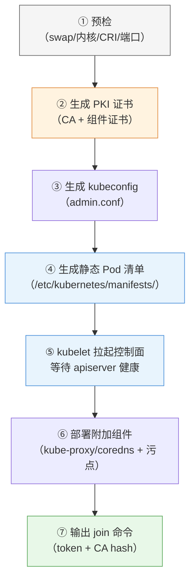

# 第 3 章 集群安装与配置

> 配套实验手册：《Kubernetes 实验手册》（manual/ 目录）**实验 01 「集群安装」**——本章讲**原理与决策**（为什么这么装、每一步在做什么、多个选项怎么选），**具体命令与操作步骤在实验手册**。第 2 章的每个组件（apiserver/etcd/kubelet...）将在本章讲清"它们是如何被安装、如何协同启动的"。

## 学习目标

学完本章，你应该能够：

1. 对比三种集群安装方式（kubeadm/托管/轻量单机），说出各自定位与选择逻辑，并解释本课程为什么选 kubeadm
2. 说清安装前必须规划的四个方面（形态/版本/网络/环境），每个决策背后的原理
3. 解释"容器运行时为什么是 containerd 而不是 Docker"，以及 CRI-O、Kata 等运行时各自适用场景
4. 完整描述 kubeadm 安装流程的三阶段与每个阶段在做什么（不是背命令，而是理解流程）
5. 解释 `kubeadm init` 每一步的原理：PKI 证书、静态 Pod、wait-control-plane、kubeconfig
6. 解释 worker 加入的 token 机制与 TLS bootstrap 原理
7. 对比主流 CNI 网络插件（Calico/Flannel/Cilium/Weave），说出本课程选 Calico 的理由
8. 知道"为什么必须装 CNI 节点才 Ready"、"为什么 Pod 网段必须与 CNI 一致"
9. 了解国内环境镜像获取的问题本质与变通思路（具体步骤在实验手册）
10. 知道装完集群要验证什么、为什么验证这些

---

## 3.1 安装方式的抉择：为什么是 kubeadm

搭建 Kubernetes 集群有三类主流方式，理解它们的定位差异，才知道教学与生产各自怎么选。

**云托管服务（EKS / AKS / GKE / ACK 等）**

- 云厂商一键创建集群，控制面完全托管（你只管业务）
- 优点：最快、最省心，生产落地主流
- 缺点：控制面是黑盒——**你学不到集群怎么运转**，出了问题只能提工单
- 定位：**生产使用，但不是学习途径**

**轻量单机方案（minikube / kind / k3s）**

- 在一台机器上模拟出集群（minikube 单节点、kind 用容器装节点、k3s 精简版）
- 优点：秒级起集群、资源占用小，适合本地快速体验
- 缺点：与生产多节点形态差异大（没有真正的跨节点调度/网络/存储）
- 定位：**开发调试、临时体验**

**kubeadm（本课程）**

- 官方推荐的**标准安装工具**：一条 `init` 命令生成完整控制面，`init` 命令加入工作节点
- 优点：**可控、可解释、可扩展**（从 3 节点到生产高可用都能用它）；过程透明——装完你对集群组成一清二楚
- 定位：**学习 + 生产两相宜**，且 **CKA 考试直接考察 kubeadm 流程**

> **决策逻辑**：学习阶段必须选"过程可见"的方式——kubeadm 把第 2 章讲的每个组件（etcd、apiserver、kubelet...）**一步步摆到你面前**；托管服务把这些全藏起来，学不到东西。

---

## 3.2 安装前必须想清楚的事

动手前有四个决策，每个都有原理支撑。

### 3.2.1 集群形态与资源

- **单节点**：1 台机器既是控制面又是工作节点——学习入门够用，但看不到跨节点调度与多节点网络
- **标准 3 节点**（本课程）：1 控制面 + 2 工作节点——能完整演练调度、网络、存储、故障转移，是学习的最优形态
- **生产高可用**：3 个控制面 + N 个工作节点——控制面自身也要冗余（多控制面 + 负载均衡，第 14 章）

资源底线：每节点 2 核 / 2GB / 20GB 磁盘（教学建议 4 核 8GB 更从容）。**关键前提：节点间内网互通**——集群的所有协作都建立在节点互访上。

### 3.2.2 版本策略

- 用**当前最新稳定版**（kubeadm 会告知可用版本），本课程基线 v1.36
- **kubelet / kubeadm / kubectl 三件套必须同版本**——它们之间通过版本对齐的协议交互，跨版本会告警甚至失败
- 工作节点与控制面版本一致（官方允许跨一个次版本，但一致最稳）
- 装完后**锁定版本**（apt-mark hold）——防止系统自动升级把集群搞崩

### 3.2.3 网络规划：三个网段不能打架

集群里有三个网络层次，规划时**必须互不重叠**：

| 网段 | 用途 | 本课程取值 | 为什么不能冲突 |
|---|---|---|---|
| 节点网段 | 机器的真实内网 IP | `192.168.0.0/24` | 物理基础 |
| **Pod 网段**（--pod-network-cidr） | 每个 Pod 的 IP | `10.244.0.0/16` | 与节点网段冲突会导致 Pod 与节点 IP 混淆、路由错乱 |
| Service 网段（--service-cidr） | Service 虚拟 IP | `10.96.0.0/12`（默认） | 同样不能与上面两个重叠 |

> **常见错误**：云主机内网常用 `192.168.x.x`，若 Pod 网段也选 `192.168.x.x`，两者重叠——流量会被路由到错误的地方。**选一个明显不同的网段（10.244.x.x）就对了**。

### 3.2.4 环境前置条件（每项的"为什么"）

- **关闭 swap（交换分区）**：kubelet 用 cgroup 精确限制 Pod 内存（limits），swap 会让"内存超限"变得不可控（先写磁盘再慢慢回收）——所以 kubeadm 预检**直接拒绝**开着 swap 的节点
- **内核模块 overlay**：容器镜像分层文件系统（第 1 章）的底层支撑，没有它 containerd 无法工作
- **内核模块 br_netfilter**：让经过网桥的流量也能被 iptables 处理——**CNI 的网络策略（第 9 章）依赖它**
- **ip_forward=1**：节点内核转发——跨节点 Pod 通信、Service 转发的必经之路
- **主机名与 hosts 解析**：kubeadm 用主机名标识节点，节点间必须能互相解析（不然证书请求和注册都会失败）

### 3.2.5 设计指南：集群容量规划与节点选型

> 从"给我一个业务需求"到"设计出一个集群"的规划链路（生产决策，教学环境按需参考）。

**节点规格选型决策树**：

```text
控制面节点（规模按集群节点数）：
  · 小型（<50 节点）：4C/8G/50G SSD
  · 中型（50-200 节点）：8C/16G/100G SSD
  · 大型（200+ 节点）：16C/32G/200G SSD（etcd 独立部署）

Worker 节点（按负载类型）：
  · 通用型：8C/32G（大多数微服务）
  · 计算密集型：16C/32G（CPU 密集）
  · 内存密集型：8C/64G（缓存/JVM 应用）
  · GPU 节点：按 AI/ML 需求独立规划

黄金法则：
  · 宁可多节点小规格，不要少节点大规格（爆炸半径更小）
  · 单节点 Pod 密度 ≤ 110（kubelet 默认上限）
  · 预留 kube-reserved + system-reserved ≈ 节点总资源的 15-20%
```

**CIDR 容量推演**（Pod 网段 vs 节点规模）：

| Pod 网段 | 每节点子网 | 最大节点数 | 最大 Pod 数 |
|----------|-----------|-----------|------------|
| /16 | /24 | 256 | 65,536 |
| /12 | /24 | 4,096 | 1,048,576 |

> 设计要点：Service CIDR 用 /12 通常足够（4096 个 Service）；**Pod CIDR 必须按"节点数 × 每节点最大 Pod 数"反推**——节点多、Pod 密时用 /12 而不是 /16。

**etcd 性能基线**（控制面的命脉）：

- etcd 对磁盘延迟**极度敏感**——生产必须 **SSD**（fsync 延迟 < 10ms，机械盘会导致选举超时、集群不稳定）
- 推荐 IOPS ≥ 3000；`etcdctl endpoint status` 的 **DB SIZE 超 2GB 告警、超 8GB 紧急处理**
- 定期 **compact（压缩）+ defrag（碎片整理）** 纳入运维日历（第 14 章）

**内核调优基线**（生产节点推荐 sysctl）：

```text
fs.inotify.max_user_watches         = 524288    # 大量 ConfigMap 挂载场景
fs.file-max                         = 1048576   # 高并发连接
net.netfilter.nf_conntrack_max      = 1048576   # Service 多时防 conntrack 表满
net.ipv4.tcp_keepalive_time         = 600       # 长连接优化
vm.max_map_count                    = 262144    # ES 等应用需要
```

> 决策逻辑：**先定业务规模（节点数/Pod 密度）→ 反推 CIDR 与节点规格 → 按 etcd 基线选磁盘 → 套内核调优**——容量规划不是"越大越好"，是"匹配业务 + 留余量"。

---

## 3.3 容器运行时：为什么是 containerd，而不是 Docker

### 3.3.1 运行时在集群中的角色

第 2 章讲过：kubelet 通过 **CRI（容器运行时接口）** 指挥"跑容器的引擎"。这个引擎就是**容器运行时**。它必须实现 CRI 接口（gRPC 协议），kubelet 才能驱动它。

### 3.3.2 Docker 与 containerd 的历史纠葛（重要背景）

**早期**：Kubernetes 直接对接 Docker（通过一个叫 dockershim 的适配层）。Docker 当时是事实标准，K8s 必须兼容它。

**问题**：Docker 是"全家桶"架构——守护进程（dockerd）+ 容器引擎（containerd）+ 上层 CLI/网络/存储抽象。对 Kubernetes 来说，**它只需要"跑容器"这一层**（containerd 的能力），Docker 的额外层是冗余，还引入了"守护进程里的守护进程"的稳定性问题。

**转折（v1.24）**：Kubernetes 官方宣布**移除 dockershim**——不再支持直接对接 Docker。因为：

- containerd 本身就是 Docker 的底层引擎，**直接实现了 CRI 接口**（Docker 反而是包了一层壳）
- 少一层抽象 = 少一个故障点 = 更轻、更快、更贴近内核
- containerd 由 CNCF 托管（与 K8s 同基金会），中立、可信

**现状**：containerd 成为 Kubernetes 的**默认/主流运行时**（本课程实测 2.2.x）。**你照样用 Docker 构建镜像**（镜像符合 OCI 标准，第 1 章），只是"跑容器"这步交给 containerd。

### 3.3.3 其他运行时：各有各的场景

| 运行时 | 特点 | 适用场景 |
|---|---|---|
| **containerd**（本课程） | 轻量、标准、CNCF 托管 | **默认选择**，绝大多数场景 |
| **CRI-O** | 专为 Kubernetes 而生，极简（只为 K8s 服务） | 偏爱极简、RedHat 生态（OpenShift 用） |
| **Kata Containers** | 每个容器跑在轻量虚拟机里（硬件级隔离） | **安全敏感场景**：多租户、不可信负载（牺牲性能换隔离） |
| gVisor | 用户态内核拦截系统调用 | 同样面向安全隔离场景 |

> **决策逻辑**：默认 containerd；要极致安全隔离考虑 Kata/gVisor；要用 OpenShift 生态考虑 CRI-O。本课程选 containerd = 主流、够用、简单。

### 3.3.4 关键配置项的原理：SystemdCgroup

安装 containerd 时有一个**必须改的配置**：`SystemdCgroup = true`。为什么？

cgroup（第 1 章）是内核限制资源（CPU/内存）的机制，而 **cgroup 有两种"驱动"**：systemd 或 cgroupfs。Ubuntu 用 systemd 管理整个系统的 cgroup 树——**kubelet 也用 systemd 驱动**。containerd 必须与 kubelet 用**同一种驱动**，否则两边对 cgroup 的管理会冲突，Pod 的资源限制（第 7 章 requests/limits）会失效。

> 一句话：**containerd 的 cgroup 驱动要和 kubelet 对齐（都是 systemd）**——这是安装时最容易漏、漏了最隐蔽（集群能跑但资源限制不生效）的配置。

---

## 3.4 kubeadm 安装流程总览

整个安装是一条流水线，先建立全局认知，再逐段理解：

```text
阶段一：准备（每台节点）
  系统参数（swap/内核/主机名）→ 容器运行时（containerd）→ kubeadm/kubelet/kubectl 三件套
        │
        ▼
阶段二：控制面（master 一台）
  kubeadm init → 生成证书与配置 → 拉起控制面静态 Pod → 配好 kubectl
        │（输出 join 命令）
        ▼
阶段三：加入与联网（worker 每台 + 控制面）
  kubeadm join（token + CA 校验）→ 装 CNI 网络插件 → 全部节点 Ready → 验收
```

**为什么是这个顺序**：

- 先准备好运行时，控制面才能被"跑起来"（apiserver 等也是容器）
- 先初始化控制面，才有 apiserver 可供 worker 注册
- 先加入 worker，最后装 CNI——因为 **CNI 是集群级组件**，装一次管所有节点（而装完它，所有节点才真正 Ready）

---

## 3.5 控制面初始化：kubeadm init 在做什么

`kubeadm init` 一条命令，背后是七个步骤——每一步对应第 2 章的一个知识点：

<!-- 原 ASCII 图已转为 Mermaid -->


> 读图要点：**证书（②）与静态 Pod 清单（④）是承上启下的两步**——证书保证组件互信（第 2 章 §2.6.3 在此落地，⚠️ 默认 1 年有效期）；静态 Pod 清单让 kubelet 直接拉起整个控制面（第 2 章 §2.5.1）；最后输出的 join 命令是 worker 的"入场券"。

**关键参数及决策逻辑**：

- `--pod-network-cidr`：声明 Pod 网段（§3.2.3）——**必须与后面 CNI 的配置一致**（不一致 → Pod 拿不到 IP）
- `--apiserver-advertise-address`：apiserver 对外宣告的地址——**用节点内网 IP**（worker 和 kubectl 都要连它；填公网 IP 会导致内网通信出问题）
- `--image-repository`：控制面镜像从哪拉（默认 registry.k8s.io）——**国内环境的第一个变通点**（§3.9）
- `--cri-socket`：告诉 kubeadm/kubelet 用哪个容器运行时 socket（多运行时并存时显式指定更稳）

**初始化失败的排查思路**（具体命令在实验手册）：

- 卡在 wait-control-plane → 看 kubelet 日志找"第一个错误"（十有八九是**镜像拉不下来**：控制面镜像或 pause 沙箱镜像——§3.9）
- 预检报错 → 按提示逐项修复（swap/内核/端口），kubeadm 会明确指出缺什么
- 记住方法论：**报错信息永远指向下一步**（第 16 章展开）

**为什么失败后不要直接 `kubeadm reset`**：很多失败（如 pause 镜像问题）在**修复环境后重试 kubelet 即可恢复**——`kubeadm reset` 会清掉已生成的证书和配置，等于从头再来（实验手册有实测记录）。

---

## 3.6 工作节点加入：token 机制与 TLS bootstrap

worker 加入不是"复制个文件"，而是一个**带安全校验的引导流程**：

**token（入场券）**：init 时生成的一次性口令（默认 24 小时有效），worker 凭它向 apiserver 证明"我是被邀请加入的"。

**CA hash（防中间人）**：join 命令里带一个 `--discovery-token-ca-cert-hash`——apiserver 证书的指纹。worker 用它**校验对方真的是我们的 apiserver**（防止假 apiserver 骗取 worker 的证书）。token 与 CA hash 二者缺一不可。

**TLS bootstrap（引导时的证书交换）**：worker 加入后，kubelet 需要一张自己的客户端证书（§2.6.3 双向 TLS）——它用 token 向 apiserver 申请，apiserver 校验后由 CA 签发。**之后 kubelet 就用这张证书与 apiserver 通信**，不再用 token。

**join 后节点为什么是 NotReady**：worker 加入成功 = 节点注册进集群了，但**还没有网络插件**——kubelet 会一直检查"本节点网络是否就绪"（CNI 是否装好）。所以 **NotReady 是正常的中间态**，装完 CNI 自动变 Ready。这个现象也解释了第 2 章"节点 Ready 依赖 kubelet + 网络就绪"。

> 若 token 过期：在控制面节点上重新生成 join 命令即可（`kubeadm token create --print-join-command`）——token 只是引导凭证，丢了/过期不影响已加入的节点。

---

## 3.7 网络插件（CNI）的选择：为什么是 Calico

### 3.7.1 CNI 的角色

第 2 章说"每个 Pod 一个 IP"——这个 IP 由 **CNI（容器网络接口）插件**负责分配与打通：Pod 创建时给它分配 IP、配置网卡、建立跨节点的路由。**没有 CNI，Pod 没有 IP、节点间不通、节点不 Ready**——这是集群里"必须装"的组件。

> **CNI 不止管"连通"**：CNI 还包含 **IPAM（IP 地址管理）**——负责 Pod IP 的分配/回收（IP 池管理）。`--pod-network-cidr` 就是给 IPAM 划定"IP 池"范围：Calico 的 IPAM 从这个池里为每个 Pod 分配 IP，Pod 删除时回收复用。**理解 IPAM 才能理解"Pod IP 从哪来、为什么不会耗尽/冲突"**（IP 耗尽排障见第 16 章）。

### 3.7.2 主流 CNI 对比与适用场景

| 插件 | 网络模型 | 特点 | 适用场景 |
|---|---|---|---|
| **Flannel** | VXLAN 覆盖网络（overlay） | 最简单、最轻量，Pod 间二层互通 | 学习、小型集群、只要"能通"就行 |
| **Calico**（本课程） | **BGP 三层路由**（可选 overlay） | 性能好、**原生支持 NetworkPolicy**（第 9 章网络策略必须有它）、可扩展 | 生产主流；需要网络策略/性能的集群 |
| **Cilium** | eBPF 内核编程 | 性能最强、功能最丰富（网络策略/可观测/服务网格） | 大型生产、对性能和功能要求高的集群（学习曲线陡） |
| Weave | 覆盖网络 | 简单易用、自带 DNS 加密 | 小规模、追求简单 |
| （云厂商自带） | 云网络直通 | 与云 VPC 集成好 | 托管集群（EKS 等）默认 |

### 3.7.3 本课程为什么选 Calico

1. **性能与模型**：BGP 三层路由（数据走真实路由而非隧道封装）比 Flannel 的 VXLAN 性能好
2. **NetworkPolicy**：第 9 章要演练"网络策略隔离"——**Flannel 不支持 NetworkPolicy，Calico 原生支持**（这是教学刚需）
3. **生产主流**：学了就是生产可用的（大量生产集群用 Calico）
4. **实测稳定**：本课程在 v1.36 实测通过（多源拉取、三节点互通）

> **决策逻辑**：教学选型 = "性能可用 + 支持全部要教的功能（网络策略）+ 生产通用"。Flannel 适合"只想通网"的极简场景；Cilium 是"更强但更复杂"的进阶选项。

### 3.7.4 一个必须一致的参数：Pod 网段

Calico 配置里有一个 `CALICO_IPV4POOL_CIDR` 参数——**必须与 `CALICO_IPV4POOL_CIDR` 完全一致**。因为：init 时声明的网段是"集群的 Pod 网段约定"，Calico 的 IP 池是"实际分配 IP 的池子"——两者不一致，Calico 分配的 IP 落在约定网段之外，路由就乱了。**这个"一致性"是 CNI 安装中最常见的错误点**。

---

## 3.8 集群验证：验证什么、为什么

装完集群，验证不是"随便看看"，而是**对照第 2 章架构逐层确认**：

| 验证层 | 验证什么 | 为什么验证它 |
|---|---|---|
| 节点层 | 3 个节点全部 `Ready` | Ready = kubelet 心跳正常 + 网络就绪（第 2 章） |
| 组件层 | kube-system 的系统 Pod 全部 Running | 控制面四件套 + kube-proxy + coredns + calico 都在岗（第 2 章架构图） |
| 调度层 | 测试 Pod 能创建并落到 worker 节点 | 证明调度器工作 + 控制面污点生效（控制面不跑业务，第 6 章） |
| 镜像层 | 测试镜像能正常拉取启动 | 证明镜像获取链路可用（§3.9 的变通是否生效） |

**验证命令（少量即可）**：`kubectl get nodes`、`kubectl get nodes`、跑一个测试 Pod 看调度结果——具体命令在实验手册（实验 01）。

> 教学提示：测试 Pod 调度到 worker 而非控制面节点是**正常设计**（master 有 control-plane 污点）——第一次看到别以为是故障。

---

## 3.9 国内环境的镜像获取策略（问题本质与思路）

> 网络通畅的环境可跳过本节。**本节讲"为什么"与"有哪些思路"；具体脚本与实测记录在实验手册（实验 01） （附录 A-F）**。

**问题的本质**：Kubernetes 官方组件镜像在 `registry.k8s.io`、业务镜像在 `registry.k8s.io`，国内网络访问不稳定——**安装失败九成是镜像拉取失败**（§3.5 的 wait-control-plane 就是典型）。

**三类变通思路（按作用对象分）**：

**① 控制面镜像：换仓库**（init 时 `--image-repository` 指向国内可达仓库，如阿里云 `--image-repository`）。注意它的**边界**：只换控制面组件的镜像仓库，**管不到 kubelet 的沙箱镜像**——引出最大的坑：

**② kubelet 沙箱镜像（pause）：本地注入**。pause 容器（第 2 章 §2.5.3）由 kubelet 按内置默认名（`registry.k8s.io/pause:3.10.1`）拉取，且与 kubeadm 预热的版本可能差一个 patch——**解法思路**：从国内源拉 pause，tag 成 kubelet 期望的名字（多 tag 几个相近版本），重启 kubelet。**这是国内安装最大的坑**（实验手册（实验 01） 附录 F 有完整实测）。

**③ 业务/CNI 镜像（docker.io）：加速站**。containerd 支持 per-registry 镜像加速配置（hosts.toml 指向加速站）。要点：加速站可用性**随时间变化**（不同站对不同镜像表现不同，有的 403、有的慢）——所以**先实测再配置**，必要时多站兜底（实验手册（实验 01） 前置检查有预测试脚本）。

> **决策逻辑**：先测网络（版本源 + 镜像源各探一次）→ 决定要不要变通 → 变通按"换仓库/本地注入/加速站"分类处理。**先测再装，别装到一半才发现**。

---

## 3.10 安装之后：集群维护的起点

集群装完，有两件事是"立刻要做的维护"，**动手实验在实验 12「集群维护与运维」**（etcd 备份恢复 + kubeadm 升级 + 节点维护演练），完整流程在第 14 章（教材）展开：

- **etcd 备份**：第 2 章强调过——etcd 是集群的全部状态。**装完集群第一件事就是配置备份**（快照 + 周期策略 + 恢复演练），CKA 必考
- **升级认知**：kubeadm 升级有固定顺序（控制面先行、worker 逐台排空升级）——第 14 章展开

---

## 3.11 实验演练指引

本章对应的动手内容全部在实验手册 **实验 01**：

- **手动安装（10 步）**：按本章原理走完整流程（含国内变通与故障清单）
- **实验 12 集群维护**：etcd 备份恢复（Lab 1）+ kubeadm 升级（Lab 2）+ 节点维护演练（Lab 3）
- **附录 A-F**：加速站清单与预测试、配置原理、版本组合、worker 一键脚本、单节点安装、实测记录（9 个坑的根因与修复）
- **Kubectl 基础**：第 2 章 Killercoda 演练的命令，在自有集群完整过一遍

> 教学建议：先在 Killercoda（第 2 章）建立命令直觉 → 读本章理解原理 → 按实验手册（实验 01） 动手安装 → 对照 §3.8 验收。

---

## 本章小结

- **方式抉择**：kubeadm（过程可见、可扩展、CKA 考）＞ 托管（生产黑盒）＞ 轻量单机（本地体验）
- **规划四件事**：形态（3 节点教学最优）、版本（三件套一致 + 锁定）、网络（**三个网段互不重叠**）、环境（swap/内核参数每项都有原理）
- **运行时选型**：containerd（直接实现 CRI、轻量、CNCF 托管）取代 Docker 的 dockershim 时代；SystemdCgroup 必须与 kubelet 对齐
- **init 原理**：预检 → PKI 证书 → kubeconfig → 静态 Pod 清单 → kubelet 拉起控制面 → 附加组件 → 输出 join 命令；失败先查镜像拉取，别急着 reset
- **join 原理**：token（入场券）+ CA hash（防中间人）+ TLS bootstrap（换取长期证书）；NotReady 是等 CNI 的正常中间态
- **CNI 选型**：Calico（BGP 性能 + NetworkPolicy + 生产主流）vs Flannel（极简）vs Cilium（更强更复杂）；**Pod 网段必须与 init 一致**
- **验证四层**：节点 Ready / 组件 Running / 跨节点调度 / 镜像拉取
- **国内变通**：问题本质是镜像可达性；三类思路（换仓库/本地注入 pause/加速站）；先测再配
- **维护起点**：etcd 备份是装完第一件事

**衔接**：集群已就绪，第 4 章开始"在集群上跑应用"——Pod 的本质、生命周期与完整配置。

## 思考题

1. 为什么 Kubernetes v1.24 要移除 dockershim？用 containerd 和用 Docker 的本质区别是什么？
2. 三个网段（节点/Pod/Service）为什么必须互不重叠？如果 Pod 网段选了和节点一样的 192.168.0.0/16 会发生什么？
3. kubeadm init 的七步里，哪一步对应第 2 章的"静态 Pod"概念？控制面组件为什么用静态 Pod 而非 Deployment 管理？
4. worker join 为什么需要"token + CA hash"两样东西？缺一个会有什么风险？
5. 为什么没装 CNI 时节点一直是 NotReady？kubelet 是怎么知道"网络没就绪"的？
6. 如果让你给一个"只要求 Pod 能互通、不在乎网络策略"的小集群选 CNI，你选什么？为什么？

> **CKA 考点标注**（对应域 1：集群架构、安装与配置 25%，**考试权重最高的实操域**）：
> - **必考命令**：`kubeadm init`（参数含义）、`kubeadm init`（token 续发）、`kubeadm init`（镜像预热）、`kubeadm init`
> - **必考机制**：init 各阶段、join 的 token + CA hash、CNI 与 Ready 的关系、etcd 备份（snapshot save/restore，第 14 章展开）
> - **必考排查**：wait-control-plane（镜像/沙箱）、节点 NotReady（kubelet/CNI）、ImagePullBackOff
> - 考试环境网络通常可达官方源——**通用流程与原理是核心**，国内变通是环境加成
