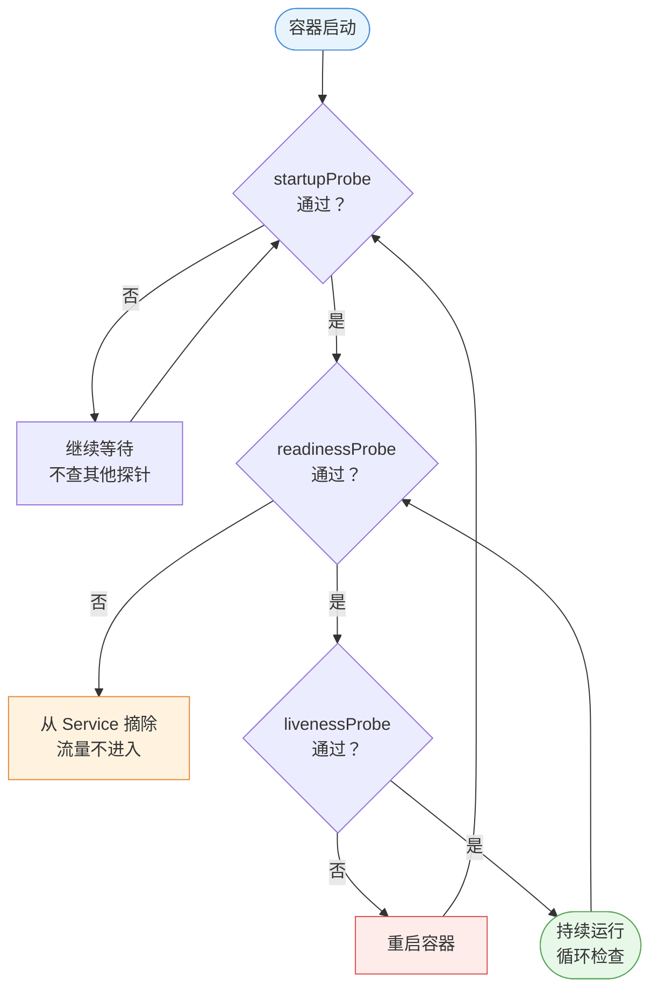
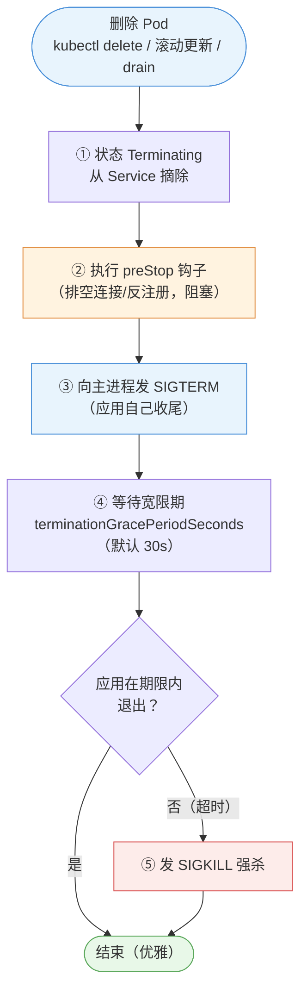

# 第 4 章 Pod 与容器

> 配套实验手册：《Kubernetes 实验手册》（manual/ 目录）**实验 02 「解析 Pod」**（全部 10 个 Lab）。本章讲 Pod 与容器的**全部核心机制**——它是"在集群上跑应用"的第一章，也是后面所有章节（控制器/网络/存储/调度）的地基。

## 学习目标

学完本章，你应该能够：

1. 解释"Pod 为什么是调度的最小单元"，说清 Pod 内多个容器共享什么、为什么要共享
2. 描述多容器 Pod 的三种协作模式（sidecar/适配器/大使）与各自场景
3. 解释镜像拉取策略三种取值的行为差异，以及"为什么默认策略由镜像 tag 决定"
4. 说清 `command`/`command` 与 Dockerfile `command`/`command` 的覆盖关系
5. 解释 Init 容器的工作机制（顺序/失败/共享）与适用场景
6. 完整讲解三种探针（startup/liveness/readiness）的职责与配合关系，以及三种探测方式的选择逻辑
7. 描述容器优雅终止的完整流程（preStop → SIGTERM → grace period → SIGKILL）
8. 区分 `requests`（调度承诺）与 `requests`（运行时上限）两个不同机制，解释 CPU 与内存超限的不同后果
9. 解释 Downward API 解决什么问题、能注入哪些元数据
10. 走查一个 Pod 从提交到删除的完整生命周期

---

## 4.1 Pod 的本质：为什么是"最小调度单元"

### 4.1.1 第 2 章回顾：Pod 是"逻辑主机"

第 2 章讲过：**Pod 是 Kubernetes 调度的最小单位**，一个 Pod 包含一个或多个容器，它们共享网络命名空间（一个 IP）、共享存储卷、同生共死。现在深入"为什么这样设计"。

**设计动机**：有些应用场景，多个进程必须**紧密耦合、同机共存**：

- 主应用 + 日志采集器（sidecar）：日志采集必须和主应用在同一台"机器"上才能读它的日志文件
- Web 服务 + 本地代理（如 Envoy）：代理必须在主应用旁边才能拦截它的流量
- 应用 + 配置刷新器：定期从外部拉配置写入共享目录

如果把它们放成独立 Pod，就会遇到：IP 不同（没法 localhost 通信）、存储不共享、生命周期不同步（一个挂了另一个还活着）。**Pod 把"这些进程必须绑在一起"的语义显式表达出来**——调度器把整个 Pod 当作一个整体调度到同一节点。

### 4.1.2 Pod 的共享边界（到底共享什么）

| Pod 内共享 | 含义 |
|---|---|
| 网络命名空间 | 一个 Pod IP + 一个端口空间；容器间用 `localhost` 互访 |
| UTS 命名空间 | 共享主机名 |
| 存储卷 | Pod 级卷可被所有容器挂载（如共享日志目录） |
| 生命周期 | 一起调度、一起终止 |

**不共享**：PID 命名空间（默认不共享——容器间看不到对方的进程）、cgroups（各自独立的资源限制）。

> 第 2 章讲过 pause 容器：Pod 的"沙箱"持有这些共享命名空间，应用容器挂靠进来。**Pod 的 IP 属于沙箱**——这也是"删 Pod = 整个 Pod 消亡"的技术根源。

### 4.1.3 单容器 vs 多容器：三种协作模式

绝大多数 Pod 只有一个容器；需要多容器时，有约定俗成的三种模式：

- **sidecar（边车）**：辅助主容器，如日志采集（filebeat）、指标暴露（prometheus-exporter）、本地文件同步。特点：**跟在主应用旁边，增强而不侵入**
- **Adapter（适配器）**：把主容器的输出**转换成统一格式**，如把应用日志转成标准 JSON、把指标转成监控系统格式
- **Ambassador（大使）**：代表主容器访问外部，如本地代理（连数据库的连接池代理、访问外部服务的代理）

> **决策逻辑**：先问"能不能一个容器搞定？"——单容器最简单，运维成本最低；只有当进程必须**同生命周期、共享本地资源**时才拆多容器（sidecar 等模式）。

---

## 4.2 容器的配置要素

### 4.2.1 镜像与拉取策略（imagePullPolicy）

**问题**：节点上已经有镜像了，还要不要重新拉？

**三种策略**：

- **IfNotPresent**：本地有就用本地，没有才拉
- **Always**：每次都到仓库拉（检查 digest，有变化就更新）
- **Never**：只用本地镜像，绝不拉取（离线环境）

**关键认知：默认策略由镜像 tag 决定**：

- 镜像带具体版本（`nginx:1.27`）→ 默认 **IfNotPresent**（版本不可变，本地有就不用重复拉）
- 镜像用 `:latest`（或没写 tag）→ 默认 **Always**（latest 是"移动靶"，每次启动都要确认最新）

> 这个默认行为的设计很巧妙：**版本化镜像假设"tag 即契约"（不可变），latest 假设"始终要最新"**。生产实践：永远用具体版本号 + IfNotPresent，避免 `:latest` 的不可预测性。

### 4.2.2 命令与参数（command / args）

容器镜像里定义了默认启动命令（Dockerfile 的 `ENTRYPOINT` 和 `ENTRYPOINT`）。Kubernetes 可以**覆盖**它们：

| Kubernetes 字段 | 覆盖 Dockerfile 的 | 作用 |
|---|---|---|
| `command` | `command` | 替换启动程序 |
| `args` | `args` | 替换启动参数 |

**覆盖规则**（容易混淆，重点记忆）：

- 只写 `args` → 程序不变（用镜像的 ENTRYPOINT），只换参数
- 只写 `command` → 程序换掉，参数用镜像默认 CMD（如果新程序不需要参数，要同时清掉 args）
- 都写 → 程序和参数全换

> **为什么需要覆盖**：同一镜像跑不同任务（如 busybox 镜像既当"睡眠容器"又当"一次性任务"）、调试（进容器跑 shell）、镜像默认命令在集群环境不适用时。kubectl 命令式创建时用 `--command -- <命令>`（**v1.36 必须带 `--command -- <命令>` 分隔符**）。

### 4.2.3 环境变量

环境变量是给容器传配置的最直接方式：

- **静态值**：`env: [{name: MODE, value: prod}]`——写死在 Pod 定义里
- **动态来源**：从 ConfigMap/Secret 引用（第 8 章）、从 Downward API 注入自身元数据（§4.5.4）

> 环境变量的局限：不适合传"文件型配置"（如整个配置文件）；文件型用 ConfigMap 卷挂载（第 8 章）。

### 4.2.4 标签与注解（Pod 层面）

第 2 章讲过两者的区别（标签可被选择器选中、注解只是说明）。在 Pod 层面补充两点：

- **Pod 的标签是"被管理的凭据"**：Deployment/Service 靠它选中 Pod——**标签与选择器必须精确匹配**，错了 Pod 就"没人管"（删了不重建、流量不进）
- **注解常用于声明"意图"**：如 `kubernetes.io/change-cause`（记录这次更新原因）、监控告警配置等——控制器/工具读取，但**不参与选择**

### 4.2.5 生产基线：SecurityContext 概览

**问题**：容器默认以 root 运行（第 1 章：容器内 root 与宿主机共享内核权限，被攻破有逃逸风险）。**SecurityContext** 是容器/Pod 的"安全设置区"，声明降权与加固（第 12 章深入）：

```yaml
spec:
  securityContext:                      # Pod 级：对 Pod 内所有容器生效
    runAsNonRoot: true                  # 禁止以 root（UID 0）运行，否则拒绝启动
    runAsUser: 1000                     # 指定运行用户（UID）
  containers:
  - name: app
    securityContext:                    # 容器级：只对本容器生效
      readOnlyRootFilesystem: true      # 根文件系统只读（防写入恶意文件）
      capabilities:
        drop: ["ALL"]                   # 丢弃全部 Linux 能力（最小能力原则）
```

| 字段 | 作用 | 防什么 |
|---|---|---|
| `runAsNonRoot` + `runAsNonRoot` | 非 root 运行 | 容器逃逸、root 权限滥用 |
| `readOnlyRootFilesystem` | 根文件系统只读 | 恶意文件写入（卷仍可写） |
| `capabilities.drop: ["ALL"]` | 丢弃能力 | 危险内核能力（SYS_ADMIN 等） |
| `allowPrivilegeEscalation: false` | 禁止提权 | 子进程提权 |

> **为什么在这里先提**：SecurityContext 是**容器配置的一部分**（第 12 章会讲 PSA 如何强制它）——先建立"容器默认不安全、要声明降权"的基线认知，第 12 章"自觉 vs 强制"才立得住。

---

## 4.3 Init 容器：启动前的"先决条件执行器"

### 4.3.1 为什么需要 Init 容器

主容器启动前，常常有必须先完成的准备工作：

- **等待依赖就绪**：数据库还没起来，主应用别急着连（如 `while ! nc -z mysql 3306; do sleep 1; done`）
- **预置数据/权限**：下载配置文件、初始化目录、设置文件权限
- **预热缓存**：启动前先把缓存填充好

这些工作如果放进主容器：会和主进程争抢资源、逻辑混杂、且"启动慢导致探针误杀"（§4.4.2）。**Init 容器的定位：在主容器之前按顺序完成准备，做完就退出**。

### 4.3.2 工作机制

```text
Pod 调度到节点
   │
   ▼
Init 容器按声明顺序逐个执行：
   init-1（等待数据库）──成功──► init-2（预置数据）──成功──► 主容器启动
        │ 失败                    │ 失败
        ▼                        ▼
   按重启策略重试（restartPolicy=Always 时整个 Pod 重启，重跑所有 init）
```

**关键规则**：

- **顺序执行**：多个 Init 容器严格按声明顺序，前一个成功后下一个才启动
- **失败即重来**：某个 Init 失败 → 整个 Pod 重启，**所有 Init 容器从头再跑**（不是从失败的继续）
- **共享卷**：Init 容器与主容器共享 Pod 卷——预置的数据写在共享卷里，主容器直接读
- **独立镜像**：Init 容器可以用与主容器不同的镜像（如主容器是精简运行时镜像，Init 用带工具的镜像下载数据）
- **与主容器隔离**：Init 容器不参与探针检查、不占用主容器的资源声明

> **为什么"失败从头跑"**：Init 容器可能修改共享卷的中间状态——从第一个重跑保证"准备动作的确定性"，避免半成品状态。

### 4.3.3 Init 容器 vs sidecar 容器

| 维度 | Init 容器 | sidecar 容器 |
|---|---|---|
| 运行时机 | 主容器**之前**，跑完即退出 | 与主容器**并行**长期运行 |
| 生命周期 | 一次性 | 与 Pod 同生共死 |
| 典型场景 | 等待依赖、预置数据 | 日志采集、代理 |

> 判断：**"做完就撤"的用 Init，"长期伴随"的用 sidecar**。

---

## 4.4 容器生命周期管理

### 4.4.1 容器的三种状态

kubelet 眼中的容器状态（`kubectl get pod -o yaml` 的 `kubectl get pod -o yaml`）：

- **Waiting**：正在准备（拉镜像、创建等）
- **Running**：正在运行
- **Terminated**：已退出（正常/异常，含退出码）

**退出码的意义**（排障必读）：0 = 正常退出；非 0 = 异常（1 通用错误、137 = SIGKILL（如内存超限被杀）、143 = SIGTERM）。**看到 137 先怀疑内存超限**（第 10 章排障展开）。

### 4.4.2 三种探针：各管一件事

Kubernetes 用探针（Probe）回答三个不同的问题：

**readinessProbe（就绪探针）——"能用了吗？"**

- 决定**是否把流量发给这个 Pod**（Service 后端列表是否包含它）
- 失败 → 从 Service 摘除（但 Pod 不重启）——服务"没准备好"时不让用户流量进来
- 典型场景：应用启动慢（要加载缓存、连数据库），ready 前流量不进

**livenessProbe（存活探针）——"还活着吗？"**

- 决定**是否重启这个容器**
- 失败 → kubelet 杀掉容器并按重启策略重建——自愈机制（死锁、内存泄漏、假死）
- 典型场景：进程活着但业务卡死（如死循环、goroutine 泄漏）

**startupProbe（启动探针）——"开始检查了吗？"**

- 决定 **liveness/readiness 什么时候开始检查**
- 启动阶段只查 startupProbe（成功后才开始查另外两个）——**解决"慢启动应用被误杀"**：如果应用要 60 秒才起来，liveness 默认 10 秒就开始查，会把"还在启动"误判为"死了"
- 典型场景：JVM 启动、加载大模型、冷启动慢的应用

**三者的配合关系**（一个图讲清）：

<!-- 原 ASCII 图已转为 Mermaid -->


> 读图要点：**startup 通过前另外两个探针都不查**（慢启动保护）；readiness 失败只摘流量不重启；liveness 失败才重启——三个探针的失败后果各不相同（摘除/重启/等待）。

**探针的参数**（速查）：`initialDelaySeconds`（启动后等多久才第一次查）、`periodSeconds`（探测间隔）、`timeoutSeconds`（单次超时）、`failureThreshold`（连续几次失败才判定失败）、`successThreshold`（几次成功才判定成功）。

> **决策逻辑**：三个探针不是都要配——**最小化原则**：只配必要的。readiness（大多数有流量的服务要配）、liveness（有死锁/泄漏风险的配）、startup（启动超过默认 10s 的必须配，否则可能被 liveness 误杀）。

### 4.4.3 探针的实现方式：怎么探测

| 方式 | 原理 | 适用 |
|---|---|---|
| `httpGet` | 发 HTTP GET，**状态码 200-399** 视为成功 | HTTP 服务（最常用） |
| `tcpSocket` | 尝试建立 TCP 连接，能连上即成功 | 非 HTTP 协议（数据库、Redis） |
| `exec` | 容器内执行命令，**exit 0** 视为成功 | 无法用端口判断的场景（检查内部状态文件） |
| `grpc` | gRPC 健康检查协议（v1.24+） | **gRPC 微服务**（无需额外探针实现，走 gRPC 健康协议） |

> 选择逻辑：**HTTP 服务用 httpGet（最贴近真实可用性）；TCP 服务用 tcpSocket；都没有的用 exec；gRPC 服务用 grpc 探针**。注意探测路径要选"真实反映可用性"的端点（如 `/healthz`，而不是只返回 200 的静态页）。gRPC 探针要求服务端实现 gRPC 健康检查协议（`/healthz`）。

### 4.4.4 生命周期钩子与优雅终止

**postStart（启动后钩子）**：容器**启动后**立即执行的动作（如注册到注册中心、初始化脚本）。两个关键点：

- 与主进程**并发执行**——不是阻塞等待！主进程不会等 postStart 跑完
- 与探针无关——postStart 失败不会导致重启（只记录事件）

**preStop（终止前钩子）**：容器**被终止前**执行的动作（如通知注册中心下线、排空连接、保存状态）。它是**阻塞式**的——必须执行完（或超时）才继续终止流程。

**优雅终止的完整流程**（这是"发布不中断"的关键机制）：

<!-- 原 ASCII 图已转为 Mermaid -->


> 读图要点：**先摘流量（不再进新请求）→ preStop 排空（处理存量）→ SIGTERM 优雅退出 → 超时才 SIGKILL 兜底**——每一步都在为"不丢请求"服务。

**为什么这套流程重要**：生产发布/扩缩容/节点维护（drain）都走这个流程——**优雅终止 = 不丢请求**。应用要配合：捕获 SIGTERM 做收尾（关连接、刷数据）；如果收尾需要超过 30 秒，调大 `terminationGracePeriodSeconds`（实验手册（实验 02） Lab 9 实测 5.8s 完整流程）。

### 4.4.5 重启策略（restartPolicy）

容器失败/退出后**要不要重启**，由 `restartPolicy` 决定：

- **Always**（默认）：任何退出都重启——Deployment 等长期服务用
- **OnFailure**：只有异常退出（非 0）才重启——Job 等任务用
- **Never**：绝不重启——一次性任务（如批处理，跑完就完）

> 注意：重启策略是 **Pod 级**的；由控制器管理的 Pod 通常用默认 Always，Job 场景改为 OnFailure/Never。

---

## 4.5 资源模型：requests 与 limits

### 4.5.1 两个不同的机制（全书最容易混的点）

容器可以声明两种资源约束，**它们作用在不同环节、由不同组件执行**：

- **requests（请求量）——调度承诺**：告诉调度器"这个容器至少需要多少"——**决定 Pod 落在哪个节点**（scheduler 过滤依据，第 3 章讲过）
- **limits（上限）——运行时限制**：告诉 kubelet"最多能用多少"——**决定容器能跑多快/会不会被杀**（运行时执行）

```text
requests: CPU 0.5 / 内存 256Mi   ← 调度器：找剩余资源 ≥ 这个值的节点
limits:   CPU 1 / 内存 512Mi    ← kubelet：容器最多用这么多
```

**CPU 与内存的本质区别**（重要）：

- **CPU 是可压缩资源**：超限 → **节流（throttling）**——跑慢点，但不会死
- **内存是不可压缩资源**：超限 → **OOM 被杀（SIGKILL，退出码 137）**——没有"慢一点"选项

> 这就是为什么"内存 limit 必须设、CPU limit 可选"：不设 CPU limit 只是不节流（可接受）；**不设内存 limit，一个泄漏的容器可以把整台节点拖垮**（影响同节点的其他 Pod）——生产上内存 limits 是底线。

### 4.5.2 不设置会怎样

- 只有 requests 没 limits：调度有保障，但运行时不受限（可超用节点资源）
- 只有 limits 没 requests：**limits 隐式等于 requests**（Kubernetes 自动补）——注意这个隐含行为
- 都没有：调度"任何节点都行"（可能挤爆别人），运行时无上限（风险）

### 4.5.3 requests/limits 与 QoS 等级

Kubernetes 根据资源声明把 Pod 分成三个服务质量等级（QoS），**决定节点资源紧张时谁先被杀**：

- **Guaranteed（保证）**：requests = limits（都设且相等）——优先级最高，最后被杀
- **Burstable（可突发）**：requests < limits，或只设 requests——有最低保障，可超用，中间
- **BestEffort（尽力而为）**：什么都没设——最容易被杀

> 生产实践：核心服务配 Guaranteed（requests=limits）；一般服务 Burstable；BestEffort 只给测试任务。

### 4.5.4 Downward API：Pod 怎么"认识自己"

**问题**：容器内部怎么知道自己的 Pod 名、命名空间、IP、所在节点？

**Downward API**：把 **Pod 自身的元数据**注入容器（环境变量或文件）——注意它注入的是"自身信息"，不是外部配置（外部配置用 ConfigMap，第 8 章）：

- 环境变量方式：Pod 名、命名空间、节点名、Pod IP（部分字段限制：label/annotation 不能进 env）
- 文件方式（volume）：label/annotation 等全部字段（挂载成文件，支持热更新）

> **典型用途**：应用上报日志时带"我是哪个 Pod"、监控系统标记来源、按 Pod 标签决定行为。

---

## 4.6 走查：一个 Pod 的完整生命周期

把本章所有机制串起来，走查一个 Deployment 管的 Pod 从生到死：

```text
① 提交：kubectl apply deployment.yaml（期望：1 副本，带 readiness+liveness 探针）
   │
   ▼
② 调度：scheduler 按 requests 过滤打分，选中 node2
   │
   ▼
③ 创建：kubelet 建 pause 沙箱 → 拉镜像 → 创建容器（Waiting：Pulling）
   │
   ▼
④ 启动：容器 Running；postStart 钩子并发执行（注册/初始化）
   │
   ▼
⑤ 探针：startup 成功后 → readiness 成功 → 加入 Service 后端，开始接流量
   │        （liveness 持续检查：失败 → 重启容器，自愈）
   │
   ▼
⑥ 更新/删除（滚动更新、扩容缩容、节点维护 drain）：
   │  从 Service 摘除 → preStop 钩子（排空）→ SIGTERM → 优雅退出
   │  超时 → SIGKILL
   ▼
⑦ 回收：Pod 对象删除；如果内存超限，中途可能已因 OOM 被 SIGKILL（退出码 137）
```

> 对照第 2 章控制循环：这个 Pod 的生死由 ReplicaSet 控制器监视——它死了，控制器立刻补一个新的（自愈）。

---

## 4.7 实验演练指引

本章机制对应实验手册：

- **实验 02 「解析 Pod」**（7 个 Lab）：极简创建 → 多容器 → Init 容器 → 拉取策略 → 环境变量 → command/args → 标签注解
- **实验 02 Lab 8**（探针）：readiness 摘流量、liveness 重启，亲眼验证探针行为
- **实验 02 Lab 9**（钩子与优雅终止）：preStop 生效、**实测完整终止流程 5.8s**
- **实验 02 Lab 10**（资源限制）：requests/limits 生效、超限节流与 OOM

> 教学建议：先理解 4.1-4.5 的机制，再按实验手册逐个验证——每个 Lab 的"观察点"都对应本节一个机制。

---

## 本章小结

- **Pod 是调度最小单元**：多容器共享网络/IP/存储/生命周期；三种协作模式（sidecar/适配器/大使）
- **容器配置**：镜像策略默认由 tag 决定（版本化→IfNotPresent、latest→Always）；command/args 覆盖 ENTRYPOINT/CMD；env 传简单配置，文件型走 ConfigMap
- **Init 容器**：主容器前顺序执行、失败从头重跑、共享卷预置数据——"做完就撤"
- **探针三兄弟**：readiness（摘流量）/ liveness（重启）/ startup（慢启动保护）；httpGet/tcpSocket/exec 三种探测方式按协议选
- **优雅终止**：摘流量 → preStop → SIGTERM → grace period → SIGKILL——发布不丢请求的关键
- **资源模型**：requests 管调度、limits 管运行；CPU 可压缩（节流）、内存不可压缩（OOM 137）；QoS 三档决定被杀顺序；内存 limits 是生产底线
- **Downward API**：注入 Pod 自身元数据（env/文件两种方式）
- **生命周期走查**：提交→调度→创建→探针→接流量→优雅终止→回收，环环相扣

**衔接**：第 5 章讲"管 Pod 的人"——Deployment 等控制器如何基于本章的 Pod 机制实现滚动更新、扩缩容与自愈。

## 思考题

1. 为什么"内存超限"比"CPU 超限"危险？分别会发生什么（提示：可压缩 vs 不可压缩）？
2. 一个应用启动需要 90 秒，直接配 liveness 会发生什么？startup 探针怎么解决？
3. preStop 钩子里 `sleep 5` 的常见用途是什么？如果应用收尾需要 60 秒，要改什么配置？
4. Init 容器与 sidecar 容器都"在主容器旁做事"，它们的本质区别是什么？
5. 为什么"只设 requests 不设 limits"（内存）在生产上是危险的？
6. 镜像带 `:latest` 时默认拉取策略是 Always——这带来什么风险？怎么规避？

> **CKA 考点标注**（对应域 2：工作负载与调度 15%）：
> - **必考配置**：探针三件套（readiness/liveness/startup）与参数、资源 requests/limits、restartPolicy、imagePullPolicy
> - **必考命令**：`kubectl run --command --`（v1.36 分隔符）、`kubectl run --command --`、`kubectl run --command --`（看探针/事件）
> - **必考机制**：优雅终止流程（preStop/SIGTERM/SIGKILL）、OOM 退出码 137、Init 容器顺序执行
> - 域 5 排障（30%）大量题目围绕本章：CrashLoopBackOff（探针失败/退出码）、ImagePullBackOff（拉取策略/镜像名）
