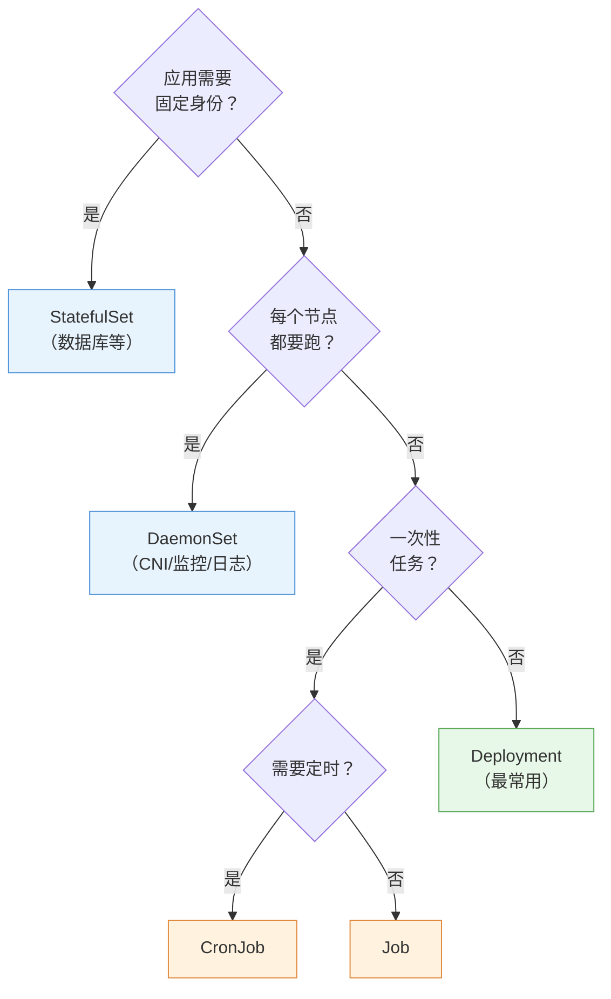

# 第 5 章 工作负载控制器

> 配套实验手册：《Kubernetes 实验手册》（manual/ 目录）**实验 03「工作负载」**（6 个 Lab：Deployment 维护/滚动更新/StatefulSet/Job/CronJob/DaemonSet）。本章讲各类控制器的**原理、机制与选型**——"如何管理 Pod"是工作负载的核心问题，也是第 4 章 Pod 知识的自然延伸。

## 学习目标

学完本章，你应该能够：

1. 解释"为什么需要控制器"（裸 Pod 的三个致命问题），说出控制器的共同骨架
2. 解释 Deployment 的三层结构（Deployment → ReplicaSet → Pod）与职责分层
3. 详细描述滚动更新的机制（maxUnavailable/maxSurge 如何控制节奏）与回滚原理
4. 解释 StatefulSet 如何解决有状态应用的三个难题（稳定标识/稳定存储/有序性）
5. 解释 DaemonSet 的机制与典型场景，说出它与 Deployment 的本质区别
6. 解释 Job 与 CronJob 的机制（成功语义、backoffLimit、并发策略）
7. 根据应用类型（无状态/有状态/守护/任务）做出控制器选型决策
8. 知道扩缩容与暂停机制背后的原理（修改期望状态）

---

## 5.1 控制器：管理 Pod 的"管理者"

### 5.1.1 为什么需要控制器

第 4 章讲过裸 Pod（直接创建的 Pod）——但生产上**几乎从不直接创建裸 Pod**，因为它有三个致命问题：

1. **不会自愈**：Pod 崩溃/被删，不会自动重建（第 2 章 Killercoda 演练 4 已验证）
2. **不会扩缩**：流量大了要手动一个个创建，流量降了要手动删
3. **没有更新能力**：镜像升级只能删了重建，无法滚动

**控制器（Controller）就是"管 Pod 的人"**：你声明"要什么样的 Pod、要几个"，控制器负责创建、维持、更新、扩缩。第 2 章的控制循环在这里具体化为：**控制器持续把"当前副本数"调和到"期望副本数"**。

### 5.1.2 控制器的共同骨架

所有工作负载控制器（Deployment/StatefulSet/DaemonSet/Job/CronJob）都有四个共同要素：

```text
① selector（选择器）：这个控制器管哪些 Pod（按标签匹配）
② template（Pod 模板）：要创建的 Pod 长什么样（镜像/端口/探针/卷）
③ replicas（副本数，部分控制器无）：期望多少个（Deployment/StatefulSet 有，DaemonSet/Job 没有）
④ 控制循环：持续观察 → 对比期望 → 调和（第 2 章 §2.3）
```

```text
用户声明（期望状态）
   │ selector 匹配
   ▼
控制器观察当前 Pod 数量
   │ 数量 < 期望？
   ├─ 是 → 按 template 创建 Pod（调度 → kubelet 运行）
   └─ 否 → 删除多余（或等待）
   ▼
再次观察（循环不止）
```

> **核心认知**：控制器不直接运行容器——它只**创建/删除 Pod 对象**，真正跑容器的是 kubelet（第 2 章职责分层）。你看到"Pod 删了又回来"，就是某个控制器在调和。

### 5.1.3 控制器选择决策树（先选对类型）

面对一个应用，先回答四个问题：

<!-- 原 ASCII 图已转为 Mermaid -->


> 读图要点：**判断顺序是先问"身份"再问"分布"再问"任务"**——有身份 → StatefulSet；每节点 → DaemonSet；一次性 → Job/CronJob；其余全部落 Deployment。

> **决策逻辑**：默认 Deployment；应用有"身份"（名字/存储要固定）→ StatefulSet；按节点分布 → DaemonSet；跑完即走 → Job/CronJob。**选错类型是工作负载最常见的错误**——把有状态应用当 Deployment 跑，数据就悬了。

---

## 5.2 Deployment 与 ReplicaSet：无状态应用的标准答案

### 5.2.1 三层结构

Deployment 不是直接管 Pod 的，它下面还有一层 ReplicaSet：

```text
Deployment（描述：期望 3 副本、镜像版本、更新策略）
    │ 管理（每次更新生成新的 RS）
    ▼
ReplicaSet-1（当前版本的"副本管家"：维持 3 个 Pod）
    │ 创建/删除
    ▼
Pod × 3（真正跑应用的）
```

**为什么中间要隔一层 ReplicaSet**：为了**回滚**（§5.2.4）——每次更新都生成一个新的 ReplicaSet，旧 RS 保留（带旧版本镜像的"历史记录"），回滚 = 把流量切回旧 RS。

### 5.2.2 副本管理与自愈

`replicas: 3` 就是"期望副本数"，ReplicaSet 控制器负责维持：

- 某 Pod 崩溃 → RS 创建新 Pod（自愈）
- 某节点挂了 → 该节点上 Pod 消失 → RS 在其他节点补建（节点级自愈）
- `kubectl scale` → 只是**修改期望值**（3→5），RS 自动补建 2 个（第 2 章 §2.3.4 走查过）

### 5.2.3 滚动更新：发布不中断的节奏控制

**问题**：镜像升级（如 1.27 → 1.28）时，如果一次性全删全建，服务会中断。

**滚动更新（RollingUpdate）**：**分批替换**——新版本 Pod 先起来、就绪后，再停旧版本 Pod，循环直到全部替换。

节奏由两个参数控制：

- **maxUnavailable**：更新过程中**最多允许多少个副本不可用**（默认 25%）
- **maxSurge**：更新过程中**最多允许超出期望多少个副本**（默认 25%）

<!-- 原 ASCII 图已转为 Mermaid -->


> 读图要点（示例：3 副本，maxUnavailable=1，maxSurge=1）：**"新起一个 → 就绪 → 停一个旧的"循环交替**（阶段 2 到阶段 5），任何时刻 ≥2 个可用且不超 4 个——橙色阶段是新旧并存期。

**关键依赖**：新 Pod 必须配 **readinessProbe**（实验 02 Lab 8）——滚动更新靠它判断"新 Pod 就绪了没"：**就绪才停旧的**。没有 readinessProbe，新 Pod 一启动就被认为可用，更新可能在应用未就绪时切换流量。

> **生产调优**：核心服务用 `maxUnavailable: 0`（任何时刻都不能少服务）+ `maxSurge: 1`（一次多起一个）——**零中断发布**（实验 10 Lab 5 演练）。

### 5.2.4 回滚：出问题一键还原

**机制**：每次更新（模板变化）→ Deployment 生成**新的 ReplicaSet**（revision 递增，如 revision 2），旧 RS（revision 1）保留但缩到 0 副本。

```bash
kubectl set image deployment/web nginx=nginx:1.28   # 更新 → revision 2（新 RS）
kubectl rollout status deployment/web         # 等更新完成
kubectl rollout history deployment/web        # 看历史：REVISION 1（1.27）/ 2（1.28）
kubectl rollout undo deployment/web           # 回滚到上一个 revision
kubectl rollout undo deployment/web --to-revision=1   # 回滚到指定版本
```

**为什么能回滚**：旧 RS 的 Pod 模板还在（历史快照）——回滚 = 把期望状态改回旧模板，滚动更新反向执行。

> **排障关联**：更新后 CrashLoopBackOff（实验 10 Lab 2）→ 第一反应是 `rollout undo` 快速恢复，再慢慢查原因——**先恢复业务，再排查问题**。

### 5.2.5 扩缩容与暂停

- **扩缩容**：`kubectl scale deployment/web --replicas=5`——改期望值，RS 自动补齐/缩减（第 7 章 HPA 就是自动执行这一步）
- **暂停/恢复**：`kubectl rollout pause deployment/web`——暂停后**多次修改模板不会触发更新**（合并修改后 `kubectl rollout pause deployment/web` 一次性生效）——批量修改时避免每次改动都滚动一次

### 5.2.6 设计指南：生产发布策略

> 滚动更新是 Deployment 的内置策略；但**高风险变更**（数据库连接串变更、重大重构）需要更谨慎的发布方式。

**发布策略选型矩阵**：

| 策略 | 原理 | 回滚速度 | 资源开销 | 适用场景 | K8s 实现 |
|---|---|---|---|---|---|
| **滚动更新** | 逐批替换（§5.2.3） | 中 | 低（+1 Pod） | 大多数无状态服务 | Deployment 原生 |
| **蓝绿部署** | 新旧两套环境，切换 Service 指向 | **极快**（切 selector） | 高（2x 资源） | 需要瞬间切换/瞬间回滚 | 两个 Deployment + Service selector 切换 |
| **金丝雀发布** | 小比例流量验证后逐步放大 | 快 | 中 | 高风险变更 | 两个 Deployment + Ingress 权重 / Argo Rollouts |
| **A/B 测试** | 按用户特征分流 | 快 | 中 | 功能验证 | Ingress Header 路由 / Service Mesh |

**变更管理规范**（生产基线）：

```text
变更窗口：常规变更工作日 10:00-16:00；高风险变更周二/周三 10:00-14:00
         禁止：周五下午、节假日前一天、大促期间
标准流程：变更申请 → 同行评审 → 预发验证 → 灰度（≤10% 流量）→ 观察（≥15 分钟）→ 全量 → 验证
回滚决策：错误率 > 基线 2 倍 → 立即回滚；P99 延迟 > 基线 3 倍 → 立即回滚；任何数据异常 → 回滚并暂停
```

> 决策逻辑：**默认滚动更新（成本最低）**；要"瞬间切换/回滚" → 蓝绿；高风险变更要"小流量验证" → 金丝雀；功能对比 → A/B。**发布策略的核心是"可回滚 + 可控观察"**——第 16 章"先恢复再排查"的纪律在发布侧就是"随时能回滚"。

---

## 5.3 StatefulSet：有状态应用的正确打开方式

### 5.3.1 有状态应用的三个难题

数据库、消息队列这类应用与无状态 Web 不同：

1. **身份要稳定**：副本 `web-0` 永远是 `web-0`（集群里其他组件认它的名字）
2. **存储要固定**：每个副本的数据必须绑在自己的卷上（删了重建数据不能丢、不能串）
3. **启动要有序**：主从架构里，主库先起、从库后起（副本 0 先于副本 1）

Deployment 给不了这些（Pod 名随机、卷不绑定、无顺序）。**StatefulSet 就是为此设计的**。

### 5.3.2 稳定网络标识：web-0、web-1、web-2

StatefulSet 的每个 Pod 有**稳定且有序**的名字：`<sts名>-<序号>`（web-0、web-1、web-2）：

- 名字**从 0 开始编号，永不改变**（Pod 删了重建，还是叫 web-1）
- 配合 **headless Service**（实验 07 Lab 4），每个 Pod 有**稳定的 DNS 名**：`web-0.web-svc.namespace.svc`——集群内其他应用用这个固定名字找它（如从库连主库：`web-0.web-svc.namespace.svc`）

```text
StatefulSet: web（replicas=3）
   ├─ web-0  ←→ 稳定 DNS: web-0.web-svc.default.svc
   ├─ web-1  ←→ web-1.web-svc.default.svc
   └─ web-2  ←→ web-2.web-svc.default.svc
```

### 5.3.3 稳定存储：每个副本绑定自己的 PVC

StatefulSet 通过 **volumeClaimTemplates（卷声明模板）** 给每个副本自动创建独立的 PVC：

```text
web-0 → PVC web-data-web-0（数据落在自己的卷）
web-1 → PVC web-data-web-1（与 web-0 的卷完全独立）
web-2 → PVC web-data-web-2

Pod 删了重建 → 还绑同一个 PVC（数据不丢）
```

> 与 Deployment 的本质区别：Deployment 的所有副本**共享同一个卷**（或各自临时卷），StatefulSet 的每个副本**有自己专属的卷**——这就是"身份与数据绑定"。

### 5.3.4 有序部署/缩容/更新

- **部署有序**：web-0 先创建且 Running 后，才创建 web-1，再 web-2（`kubectl rollout status` 能看到依次就绪）
- **缩容有序**：从大到小删除（先 web-2、再 web-1、最后 web-0）
- **更新有序**：逆序逐个更新（web-2 → web-1 → web-0），保证主节点（web-0）最后更新

> **并发策略 `podManagementPolicy`**：默认 `podManagementPolicy`（严格有序）。**不需要启动顺序的应用**（如无主从关系的缓存集群）可以设 `podManagementPolicy`——**所有副本并行创建/删除，大幅提升扩缩容速度**（10 副本有序可能要几分钟，并行秒级）。判断标准：**副本间有无"谁先谁后"的依赖**——有则 OrderedReady，无则 Parallel。

### 5.3.5 StatefulSet vs Deployment（选型对照）

| 维度 | Deployment | StatefulSet |
|---|---|---|
| Pod 名称 | 随机后缀（web-abc12） | **稳定有序**（web-0/1/2） |
| 存储 | 副本共享/无绑定 | **每副本独立 PVC（volumeClaimTemplates）** |
| 顺序 | 无 | **创建/删除/更新都有序** |
| 网络标识 | 仅 Service | **headless + 稳定 DNS 名** |
| 适用 | 无状态（Web/API） | 有状态（数据库/消息队列/协调器） |

> **决策逻辑**：应用需要"被点名"（固定名字/固定存储）→ StatefulSet；应用无身份需求 → Deployment（更简单）。**判断标准：删掉这个 Pod，它的"身份/数据"需不需要保留？**

---

## 5.4 DaemonSet：每节点一个

### 5.4.1 机制

**DaemonSet 保证每个节点上恰好运行一个该应用的 Pod**——不是按副本数分布，而是**按节点分布**：

- 新节点加入集群 → DaemonSet 自动在新节点创建 Pod
- 节点删除 → 对应 Pod 一并消失
- 有节点被标记不可调度（cordon，实验 12 Lab 3）→ 该节点上不创建

### 5.4.2 典型场景

DaemonSet 都是"节点级服务"：

- **网络插件**：calico-node（每节点一个，管该节点 Pod 网络，实验 01 装过）
- **监控采集**：node-exporter（每节点采集主机指标）、metrics-server 的指标来源
- **日志采集**：filebeat/fluentd（每节点一个，收集该节点所有容器日志）
- **存储挂载**：部分 CSI 节点组件

### 5.4.3 与 Deployment 的本质区别

| 维度 | Deployment | DaemonSet |
|---|---|---|
| 分布逻辑 | 按副本数，调度器选节点 | **按节点，每节点恰好一个** |
| 新增节点 | 可能不上新节点 | **自动补上** |
| 副本数 | `replicas` 指定 | 无需指定（= 节点数） |

> **注意**：默认情况下 DaemonSet 只在**工作节点**运行——控制面节点有污点（第 6 章调度时展开）。要让 DaemonSet 也跑上控制面，需要容忍那个污点（实验 04 Lab 7 演练过）。

---

## 5.5 Job 与 CronJob：任务型工作负载

### 5.5.1 Job：一次性任务

**Job 保证"一个任务成功完成"**——与 Deployment（长期运行）完全不同的语义：

- **成功 = 完成**：Pod 正常退出（exit 0）→ Job 标记 `Completed`（任务完成，不再重跑）
- **失败 = 重试**：Pod 异常退出 → 按 `backoffLimit` 重试（默认 6 次），超限 Job 标记 `backoffLimit`
- **并行**：`parallelism` 控制同时跑几个 Pod（如 10 个任务并发 3 个）

```bash
kubectl create job my-job --image=busybox -- sh -c "echo done"
kubectl get job          # COMPLETIONS 1/1、STATUS Completed
```

> ⚠️ **生产必配：`ttlSecondsAfterFinished`（完成后自动清理）**——不配置的话，**已完成的 Job 及其 Pod 会无限堆积**（CronJob 每天跑一次 → 一年 365 个历史 Job 残留），导致 etcd 性能衰退。声明自动清理：

```yaml
spec:
  ttlSecondsAfterFinished: 3600   # Job 完成 1 小时后自动删除（含其 Pod）
```

> CronJob 场景还可以配合 `successfulJobsHistoryLimit` / `successfulJobsHistoryLimit`（第 5.5.2 节）限制历史记录数量——**任务型负载的"垃圾回收"是生产必做项**。

典型场景：数据迁移、批量处理、初始化任务、CI 中的一次性步骤。

### 5.5.2 CronJob：定时触发 Job

**CronJob 按 cron 表达式定时创建 Job**（cron 语法：`分 时 日 月 周`）：

```yaml
schedule: "0 2 * * *"     # 每天凌晨 2 点
schedule: "*/5 * * * *"   # 每 5 分钟
```

关键配置：

- **并发策略**：`concurrencyPolicy`——`concurrencyPolicy`（允许并发）/`concurrencyPolicy`（上次没跑完就不起新的）/`concurrencyPolicy`（替换上次）
- **历史保留**：`successfulJobsHistoryLimit` / `successfulJobsHistoryLimit`（保留多少次记录，防 etcd 膨胀）
- **时区**：`timeZone` 指定（默认按节点时区）

典型场景：定时备份、定时清理、定时报表。

### 5.5.3 任务型 vs 服务型（restartPolicy 的关键差异）

| 维度 | 服务型（Deployment 等） | 任务型（Job/CronJob） |
|---|---|---|
| 期望状态 | 容器**一直运行** | 容器**跑完退出** |
| restartPolicy | Always（退出就重启） | **OnFailure / Never**（跑完别重启） |
| 成功标志 | Running | **Completed（exit 0）** |

> **为什么 Job 的 Pod 不能配 Always**：Always 意味着"退出就重启"——任务跑完了还会被拉起来重跑，永远完不成。Job 语义要求"退出即结束"。

---

## 5.6 控制器选择总决策树（走查实例）

把本章所有控制器放进一个决策流程，用两个真实应用走一遍：

```text
新应用上线，先问：
① 它是"长期服务"还是"跑一次/定时"？
   ├─ 跑一次 → Job（backoffLimit 控制重试）
   ├─ 定时 → CronJob（schedule + 并发策略）
   └─ 长期服务 → 问 ②
② 每个节点都需要吗？
   ├─ 是（CNI/监控/日志）→ DaemonSet
   └─ 否 → 问 ③
③ 应用有"身份"吗（名字/存储要固定）？
   ├─ 是（数据库/消息队列）→ StatefulSet
   └─ 否（Web/API/网关）→ Deployment
```

**实例 1：WordPress 站点**——无状态 Web（WordPress）+ 有状态数据库（MySQL）：

- WordPress 前端 → **Deployment**（多副本、可滚动更新、挂共享卷存上传文件）
- MySQL → **StatefulSet**（稳定标识 `mysql-0`、独立 PVC 存数据、有序启动）——生产建议

**实例 2：监控体系**：

- node-exporter（每节点采集指标）→ **DaemonSet**
- 每日凌晨备份数据库 → **CronJob**（`0 2 * * *`）
- 一次性数据迁移 → **Job**

> 这个决策树是 CKA 工作负载题的**答题骨架**——看到场景先分类，再选控制器。

---

## 5.7 实验演练指引

本章机制对应实验 **03「工作负载」**（6 个 Lab）：

- **Lab 1 使用 deployment 维护服务数量**：副本/自愈/扩缩容——`kubectl scale` 改期望值，亲眼看到"删了自动补"
- **Lab 2 滚动更新与回滚**：`kubectl set image` 更新 → `kubectl set image`——maxUnavailable/maxSurge 默认值的观察
- **Lab 3 StatefulSet**：webserver-0/1/2 的稳定命名与 headless DNS——有序部署的观察
- **Lab 4 Job**：`Completed` 状态与 `Completed` 查看任务输出
- **Lab 5 CronJob**：`*/1 * * * *` 每分钟触发，`*/1 * * * *` 看调度记录
- **Lab 6 DaemonSet**：`kubectl get pods -o wide` 看"每节点一个"的分布

> 教学建议：每个 Lab 做完回到本章对应小节对照"机制 → 现象"——例如 Lab 2 的滚动更新观察点，就是 §5.2.3 的节奏图；Lab 3 的 `webserver-0` 命名，就是 §5.3.2 的稳定标识。

---

## 本章小结

- **为什么需要控制器**：裸 Pod 不自愈、不扩缩、不更新——控制器通过控制循环"维持期望状态"
- **共同骨架**：selector（管哪些）+ template（长什么样）+ replicas（几个）+ 控制循环
- **Deployment**：三层结构（Deployment→ReplicaSet→Pod，RS 为回滚而生）；滚动更新用 maxUnavailable/maxSurge 控节奏（**readinessProbe 是零中断的前提**）；rollout undo 一键回滚
- **StatefulSet**：解决有状态三难题——稳定有序命名（web-0）、独立 PVC（volumeClaimTemplates）、有序部署/更新
- **DaemonSet**：按节点分布（每节点一个），新节点自动补——CNI/监控/日志的标配
- **Job/CronJob**：成功 = Completed（exit 0）；restartPolicy 必须 OnFailure/Never；CronJob 定时触发 + 并发策略
- **选型决策树**：任务→Job/CronJob；每节点→DaemonSet；有身份→StatefulSet；其余→Deployment

**衔接**：第 6 章讲"Pod 落在哪个节点"——调度器与调度策略（nodeSelector/亲和/污点容忍/drain/PDB），届时 DaemonSet 的"控制面不上"之谜会解开。

## 思考题

1. 为什么 Deployment 要隔一层 ReplicaSet？没有它，回滚怎么实现？
2. 滚动更新时 `maxUnavailable: 0` 意味着什么代价？（提示：更新期间副本数会怎样）
3. 新 Pod 没配 readinessProbe，滚动更新会有什么风险？
4. StatefulSet 的 Pod 删了重建，为什么名字还是 web-1？数据还在吗？（提示：稳定标识 + volumeClaimTemplates）
5. 为什么 Job 的 Pod 不能配 restartPolicy: Always？
6. 用决策树判断：一个"每节点都要采集系统指标"的组件和"每天凌晨清理临时文件"的任务，分别用什么控制器？

> **CKA 考点标注**（对应域 2：工作负载与调度 15%）：
> - **必考操作**：`kubectl scale`、`kubectl scale`、`kubectl scale`、`kubectl scale`
> - **必考机制**：滚动更新（maxUnavailable/maxSurge）、回滚原理（RS 历史）、StatefulSet 稳定标识（headless + PVC 模板）、Job 的 Completed 语义与 backoffLimit、CronJob 并发策略
> - **必考选型**：控制器决策树（场景 → 类型）——CKA 场景题常考
> - 排障关联（域 5）：更新后 CrashLoop → `rollout undo` 快速恢复
