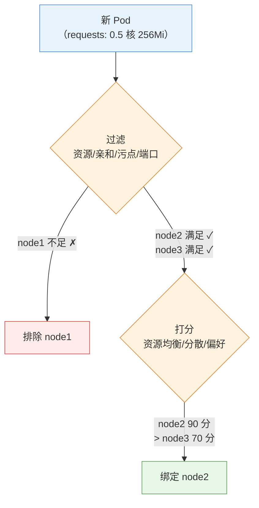

# 第 6 章 调度器与调度策略

> 配套实验手册：《Kubernetes 实验手册》（manual/ 目录）**实验 04「集群资源调度」**（7 个 Lab：labels/nodeSelector/亲和/taint/tolerations/drain/PDB/控制面承载）。本章讲"Pod 落在哪个节点"的全部决策机制——从调度器的两阶段原理，到四种控制落点的手段（nodeSelector/亲和/污点容忍/节点维护），这是理解集群资源利用与高可用的关键。

## 学习目标

学完本章，你应该能够：

1. 解释调度器的两阶段决策过程（过滤 → 打分），知道哪些因素参与过滤与打分
2. 对比四种节点选择手段（nodeSelector/节点亲和/污点容忍/手动指定），说出各自适用场景
3. 解释节点亲和与反亲和的软硬约束（required/preferred）与表达式语法
4. 解释 Pod 亲和/反亲和的原理与 topologyKey（拓扑域）的概念，能设计多副本高可用分布
5. 解释污点与容忍的机制、三种 effect 的语义（含 NoExecute 驱逐时间）
6. 说出控制面节点"不跑业务"的实现机制（内置污点）
7. 解释 cordon/drain/uncordon 维护流程与 drain 的驱逐逻辑
8. 解释 PDB 如何保护驱逐（ALLOWED DISRUPTIONS 计算）
9. 综合运用：为一个 Pod 规划完整的落点控制方案

---

## 6.1 调度器：Pod 落点的决策者

### 6.1.1 调度的本质

**调度（Scheduling）** = 决定"这个新 Pod 放在哪台节点上"。第 2、3 章已经见过它的身影（scheduler 组件 + "过滤/打分"），本章把它讲透。

调度只发生在**新创建的 Pod**（Pending 状态）上：

```text
Pod 创建（未指定节点）→ 状态 Pending
   │
   ▼
调度器决策 → 把 nodeName 写进 Pod 对象（绑定）
   │
   ▼
目标节点 kubelet 通过 Watch 发现 → 拉起容器（第 2 章 §2.6.2 旅程）
```

> **核心认知**：调度器**不直接通知** kubelet"我调给你了"——它只修改 Pod 对象的 `spec.nodeName` 字段，kubelet 自己 Watch 到才动手。这是第 2 章"组件只与 apiserver 通信"的又一次体现。

### 6.1.2 两阶段决策：过滤与打分

调度器对每个待调度 Pod 执行两个阶段：

**阶段一：过滤（Filtering）——"哪些节点不合格"**

逐节点检查硬性条件，不满足直接排除：

- 资源够吗？（节点可用 CPU/内存 ≥ Pod 的 requests，第 4 章）
- 满足 nodeSelector 和节点亲和吗？（§6.2/6.3）
- 能容忍节点污点吗？（§6.4）
- 端口冲突吗？主机名/磁盘压力/年龄等其他硬条件
- 结果：候选节点集合（可能为空 → Pod 一直 Pending）

**阶段二：打分（Scoring）——"候选里选谁最优"**

对候选节点逐项打分（各策略加权求和），最高分胜出：

- **资源均衡**：剩余资源（CPU/内存）越均衡得分越高（避免某节点挤爆、其他闲置）
- **Pod 分布**：与同应用已有 Pod 尽量分散（反亲和偏好，§6.3）
- **节点亲和偏好**（preferred 部分）
- 结果：得分最高者被选中，Pod 绑定到它

<!-- 原 ASCII 图已转为 Mermaid -->


> 读图要点：**过滤是"一票否决"（不合格直接排除）、打分为"择优录取"（剩余里选最优）**——先保证可行性，再追求均衡性。

> **排障关联**：Pod 一直 Pending → `kubectl describe pod` 的 Events 看 `FailedScheduling`——**报错直接说"哪个条件不满足"**（如 `didn't match node selector`、`Insufficient cpu`、`Untolerated taint`），改对应配置即可（实验 10 Lab 1 三板斧）。

### 6.1.3 调度器的可替换性

调度器不是"硬编码"的：Pod 可以用 `schedulerName` 指定**自定义调度器**（如专门处理 GPU 任务的调度器）。默认调度器（kube-scheduler）覆盖绝大多数场景；知道"调度策略可插拔"即可（进阶内容）。

### 6.1.4 Descheduler：调度生命周期的闭环

**问题**：调度器**只在 Pod 创建时决策一次**——之后新节点加入、节点资源碎片化、副本增减，已运行的 Pod 不会重新平衡：

```text
场景：node1 挤满、node3 空着 → 新 Pod 调度到 node3
     但 node1 上的旧 Pod 不会自己挪过来 → 长期"贫富不均"
```

**Descheduler**（独立的控制器组件）定期扫描并**驱逐需要重新调度的 Pod**（按策略：低利用率节点合并、副本分散、节点年龄等）——被驱逐的 Pod 走优雅终止（第 4 章）后由控制器重建、重新调度（§6.1 流程）。

> **核心认知**：**Descheduler 与调度器互补**——调度器管"初始放置"，Descheduler 管"运行期再平衡"（配合 Cluster Autoscaler 第 14 章实现资源生命周期闭环）。教学环境可选安装，知道概念即可。

---

## 6.2 节点选择：把 Pod 定向到节点

### 6.2.1 nodeSelector：最简单的方式

给节点打标签，Pod 声明"只要带这个标签的节点"：

```yaml
# 节点标签
kubectl label node node2 disktype=ssd

# Pod 声明
spec:
  nodeSelector:
    disktype: ssd      # 只调度到 disktype=ssd 的节点
```

**特点与局限**：

- 简单直观，但**只能做"等值匹配"**（=）
- 不能表达"或"（ssd 或 nvme）、"非"（不要 CPU 密集节点）、"软性偏好"（最好在 SSD 上，没有也无妨）

> 需要更强表达力 → 节点亲和。

### 6.2.2 节点亲和/反亲和：表达式的力量

**节点亲和（nodeAffinity）** 是 nodeSelector 的升级版，支持**表达式匹配**与**软硬约束**：

- **requiredDuringScheduling**（硬性）：必须满足，否则不调度（≈ nodeSelector，但更强）
- **preferredDuringScheduling**（软性）：尽量满足，不满足也能调度（打分加权，§6.1.2）

```yaml
spec:
  affinity:
    nodeAffinity:
      requiredDuringSchedulingIgnoredDuringExecution:   # 硬性
        nodeSelectorTerms:
        - matchExpressions:
          - key: disktype
            operator: In
            values: ["ssd", "nvme"]      # 或：ssd 或 nvme
      preferredDuringSchedulingIgnoredDuringExecution:  # 软性
      - weight: 100                                    # 权重（打分用）
        preference:
          matchExpressions:
          - key: zone
            operator: In
            values: ["az-a"]             # 最好在 az-a，没有也行
```

### 6.2.3 matchExpressions 语法（operators）

| operator | 含义 | 示例 |
|---|---|---|
| `In` | 值在列表里 | `In` |
| `NotIn` | 值不在列表里 | 排除某些节点 |
| `Exists` | 键存在（不管值） | 节点有该标签 |
| `DoesNotExist` | 键不存在 | 节点没有该标签 |
| `Gt` / `Gt` | 值大于/小于（数值标签） | `Gt` |

> **为什么叫"节点亲和"而不是"节点选择"**：语义从"我选节点"升级为"节点与我的关系"——可以表达"我偏好在这些节点上"（软性），这是选择器做不到的。

### 6.2.4 三种节点选择手段的选型

| 手段 | 能力 | 适用 |
|---|---|---|
| `nodeName`（直接写节点名） | 指定唯一节点 | 特殊调试（**生产不推荐**：节点挂了 Pod 就困死） |
| `nodeSelector` | 等值匹配 | 简单场景（如"只上 GPU 节点"） |
| `nodeAffinity` | 表达式 + 软硬约束 | 需要"或/非/软偏好"的复杂场景 |

> **决策逻辑**：简单等值 → nodeSelector；需要表达式或软偏好 → nodeAffinity；`nodeName` 只在调试时用。

---

## 6.3 Pod 亲和/反亲和：Pod 之间的位置关系

### 6.3.1 为什么需要"Pod 之间的位置控制"

节点选择解决"Pod 与节点的关系"，但很多场景需要控制"**Pod 与 Pod 的关系**"：

- **反亲和（分散）**：同一应用的 3 个副本**不要放同一台节点**——一台挂了不至于全部副本一起挂（高可用）
- **亲和（聚合）**：缓存服务与计算服务**放在同一节点**——本地访问快（数据本地性）

nodeSelector/节点亲和做不了这个（它们只认节点标签，不关心其他 Pod 在哪）。

### 6.3.2 拓扑域（topologyKey）：用什么维度衡量"同一处"

Pod 亲和/反亲和的"就近/分散"需要一个**拓扑单位**——`topologyKey` 指定按哪个标签分组：

- `kubernetes.io/hostname`：按**节点**分（同一节点 = 同一拓扑域）
- `topology.kubernetes.io/zone`：按**可用区**分（同一机房 = 同一拓扑域）
- `topology.kubernetes.io/region`：按**地域**分

```yaml
topologyKey: kubernetes.io/hostname
   node1（web-1, web-2）│ node2（web-3）│ node3（）
   ↑ web-1 和 web-2 在同一拓扑域（同节点）→ 反亲和会避免这种情况
```

> **核心认知**：拓扑域 = "多分散/多聚合才算数"的度量单位。**同节点分散（hostname）是默认需求**；跨可用区分散（zone）是生产高可用的进阶需求。

### 6.3.3 podAffinity / podAntiAffinity

与节点亲和结构几乎一样，只是匹配对象从"节点标签"换成"**已运行 Pod 的标签**"：

```yaml
spec:
  affinity:
    podAntiAffinity:                       # 反亲和：分散
      requiredDuringSchedulingIgnoredDuringExecution:
      - labelSelector:
          matchLabels:
            app: web                       # 匹配"app=web 的已运行 Pod"
        topologyKey: kubernetes.io/hostname  # 以节点为单位分散
    podAffinity:                           # 亲和：聚合
      preferredDuringSchedulingIgnoredDuringExecution:
      - weight: 100
        podAffinityTerm:
          labelSelector:
            matchLabels:
              app: cache
          topologyKey: kubernetes.io/hostname  # 与 cache Pod 同节点最好
```

**硬性 vs 软性**（与节点亲和相同的语义）：

- `required`（硬）：**可能导致调度不上**——例如 5 个副本反亲和到 3 台节点（每节点最多 1 个），第 4、5 个会一直 Pending
- `preferred`（软）：尽量满足，打分加权

### 6.3.4 典型场景设计

**场景一：多副本高可用分布**

```text
3 副本 web + podAntiAffinity(required, hostname)
→ 每个节点最多 1 个 web 副本：一台节点挂了，另两台照常服务
```

> ⚠️ 注意：`required` 反亲和的副本数**不能超过节点数**（5 副本 × 3 节点 → 2 个永远 Pending）。高可用部署的标准组合是：**反亲和 + PDB + 多副本**（PDB 见 §6.5.2）。

**场景二：计算与缓存同地**

```text
计算 Pod（job） + podAffinity(preferred, app=cache, hostname)
→ 尽量调度到有 cache Pod 的节点：本地读缓存，不跨节点
```

### 6.3.5 Pod 拓扑分布约束（topologySpreadConstraints）

**问题**：podAntiAffinity 能做到"分散"，但表达力有限——只能按单一 topologyKey 写死规则，且是"有则避开"的硬逻辑。**现代多可用区/多节点均衡打散的最佳实践是 topologySpreadConstraints**：

```yaml
spec:
  topologySpreadConstraints:
  - maxSkew: 1                          # 允许的最大分布偏差（≤1 即"尽量均匀"）
    topologyKey: topology.kubernetes.io/zone   # 按可用区分组
    whenUnsatisfiable: DoNotSchedule     # 无法满足时：不调度（硬）/ScheduleAnyway（软）
    labelSelector:
      matchLabels:
        app: web
```

**与 podAntiAffinity 的对比**：

| 维度 | podAntiAffinity | topologySpreadConstraints |
|---|---|---|
| 语义 | "避开已有同标签 Pod" | "**按拓扑域均匀分布**"（偏差 ≤ maxSkew） |
| 多维度 | 单一 topologyKey | 可配多个约束（跨 zone + 跨节点同时约束） |
| 软硬 | required/preferred | DoNotSchedule / ScheduleAnyway |
| 适用 | 简单分散 | **跨可用区高可用、节点池均衡**（生产最佳实践） |

> **决策逻辑**：只是"同一节点别放两个" → podAntiAffinity 够用；要"跨可用区均匀分布、任何 zone 的 Pod 数差 ≤1" → topologySpreadConstraints（**生产高可用的标配**，常与 PDB、反亲和组合）。注意 `maxSkew` 过严可能导致调度不上（与 required 反亲和同样受节点数约束）。

---

## 6.4 污点与容忍：节点的"排斥力"与 Pod 的"通行证"

### 6.4.1 机制：两个方向的力量

前两节是 **Pod 主动挑节点**（亲和）；污点机制是 **节点主动排斥 Pod**：

- **污点（Taint）**：节点上打的"排斥标记"——默认情况下，带污点的节点**拒绝**没有相应容忍的 Pod
- **容忍（Toleration）**：Pod 声明的"通行证"——容忍了某个污点，才能被调度到该节点

```text
node1（带污点: dedicated=gpu:NoSchedule）
   ──► 普通 Pod：拒绝调度 ✗
   ──► 带容忍的 Pod：放行 ✓
```

### 6.4.2 三种 effect（排斥的强度）

| effect | 语义 | 典型用途 |
|---|---|---|
| `NoSchedule` | 不调度新 Pod（**已在跑的不管**） | 节点维护前隔离新负载 |
| `PreferNoSchedule` | 尽量不调度（软性，打分排斥） | 偏好性隔离 |
| `NoExecute` | 不调度新 Pod + **驱逐已在跑的**（不带容忍的 Pod 立即被赶走） | 节点故障/隔离的强手段 |

**NoExecute 的驱逐时间（tolerationSeconds）**：容忍可以带时长——`tolerationSeconds: 60` 表示"容忍 60 秒，之后被驱逐"。用于"故障节点上让 Pod 多活一会儿完成收尾"。

```bash
kubectl taint nodes node2 dedicated=gpu:NoSchedule     # 打污点
kubectl taint nodes node2 dedicated=gpu:NoSchedule-    # 去掉污点（末尾 -）
```

### 6.4.3 内置污点：你其实天天在用

集群里默认存在一些**系统污点**，理解了它们很多"奇怪现象"就通了：

- **控制面节点**：`node-role.kubernetes.io/control-plane:NoSchedule`——**这就是"控制面不跑业务 Pod"的实现机制**（第 2 章提到过；实验 04 Lab 6 就是去掉它让 控制面承载负载）
- **节点 NotReady**：`node.kubernetes.io/not-ready:NoExecute`——节点失联时驱逐其上 Pod（第 16 章排障相关）
- **磁盘/网络压力**：`node.kubernetes.io/disk-pressure` 等

> **DaemonSet 之谜解开**（第 5 章遗留问题）：calico-node 等 DaemonSet 为什么能跑在控制面节点上？——DaemonSet 的 Pod **自动容忍节点故障类污点**（not-ready/unreachable/disk-pressure 等，由 DaemonSet 控制器默认注入，保证节点异常时守护组件不被驱逐）；但 **control-plane 污点不自动容忍**——calico-node 能上控制面节点 是因为它的清单里**显式写了 tolerations**（实验 04 Lab 7 演练过）。

### 6.4.4 应用场景

- **专用节点**：GPU 节点打 `dedicated=gpu:NoSchedule`，只有带容忍的 AI 任务能上（防止普通任务挤占 GPU）
- **节点隔离**：节点出问题先 `NoExecute` 驱逐业务，再维护
- **控制面保护**：内置 control-plane 污点（§6.4.3）
- **混合环境**：隔离"测试节点"和"生产节点"

### 6.4.5 污点 vs 亲和（两个独立维度）

| 维度 | 谁主动 | 方向 |
|---|---|---|
| 亲和（nodeAffinity/podAffinity） | **Pod 主动挑** | Pod → 节点（我要去哪） |
| 污点/容忍 | **节点主动拒** | 节点 → Pod（我不要谁） |

两者**同时生效**（先过滤双方条件），配合使用：**亲和"要什么节点" + 容忍"能上什么节点"**——生产常用组合：GPU 任务 = nodeAffinity(要 gpu=true 的节点) + tolerations(容忍 gpu 污点)。

---

## 6.5 节点维护与驱逐保护

### 6.5.1 维护三步曲：cordon / drain / uncordon

节点要维护（升级/换硬件/重启）时，标准动作（实验 12 Lab 3 实操过）：

```bash
kubectl cordon node2      # ① 隔离：标记不可调度（已有 Pod 不受影响）
kubectl drain node2 --ignore-daemonsets   # ② 排空：驱逐所有业务 Pod（到其他节点）
[维护...]
kubectl uncordon node2    # ③ 恢复：重新可调度
```

- **cordon**：只挡新 Pod（= 打 `node.kubernetes.io/unschedulable` 标记）
- **drain**：驱逐 Pod（走第 4 章优雅终止流程：摘流量 → preStop → SIGTERM）——`--ignore-daemonsets` 跳过 DaemonSet（它们的 Pod 会由控制器在节点恢复后自动重建，驱逐无意义）
- **uncordon**：去掉隔离标记

> **为什么 drain 是安全的**：驱逐逐个进行、每个走优雅终止（实验 02 Lab 9）——业务无感迁移（配合 PDB，见下）。

### 6.5.2 PodDisruptionBudget：驱逐的保险丝

**问题**：drain node2 时，如果 node2 上正好有某应用的全部 3 个副本，一次全驱逐 = 服务中断。

**PDB（PodDisruptionBudget）**：约束"**主动驱逐**（drain 这类）最多能同时干掉几个副本"：

```yaml
apiVersion: policy/v1
kind: PodDisruptionBudget
metadata:
  name: web-pdb
spec:
  minAvailable: 2          # 至少保持 2 个可用
  selector:
    matchLabels:
      app: web
```

**ALLOWED DISRUPTIONS 计算**：

```text
当前可用副本数 3 - minAvailable 2 = 允许同时驱逐 1 个

kubectl get pdb
NAME      MIN AVAILABLE   ALLOWED DISRUPTIONS
web-pdb   2               1
```

**两个重要边界**：

1. PDB **只约束主动驱逐**（drain/自愿中断）——节点宕机、Pod 崩溃这类**非自愿中断不归它管**（控制器照样重建）
2. PDB 只保护"副本数量"——**不保护"这些副本是否可用"**：若 3 个副本里 2 个已经 CrashLoop（readiness 失败），PDB 可能直接阻止 drain（"可用数已经低于 minAvailable，不允许再驱逐"）

> **生产实践**：核心服务（数据库/网关/所有多副本应用）必须配 PDB——**否则一次节点维护就可能造成全量中断**。`maxUnavailable` 模式（上限）与 `maxUnavailable` 模式（保底）二选一。

---

## 6.6 综合走查：一个 Pod 的完整落点决策

把本章所有机制串起来——一个带完整约束的 Pod 从创建到落点：

```bash
kubectl apply -f gpu-job.yaml（期望：3 副本、要 GPU 节点、副本分散、容忍 GPU 污点）
   │
   ▼ 调度器过滤（阶段一）：
   ① 资源过滤：节点剩余 ≥ requests？
   ② 节点亲和：节点有 gpu=true 标签？（nodeAffinity required）
   ③ 污点过滤：节点有 GPU 污点 → Pod 有容忍吗？（tolerations）
   ④ Pod 反亲和：该节点已有 gpu-job 副本？（podAntiAffinity required, hostname）
   → 候选节点集
   │
   ▼ 打分（阶段二）：
   资源均衡度 + preferred 偏好（如"优先 zone-a"）
   → 选出最优节点 node2
   │
   ▼ 绑定：Pod.nodeName = node2 → kubelet 拉起
   │
   ▼ 之后（运行时保护）：
   节点维护 drain → PDB 限制同时驱逐数（minAvailable=2）→ 优雅终止迁移
```

> **设计顺序建议**：先定"应用类型与副本数"（第 5 章）→ 再定"落点约束"（本章：节点亲和 + 污点容忍 + Pod 反亲和）→ 最后加"运行期保护"（PDB + 探针）。三层约束各有各的职责，缺一不可。

---

## 6.7 实验演练指引

本章机制对应实验 **04「集群资源调度」**（7 个 Lab）：

- **Lab 1 labels 和 nodeSelector**：给节点打标签 + nodeSelector 定向调度——基础手段
- **Lab 2 亲和性**：nodeAffinity（matchExpressions）+ podAntiAffinity 分散副本——表达式与拓扑域
- **Lab 3 taint 和 tolerations**：给节点打污点 + Pod 加容忍——"排斥力与通行证"亲手验证
- **Lab 4 drain 和 uncordon**：节点排空与恢复——维护三步曲
- **Lab 5 PDB**：创建 PodDisruptionBudget，**drain 时被 PDB 拦截**（实测观察）
- **Lab 6 使 控制面承载工作负载**：去掉 control-plane 污点——内置污点的实操
- **Lab 7 部署在控制面节点上的 DaemonSet**：容忍控制面污点后 DaemonSet 上控制面节点——内置污点 + 容忍组合

> 教学建议：实验顺序就是本章小节顺序——Lab 1/2 对应 §6.2/6.3（Pod 主动挑），Lab 3 对应 §6.4（节点主动拒），Lab 4/5 对应 §6.5（维护与保护），Lab 6/7 对应 §6.4.3（内置污点实战）。

---

## 本章小结

- **调度本质**：新 Pod（Pending）→ 调度器两阶段（过滤硬条件 + 打分选最优）→ 写 nodeName → kubelet 拉起
- **过滤项**：资源/亲和/污点容忍/端口等；**打分项**：资源均衡/Pod 分散/软偏好
- **节点选择**：nodeSelector（等值）→ nodeAffinity（表达式 + 软硬）——需要"或/非/软偏好"用亲和
- **Pod 亲和**：topologyKey 定义"同一处"（hostname=同节点、zone=同可用区）；反亲和分散副本保高可用（**副本数 ≤ 拓扑域数**）
- **污点/容忍**：节点主动拒（NoSchedule 挡新/NoExecute 连旧一起驱逐）；内置污点解释了"控制面不跑业务"与"DaemonSet 上控制面节点"
- **维护三步曲**：cordon（挡新）→ drain（驱逐，走优雅终止）→ uncordon（恢复）
- **PDB**：只保护**主动驱逐**的副本数（ALLOWED = 可用 - minAvailable）——核心服务必配
- **三层设计**：副本数（第 5 章）+ 落点约束（本章）+ 运行期保护（PDB/探针）

**衔接**：第 7 章讲"资源不够了怎么办"——扩缩容（HPA）与资源治理（requests/limits 体系、LimitRange、ResourceQuota），调度器过滤里的"资源"就是第 7 章的主角。

## 思考题

1. 调度器过滤阶段和打分阶段各回答什么问题？举一个"过滤通过但打分靠后"的例子。
2. nodeSelector 与 nodeAffinity 的本质区别是什么？什么场景必须用亲和？
3. 5 个副本配 `podAntiAffinity(required, hostname)` 在 3 节点集群会发生什么？为什么？
4. taint 的 NoExecute 与 NoSchedule 的区别？容忍里 `tolerationSeconds: 60` 是什么意思？
5. 为什么 DaemonSet 的 Pod 能跑到带 control-plane 污点的 控制面节点上？
6. PDB 能防止节点宕机导致的业务中断吗？为什么？（提示：自愿 vs 非自愿中断）
7. 设计一个"GPU 推理服务"的落点方案：要 GPU 节点、副本分散、节点维护时业务无损——需要哪几层配置？

> **CKA 考点标注**（对应域 2：工作负载与调度 15%）：
> - **必考命令**：`kubectl label node`、`kubectl label node`、`kubectl label node`、`kubectl label node`
> - **必考机制**：两阶段调度、nodeAffinity（required/preferred + matchExpressions）、podAntiAffinity + topologyKey、污点三种 effect、PDB 计算（minAvailable/maxUnavailable）
> - **高频场景题**：给定需求（专用节点/分散高可用/维护窗口）→ 配置对应机制
> - 排障关联（域 5）：`FailedScheduling`（调度条件不满足，describe 看 Events）
