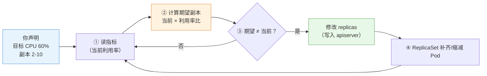
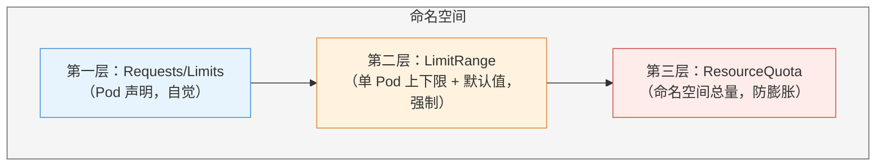

# 第 7 章 自动扩缩与资源治理

> 配套实验手册：《Kubernetes 实验手册》（manual/ 目录）**实验 05「资源管理和监控」**（4 个 Lab：metrics-server/HPA/LimitRange/ResourceQuota）。本章讲两件事：**自动扩缩**（负载变了，副本数怎么自动跟随）与**资源治理**（怎么防止资源被滥用）——前者是"弹性"的实现，后者是"秩序"的保障，两者都围绕第 4 章的 requests/limits 展开。

## 学习目标

学完本章，你应该能够：

1. 解释指标链路（kubelet → metrics-server → metrics API），知道 HPA 和 kubectl top 的数据来源
2. 解释 HPA 的工作原理（控制循环 + 指标 → 期望副本数），说出指标类型与计算公式
3. 解释 HPA 的伸缩节奏（稳定窗口/冷却）与 behavior 策略
4. 区分三种扩缩（HPA 水平/VPA 垂直/ClusterAutoscaler 节点级）的定位
5. 解释资源治理三层防线（requests/limits → LimitRange → ResourceQuota）各自的管辖范围
6. 解释 LimitRange 与 ResourceQuota 的拒绝机制（准入控制）
7. 说出"没有限制"与"限制过严"的风险，设计合理的资源治理方案

---

## 7.1 指标链路：扩缩容的数据基础

### 7.1.1 谁提供"用量数据"

第 4 章讲过 requests/limits 是**静态声明**；但"实际用了多少"需要**动态数据**——这就是 metrics-server 的角色：

- **metrics-server**：集群内的**指标采集器**（kube-system 里的一个 Deployment，实验 01 安装）
- 它从每个节点的 **kubelet（cAdvisor）** 拉取节点与容器的 CPU/内存用量，聚合后暴露为标准 API

### 7.1.2 指标链路

```text
节点上的容器
   │ kubelet 内置 cAdvisor 采集（CPU/内存实际用量）
   ▼
metrics-server（默认单副本 Deployment，从各节点 kubelet 的 Summary API 拉取）
   │ 聚合
   ▼
metrics.k8s.io API（apiserver 暴露的标准接口）
   ├─ kubectl top node / top pod（人看）
   └─ HPA 控制器（机器用，§7.2）
```

> **核心认知**：没有 metrics-server，`kubectl top` 报 `kubectl top`，**HPA 也无法工作**（指标未知 → 无法决策）。所以实验 05 的 Lab 1 是 HPA 的前提。

> 注意：metrics-server 只提供**实时用量**（不存历史）；历史趋势与告警需要 Prometheus 这类完整监控（第 15 章可观测性展开）。

---

## 7.2 HPA：水平自动扩缩

### 7.2.1 原理：又一个控制循环

**HPA（HorizontalPodAutoscaler）** 把第 2 章的控制循环应用在"副本数"上：

<!-- 原 ASCII 图已转为 Mermaid -->


> 读图要点：**HPA 是控制循环的又一个实例**（周期约 15 秒）——读指标 → 算期望副本（当前 × 利用率比）→ 有差异才改 replicas；修改 replicas 只是改期望状态，真正补齐 Pod 的是 ReplicaSet（第 5 章）。

```text
示例：副本 3，目标 60%，当前利用率 90%
  期望副本 = 3 × (90% / 60%) = 4.5 → 取整 5
  → replicas 3 → 5（扩容）
```

### 7.2.2 指标类型（autoscaling/v2）

| 指标类型 | 含义 | 示例 |
|---|---|---|
| **Utilization**（利用率） | 实际用量 / requests 的百分比 | CPU 利用率 60%（最常用） |
| **AverageValue**（平均值） | 每副本的平均绝对用量 | 每副本内存 200Mi |
| **Value**（总值） | 整个工作负载的总量 | 总请求数 |
| 自定义/外部指标 | Prometheus 等来源（需适配器） | QPS、队列长度（进阶） |

> 注意 Utilization 的分母是 **requests**（不是节点容量）——所以 **HPA 的准确性依赖 requests 设置合理**（第 4 章资源模型的意义又一处体现）。

### 7.2.3 伸缩节奏：为什么不会"抖"？

指标是波动的——如果利用率在 59%/61% 间跳，副本数会不停增减（抖动）。HPA 用**稳定窗口**平滑：

- **scaleUp 稳定窗口**（默认 0 秒，可配置如 60s）：利用率持续超目标这么久才扩容
- **scaleDown 稳定窗口**（默认 5 分钟）：利用率持续低于目标这么久才缩容——**缩容比扩容谨慎**（扩错了最多多花钱，缩错了会扛不住流量）

### 7.2.4 behavior：精细控制伸缩

```yaml
behavior:
  scaleUp:
    stabilizationWindowSeconds: 60     # 扩容稳定窗口
    policies:
    - type: Percent
      value: 100                       # 一次最多翻倍
      periodSeconds: 60
  scaleDown:
    stabilizationWindowSeconds: 300    # 缩容稳定窗口（默认 5 分钟）
    policies:
    - type: Percent
      value: 50                        # 一次最多缩一半
```

> **生产要点**：默认行为（5 分钟缩容稳定窗口）通常够用；关键业务可收紧 scaleUp 窗口（更快扩容）、拉长 scaleDown 窗口（更稳的缩容）。

### 7.2.5 局限与注意

- **指标延迟**：metrics-server 采集有延迟（~15s），HPA 决策滞后于流量变化——**突发流量场景要预留余量**（目标利用率别设 90%，留 60-70%）
- **最小/最大副本**：`minReplicas` 保底（应对冷启动）、`minReplicas` 封顶（防失控）
- **与手动 scale 的关系**：手动 `kubectl scale` 会**被 HPA 覆盖**（HPA 是权威）——要么手动、要么 HPA，不要混用（调整 HPA 的 min/max 而不是手动 scale）
- **与第 4 章资源模型的关系**：HPA 只认 requests——**Pod 没配 requests，HPA 的 CPU 利用率指标不可用**

---

## 7.3 垂直扩缩与集群扩缩：另外两个维度

HPA 只是"水平"（加副本）。还有两个扩缩维度：

### 7.3.1 VPA（Vertical Pod Autoscaler）：调 requests 而不是副本数

- **原理**：根据历史用量**自动调整 Pod 的 requests/limits**（而不是副本数）
- **为什么需要**：应用实际需求会变（内存泄漏前的膨胀、业务高峰）——人工调 requests 很烦
- **机制**：VPA 建议 → 修改 Deployment 模板 → 滚动更新（**需要重建 Pod 生效**，因为是模板变化）
- **注意**：VPA 与 HPA 在 CPU/内存指标上**不能同时用**（会打架）——生产常用"VPA 调 requests + HPA 管副本"

> ⭐ **In-place Pod Resource Updates（v1.27+）**：Kubernetes 原生支持**不重启 Pod** 原地更新部分资源字段（`spec.containers[].resources` 的 Requests/Limits）——改变了 VPA 必须"重建 Pod"的运作模式。开启该特性后，VPA 或手动 `spec.containers[].resources` 修改资源可以**原地生效**（对重启敏感的有状态服务意义重大）。v1.36 已支持（部分字段需要 Pod 不在 QoS 突变范围）。

### 7.3.2 ClusterAutoscaler（CA）：节点级扩缩

- **原理**：集群资源不足时**自动增减节点**（云环境，调用云厂商 API）
- **为什么需要**：Pod 挤满所有节点（调度过滤失败 Pending）→ 加节点；节点长期空闲 → 减节点
- **注意**：需要云环境（裸机集群无法自动加机器）；与 HPA 配合形成"应用级 + 节点级"双层弹性

### 7.3.3 三种扩缩的定位

| 维度 | 调整什么 | 生效方式 | 适用 |
|---|---|---|---|
| **HPA**（水平） | 副本数 | 立即（改 replicas） | 无状态应用，最常用 |
| **VPA**（垂直） | requests/limits | 需重建 Pod（v1.27+ 可原地） | 有状态/不好水平扩展的应用 |
| **ClusterAutoscaler**（节点级） | 节点数 | 分钟级（云 API） | 集群容量不足时 |

> **决策逻辑**：**默认 HPA**（无状态应用的水平扩展是首选）；副本数不能随便加（有状态/单实例）→ VPA；节点容量瓶颈 → ClusterAutoscaler。三者可以组合（生产标准组合：HPA + CA）。

### 7.3.4 KEDA：事件驱动自动扩缩（进阶）

**HPA 的局限**：只认 CPU/内存（或需额外适配器接自定义指标）。生产中常见"**消息队列堆积量**触发扩容"（RabbitMQ/Kafka 积压 1 万条 → 加消费者）——这是 **KEDA（Kubernetes Event-driven Autoscaling）** 的场景：

- KEDA 内置 70+ **Scaler**（Kafka/RabbitMQ/Redis/HTTP 等），直接读外部系统指标
- 以"自定义指标源"形式接入 HPA（KEDA 负责把外部指标变成 HPA 能用的指标）
- 使用：安装 KEDA → 创建 `ScaledObject`（声明"队列长度 > N 时扩到 M 个"）

> 决策逻辑：**标准 CPU/内存 → HPA 原生；外部系统事件（队列/吞吐）驱动 → KEDA**（事件驱动弹性，Serverless 化工作负载的方向）。

---

## 7.4 资源治理三层防线

> 资源治理回答："怎么防止某个 Pod/命名空间把集群资源吃光？"——**三层防线，层层递进**（第 4 章 requests/limits 是地基）。

### 7.4.1 第一层：requests/limits（Pod 自己声明）

- 每容器声明"要多少/最多用多少"（实验 02 Lab 10）
- **问题**：靠自觉——Pod 不写就没有；写小了（requests）节点可能超卖；写大了浪费

### 7.4.2 第二层：LimitRange（命名空间内约束"单个 Pod"）

**LimitRange** 在**命名空间级别**给"单个对象"设默认值与上下限：

```text
命名空间 dev 的 LimitRange：
  - 每个 Pod 的 requests 必须在 50m~2 核、内存 32Mi~1Gi
  - Pod 没写 requests/limits → 自动填默认值（default/defaultRequest）
```

**三个动作**（准入控制实现，第 12 章展开）：

1. **校验**：Pod 声明超出范围 → **创建被拒**（`Forbidden`）
2. **填充**：Pod 没声明 → 自动补默认值（**防止"裸奔"Pod**——这是最重要的一条）
3. **约束**：统一命名空间的资源声明口径

```bash
kubectl -n dev apply -f lr-pod.yaml（requests 4 核 > 上限 2 核）
Error from server (Forbidden): ... maximum cpu usage per Pod is 2, but request is 4
```

> **核心认知**：LimitRange 解决"**单个 Pod 不守规矩**"——要么超限被拒，要么没写被填默认。

### 7.4.3 第三层：ResourceQuota（命名空间内约束"总量"）

**ResourceQuota** 约束**整个命名空间的累计用量**——所有 Pod 的 requests/limits **加起来**不能超过配额：

```text
命名空间 dev 的 ResourceQuota：
  requests.cpu: 10 核、requests.memory: 20Gi
  limits.cpu: 20 核、limits.memory: 40Gi
  pods: 100、services: 50、pvc: 20 ...
```

- 超过配额 → 新对象创建被拒（`exceeded quota`）
- **资源释放后自动恢复**（删掉占用后又能建）
- 还能配额对象数量（pods/services/pvc 等）——防止命名空间资源无限膨胀

```bash
kubectl -n dev apply -f new-pod.yaml
Error from server (Forbidden): exceeded quota: dev-quota, requested: requests.cpu=500m, used: requests.cpu=9.7, limited: requests.cpu=10
```

> **排障关联**：创建 Pod 报 `exceeded quota`（实验 10 Lab 1）→ `exceeded quota` 看 Used/Hard——**报错直说超了哪个配额**。

### 7.4.4 三层协作与设计建议

<!-- 原 ASCII 图已转为 Mermaid -->


> 读图要点：**三层是"递进约束"**——Requests/Limits 是 Pod 自觉声明（不写就没人管）；LimitRange 在命名空间内强制单 Pod 的默认值与上下限；ResourceQuota 兜底命名空间总量——后两层都在准入控制执行（第 12 章）。

**设计建议**（生产视角）：

- 每个**生产命名空间**都配 ResourceQuota（总量兜底）
- 配 LimitRange 的 `default`（**强制每个 Pod 都有 requests**——HPA 依赖它、调度依赖它）
- 测试命名空间配额可以小（倒逼省资源）；生产按业务量评估
- 记住拒绝机制都在**准入控制**（创建时拦截，第 12 章展开原理）

### 7.4.5 设计指南：多租户治理体系

> 多团队/多业务共用一个集群时，"怎么隔离 + 怎么分资源"是核心治理问题——与第 11 章 RBAC 联动，构成完整的多租户体系。

**命名空间规划模型**（按组织规模选）：

```text
模型一：按环境划分（小团队）        dev / staging / production
模型二：按团队×环境（中型组织）     team-order-dev / team-payment-prod
模型三：按业务域划分（大型组织）    domain-trade / domain-payment
        域内按微服务部署，跨域用 NetworkPolicy 隔离（第 9 章）
```

**多租户隔离四层模型**（层层加固）：

| 层级 | 机制 | 隔离强度 | 适用 |
|---|---|---|---|
| L1 逻辑隔离 | Namespace + RBAC（第 11 章） | ⭐⭐ | 同信任域内团队 |
| L2 资源隔离 | ResourceQuota + LimitRange（本章） | ⭐⭐⭐ | 防 Noisy Neighbor（吵闹邻居） |
| L3 网络隔离 | NetworkPolicy（第 9 章） | ⭐⭐⭐⭐ | 跨团队安全边界 |
| L4 节点隔离 | Taint/Toleration + 专用节点池（第 6 章） | ⭐⭐⭐⭐⭐ | 合规/安全敏感负载 |

**资源超卖策略**（配额与 requests 的设计）：

```text
测试环境：超卖比 200-300%（requests 低、limits 高，允许争抢）
生产环境：超卖比 120-150%（requests 接近实际用量）
核心服务：超卖比 100%（Guaranteed QoS，requests = limits，零争抢）
监控指标：节点实际利用率 / requests 总和 = 实际超卖比，> 85% 触发扩容
```

> 决策逻辑：**先定租户模型（命名空间规划）→ 再定隔离级别（四层按需）→ 最后定超卖策略（配额/requests 比例）**——多租户治理 = "逻辑划分 + 资源约束 + 网络边界"三件套。

---

## 7.5 实验演练指引

本章机制对应实验 **05「资源管理和监控」**（4 个 Lab）：

- **Lab 1 安装 metrics-server**：指标链路的数据源——`kubectl top node/pod` 有数（requests/limits 基础在实验 02 Lab 10）
- **Lab 2 启用 HPA**：autoscaling/v2 配置 CPU/内存指标，压测观察副本自动增减
- **Lab 3 LimitRange**：`min/max/default/defaultRequest`——超限 Forbidden、缺省自动填充
- **Lab 4 ResourceQuota**：`hard` 配额 + `hard` 观察——超配额拒绝、释放恢复

> 教学建议：Lab 1 是 HPA 的前提（无指标无决策）；Lab 3/4 对比记忆——**LimitRange 管单个、ResourceQuota 管总量**。

---

## 本章小结

- **指标链路**：kubelet（cAdvisor）→ metrics-server → metrics API → kubectl top / HPA——**没 metrics-server 就没有 HPA**
- **HPA**：控制循环 + 指标 → 期望副本数（当前 × 利用率比）；Utilization 的分母是 **requests**；稳定窗口防抖动（缩容默认 5 分钟）
- **三种扩缩**：HPA 水平（加副本，首选）/ VPA 垂直（调 requests，需重建）/ CA 节点级（云环境加机器）——生产组合 HPA + CA
- **三层防线**：requests/limits（自觉）→ LimitRange（单 Pod 默认值/上下限，**强制有 requests**）→ ResourceQuota（命名空间总量）；拒绝都在准入控制（Forbidden/exceeded quota）
- **HPA 与资源模型联动**：requests 设得准 → 调度准、HPA 准、配额准

**衔接**：第 8 章讲配置管理（ConfigMap/Secret）——应用"运行参数"的外部化；资源治理管"用多少"，配置管理管"怎么配"。

## 思考题

1. 没有 metrics-server 时，HPA 会怎样？kubectl top 会怎样？
2. HPA 计算期望副本数时，为什么"当前利用率/目标利用率"用乘法？（提示：比例关系）
3. 为什么缩容稳定窗口默认比扩容长？极端情况下把两个窗口都设 0 会怎样？
4. 某 Pod 没配 requests，HPA 的 CPU 利用率指标为什么不可用？
5. LimitRange 与 ResourceQuota 的管辖范围分别是什么？"exceeded quota" 和 "Forbidden: maximum cpu" 分别来自哪层？
6. 为什么生产建议给每个命名空间配 LimitRange 的 default？（提示：HPA/调度/配额都依赖 requests）

> **CKA 考点标注**（对应域 2/5）：
> - **必考操作**：`kubectl autoscale deployment xxx --cpu=50% --min=2 --max=10`（v1.36 语法，旧 `kubectl autoscale deployment xxx --cpu=50% --min=2 --max=10` 已弃用）、`kubectl autoscale deployment xxx --cpu=50% --min=2 --max=10`、`kubectl autoscale deployment xxx --cpu=50% --min=2 --max=10`
> - **必考机制**：HPA 计算公式与稳定窗口、LimitRange（default/min/max/Forbidden）、ResourceQuota（hard/Used/exceeded quota）
> - **高频场景题**：给定资源策略需求 → 配置 LimitRange/ResourceQuota/HPA
> - 排障关联（域 5）：`exceeded quota`、`exceeded quota`、HPA 副本不动的排查
