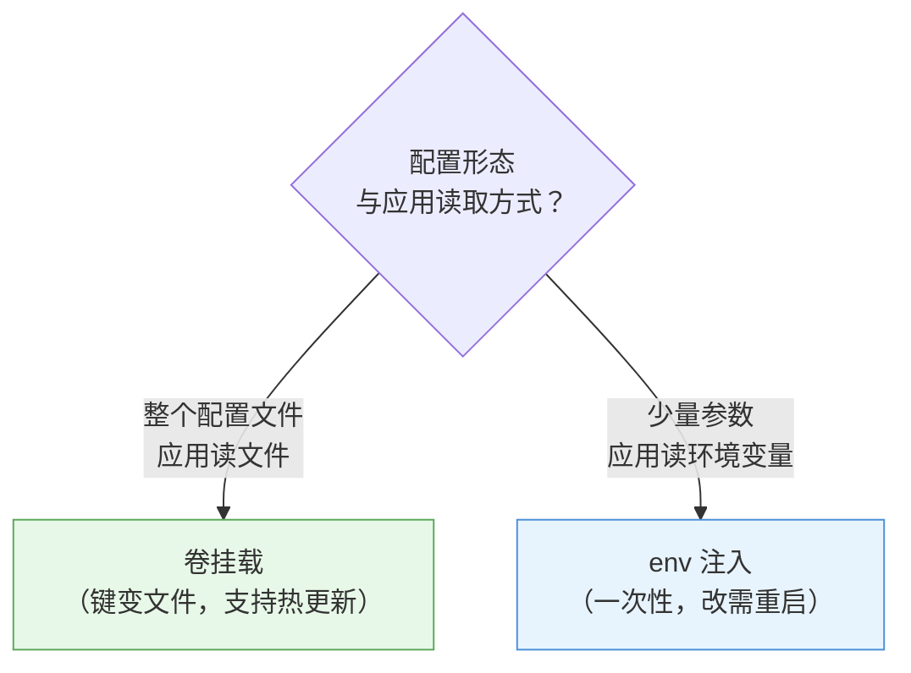

# 第 8 章 配置管理：ConfigMap 与 Secret

> 配套实验手册：《Kubernetes 实验手册》（manual/ 目录）**实验 06「ConfigMap 和 Secret」**（5 个 Lab + Secret 类型补充 + Downward API 补充）。本章承接第 4 章"容器怎么配置"（env/command 硬编码），讲**配置怎么外部化**——把配置从镜像/yaml 里"抽"出来，交给 ConfigMap 与 Secret 统一管理。

## 学习目标

学完本章，你应该能够：

1. 解释"配置外部化"的必要性（镜像不可变/多环境/敏感信息三痛点）
2. 解释 ConfigMap 的本质与两种消费方式（卷挂载 vs 环境变量）的机制差异
3. 解释"卷挂载支持热更新、env 注入需要重启"的底层原因
4. 解释 Secret 与 ConfigMap 的关系，以及"base64 是编码不是加密"的深刻含义
5. 说出 Secret 的四种类型及各自用途（Opaque/tls/dockerconfigjson/service-account-token）
6. 区分 ConfigMap/Secret（外部配置）与 Downward API（自身元数据）
7. 说出 Secret 的安全边界（RBAC/etcd 加密/最小权限）
8. 设计一个应用的完整配置方案（哪些进 ConfigMap、哪些进 Secret、哪些进 Downward API）

---

## 8.1 为什么需要"配置外部化"

### 8.1.1 配置写死在镜像/代码里的三个痛点

第 4 章学了 env 和 command——但如果把配置直接写进镜像或 Deployment yaml，会遇到：

1. **镜像不可变原则被破坏**：镜像（第 1 章分层）一旦构建就不该改——改了配置就得重新构建镜像、重新发布
2. **多环境无法复用**：dev/test/prod 的数据库地址、日志级别不同——写死一份镜像只能服务一个环境
3. **敏感信息暴露**：密码写进 yaml → 进 Git → 泄密；写进镜像 → 所有拉取镜像的人都能看到

### 8.1.2 配置外部化的原则

> 十二要素（12-Factor）的核心：**"配置"与"代码"分离**——同一份镜像，通过注入不同的配置运行在不同环境。

Kubernetes 的答案是两个专用对象：

- **ConfigMap**：非敏感配置（连接串、开关、日志级别）
- **Secret**：敏感配置（密码、Token、证书）

两者机制几乎一样，唯一的本质区别是**数据的敏感程度**。

---

## 8.2 ConfigMap：非敏感配置

### 8.2.1 本质与创建

**ConfigMap** 就是一个"键值对仓库"（`data` 区），键可以是短字符串，也可以是**整个配置文件的内容**：

```yaml
apiVersion: v1
kind: ConfigMap
metadata:
  name: app-config
data:
  LOG_LEVEL: info            # 键值对（短配置）
  APP_PORT: "8080"
  app.conf: |                # 键 = 文件名，值 = 文件内容（长配置）
    server.port=8080
    server.timeout=30
```

创建方式：

- `kubectl create configmap xxx --from-literal=KEY=VAL`（字面量）
- `kubectl create configmap xxx --from-file=app.conf`（文件）
- `kubectl create configmap xxx --from-file=conf.d/`（目录，每个文件一个键）
- 或声明式 yaml（生产推荐）

### 8.2.2 消费方式一：卷挂载（键变文件）

把 ConfigMap 挂成**卷**，每个键变成目录里的一个文件：

```yaml
spec:
  containers:
  - name: app
    volumeMounts:
    - name: config
      mountPath: /etc/app      # ConfigMap 挂到这里
  volumes:
  - name: config
    configMap:
      name: app-config
```

```text
/etc/app/
├── LOG_LEVEL     # 内容是 "info"
├── APP_PORT      # 内容是 "8080"
└── app.conf      # 内容是完整配置文本
```

适合：应用**读配置文件**的场景（配置文件是文件，不是环境变量）。

### 8.2.3 消费方式二：环境变量（键变变量）

把指定的键注入为**环境变量**：

```yaml
spec:
  containers:
  - name: app
    env:
    - name: LOG_LEVEL              # 环境变量名
      valueFrom:
        configMapKeyRef:
          name: app-config
          key: LOG_LEVEL           # 从 ConfigMap 取这个键
```

适合：应用**读环境变量**的场景（12-Factor 风格）。

### 8.2.4 两种方式对比

| 维度 | 卷挂载 | env 注入 |
|---|---|---|
| 形态 | 键 → 文件 | 键 → 环境变量 |
| 应用读取 | 读文件（配置类应用） | 读环境变量 |
| **热更新** | **改 ConfigMap 后文件自动更新**（无需重启） | **改后需重启 Pod 才生效** |
| 场景 | 配置文件、整个 conf 目录 | 少量开关、连接参数 |

<!-- 原 ASCII 图已转为 Mermaid -->


> 读图要点：**判断依据是"形态 + 读取方式"**——配置是文件 → 卷挂载；配置是少量键值且应用读 env → env 注入；热更新需求直接排除 env。

### 8.2.5 热更新的底层原理（重要）

- **卷挂载为什么能热更新**：kubelet 定期同步 ConfigMap 到本地缓存目录，挂载是"软链/绑定挂载"——ConfigMap 变了，**文件内容跟着变**，应用读到新值（应用自己要不要"重新读文件"取决于应用实现）
- **env 为什么不能**：环境变量是**进程启动时**注入的——进程已经跑起来了，改 env 不会进到正在运行的进程里，**只能重启 Pod**（新 Pod 用新值）

> **决策逻辑**：需要频繁改配置、应用读文件 → 卷挂载（热更新）；少量一次性参数、应用读 env → env 注入。

### 8.2.6 subPath 挂载陷阱（经典坑，必读）

**subPath** 让你只挂 ConfigMap 里的**单个文件**（而不是整个目录）：

```yaml
volumeMounts:
- name: config
  mountPath: /etc/nginx/nginx.conf   # 只挂这个文件
  subPath: nginx.conf                # 而不是整个 config 目录
```

**为什么是坑**：subPath 挂载是**直接复制文件**（不做软链接）——**ConfigMap 更新后，subPath 挂载的文件不会跟着变（彻底丧失热更新）**！要更新只能重启 Pod。

> **决策逻辑**：`subPath` 适合"只挂单个文件 + 配置基本不变"的场景；需要热更新的配置文件**不要用 subPath**（挂整个目录或目录里放单文件）。这是 K8s 社区最经典的配置坑之一。

### 8.2.7 immutable 与热更新工具（生产性能）

- **immutable（不可变）**：`immutable: true` 的 ConfigMap/Secret **禁止修改**（只能删除重建）——好处：kubelet 不再轮询检查变化，**大规模集群控制面压力大幅下降**；适合"基本不变"的配置（如公共证书、系统级配置）
- **Reloader 工具**（第三方）：自动监听 ConfigMap/Secret 变化并**滚动重启**关联 Deployment——解决"env/subPath 不能热更新"的自动化方案（`reloader.stakater.com/auto: "true"` 注解标记）

> **生产组合**：配置文件卷挂载（热更新）+ 少量参数 immutable（省轮询）+ 需要重启生效的场景用 Reloader 自动滚动。

---

## 8.3 Secret：敏感配置

### 8.3.1 与 ConfigMap 的关系

Secret 的结构与 ConfigMap **几乎一样**（`data` 区键值对），差别在：

- 值必须 **base64 编码**（ConfigMap 明文）
- `describe`/`describe` 默认**不显示内容**
- 有**类型**字段（§8.3.3）
- 访问控制更严格（RBAC 可单独授权，§8.3.5）

```yaml
apiVersion: v1
kind: Secret
metadata:
  name: mysql-pass
type: Opaque
data:
  password: d29yZHByZXNzMTIz    # "wordpress123" 的 base64
```

消费方式与 ConfigMap 相同（卷挂载 `secret` 卷 / env 的 `secret`）——挂载后**自动还原明文**（文件里是原始值，不是 base64）。

### 8.3.2 重要认知：base64 是编码，不是加密

- base64 只是"字节 → 可打印字符"的**编码**（第 2 章 kubeconfig 里的证书数据也是 base64）——**任何人都能解码**
- 证明：`kubectl get secret mysql-pass -o yaml` 拿到密文 → `kubectl get secret mysql-pass -o yaml` 秒还原（实验 06 Lab 4 亲手验证）
- **Secret 的真正安全依赖**：
  1. **RBAC**：谁能读 Secret（第 11 章授权机制）
  2. **etcd 静态加密**：落盘加密（实验 09 Lab 9 实操，防备份泄露）
  3. **最小权限**：不用的 Secret 不创建、不授权

> **一句话**：把 base64 当加密是新手最常见的误解——它只是"传输/存储格式"，安全靠权限和加密存储。

### 8.3.3 Secret 的类型

| 类型 | 用途 | 键要求 |
|---|---|---|
| `Opaque`（默认） | 通用敏感值（密码/Token/API Key） | 任意键 |
| `kubernetes.io/tls` | TLS 证书（Ingress 的 HTTPS） | 固定 `kubernetes.io/tls` + `kubernetes.io/tls` |
| `kubernetes.io/dockerconfigjson` | 私有镜像仓库凭据 | 固定 `kubernetes.io/dockerconfigjson` |
| `kubernetes.io/service-account-token` | SA 令牌（系统使用） | 自动管理 |

**两个"非通用"消费特例**（不通过 env/卷，而是被系统直接引用）：

- **tls 类型** → Ingress 的 `spec.tls.secretName`（实验 07 Ingress TLS）
- **dockerconfigjson 类型** → Pod 的 `imagePullSecrets`（拉私有镜像时用它认证）

```bash
kubectl create secret tls my-tls --cert=cert.crt --key=key.key
kubectl create secret docker-registry regcred --docker-server=... --docker-username=... --docker-password=...
```

### 8.3.4 消费方式

与 ConfigMap 完全相同（卷挂载 / env 注入）+ 上面两个系统级特例。区别只在**数据的敏感性**——设计上 Secret 更"金贵"：只给需要的 Pod 挂，别一把梭。

### 8.3.5 Secret 的安全边界

- **RBAC**：Secret 的读权限要单独收紧（`get secret` 就是拿到了全部值——第 11 章）
- **etcd 静态加密**：默认 etcd 里 Secret 明文存储——配 EncryptionConfiguration 落盘加密（实验 09 Lab 9）
- **最小权限**：一个 Secret 只给需要的命名空间/应用；定期轮换
- **外部密钥管理**（进阶）：生产可接 External Secrets（Vault/AWS Secrets Manager），集群里不落明文——知道存在即可

---

## 8.4 Downward API：注入"自己是谁"

第 4 章 §4.5.4 讲过 Downward API（实验 06 补充实操）。放在本章对比是为了建立完整图景——**三种"注入"的界限**：

| 注入来源 | 对象 | 典型内容 | 使用 |
|---|---|---|---|
| **ConfigMap** | 外部配置 | 数据库地址、开关、配置文件 | 应用"要什么" |
| **Secret** | 外部敏感配置 | 密码、Token、证书 | 应用"凭什么" |
| **Downward API** | **Pod 自身元数据** | Pod 名、命名空间、节点名、labels | 应用"我是谁" |

```text
┌─────────────────────────────────────────┐
│  应用容器（env / 卷 两种注入通道）        │
│    ├─ ConfigMap → 外部配置（第 8 章）     │
│    ├─ Secret     → 敏感配置（第 8 章）    │
│    └─ Downward   → 自身元数据（第 4 章）  │
└─────────────────────────────────────────┘
```

> **判断标准**：数据是"环境给的"（CM/Secret）还是"我自己身上的"（Downward）？

---

## 8.5 配置管理最佳实践（生产）

1. **配置全进对象，yaml 零硬编码**：Deployment yaml 里不该出现环境相关值（地址/密码/开关）
2. **按敏感性分流**：非敏感 → ConfigMap；敏感 → Secret（别图省事全放 CM）
3. **文件名即配置**：配置文件用卷挂载（支持热更新）；少量参数用 env
4. **Secret 最小权限**：RBAC 收紧 + etcd 加密 + 定期轮换
5. **多环境复用**：同一镜像 + 不同命名空间的 CM/Secret = 一套镜像跑 dev/prod
6. **修改流程**：改 CM（卷方式）→ 应用自动感知（热更新）；改 env → 滚动重启 Pod

---

## 8.6 实验演练指引

本章机制对应实验 **06「ConfigMap 和 Secret」**（5 Lab + 2 补充）：

- **Lab 1 文件型 ConfigMap**：`--from-file` 创建、卷挂载进 mysql（配置外部化实例）
- **Lab 2 键值对 ConfigMap**：`--from-literal` 创建、键变文件
- **Lab 3 env 映射 ConfigMap**：`configMapKeyRef` 注入环境变量
- **Lab 4 Secret 保存敏感信息**：base64 编码、`secretKeyRef` 注入 mysql 密码——**亲手验证"base64 秒还原"**
- **Lab 5 文件型 Secret**：整个配置文件封装进 Secret、挂载自动还原明文
- **补充：Secret 类型**：tls/dockerconfigjson（Ingress/私有仓库）
- **补充：Downward API**：fieldRef env 注入 + downwardAPI 卷（labels/annotations 文件）

> 教学建议：Lab 1-3 对比记忆"卷 vs env"两种消费；Lab 4 重点体验"编码≠加密"；补充小节对应 §8.3.3 与 §8.4。

---

## 本章小结

- **为什么外部化**：镜像不可变、多环境复用、敏感信息不落地——同一镜像跑所有环境
- **ConfigMap**：非敏感键值对；**卷挂载**（键变文件、**热更新**）vs **env 注入**（一次性、需重启）——读文件用卷、读 env 用 env
- **Secret**：结构与 CM 同构 + base64；**base64 ≠ 加密**（安全靠 RBAC + etcd 加密 + 最小权限）；四种类型（Opaque/tls/dockerconfigjson/SA-token），后两种是系统级消费特例
- **Downward API**：注入"自己是谁"（与外部配置界限分明）
- **生产实践**：配置全进对象、按敏感性分流、Secret 最小权限、多环境复用

**衔接**：第 9 章讲网络（Service/Ingress）——tls 类型的 Secret 就是 Ingress HTTPS 的原料；第 11 章 RBAC 会给 Secret 的访问控制提供机制。

## 思考题

1. 为什么"改 env 注入的配置"要重启 Pod，而"改卷挂载的配置"不用？（提示：进程启动时注入 vs 文件系统挂载）
2. `kubectl get secret xxx -o yaml` 里能看到密码吗？怎么防？（提示：编码 vs 加密）
3. 私有镜像仓库的凭据用什么 Secret 类型？Pod 怎么用它？
4. 数据库密码、日志级别、Pod 所在节点名，分别应该用 CM/Secret/Downward 哪个？
5. 为什么 Secret 的"值"要 base64 编码？ConfigMap 为什么不用？

> **CKA 考点标注**（对应域 1/2）：
> - **必考操作**：`kubectl create configmap/secret`（--from-literal/--from-file）、`kubectl create configmap/secret`（base64 解码）
> - **必考配置**：configMapKeyRef/secretKeyRef（env）、configMap/secret 卷（文件）、imagePullSecrets、`kubectl create secret tls/docker-registry`
> - **必考认知**：卷挂载热更新 vs env 需重启、base64 是编码不是加密
> - 排障关联（域 5）：`secret "xxx" not found`（引用名错/命名空间错）、env 没生效（改了没重启）
