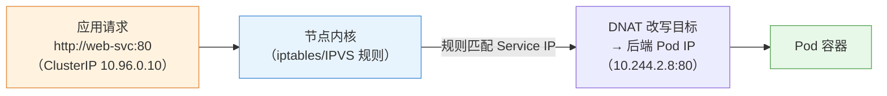
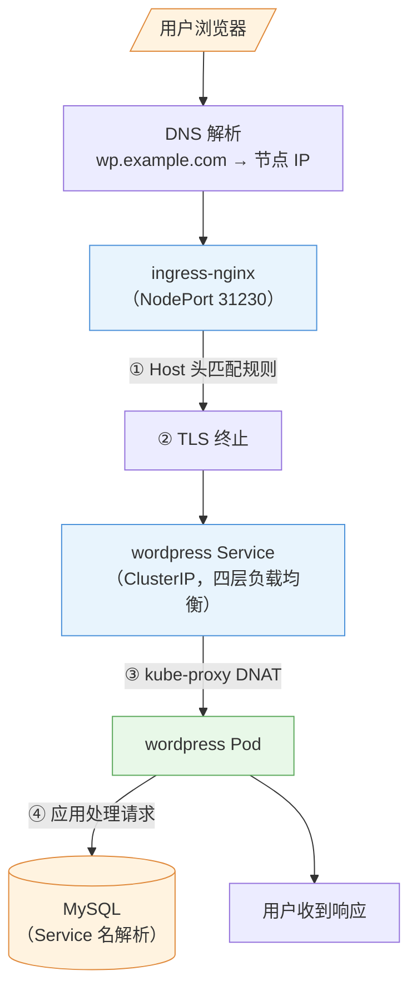

# 第 9 章 服务、负载均衡与网络

> 配套实验手册：《Kubernetes 实验手册》（manual/ 目录）**实验 07「网络和服务」**（6 个 Lab + 补充：Service 三类型/headless/Ingress/NetworkPolicy/多端口/ExternalName）。本章是 **CKA 核心域（域 3，20%）**——讲清楚"流量怎么进集群、怎么到 Pod、怎么隔离"的完整机制。

## 学习目标

学完本章，你应该能够：

1. 画出集群的四个网络层次（节点/Pod/Service/集群外）及各自网段
2. 解释 Service 的完整机制：Endpoints 选择后端 + kube-proxy 写入转发规则（iptables/IPVS）
3. 对比 Service 的四种类型与 headless，说出各自适用场景
4. 解释集群 DNS（coredns）的解析规则与命名空间作用域
5. 解释 Ingress 的原理（对象 + 控制器 + host/path 路由 + TLS 终止），说出它与 Service 的分工
6. 解释 NetworkPolicy 的隔离原理（默认全通 → 白名单）与典型策略设计
7. 走查"外部用户 → 应用 Pod"的完整路径（哪个组件做了什么）

---

## 9.1 网络全景：四个层次

Kubernetes 集群里有四个网络层次，各司其职（第 3 章规划过网段）：

```text
① 节点网络（物理）   192.168.0.0/24   机器真实 IP，节点互通
② Pod 网络（虚拟）   10.244.0.0/16    每个 Pod 一个 IP（CNI 分配）
③ Service 网络（虚拟）10.96.0.0/12     Service 虚拟 IP（ClusterIP）
④ 集群外访问         节点 IP:端口 / 域名 → 负载均衡器 / Ingress
```

> 补充：**IPv6 双栈**——现代 Kubernetes 支持集群同时跑 IPv4 + IPv6（`--pod-cidrs` 配双网段、Service `--pod-cidrs`）。对刚接触 K8s 的读者，知道"双栈是选项、默认单栈 IPv4"即可；云环境 IPv6 出口是独立能力。

**② Pod 网络的关键模型（第 2 章回顾）**：**每个 Pod 一个 IP**（属于 Pod 沙箱），Pod 之间直接互通（不需要 NAT）——由 CNI 插件实现（第 3 章装的 Calico：BGP 三层路由）。**没有 CNI，Pod 无 IP、节点不 Ready**（第 3 章验证过）。

---

## 9.2 Service：稳定入口的完整原理

### 9.2.1 为什么需要 Service

Pod IP 是**临时**的（重建即变），且多副本时"该访问哪个 IP"——Service 提供**稳定虚拟 IP + DNS 名**（第 2 章概念，本章讲机制）。

### 9.2.2 机制：Endpoints + kube-proxy

Service 的负载均衡由两个部件协作：

```text
① Endpoints（谁在服务）：控制器把"selector 匹配的 Pod IP:端口"写进 Endpoints 对象
   Service web → selector app=web → Endpoints: [10.244.1.5:80, 10.244.2.8:80, 10.244.3.2:80]

② kube-proxy（怎么转发）：每个节点上把转发规则写进内核
   发往 ClusterIP:80 的流量 → 随机/轮询选一个 Endpoints → DNAT 到 Pod IP
```

**iptables 与 IPVS 两种实现**：

- **iptables 模式**（默认）：为每个 Service/Endpoints 生成 iptables 规则链；每个请求在规则里**随机命中**一个后端（随机算法，不是加权轮询）
- **IPVS 模式**：内核级负载均衡（LVS），支持 rr/wrr/lc 等算法，规则更少、性能更好（大量 Service 时明显）

<!-- 原 ASCII 图已转为 Mermaid -->


> 读图要点：**规则由 kube-proxy 提前写进内核，转发发生在内核里**——请求路径完全不经过 kube-proxy 进程；kube-proxy 只是"规则的搬运工"。

> **核心认知**（易错点）：kube-proxy **不是代理进程**——流量不经过它（它只负责把规则写进内核）；它也不做服务发现（发现靠 DNS）。**"规则写内核、转发在内核"是性能的关键**。

### 9.2.3 Service 的四种类型

| 类型 | 作用域 | 机制 | 适用 |
|---|---|---|---|
| **ClusterIP**（默认） | 集群内 | 虚拟 IP，仅集群内可达 | 内部服务间调用（默认首选） |
| **NodePort** | 集群外 | 每个节点开一个端口（30000-32767）→ 转发到 ClusterIP | 测试/小规模外部访问 |
| **LoadBalancer** | 集群外 | 云厂商创建负载均衡器 → 指向 NodePort | 云环境生产对外 |
| **ExternalName** | 集群外 | DNS CNAME 指向外部域名（无 IP 无转发） | 把集群外服务"伪装"成集群内服务 |

```text
NodePort 的访问链：
外部用户 → 任意节点 IP:31230 → kube-proxy 规则 → ClusterIP:80 → Pod

LoadBalancer 的访问链：
外部用户 → 云负载均衡器 → 节点 IP:NodePort → ClusterIP → Pod
```

> **NodePort 端口范围**：30000-32767（固定）——实验 07 Lab 3 看 `443:30573/TCP` 就是它。

### 9.2.4 headless Service：不要虚拟 IP

`clusterIP: None` 的 Service 不创建虚拟 IP——**DNS 直接返回所有后端 Pod IP 列表**，调用方自己选（轮询/随机）。

```text
普通 Service：DNS 解析 web-svc → 1 个 ClusterIP（kube-proxy 转发）
headless：   DNS 解析 web-svc → N 个 Pod IP（调用方自行选择）
```

**典型用途**（第 5 章 StatefulSet 的配套）：

- StatefulSet 的每个 Pod 需要**稳定 DNS 名**：`web-0.web-svc.namespace.svc`——这要求 Service 是 headless（Pod 名解析由 StatefulSet 控制器写入 DNS）
- 需要"拿到所有后端 IP 自己控制负载"的场景（如数据库客户端自己挑从库）

> **关键点**：headless 的"稳定 DNS 名"只有配合 StatefulSet 才有（普通 Deployment 的 Pod 没有 `pod名.svc` 解析）。

### 9.2.5 多端口与端口命名

一个 Service 可以暴露多个端口（如 80 HTTP + 443 HTTPS），**每个端口必须有名字**：

```yaml
spec:
  ports:
  - name: http
    port: 80
    targetPort: 8080      # 转发到 Pod 的 8080
  - name: https
    port: 443
    targetPort: 8443
```

> `targetPort` 可以是端口号或**容器端口名**（第 4 章 ports.name）——用名字的好处：改端口号不用改 Service。

---

## 9.3 集群 DNS：名字解析

### 9.3.1 coredns 的角色

集群内每个 Pod 的 `/etc/resolv.conf` 指向 coredns（kube-system 里的 Deployment，第 2 章 Killercoda 见过）。**应用用 Service 名访问，DNS 解析成 ClusterIP**。

### 9.3.2 解析规则

```text
<svc名>                     → 当前命名空间的 Service（简写）
<svc名>.<命名空间>            → 指定命名空间
<svc名>.<命名空间>.svc        → 完整形式（FQDN，svc 是固定段）
<svc名>.<命名空间>.svc.cluster.local → 带集群域（默认 cluster.local）
```

**命名空间作用域**（易错点）：Pod 里写 `mysql` 只解析**当前命名空间**的 mysql；跨命名空间必须写 `mysql`。

### 9.3.3 排障视角

`kubectl exec -it xxx -- nslookup <svc>.<ns>.svc` 返回 IP = DNS 正常；解析失败先查：Service 存在吗（名字/命名空间对了吗）→ coredns 正常吗（实验 10 Lab 4 完整流程）。

---

## 9.4 Ingress：七层入口

### 9.4.1 为什么需要 Ingress

NodePort/LoadBalancer 是**四层**（IP+端口）——问题：

- 每个服务都要开一个端口（端口资源有限、管理混乱）
- 没有"按域名/路径路由"能力（两个域名共用 80 端口做不到）

**Ingress 是七层（HTTP/HTTPS）入口**：一个入口点，按 **host（域名）和 path（路径）** 路由到不同 Service。

### 9.4.2 原理：对象 + 控制器

```text
Ingress 对象（声明路由规则：哪个域名/路径 → 哪个 Service）
   │ 控制器（ingress-nginx，实验 07 安装）Watch 它
   ▼
ingress-nginx 控制器生成 nginx 配置（server_name/location 规则）并加载
   │
   ▼
外部流量 → ingress-nginx（NodePort/LoadBalancer）→ 按规则路由
```

**关键认知**：Ingress **对象本身不做转发**——它只是"规则声明"；真正转发的是 **Ingress 控制器**（通常 ingress-nginx，一个跑在集群里的反向代理）。**没有控制器，Ingress 对象是死的**。

### 9.4.3 路由规则：host 与 path

```yaml
apiVersion: networking.k8s.io/v1
kind: Ingress
metadata:
  name: web-ingress
spec:
  ingressClassName: nginx        # 指定用哪个控制器
  rules:
  - host: shop.example.com        # 域名 A
    http:
      paths:
      - path: /
        pathType: Prefix
        backend:
          service:
            name: shop-svc        # → shop 服务
            port:
              number: 80
  - host: blog.example.com        # 域名 B
    http:
      paths:
      - path: /admin
        pathType: Prefix
        backend:
          service:
            name: blog-admin      # → admin 服务（按路径再细分）
```

- `host` 匹配域名（Host 头）；`host` 前缀匹配 / `host` 精确匹配
- 无 host 的规则 = 兜底（匹配所有域名）
- **访问验证**（无 DNS 时）：`curl -H "Host: shop.example.com" http://节点IP:NodePort`

### 9.4.4 TLS 终止

HTTPS 的证书加解密（TLS 终止）由 Ingress 完成（后端 Pod 保持 HTTP 简单）：

```yaml
spec:
  tls:
  - hosts: [shop.example.com]
    secretName: shop-tls          # kubernetes.io/tls 类型的 Secret（第 8 章）
  rules:
  - host: shop.example.com
    ...
```

> 证书原料就是第 8 章的 `kubernetes.io/tls` Secret（`kubernetes.io/tls` + `kubernetes.io/tls`）——**第 8 章的知识在这里落地**。生产上证书由 cert-manager 自动签发续期（进阶）。

### 9.4.5 Ingress 与 Service 的分工（易混点）

```text
Ingress（七层：域名/路径路由 + TLS）→ Service（四层：负载均衡）→ Pod
   路由决策                          稳定入口 + 转发           真正干活
```

> **一句话**：**Service 负责"负载均衡"（四层），Ingress 负责"路由"（七层）**——Ingress 的 backend 指向 Service，不是直接指向 Pod。

### 9.4.6 展望：Gateway API（Ingress 的继任者）

**Ingress 的局限**（生产暴露的问题）：

- 能力被"注解"绑架（不同控制器各自发明注解，不可移植）
- 只能管"南北向"（外部进集群），管不了"东西向"（服务间流量）
- 路由/流量治理能力有限（权重分流要靠控制器扩展）

**Gateway API**（Kubernetes 官方力推的下一代流量管理 API）的核心模型：

```text
GatewayClass（控制器实现声明，类比 StorageClass）
   │
   ▼
Gateway（入口实例：监听端口/TLS）
   │
   ▼
HTTPRoute（路由规则：host/path/权重/Header）→ 绑定到 Service
   → 与 Ingress 最大的不同：路由规则是**独立对象**（可组合、可跨命名空间引用）
```

**与 Ingress 的关系**：

- 不是"替换即弃"——Ingress 仍被广泛支持；Gateway API 是**演进方向**（v1.36 已 GA）
- 关键优势：**标准化**（不再依赖控制器注解）、支持南北向 + 东西向、权重分流/Header 路由内建（金丝雀/A-B 的天然载体，第 5 章发布策略）

> 决策逻辑：**现有集群继续用 Ingress（成熟稳定）；新架构/需要高级流量治理 → 评估 Gateway API**。知道模型（GatewayClass/Gateway/HTTPRoute）即可，用法与 Ingress 思路一脉相承。

---

## 9.5 NetworkPolicy：网络隔离

### 9.5.1 默认全通（现状与风险）

**默认情况下集群内所有 Pod 互通**（Pod 网络扁平）——攻击面：一个 Pod 被攻破，可以横向访问任何其他 Pod（包括数据库）。

**NetworkPolicy** 实现**网络层白名单**：声明"谁可以访问哪些 Pod"。

### 9.5.2 原理

```yaml
apiVersion: networking.k8s.io/v1
kind: NetworkPolicy
metadata:
  name: db-allow-app
  namespace: default
spec:
  podSelector:                    # 策略作用对象：哪些 Pod
    matchLabels:
      app: mysql
  policyTypes:                    # 生效方向
  - Ingress
  - Egress
  ingress:                        # 入站规则：谁可以访问 mysql
  - from:
    - podSelector:                # 允许：带 app=web 标签的 Pod
        matchLabels:
          app: web
    - ipBlock:                    # 允许：特定网段（外部/监控）
        cidr: 10.0.0.0/8
  egress:                         # 出站规则：mysql 可以访问谁
  - to:
    - podSelector:
        matchLabels:
          app: web
    ports:
    - protocol: TCP
      port: 3306
```

**关键语义**：

- 匹配的 Pod **一旦被某个 NetworkPolicy 覆盖，默认全通就失效**——只允许规则里写明的来源（**白名单制**）
- `policyTypes` 不写的方向不受影响（如只限制 Ingress，Egress 仍全通）
- **注意**：应用要访问集群 DNS（coredns）→ egress 规则要**放行 DNS（53/UDP）**，否则 Pod 域名解析都断了（实验 07 Lab 6 实测踩坑）

### 9.5.3 典型策略设计

```text
默认：全通（无策略）

生产基线：
① 数据库层：只允许业务 Pod 访问（podSelector: app=web）+ 监控网段（ipBlock）
② 业务层：只允许 Ingress 入口访问 + 放行 DNS
③ 拒绝一切兜底：空规则 NetworkPolicy（podSelector: {} + 空 ingress）
```

> **决策逻辑**：先想"谁必须能访问我"（白名单）→ 逐条写 from/to；**宁缺毋滥但要有**——生产至少给数据库加隔离。

### 9.5.4 依赖 CNI（重要）

**NetworkPolicy 必须由支持它的 CNI 实现**：

- **Calico**（本课程）：原生支持 ✓
- Flannel：**不支持**（这就是第 3 章选 Calico 的原因之一）
- Cilium：支持（更强）

> 验证：`kubectl apply` 策略后，`kubectl apply` 能列出，且实际访问被拒——实验 07 Lab 6 用 nginx 实测。

---

## 9.6 综合走查：外部用户访问应用的完整路径

把本章所有机制串起来（对应实验 11 的 WordPress 案例）：

<!-- 原 ASCII 图已转为 Mermaid -->


> 读图要点：**五跳链路**（DNS → Ingress → Service → Pod → MySQL），每层职责不同——Ingress 管域名路由与 TLS、Service 管负载均衡、kube-proxy 管转发、应用管业务；**排障从外层往内层逐层验证**（实验 10 Lab 4 的 Service/DNS 排查就是这个顺序）。

**每层职责回顾**：DNS（名字 → IP）→ Ingress（域名/路径路由 + TLS）→ Service（负载均衡）→ kube-proxy（转发规则）→ Pod（干活）。

---

## 9.7 实验演练指引

本章机制对应实验 **07「网络和服务」**（6 Lab + 补充）：

- **Lab 1 katacoda deployment**：准备多副本测试应用
- **Lab 2 ClusterIP Service**：虚拟 IP + 负载均衡观察（多次访问返回不同 Pod）
- **Lab 3 NodePort Service**：外部访问（节点 IP:端口）
- **Lab 4 headless Service + DNS**：`clusterIP: None`，nslookup 返回所有 Pod IP
- **Lab 5 Ingress**：安装 ingress-nginx + host 路由 + **TLS**（补充）
- **Lab 6 NetworkPolicy**：白名单隔离 + **DNS 放行**（实测踩坑点）
- **补充**：多端口 Service、ExternalName

> 教学建议：Lab 2-4 是 Service 三连（内部→外部→无头）；Lab 5 对应 §9.4（路由与 TLS）；Lab 6 对应 §9.5（隔离，注意 DNS 放行）。

---

## 本章小结

- **四层网络**：节点（物理）/Pod（每 Pod 一 IP，CNI）/Service（虚拟 IP）/外部（NodePort/LB/Ingress）
- **Service 机制**：Endpoints（选后端）+ kube-proxy（规则写内核，iptables 随机/IPVS 轮询）——**流量不经过 kube-proxy 进程**
- **四种类型**：ClusterIP（内部）/NodePort（节点端口）/LoadBalancer（云 LB）/ExternalName（外部伪装）；headless 返回 Pod IP 列表（StatefulSet 稳定 DNS 名）
- **DNS**：coredns 解析 `svc.ns.svc`；**命名空间作用域**是易错点
- **Ingress**：对象声明规则 + 控制器真正转发；host/path 路由 + TLS 终止（原料是 tls Secret）——**Ingress 管路由（七层）、Service 管负载均衡（四层）**
- **NetworkPolicy**：默认全通 → 白名单制；podSelector/ipBlock + ingress/egress；**依赖支持它的 CNI（Calico 行、Flannel 不行）**；注意放行 DNS
- **走查**：DNS → Ingress → Service → kube-proxy → Pod，排障从外到内

**衔接**：第 10 章讲存储（PV/PVC/StorageClass）——"应用数据放哪"；第 11 章 RBAC 会给网络策略之外的"谁能做什么"提供另一层安全。

## 思考题

1. 流量真的经过 kube-proxy 进程吗？iptables 和 IPVS 模式的本质区别是什么？
2. headless Service 的 DNS 返回什么？为什么 StatefulSet 需要 headless？
3. 跨命名空间访问 Service，DNS 名怎么写？只写 `mysql` 会发生什么？
4. Ingress 对象不部署控制器会怎样？Ingress 的 backend 为什么指向 Service 而不是 Pod？
5. 给数据库配了只允许 app 访问的 NetworkPolicy，为什么数据库 Pod 突然"域名解析失败"了？
6. 外部用户访问 WordPress 的完整路径中，哪一层做域名路由、哪一层做负载均衡、哪一层做端口转发？

> **CKA 考点标注**（对应域 3：服务与网络 **20%，CKA 第二重**）：
> - **必考操作**：`kubectl expose`、`kubectl expose`（host/path + TLS）、`kubectl expose`、`kubectl expose`
> - **必考机制**：Service 类型与转发（kube-proxy/Endpoints）、headless + StatefulSet、Ingress 规则与控制器、NetworkPolicy（podSelector/ipBlock、ingress/egress）
> - **高频场景题**：暴露服务（NodePort vs Ingress）、网络隔离（给 DB 加策略）、Service 排障（Endpoints 为空 → selector 错）
> - 排障关联（域 5）：Endpoints 为空、DNS 解析失败、Ingress 404/502、NetworkPolicy 误拦
