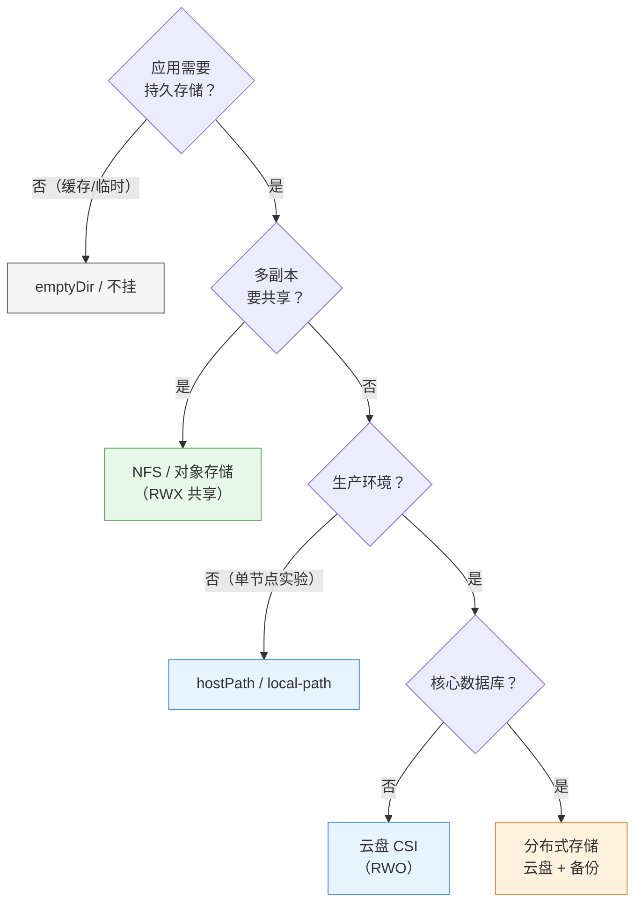

# 第 10 章 存储

> 配套实验手册：《Kubernetes 实验手册》（manual/ 目录）**实验 08「实现基本存储」**（4 个 Lab：卷基础/hostPath 应用/PV 静态绑定/StorageClass 动态交付——**StorageClass 在 Lab 4 才安装**，与本章讲解顺序一致）。本章讲"应用数据放哪、怎么持久化"——从 Pod 级卷到集群级 PV/PVC 再到自动化的 StorageClass，理解存储的抽象层次。

## 学习目标

学完本章，你应该能够：

1. 解释容器存储的痛点（文件系统临时性）与三种卷类型（emptyDir/hostPath/配置卷）的适用边界
2. 解释 PV/PVC 解耦设计的价值（应用声明需求、管理员提供资源）
3. 描述 PV/PVC 的生命周期（Provision/Bind/Use/Reclaim）与访问模式、回收策略
4. 区分静态绑定（手动建 PV）与动态供应（StorageClass 自动建）
5. 解释 StorageClass 的机制（provisioner/默认类/绑定模式/回收策略）
6. 说出 local-path 的本质与局限（单节点），理解为什么多副本共享存储需要 NFS/云盘
7. 为有状态应用做出存储选型决策

---

## 10.1 存储问题全景

### 10.1.1 容器文件系统为什么"靠不住"

第 1 章讲过镜像分层：容器运行时的写入发生在**可写层**——容器删除，可写层一起消失。这意味着：

- Pod 重建 → 容器内文件**全部丢失**
- Pod 被调度到其他节点 → 原节点上的数据**够不着**

```text
第 4 章 Pod 的"无状态"认知 → 需要持久数据的应用（数据库/上传文件）必须显式挂存储
```

### 10.1.2 三个存储需求

1. **持久化**：数据跨 Pod 生命周期存活（删了重建数据还在）
2. **共享**：Pod 内多个容器共享数据（sidecar 读主容器日志）
3. **解耦**：应用不关心存储底层细节（本地盘/网络盘/云盘都一样用）

Kubernetes 用**层层抽象**回答这三个需求：卷 → PV/PVC → StorageClass。

---

## 10.2 卷（Volume）：Pod 内的存储抽象

**卷（Volume）** 是 Pod 级的概念：声明在 Pod 里，挂载进容器，生命周期与 Pod 一致。常用类型：

**emptyDir：Pod 内的临时共享盘**

- 创建时为空目录，**Pod 存在期间数据都在**（容器重启不丢，**Pod 删除即清空**）
- 典型用途：Pod 内容器间共享（sidecar 读主容器日志）、临时缓存
- 注意：Pod 被调度到别的节点 = 新 Pod = 新 emptyDir（数据不迁移）

**hostPath：宿主机目录（单节点绑定）**

- 直接挂宿主机的一个目录（如 `/data/mysql`）
- **数据在节点磁盘上**——Pod 删了数据还在，**但只在该节点**：Pod 漂移到其他节点就找不到数据了
- 典型用途：单节点实验、需要读宿主机文件的系统组件（如 kubelet 自身）

**configMap/secret 卷**：第 8 章的配置注入（键变文件）——本质也是卷（只读配置卷）。

> **卷的边界认知**：emptyDir 和 hostPath 都**绑定节点**——它们是"单机思维"的存储。多节点集群里要"数据跟着应用走"，需要集群级抽象（PV/PVC）。

---

## 10.3 PV 与 PVC：存储解耦（核心）

### 10.3.1 为什么需要两层

直接让应用指定"用哪个宿主机目录"（hostPath）的问题：

- 应用 yaml 里写死了存储细节（路径/机器）——**换存储就要改应用**
- 管理员想统一管理存储资源（哪些盘可用、多大、怎么回收）没有抓手

**解耦设计**（与 RBAC 的 Subject/Binding 思想同源）：

```text
PV（PersistentVolume）——集群级资源：一块"已就绪的存储"
   · 由管理员创建（或 StorageClass 自动创建）
   · 描述：容量、访问模式、回收策略、底层实现（hostPath/NFS/云盘）

PVC（PersistentVolumeClaim）——命名空间级请求：应用"要一块存储"
   · 由应用声明：需要多大、什么访问模式
   · 应用只写 PVC，不写底层细节

绑定：PVC 匹配到满足条件的 PV → 状态 Bound → 应用挂载 PVC 使用
```

```text
管理员视角：PV（我提供什么）
应用视角：  PVC（我需要什么）——不知道也不关心底层是 NFS 还是云盘
```

### 10.3.2 PV：存储资源的"货架"

```yaml
apiVersion: v1
kind: PersistentVolume
metadata:
  name: mysqldata-pv
spec:
  capacity:
    storage: 5Gi
  accessModes:
  - ReadWriteOnce
  persistentVolumeReclaimPolicy: Retain   # 回收策略
  hostPath:                                # 底层实现（也可以是 nfs/云盘 CSI）
    path: /data/mysql
```

**访问模式（Access Modes）**：一块 PV 能被几个节点/几个 Pod 同时用

| 模式 | 含义 |
|---|---|
| `ReadWriteOnce`（RWO） | 单节点读写（数据库标配） |
| `ReadOnlyMany`（ROX） | 多节点只读 |
| `ReadWriteMany`（RWX） | 多节点读写（共享存储如 NFS 才支持） |

**回收策略（Reclaim Policy）**：PVC 删除后，PV 怎么处理

| 策略 | 行为 |
|---|---|
| `Retain` | 保留数据（PV 变 Released，管理员手动处理——**数据安全**） |
| `Delete` | 自动删除底层存储（云盘等可自动删） |
| `Recycle`（已废弃） | 清理后复用 |

> **核心认知**：**访问模式是"底层存储能力"的约束**——hostPath 只能 RWO；NFS 支持 RWX。应用声明 PVC 时选的模式必须 PV 支持。

### 10.3.3 PVC：应用的存储请求

```yaml
apiVersion: v1
kind: PersistentVolumeClaim
metadata:
  name: mysqldata
spec:
  accessModes:
  - ReadWriteOnce
  storageClassName: ""        # 禁用动态供应（§10.4），强制匹配手动 PV
  resources:
    requests:
      storage: 5Gi
```

**匹配规则**（静态绑定时）：容量 ≥ 请求 && 访问模式匹配 &&（storageClassName 匹配）→ 一个 PV 绑定一个 PVC（一对一）。

> ⚠️ **实测易错点**：集群里存在默认 StorageClass 时，PVC 不写 `storageClassName` 会走**动态供应**（不匹配手动 PV）——要强制静态绑定必须写 `storageClassName`（实验 08 Lab 3 实测修正）。

### 10.3.4 生命周期

```text
Provision（供应）→ Bind（绑定）→ Use（使用）→ Reclaim（回收）
  管理员建 PV /        PVC 匹配 PV         Pod 挂载 PVC      PVC 删除 →
  动态供应自动建       状态 Bound           写数据            按回收策略处理 PV
```

```text
状态流转：
PV:  Available（待绑定）→ Bound（已绑定）→ Released（PVC 删了，Retain 后）→ Available/删除
PVC: Pending（等待匹配）→ Bound（匹配成功）→ 删除
```

> **排障关联**：PVC 一直 `Pending` → 看 Events：`Pending`（没有匹配的 PV）——检查 PV 是否存在/容量/访问模式/SC 是否一致（实验 10 Lab 1 三板斧）。

### 10.3.5 静态绑定 vs 动态供应

| | 静态绑定 | 动态供应 |
|---|---|---|
| 谁建 PV | **管理员手动建** | **StorageClass 自动建** |
| 适用 | 存储资源固定/要精细控制 | 大量 PVC、云环境自动扩 |
| 成本 | 每个 PV 都要手工 | 声明即用 |

---

## 10.4 StorageClass：动态供应（自动化）

### 10.4.1 为什么需要

静态绑定的问题：**每个应用都要管理员先手动建好 PV**——应用多了根本忙不过来，且 PV 容量是死的（应用要 8G 但只建了 5G 的 PV？）。

**StorageClass** 让"建 PV"自动化：PVC 声明 `storageClassName`，**provisioner（供应商）自动创建匹配的 PV 并绑定**——声明即用。

### 10.4.2 机制

```yaml
apiVersion: storage.k8s.io/v1
kind: StorageClass
metadata:
  name: local-path
provisioner: rancher.io/local-path     # 谁负责自动建 PV（本课程：本地目录方案）
reclaimPolicy: Delete                   # 动态供应的 PV 默认回收策略
volumeBindingMode: WaitForFirstConsumer # 绑定时机
```

```text
PVC（storageClassName: local-path）
   │
   ▼ provisioner 收到请求 → 自动创建 PV（底层：在节点本地目录建文件夹）
   │
   ▼ 自动绑定 → PVC Bound → Pod 挂载使用
```

**默认 StorageClass**：`storageclass.kubernetes.io/is-default-class: "true"` 注解标记默认类——**PVC 不写 storageClassName 时自动用它**（本课程教学顺序：实验 08 Lab 4 才安装，见下）。

### 10.4.3 绑定模式（VolumeBindingMode）

- **Immediate**：PVC 创建就绑定（PV 立即建好）——可能建在与 Pod 无关的节点上
- **WaitForFirstConsumer**：**等第一个 Pod 调度后再绑定**——PV 建在 Pod 所在节点（**local-path 这类"节点本地存储"必须用这个**：提前绑定可能建在别的节点，Pod 调度过来时数据在别处）

### 10.4.4 回收策略

动态供应的 PV 回收策略跟随 StorageClass（`reclaimPolicy: Delete` 常见）——**PVC 删除 = 数据删除**（local-path 会删掉本地目录）。要保留数据：临时改 PV 的回收策略为 Retain 或用备份。

### 10.4.5 PVC 在线扩容（Volume Expansion）

**问题**：磁盘满了怎么办？生产刚需——**在线扩容**（不重建 Pod）：

```yaml
# StorageClass 开启扩容能力
apiVersion: storage.k8s.io/v1
kind: StorageClass
metadata:
  name: local-path
provisioner: rancher.io/local-path
allowVolumeExpansion: true      # 关键：声明支持扩容

# 扩容操作：改 PVC 的 storage 请求（大一点）
kubectl patch pvc mysqldata -p '{"spec":{"resources":{"requests":{"storage":"10Gi"}}}}'
```

- 前提：**StorageClass 的 `allowVolumeExpansion: true`**（未开启则 PVC 的 storage 不可改）
- 生效：底层存储支持在线扩容时**应用无感**（local-path 支持）；部分存储需要 Pod 重启
- **只能扩不能缩**（缩减有数据风险，K8s 不支持）

### 10.4.6 Volume Snapshots：存储快照与恢复（数据保护）

**VolumeSnapshot**（CSI 快照）给 PVC 打"时间点快照"——**数据保护的又一手段**（比拷贝文件更一致、更快）：

```yaml
apiVersion: snapshot.storage.k8s.io/v1
kind: VolumeSnapshot
metadata:
  name: mysqldata-snap
spec:
  volumeSnapshotClassName: <存储支持的快照类>
  source:
    persistentVolumeClaimName: mysqldata   # 给哪个 PVC 打快照
```

- 用途：**备份前的快速一致快照、数据库迁移、测试环境克隆**
- 恢复：从快照创建新 PVC（`VolumeSnapshotContent` → 新 PVC 的 `VolumeSnapshotContent`）
- 前提：底层存储（CSI 驱动）支持快照——local-path 不支持；云盘/NFS 类支持
- 与第 14 章 etcd 快照的区别：**etcd 快照保"集群状态"、VolumeSnapshot 保"应用数据"**——两者互补（Velero 灾备就是组合使用，第 14 章）

> **教学顺序说明（本课程设计）**：StorageClass 是"讲到概念再安装"的典型——**实验 08 Lab 4 才安装 local-path**（安装阶段不装，第 3 章 §3.8 验收清单里它是"延迟项"）。学完 10.3（静态）再学 10.4（动态），对比最清晰。

---

## 10.5 存储方案选型：本地 vs 共享 vs 云盘

### 10.5.1 local-path：本地方案的本质与局限

本课程用的 local-path：**PV 就是节点上的一个本地目录**（`/opt/local-path-provisioner/<pvc名>`）。

- 优点：零成本、快（本地盘）、教学演示动态供应足够
- **局限（必须理解）**：
  1. **单节点**：数据只在创建它的节点上——Pod 漂移/扩容到其他节点 → 数据够不着
  2. **多副本挂同一 PVC（RWX）不支持**：local-path 只能 RWO——第 5 章多副本共享 PVC 的场景它做不了
  3. **节点故障 = 数据风险**：本地盘没有冗余

> 这正是实验 11（WordPress 综合演练）里"多副本共享 PVC"受限的原因——**水平扩展的前提是存储可共享**。

### 10.5.2 共享存储（NFS/云盘）：多节点可访问

| 方案 | 特点 | 适用 |
|---|---|---|
| **NFS** | 网络文件系统，一台服务器导出目录，**所有节点挂载**（支持 RWX） | 自建环境的多副本共享存储（教学扩展首选） |
| **云盘**（云厂商 CSI） | 云盘挂到节点，一般 RWO；对象存储 OSS/S3 天然共享 | 云环境生产 |
| **分布式存储**（Ceph/Longhorn） | 软件定义存储，强一致/多副本 | 大规模生产 |

**选型逻辑（决策树）**：

<!-- 原 ASCII 图已转为 Mermaid -->


> 读图要点：**判断顺序：持久与否 → 是否共享 → 是否生产 → 是否核心**——"共享"与"生产"是两条最关键的岔路：要共享必须 RWX 方案（local-path 不行）、生产必须可托底的方案（云盘/分布式）。

### 10.5.3 CSI：标准接口

**CSI（Container Storage Interface）**：Kubernetes 与存储厂商之间的标准接口（类似第 3 章的 CRI）——任何存储（云盘/NFS/Ceph）实现 CSI 就能被 K8s 动态供应。**生产里"装一个 CSI 驱动"就是接入了某类存储**。

> **分布式存储实例：Rook-Ceph**——Ceph（分布式存储，自带多副本/自愈）通过 Rook（K8s 的 Operator，第 18 章展望的模式）部署进集群，对外以 CSI 驱动提供动态供应（StorageClass）。**"K8s 里跑一个软件定义存储集群"是自建环境生产存储的常见选择**（比 NFS 单点更可靠，比云盘更可控）。知道这个部署模式即可（实施属于进阶）。

---

## 10.6 实验演练指引

本章机制对应实验 **08「实现基本存储」**（4 个 Lab，顺序与本章一致）：

- **Lab 1 卷基础（hostPath/emptyDir）**：Pod 级卷的挂载与生命周期——emptyDir 随 Pod 消失、hostPath 绑定节点
- **Lab 2 hostPath 应用**：mysql 数据写到宿主机目录（应用级持久化）
- **Lab 3 使用 PVC 和 PV**：手动建 PV + PVC 静态绑定（`storageClassName: ""` 实测修正点）
- **Lab 4 使用存储类动态交付**：**安装 local-path** + PVC 声明即用（WaitForFirstConsumer 观察）

> 教学建议：Lab 3 与 Lab 4 对比 = 静态 vs 动态（§10.3.5 的表格亲手验证）；Lab 4 安装 local-path 时观察"PV 自动生成、目录自动创建"。

---

## 本章小结

- **卷（Pod 级）**：emptyDir（临时共享）/hostPath（宿主机目录，绑节点）/配置卷（CM/Secret）——**单机思维**
- **PV/PVC（集群级）**：PV=管理员提供的存储资源（容量/访问模式/回收策略），PVC=应用的存储请求，**绑定一对一**——解耦"提供"与"使用"
- **生命周期**：Provision → Bind → Use → Reclaim；访问模式（RWO/ROX/RWX）是底层能力约束；回收策略（Retain 保数据/Delete 自动删）
- **StorageClass（自动化）**：provisioner 自动建 PV——声明即用；默认类（不写 SC 就用它）；WaitForFirstConsumer 是**节点本地存储的必需**
- **选型**：local-path 单节点（局限：Pod 漂移/多副本共享都不行）→ NFS/云盘（共享）→ CSI 生态（生产标准）；**多副本共享的前提是存储可共享**
- **本课程教学顺序**：StorageClass 在实验 08 Lab 4 才安装（讲概念再动手）

**衔接**：第 11 章讲安全（认证/授权）——存储的权限控制（谁能用哪个 PVC/Secret）也是安全的一部分；第 18 章综合演练里 WordPress 的持久化（PVC + local-path）就是本章知识的落地。

## 思考题

1. 容器内写的文件，Pod 删除后还在吗？emptyDir 和 hostPath 的数据分别在什么情况下会丢？
2. PV 与 PVC 各自是谁创建的？为什么应用只写 PVC 不写 PV？
3. PVC 一直 Pending，可能的原因有哪些（至少三个）？怎么排查（提示：describe 看 Events）？
4. local-path 的 PV 为什么必须是 WaitForFirstConsumer 绑定？
5. 一个 3 副本应用要共享同一个 PVC，local-path 行吗？应该用什么方案？
6. 为什么说"水平扩展的前提是存储可共享"？（结合第 5 章 StatefulSet 与本章 local-path）

> **CKA 考点标注**（对应域 4：存储 **10%**）：
> - **必考操作**：`kubectl create -f pv.yaml/pvc.yaml`、`kubectl create -f pv.yaml/pvc.yaml`、`kubectl create -f pv.yaml/pvc.yaml`（看绑定/事件）
> - **必考机制**：PV/PVC 绑定与生命周期、访问模式、回收策略、StorageClass（provisioner/默认类/绑定模式）
> - **高频场景题**：给应用配持久化（静态 vs 动态）、PVC 排障（Pending → 匹配条件）、多副本共享存储选型
> - 排障关联（域 5）：PVC Pending（Events 报错）、Pod 挂载失败（`FailedMount`）
