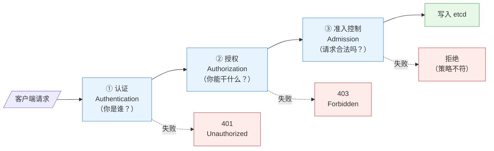

# 第 11 章 认证与授权

> 配套实验手册：《Kubernetes 实验手册》（manual/ 目录）**实验 09「认证与授权」**（Lab 1-6：证书目录/用户证书/SA/用户授权/SA 授权/dashboard 综合演练）。本章讲安全模型的**前两道门**：认证（你是谁）与授权（你能干什么）——理解它们，就理解了"为什么能登录但不让操作"这类核心现象。第 12 章讲第三道门（准入控制）。

## 学习目标

学完本章，你应该能够：

1. 说出 Kubernetes 安全模型的三道门（认证/授权/准入）与各自回答的问题
2. 区分两种身份（User 给人、ServiceAccount 给程序）与两种认证凭据（证书/Token）
3. 解释 X.509 证书认证的机制（CA 签发、CN 即用户名、kubeconfig 携带）
4. 解释 v1.24+ 的 SA Token 机制（动态签发，无长期 token）
5. 完整解释 RBAC 三要素（Subject/Role/ClusterRole/Binding）与两种范围
6. 写出自定义 Role 的 rules（apiGroups/resources/verbs）
7. 解释"认证 ≠ 授权"（能登录但 Forbidden）并用实例说明
8. 应用最小权限原则设计授权方案（含 `kubectl auth can-i` 验证）

---

## 11.1 安全模型总览：三道门

第 2 章 §2.4.1 讲过 apiserver 的请求处理流程，安全部分展开就是**三道门**：

<!-- 原 ASCII 图已转为 Mermaid -->


> 读图要点：**三道门依次通过、各自有独立的拒绝出口**——认证失败 401、授权失败 403、准入失败策略不符；"能登录但不让操作"就是第一道门过了、第二道门没过。

| 门 | 问题 | 拒绝结果 | 对应实验 |
|---|---|---|---|
| 认证 | 你是谁？ | 401 Unauthorized | Lab 1/2 |
| 授权 | 你能干什么？ | 403 Forbidden | Lab 3/4/5 |
| 准入 | 请求本身合法吗？ | Forbidden/校验错误 | 实验 09 Lab 7/8 |

> **核心认知**：三道门**依次通过**——认证通过但授权不足 → Forbidden（"能登录但不让操作"）；授权通过但准入拦截 → 也拒绝（第 12 章）。

---

## 11.2 认证：你是谁

### 11.2.1 两种身份

| 身份 | 给谁用 | 凭据 | 用户名格式 |
|---|---|---|---|
| **User** | 人（管理员/开发） | 客户端证书 / token | `train`、`train` |
| **ServiceAccount（SA）** | 程序（Pod 内应用） | Token（Bearer） | `system:serviceaccount:<ns>:<名字>` |

> 注意：Kubernetes **没有 User 对象**（User 是"外部概念"，通过证书 CN 识别）；**SA 是真实对象**（存在集群里）。

### 11.2.2 认证方式（apiserver 支持的）

- **X.509 客户端证书**（最常用）：kubeconfig 里带证书，apiserver 用 CA 校验签名
- **Bearer Token**：SA 的 token（HTTP 头 `Authorization: Bearer <token>`）
- **基础认证**（用户名/密码，一般不启用）
- **OIDC**（企业单点登录，见下）
- 其他（Webhook 认证等）

**OIDC 企业集成（生产人员认证的事实标准）**：

> 企业环境里"给每个人签发证书"不可行（人进人出、证书管理爆炸）——**人员认证几乎 100% 对接 OIDC**（Keycloak/Dex/企业 SSO）：

```text
用户 → 企业 SSO 登录（Keycloak/AD/Okta）→ 拿 ID Token（JWT）
   → kubectl 用 token 访问 apiserver
   → apiserver 的 OIDC 认证器验证签名 → 提取 username/groups（来自 token 声明）
   → 之后的 RBAC 照常工作（username/groups 参与授权）
```

- 配置：apiserver 加 `--oidc-issuer-url/--oidc-client-id/--oidc-username-claim/--oidc-groups-claim`（kubeadm 环境改 manifest）
- 好处：**统一账号体系**（员工离职一个按钮禁用）、支持 MFA、组（groups）随 SSO 自动映射到 RBAC
- 实操：`kubectl oidc-login` 插件完成登录换 token 流程（进阶）

> **核心认知**：**证书认证适合"少量管理员"，OIDC 适合"大量企业用户"**——考试不考 OIDC 配置，但真实企业环境绕不开。

### 11.2.3 X.509 证书认证的机制

第 3 章安装时生成了集群 CA（第 2 章 §2.6.3 双向 TLS）。用户证书认证的完整链路：

```text
① 管理员用 CA 签发用户证书：openssl 生成密钥 → 用 ca.key 签发
   · 证书的 CN（Common Name）= 用户名（如 CN=train → 用户 train）
   · O（Organization）= 用户组
② kubeconfig 里配置：cluster（apiserver 地址 + CA）+ user（客户端证书）+ context
③ 请求时：kubectl 出示客户端证书 → apiserver 用 CA 校验签名 → 通过
④ 认证结果：用户名 = 证书 CN（如 train），进入授权环节
```

> **核心认知**：**"签发证书"就是"创建用户"**——集群没有用户注册表，信任链就是 CA 签名。证书泄露 = 身份泄露（所以私钥要保管好）。

### 11.2.4 ServiceAccount 与 Token（v1.24+ 的重要变化）

**SA 是给 Pod/程序用的身份**：Pod 可以指定 `serviceAccountName`，容器内自动挂载 SA 的 token 文件——应用用它调 apiserver。

**v1.24+ 的变化**（实验 09 Lab 2 实测）：

- **旧机制**：SA 创建时自动生成一个**长期 token secret**（永不过期）——安全风险：泄露就永远有效
- **新机制**：**不再自动创建 token secret**；用 `kubectl create token <sa>` **动态签发**短期 token（默认 1 小时，过期重新签发）——安全得多

```bash
kubectl create token chengzh            # 动态签发（1 小时有效）
eyJhbGciOiJSUzI1NiIsImtpZCI6...        # JWT 格式（第 3 章见过）
```

> 考试/实操注意：`kubectl describe secret` 找 token 是旧版做法；**v1.36 用 `kubectl describe secret`**。

### 11.2.5 kubeconfig 多身份（第 2 章 §2.8.2 深化）

一个 kubeconfig 可以装多个 cluster/user/context——**用 context 切换身份**：

```bash
kubectl config get-contexts        # 列出（* 当前）
kubectl config use-context train@kubernetes    # 切到 train 身份
```

> 这就是"同一台机器上，管理员和普通用户身份并存"的实现——实验 09 Lab 1/2 亲手建了多个 context。

---

## 11.3 授权：你能干什么（RBAC）

### 11.3.1 RBAC 三要素

**RBAC（基于角色的访问控制）** 的核心是三个对象：

```text
Subject（谁）＋ Role/ClusterRole（权限）＋ Binding（关联）＝ 授权
  User/SA/Group       rules 列表           把谁和什么权限绑一起
```

**Group（用户组）绑定机制**：Subject 不只是单个 User/SA——**Group（组）**可以整体授权，管理成本大幅下降：

```text
① 来源：证书的 O（Organization）字段 = 组名（如 CN=train, O=devs → 用户 train 属于 devs 组）
          OIDC 的 groups claim = 组（第 11.2.2 节）
② 绑定：给组授权，组里所有用户生效
   kubectl create clusterrolebinding devs-readonly --clusterrole=view --group=devs
③ 内置特殊组：
   - system:masters  → 绑定 cluster-admin 的超级管理员组（kubeadm 的 admin.conf 用户在此组）
   - system:serviceaccounts:<ns> → 某命名空间的所有 SA
   - system:authenticated → 所有认证通过的用户
```

> **认知**：**给"组"授权是生产惯例**（人进人出只改 SSO 组成员，不改 K8s 绑定）；`system:masters` 是最高权限组（第 3 章 super-admin.conf 的 O 字段就是它）。

```text
Subject: User train ──┐
                      ▼
ClusterRoleBinding ──► ClusterRole: cluster-admin（全权）
（全集群生效）          Role: dev-role（自定义只读 dev 资源）
```

### 11.3.2 Role vs ClusterRole（权限的范围）

| | Role | ClusterRole |
|---|---|---|
| 作用域 | **命名空间内**（如 default 里） | **全集群**（所有命名空间 + 集群级资源） |
| 管理什么 | 该命名空间的 Pod/Svc 等 | 全部命名空间 + Node/PV/Namespace 等集群资源 |
| 创建时 | 必须指定命名空间 | 无命名空间 |

> **注意（易混点）**：Role 是"权限集合"，范围由**绑定方式**决定——**ClusterRole 被 RoleBinding 绑定时，只在那个命名空间生效**（实验 09 Lab 4 实测：权限范围被限制在绑定命名空间）。

### 11.3.3 RoleBinding vs ClusterRoleBinding（生效范围）

| | RoleBinding | ClusterRoleBinding |
|---|---|---|
| 生效范围 | **一个命名空间** | **全集群** |
| 授权对象 | 该命名空间内的资源权限 | 所有命名空间 + 集群级资源 |
| 可绑定的角色 | Role 或 ClusterRole | Role（仅本命名空间？不——ClusterRoleBinding 绑 Role 会报错，只能绑 ClusterRole） | 

> **准确规则**：**RoleBinding 可以绑 Role 或 ClusterRole**（绑 ClusterRole 时限制在命名空间内）；**ClusterRoleBinding 只能绑 ClusterRole**（全集群生效）。

### 11.3.4 rules 写法（自定义权限）

Role/ClusterRole 的核心是 `rules`——"对哪些资源的哪些操作"：

```yaml
apiVersion: rbac.authorization.k8s.io/v1
kind: Role
metadata:
  name: dev-role
  namespace: default
rules:
- apiGroups: [""]                    # 核心组（Pod/Service/ConfigMap 等）
  resources: ["pods", "pods/log"]    # 资源（pods/log 是子资源）
  verbs: ["get", "list", "watch"]    # 操作（读）
- apiGroups: ["apps"]                # apps 组（Deployment 等）
  resources: ["deployments"]
  verbs: ["get", "list", "watch", "create", "update", "patch", "delete"]  # 读写
- apiGroups: ["batch"]
  resources: ["jobs"]
  verbs: ["get", "list", "watch", "create"]
```

**三要素写法**（CKA 必考）：

- **apiGroups**：API 组——核心组用 `""`（空字符串），`""`、`""`、`""` 等（第 2 章 §2.7.1；查法：`""` 看 APIGROUP 列）
- **resources**：资源名（复数）——pods/services/deployments/nodes...（子资源如 `pods/log`）
- **verbs**：get/list/watch/create/update/patch/delete（`*` 表示全部）

> **常见错误**：写错了 apiGroups（核心组写成 "core"/"v1"）→ 权限不生效（返回 Forbidden）——**先 `kubectl api-resources` 确认 APIGROUP**。

### 11.3.5 内置角色（现成的权限模板）

| 角色 | 范围 | 能力 |
|---|---|---|
| `cluster-admin` | 全集群 | 超级管理员（绑给 admin.conf） |
| `admin` | 命名空间 | 命名空间内全权（含 RBAC 管理） |
| `edit` | 命名空间 | 读写（不含 RBAC） |
| `view` | 命名空间 | 只读 |

> 常用组合：普通开发 → view/edit；项目负责人 → admin；运维/管理员 → cluster-admin。**优先用内置角色，不够再自定义**。

### 11.3.6 认证 vs 授权（核心辨析）

```text
证书有效（认证通过）≠ 有权限（授权通过）

实例（实验 09 Lab 1/3）：
  ① 签发用户证书 train → kubectl 能连上 apiserver（认证通过）
  ② 但 get pods → Forbidden：pods is forbidden: User "train" cannot list resource "pods"
     （授权未配置——train 没有任何 Role/Binding）
  ③ 创建 ClusterRoleBinding（cluster-admin → train）→ 立刻能操作
     （授权是即时生效的，不需要重启任何组件）
```

> **一句话**：认证回答"你是谁"，授权回答"你能干啥"——**"能登录"和"能操作"是两件独立的事**，这是本章最重要的认知。

---

## 11.4 最小权限设计

### 11.4.1 原则

**最小权限（Least Privilege）**：只给完成工作所需的最小权限。

- 开发只读 → view；要改配置 → edit；不要给所有人 cluster-admin
- 按团队/项目拆分命名空间 + RoleBinding（隔离授权范围）
- SA 只挂自己需要的权限（Pod 不该有集群管理权限）
- 定期审计：谁的权限过期了、谁还挂着 cluster-admin

### 11.4.2 验证工具：kubectl auth can-i

**不用真试**就能检查"某个身份能不能做某个操作"：

```bash
kubectl auth can-i get pods                          # 当前身份
kubectl auth can-i create deployments --as=dev-user  # 模拟 dev-user
kubectl auth can-i list secrets --as=system:serviceaccount:default:my-sa
```

> **实战价值**：给权限之前先验证、给完再验证一次；排障"为什么 Forbidden"时用它确认是授权没配还是规则写错。

---

## 11.5 实验演练指引

本章机制对应实验 **09「认证与授权」** Lab 1-6：

- **Lab 1 生成用户证书**：openssl 用 CA 签发 train 证书 + kubeconfig 三段式——**认证≠授权的 Forbidden 实例**（§11.2.3/11.3.6）
- **Lab 2 创建 SA**：`kubectl create token` 动态签发——v1.24+ 新机制（§11.2.4）
- **Lab 3 给用户授权**：ClusterRoleBinding + 自定义 Role rules——三要素写法（§11.3.4）
- **Lab 4 给 SA 授权**：RoleBinding 命名空间级 + 跨命名空间失败——两种 Binding 对比（§11.3.3）
- **Lab 5 用户证书 API 方式**（补充）：CSR API 签发证书（进阶）
- **Lab 6 dashboard 综合演练**：SA + RBAC + Token 完整链路（§11.2-11.4 的"总装"）

> 教学建议：Lab 1 重点体验"认证通过但 Forbidden"；Lab 3/4 对比两种 Binding 的生效范围；Lab 6 是把全章机制串起来的综合演练（浏览器输 Token 登录的背后就是本章全部机制）。

---

## 本章小结

- **三道门**：认证（你是谁）→ 授权（你能干啥）→ 准入（请求合法吗）——依次通过
- **认证**：User（人，证书 CN 即用户名）/ SA（程序，动态 token）；**签发证书 = 创建用户**；v1.24+ 用 `kubectl create token` 动态签发
- **RBAC 三要素**：Subject + Role/ClusterRole + Binding——**Role 定权限内容、Binding 定生效范围**
- **两种范围**：Role（命名空间）/ClusterRole（集群）；RoleBinding（命名空间）/ClusterRoleBinding（全集群）；**RoleBinding 绑 ClusterRole 时限制在命名空间内**
- **rules 三要素**：apiGroups（核心组 `""`）/resources（复数）/verbs——写错 apiGroups 是最常见错误
- **内置角色**：cluster-admin/admin/edit/view——优先内置，不够自定义
- **认证 ≠ 授权**：Forbidden 实例（能登录但不让操作）；授权即时生效
- **最小权限**：够用就行 + `kubectl auth can-i` 验证

**衔接**：第 12 章讲第三道门（准入控制与容器安全）——PSA 强制安全标准、SecurityContext 容器加固；第 13 章讲集群级安全（证书续期/etcd 加密）。

## 思考题

1. "签发一张用户证书"在 Kubernetes 里相当于"创建一个用户"——为什么？
2. v1.24 之前 SA 自动创建长期 token，为什么被改掉？
3. Role 与 ClusterRole、RoleBinding 与 ClusterRoleBinding 的交叉组合，生效范围分别是什么？
4. 自定义 Role 里 `apiGroups: [""]` 是什么意思？写成 `apiGroups: [""]` 会怎样？
5. 用户 train 证书有效但 get pods 报 Forbidden——问题出在哪道门？怎么修？
6. 给一个"只能看 default 命名空间 Pod 和日志"的账号，写出完整的 RBAC 方案（Role + Binding + 验证命令）。

> **CKA 考点标注**（对应域 1/2/3，**考试高频**）：
> - **必考操作**：`kubectl create role/clusterrole/rolebinding/clusterrolebinding`、`kubectl create role/clusterrole/rolebinding/clusterrolebinding`、`kubectl create role/clusterrole/rolebinding/clusterrolebinding`、`kubectl create role/clusterrole/rolebinding/clusterrolebinding`
> - **必考机制**：RBAC 三要素与范围规则（Role vs ClusterRole、两种 Binding）、rules 三要素、认证 vs 授权
> - **高频场景题**：给用户/SA 配权限（场景 → Role/Binding 组合）、跨命名空间访问失败排查
> - 排障关联（域 5）：Forbidden（授权未配/规则写错）——`kubectl auth can-i` 定位
