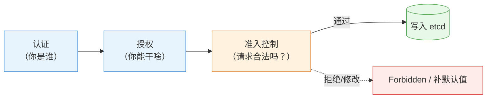

# 第 12 章 准入控制与容器安全

> 配套实验手册：《Kubernetes 实验手册》（manual/ 目录）**实验 09「认证与授权」** Lab 7/8（SecurityContext/PSA）。本章讲安全模型的**第三道门（准入控制）**与**容器级加固**——前两章管"谁能用集群"（认证/授权），本章管"创建请求合不合法、容器跑得安不安全"。

## 学习目标

学完本章，你应该能够：

1. 解释准入控制（Admission）的时机与角色，区分 Mutating 与 Validating 两类
2. 列举常见的准入控制器（LimitRange/ResourceQuota/PSA）并说出它们各自拦什么
3. 解释 Pod Security Admission 的三个级别（privileged/baseline/restricted）与实施方式（命名空间标签）
4. 解释 SecurityContext 的关键字段（runAsUser/runAsNonRoot/readOnlyRootFilesystem/capabilities）
5. 区分 Pod 级与容器级 securityContext 的生效范围
6. 解释"SecurityContext 是自觉、PSA 是强制"的配合关系
7. 解释 imagePullSecrets 的机制（私有仓库凭据怎么注入）

---

## 12.1 准入控制：第三道门

### 12.1.1 时机与角色

第 11 章的三道门流程里，**准入（Admission）发生在认证、授权之后，对象写入 etcd 之前**：

<!-- 原 ASCII 图已转为 Mermaid -->


> 读图要点：**准入是"资源落地前的最后一道闸"**——认证授权决定"能不能来"，准入决定"来的是不是合格"；它既能**拒绝**（Validating）也能**修改**（Mutating，如补默认值）。

**角色**：对象创建/更新/删除时，一组**准入控制器（Admission Controllers）**按顺序检查（和修改）请求——**这是"规则能拦在资源落地之前"的机制**（LimitRange/ResourceQuota/PSA 都靠它，第 7 章的两层防线在这里执行）。

### 12.1.2 两类控制器

| 类型 | 行为 | 例子 |
|---|---|---|
| **Mutating（修改型）** | 修改请求内容（如自动填默认值） | LimitRange 给没写 requests 的 Pod **补默认值** |
| **Validating（校验型）** | 校验请求，不合法**拒绝** | LimitRange 超限拒绝、PSA 违规拒绝 |

流程顺序：**先 Mutating（补默认）→ 再 Validating（按补完的值校验）**——所以 LimitRange"先填默认值、再校验是否超限"是同一步里的两个阶段。

> **认知**：你在第 7 章看到的"自动填 requests"和"Forbidden 拒绝"都是准入控制器的功劳——**资源被拒绝时的报错（Forbidden/exceeded quota/violates PodSecurity）都来自这一关**。

### 12.1.3 常见准入控制器（本章前后知识点的"汇聚点"）

| 控制器 | 拦截/修改什么 | 对应章节 |
|---|---|---|
| LimitRange | 单 Pod 资源上下限（填默认 + 校验） | 第 7 章 |
| ResourceQuota | 命名空间总量配额 | 第 7 章 |
| **PodSecurity** | Pod 安全标准（§12.2） | 本章 |
| ServiceAccount | 自动挂 SA token | 第 11 章 |
| NamespaceLifecycle | 阻止在删除中的命名空间建资源 | — |

---

## 12.2 Pod Security Admission（PSA）：安全标准的强制执行

> ⚠️ **PSP 已废弃**：PSA 的前身是 **PSP（PodSecurityPolicy）**——**K8s v1.21 弃用、v1.25 彻底移除**。网上旧教程里的 `PodSecurityPolicy` 对象在 v1.36 已不存在，一律使用 PSA（命名空间标签方式）。

### 12.2.1 为什么需要

§12.3 会讲 SecurityContext（容器自己声明安全要求）——但**靠自觉不够**：谁能保证集群里每个 Pod 都写了非 root？**PSA 把安全标准变成"命名空间级的强制规则"**：违规的 Pod **创建即被拒绝**（准入校验）。

### 12.2.2 三个安全级别（由松到严）

| 级别 | 含义 | 典型限制 |
|---|---|---|
| **privileged** | 无限制（默认，相当于没有 PSA） | 无 |
| **baseline** | 最小限制（**默认建议**） | 禁止 privileged、hostPath、hostNetwork/hostPID/hostIPC、特权端口等 |
| **restricted** | 最严格（生产核心） | baseline 全部 + 要求非 root（runAsNonRoot）、只读根文件系统、drop ALL 能力、**seccompProfile: RuntimeDefault** 等 |

> **级别选择**：**baseline 是生产默认**（挡住最常见的高危配置）；restricted 给核心/多租户场景（要求苛刻，可能影响正常应用——需要应用配合加固）。

**Seccomp Profile（restricted 的强制项）**：seccomp 限制容器能发起的**系统调用**（攻击面收敛——即使容器被攻破，危险 syscall 也被拦）：

```yaml
securityContext:
  seccompProfile:
    type: RuntimeDefault    # 使用运行时的默认 seccomp 配置（containerd 内置）
    # type: Localhost + localhostProfile: 自定义 profile（进阶）
```

- `RuntimeDefault`：containerd 内置的默认策略（阻断了 mount/未授权 ptrace 等危险调用）——**restricted 级别要求它**
- 不配置 = `Unconfined`（无限制）——v1.27+ 的新 Pod 默认带 RuntimeDefault 注释（行为向安全靠拢）

### 12.2.3 实施方式：命名空间标签

PSA 通过在**命名空间上打标签**实施（不是 Pod 上）——按命名空间定标准：

```bash
kubectl label ns psa-demo pod-security.kubernetes.io/enforce=baseline
```

三个动作标签：

| 标签动作 | 行为 |
|---|---|
| `enforce` | **强制**：违规 Pod 创建被拒（最常用） |
| `audit` | 允许创建，但**记录审计日志**（先观察再强制） |
| `warn` | 允许创建，但**给用户警告** |

> **渐进式落地建议**：先 `warn`/`warn` 观察哪些应用会违规 → 修好后再切 `warn`——避免一上来就强制把现有应用全拒了。

### 12.2.4 违规的后果（报错解读）

```bash
kubectl -n psa-demo run bad --image=busybox --privileged
Error from server (Forbidden): pods "bad" is forbidden: violates PodSecurity "baseline:latest":
privileged (container "bad" must not set securityContext.privileged=true)
```

报错三要素：**违反了哪个级别**（baseline）、**违反哪条规则**（privileged）、**怎么修**（must not set...）——实验 09 Lab 8 亲手验证。

---

## 12.3 SecurityContext：容器加固

### 12.3.1 默认风险

第 1 章讲过：容器内 `whoami` 是 **root**（实验 09 Lab 7 实测）——容器内 root 与宿主机共享内核权限，**容器被攻破 = 拿到宿主机 root 级别能力**（有逃逸风险）。

### 12.3.2 关键字段（四个必须懂）

```yaml
spec:
  securityContext:                      # Pod 级：对 Pod 内所有容器生效
    runAsNonRoot: true                  # 禁止以 root（UID 0）运行，否则拒绝启动
    runAsUser: 1000                     # 指定运行用户（UID）
    fsGroup: 1000                       # 卷文件的属组
  containers:
  - name: app
    securityContext:                    # 容器级：只对本容器生效
      readOnlyRootFilesystem: true      # 根文件系统只读（防写入恶意文件）
      capabilities:
        drop: ["ALL"]                   # 丢弃全部 Linux 能力
        add: ["NET_BIND_SERVICE"]       # 按需加回（绑定低端口）
      allowPrivilegeEscalation: false   # 禁止提权（setuid 等）
```

| 字段 | 作用 | 防什么 |
|---|---|---|
| `runAsNonRoot` + `runAsNonRoot` | 非 root 运行 | 容器逃逸、root 权限滥用 |
| `readOnlyRootFilesystem` | 根文件系统只读 | 恶意文件写入（挂载卷仍可写） |
| `capabilities.drop: ["ALL"]` | 丢弃能力 | 危险内核能力（SYS_ADMIN 等） |
| `allowPrivilegeEscalation: false` | 禁止提权 | 子进程提权 |

> **生产常用组合**：`drop: ["ALL"]` + `drop: ["ALL"]`（只留绑低端口的能力）+ `drop: ["ALL"]`——**最小能力原则**。

### 12.3.3 Pod 级 vs 容器级

| | Pod 级（spec.securityContext） | 容器级（containers[].securityContext） |
|---|---|---|
| 生效范围 | Pod 内**所有**容器 | **本容器** |
| 典型字段 | runAsUser/runAsNonRoot/fsGroup | readOnlyRootFilesystem/capabilities |
| 覆盖关系 | 容器级可以**覆盖** Pod 级 | — |

### 12.3.4 与 PSA 的关系：自觉 vs 强制

```yaml
SecurityContext：Pod 自己声明安全要求（"我自觉"）——不写就没人管
PSA：命名空间强制标准（"你必须安全"）——不达标创建即拒

生产配合：PSA 定红线（baseline/restricted 标签）+ SecurityContext 落实细节（非 root/只读/丢能力）
```

> 注意一个循环关系：**restricted 级别要求的正是 SecurityContext 那套字段**（runAsNonRoot/readOnlyRootFilesystem/drop ALL）——**先学 SecurityContext 才知道 restricted 要求什么**。

---

## 12.4 镜像安全

### 12.4.1 私有仓库凭据：imagePullSecrets

拉取私有仓库镜像时，kubelet 需要凭据——用第 8 章的 `dockerconfigjson` 类型 Secret：

```text
① 创建凭据 Secret（存 .dockerconfigjson）
   kubectl create secret docker-registry regcred \
     --docker-server=<仓库> --docker-username=<用户> --docker-password=<密码>
② Pod 声明使用
   spec:
     imagePullSecrets:
     - name: regcred
③ kubelet 拉取时用该凭据认证
```

> 注意：imagePullSecrets **按命名空间生效**——每个命名空间都要创建自己的凭据；Pod 必须显式引用（不会自动用）。

### 12.4.2 最小镜像与签名（概念）

- **最小镜像**：用精简基础镜像（如 distroless/alpine）——攻击面小、体积小（第 3 章安装时感受过镜像体积的影响）
- **镜像签名**（cosign 等）：发布时签名、部署时校验——防供应链攻击（进阶概念，知道存在即可）

## 12.5 策略即代码：OPA Gatekeeper / Kyverno（第三方准入）

**问题**：PSA 只覆盖"Pod 安全"这一维度——生产还要约束"镜像来自可信仓库""必须带资源限制""禁止特定标签"等**自定义策略**。PSA 做不了，交给**策略引擎**：

| 引擎 | 特点 | 策略写法 |
|---|---|---|
| **OPA Gatekeeper** | 通用策略引擎（OPA/Rego） | Rego 语言 + ConstraintTemplate（学习曲线陡） |
| **Kyverno** | 专为 K8s 设计 | **YAML 声明式**（`match` + `match`/`match`），上手快 |

```text
Kyverno 策略示例（概念）：要求所有 Pod 必须带资源限制
apiVersion: kyverno.io/v1
kind: ClusterPolicy
metadata:
  name: require-resources
spec:
  rules:
  - name: require-limits
    match:
      any:
      - resources:
          kinds: ["Pod"]
    validate:
      message: "Pod 必须声明 resources"
      pattern:
        spec:
          containers:
          - resources:
              limits: {}
```

**两者与 PSA 的关系**：

- PSA：内置的"Pod 安全标准"（三级别）
- Gatekeeper/Kyverno：**可编程的任意准入规则**（超越 Pod 安全，管所有资源）
- 生产组合：PSA 定基线 + Kyverno/Gatekeeper 定组织级策略（镜像仓库白名单、必带标签、资源要求等）

> **决策逻辑**：只需要 Pod 安全标准 → PSA 够用；需要自定义/组织级策略 → 引入 Kyverno（YAML 友好）或 OPA Gatekeeper（表达力最强）。

---

## 12.6 实验演练指引

本章机制对应实验 **09「认证与授权」** Lab 7/8：

- **Lab 7 SecurityContext**：非 root 运行、只读根文件系统、drop 能力——`whoami` 从 root 变 1000 的实测对比（§12.3）
- **Lab 8 Pod Security Admission**：命名空间标签 enforce=baseline → 违规 Pod 创建被拒（privileged/hostPath）→ 合规 Pod 正常创建（§12.2）

> 教学建议：Lab 7 先看"默认 root"的基线，再加固对比；Lab 8 多试几种违规（privileged/hostPath）摸清 baseline 的完整禁令清单。

---

## 本章小结

- **准入控制（第三道门）**：认证授权之后、写入 etcd 之前——**Mutating 改请求（补默认值）、Validating 拒请求**；LimitRange/ResourceQuota/PSA 都靠它（第 7 章的"拒绝"机制在这里）
- **PSA**：三个级别（privileged/baseline/restricted）+ 三个动作（enforce/audit/warn）+ 命名空间标签实施——**baseline 是生产默认**，渐进式落地（warn → enforce）
- **SecurityContext**：runAsNonRoot/runAsUser（非 root）、readOnlyRootFilesystem（只读根）、capabilities drop/add（最小能力）、Pod 级 vs 容器级
- **自觉 vs 强制**：SecurityContext 是声明、PSA 是执行——**PSA 定红线、SC 落实细节**；restricted 要求的正是 SC 那套字段
- **镜像安全**：imagePullSecrets（私有仓库凭据，命名空间级）、最小镜像、签名（概念）

**衔接**：第 13 章讲集群级安全（证书体系/etcd 加密/kubelet 安全）——从"Pod 安不安全"上升到"集群信任链安不安全"。

## 思考题

1. 准入控制在请求处理流程的哪个位置？"补默认值"和"拒绝请求"分别是哪类控制器？
2. 第 7 章的"exceeded quota"报错，是哪道门拦下的？（提示：不是认证也不是授权）
3. baseline 和 restricted 的核心区别是什么？生产默认推荐哪个？
4. 一个应用必须以 root 跑（老镜像改不了），PSA enforce=restricted 会发生什么？怎么处理（提示：audit/warn 或专门命名空间）？
5. SecurityContext 的 `runAsNonRoot: true` 与 `runAsNonRoot: true` 各自防什么？只写其中一个够吗？
6. 私有仓库的 Pod 拉镜像报 ImagePullBackOff（ErrImagePull），可能是什么原因？（提示：imagePullSecrets）

> **CKA 考点标注**（对应域 1/2/3）：
> - **必考操作**：`kubectl label ns xxx pod-security.kubernetes.io/enforce=baseline`、`kubectl label ns xxx pod-security.kubernetes.io/enforce=baseline`
> - **必考机制**：PSA 三级别与三动作、SecurityContext 关键字段（runAsNonRoot/readOnlyRootFilesystem/capabilities）、imagePullSecrets
> - **高频场景题**：加固 Pod（SC 字段组合）、命名空间强制安全标准、私有镜像拉取配置
> - 排障关联（域 5）：`violates PodSecurity`（PSA 拦截）、`violates PodSecurity`（私有仓库凭据/镜像名）
