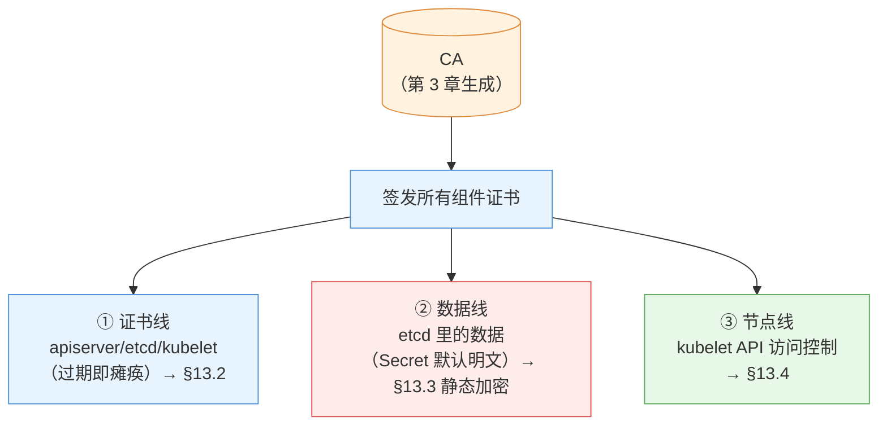
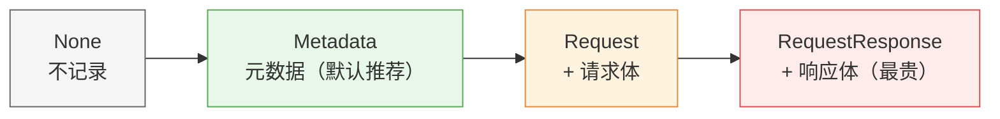

# 第 13 章 集群安全加固

> 配套实验手册：《Kubernetes 实验手册》（manual/ 目录）**实验 09「认证与授权」** Lab 1/7/8/9（证书体系/SC/PSA/集群加固）。第 11 章管"谁能用集群"、第 12 章管"Pod 安不安全"，本章上升到**集群级信任链**：证书体系、数据加密、节点安全——"集群本身可不可信"。

## 学习目标

学完本章，你应该能够：

1. 画出集群的信任链（CA → 各组件证书 → 双向 TLS），说出"证书过期 = 集群瘫痪"的机制
2. 执行证书检查与续期（check-expiration/renew）并知道续期后的注意事项
3. 解释 etcd 静态加密的机制（EncryptionConfiguration、aescbc、identity 兜底）与验证方法
4. 解释 kubelet 的认证授权模式（anonymous 禁用 + Webhook）
5. 汇总 Secret 的安全边界（RBAC + 加密存储 + 最小权限）
6. 说出"数据安全"的两道防线（静态加密 + 网络隔离）及各自防什么

---

## 13.1 集群信任链总览

第 2 章讲过"所有组件只与 apiserver 通信 + HTTPS 双向证书"——展开成三条安全线：

<!-- 原 ASCII 图已转为 Mermaid -->


> 读图要点：**信任根是 CA**，由它签发全部组件证书；三条安全线各守一段——证书线管"通信可信"、数据线管"落盘安全"、节点线管"入口不裸奔"，缺一不可。

**一句话总览**：**证书保证"通信可信"，静态加密保证"落盘安全"，kubelet 安全保证"节点入口不裸奔"**——三条线缺一不可。

---

## 13.2 证书体系与续期

### 13.2.1 组件证书全景（谁有证书）

第 3 章 kubeadm init 时生成的 PKI 体系（`/etc/kubernetes/pki/`）：

| 证书 | 用途 |
|---|---|
| `ca.crt/ca.key` | **信任根**：签发所有其他证书（最宝贵，必须保管好） |
| `apiserver.crt/key` | apiserver 对外服务（kubectl/组件连它时验证） |
| `apiserver-kubelet-client.crt` | apiserver → kubelet（§13.4 的客户端身份） |
| `apiserver-etcd-client.crt` | apiserver → etcd |
| `etcd/ca.crt` + server/peer | etcd 集群内部与客户端 |
| `front-proxy-ca.crt` | 聚合 API（扩展 apiserver） |
| `sa.pub/sa.key` | ServiceAccount token 签名（第 11 章） |

> **注意**：`ca.key` 是签发一切的私钥——泄露 = 攻击者可伪造任何组件身份；备份但要加密保管。

### 13.2.2 证书过期 = 集群瘫痪（为什么）

组件之间靠**双向 TLS** 通信（第 2 章 §2.6.3）——证书有过期时间（kubeadm 默认 **1 年**）：

```text
某组件证书过期 → 对方校验失败（x509: certificate has expired）→ 通信失败
   apiserver 证书过期 → kubectl 连不上、所有组件连不上 → 集群"瘫痪"
```

**所以"证书续期"是集群的例行运维**（不是可选项）——这也是实验 12 讲运维、本章讲机制的原因。

### 13.2.3 检查与续期

```bash
kubeadm certs check-expiration        # 检查：每个证书的到期时间与剩余时间
```

```text
CERTIFICATE                EXPIRES                  RESIDUAL TIME
admin.conf                 Aug 15, 2027 13:52 UTC   364d
apiserver                  Aug 15, 2027 13:52 UTC   364d
...
kubelet.conf               Aug 15, 2027 13:52 UTC   364d
```

```bash
kubeadm certs renew all                # 续期全部（到期时间顺延 1 年）
```

**续期后的注意事项**：

- 控制面静态 Pod 由 kubelet **自动重建**（加载新证书）
- 但 **kubeconfig（admin.conf 等）不会自动更新**——admin.conf 也过期的话要重新生成（`kubeadm init phase kubeconfig admin`）
- 续期后验证：`kubectl get nodes` 正常 + `kubectl get nodes` 剩余时间顺延

> **生产实践**：证书续期纳入例行维护（配合实验 12 的维护窗口）；剩余 <90 天就安排续期；**kubelet 等节点组件的证书由 kubelet 自动轮换**（不需要手动管）。

**TLS 密码套件加固（安全敏感环境）**：金融/合规场景还要求限制 TLS 版本与密码套件（apiserver 启动参数）：

```text
--tls-min-version=VersionTLS12        # 最低 TLS 1.2（禁止旧版本弱协议）
--tls-cipher-suites=...               # 显式指定强密码套件（如 TLS_ECDHE_RSA_WITH_AES_128_GCM_SHA256）
```

> **核心认知**：**默认配置"安全够用"**（Go 默认已排除弱套件）；等保/金融合规要求显式声明时按上例配置（kubeadm 环境改 apiserver manifest，§13.5 审计日志同类操作）。

### 13.2.4 kubeconfig 与证书（回顾）

kubeconfig 里的 `client-certificate-data` 就是用户身份证书（第 11 章 Lab 1 亲手签发过）——**"身份"在 Kubernetes 里就是一张 CA 签发的证书**，这条线从安装贯穿到用户管理。

---

## 13.3 etcd 安全

### 13.3.1 TLS：通信加密

etcd 全链路 TLS（第 3 章安装生成 etcd CA/证书）：apiserver 用 `apiserver-etcd-client` 证书连 etcd（2379）；etcd 节点间用 peer 证书（2380）——**通信层面没有明文**。

### 13.3.2 静态加密：落盘加密（数据线核心）

**问题**：etcd 里存的 **Secret 默认是明文**——base64 只是格式（第 8 章）！**能拿到 etcd 备份/数据文件的人 = 看到所有密码**。

**静态加密（EncryptionConfiguration）**：apiserver 写数据前加密、读数据时解密——**落盘即密文**：

```yaml
apiVersion: apiserver.config.k8s.io/v1
kind: EncryptionConfiguration
resources:
- resources: ["secrets"]
  providers:
  - aescbc:
      keys:
      - name: key1
        secret: <32字节随机密钥(base64)>
  - identity: {}        # 兜底：解密旧的未加密数据（必须放在最后）
```

**机制要点**：

- 配置通过 apiserver 的 `--encryption-provider-config` 参数启用（改 manifest，静态 Pod 自动重启）
- **provider 顺序 = 加密算法优先级**：`aescbc` 加密写入，`aescbc` 兜底解密存量明文
- 只对**新写入**的数据加密；旧数据在下次更新时加密（可读但未加密，最终一致）
- **密钥管理**：密钥泄露 = 数据可解——生产用 KMS（云厂商密钥服务）托管密钥

**验证（实验 09 Lab 9 实测）**：

```bash
# 创建新 Secret 后，直接读 etcd 里的原始数据：
kubectl -n kube-system exec etcd-node1 -- etcdctl \
  --endpoints=https://127.0.0.1:2379 \
  --cacert=/etc/kubernetes/pki/etcd/ca.crt \
  --cert=/etc/kubernetes/pki/etcd/server.crt \
  --key=/etc/kubernetes/pki/etcd/server.key \
  get /registry/secrets/<ns>/<name>
# 输出以 k8s:enc:aescbc:v1:key1: 开头（密文）→ 加密生效
# 而 kubectl get secret 仍正常返回明文 → 对应用透明
```

> **为什么需要 etcdctl 进容器执行**：kubeadm 集群的宿主机不带 etcdctl 二进制（实验 09 Lab 9 实测修正）——etcd 静态 Pod 走 hostNetwork，容器内 127.0.0.1 即宿主 etcd。

### 13.3.3 备份安全

第 14 章/实验 12 的 etcd 备份（快照）**也含明文 Secret**（如果没配静态加密）——**备份文件要当敏感数据对待**（加密存储、异地、访问控制）。

---

## 13.4 kubelet 安全

### 13.4.1 kubelet 也有 API（10250）

kubelet 提供 API（第 2 章 §2.5.1）：apiserver 用它在节点上执行操作（取日志、执行命令、metrics）。**这个入口必须认证授权**，否则任何人连 10250 就能操作节点上的容器。

### 13.4.2 默认配置（kubeadm 的安全基线）

```yaml
# /var/lib/kubelet/config.yaml
authentication:
  anonymous:
    enabled: false      # 禁止匿名访问（默认：匿名请求直接拒绝）
  webhook:
    enabled: true       # 用 TokenReview 认证（token 交给 apiserver 验证）
authorization:
  mode: Webhook         # 用 SubjectAccessReview 授权（走 apiserver 的 RBAC）
```

**机制解读**：

- **认证**：kubelet 收到请求 → 把请求者的 token 交给 apiserver 的 TokenReview 接口验证（Webhook 认证）——**kubelet 自己不存用户，全部委托 apiserver**
- **授权**：同样的，kubelet 把"这个用户能不能对 pod/xxx 做 exec"交给 apiserver 的 SubjectAccessReview（Webhook 授权）——**与集群 RBAC 一套规则**

> **一句话**：**kubelet 的入口与 apiserver 共用同一套身份体系**——匿名被禁、认证授权全部 Webhook 委托。**生产不要改成 anonymous 允许或 AlwaysAllow**（那等于节点裸奔）。

## 13.5 API Server 审计日志（集群的"天眼"）

### 13.5.1 审计与事件的区别（第 15 章回顾）

- **事件（Events）**：对象状态变化的流水账（第 15 章，1 小时 TTL）
- **审计（Audit）**：**所有访问 apiserver 的请求全记录**——谁（用户/SA）、何时、做了什么操作、结果如何——安全审计/合规/入侵检测的"天眼"

### 13.5.2 Audit Policy：记录什么（配置逻辑）

审计按**策略文件**决定记录哪些请求（`/etc/kubernetes/audit-policy.yaml`，通过 apiserver 的 `/etc/kubernetes/audit-policy.yaml` 启用）：

```yaml
apiVersion: audit.k8s.io/v1
kind: Policy
rules:
- level: Metadata            # 记录请求元数据（谁/什么操作/结果）
  resources:
  - group: ""
    resources: ["secrets"]   # 重点盯 Secret 的访问
- level: RequestResponse     # 记录请求与响应体（最详细）
  resources:
  - group: ""
    resources: ["pods"]
- level: None                # 兜底：其余不记录
```

**四个审计阶段（level 的粒度）**：

<!-- 原 ASCII 图已转为 Mermaid -->


> 读图要点：**记录粒度从左到右递增、成本也随之递增**——生产默认 Metadata（够审计用），只有敏感资源（Secret/证书）才单独加细到 Request 级；RequestResponse 极少用（性能代价大）。

### 13.5.3 存储与用途

- 审计日志经 apiserver 输出到文件/webhook 后端（`--audit-log-path` 等参数）——**集中采集**（第 15 章日志管道）
- **用途**：谁删了 Secret？（取证）→ 合规审查（等保/审计要求）→ 入侵检测（异常请求模式）
- **成本**：越详细越贵（控制面压力）——**生产建议 Metadata 起步，敏感资源（Secret/证书）单独加细**

> **运维提示**：审计日志默认**不启用**（要配 policy 文件 + apiserver 参数，改 manifest 重启生效）——生产安全要求高时必须开（等保合规常见要求）。

## 13.6 密钥与数据安全（汇总）

### 13.6.1 Secret 的三道保护（第 8 章 §8.3.5 深化）

```text
① RBAC：谁能读 Secret（第 11 章授权）——读 Secret = 拿到全部值
② 静态加密：etcd 落盘密文（§13.3.2）——防备份/磁盘泄露
③ 最小权限：只创建/挂载需要的 Secret；定期轮换
```

> 三者**缺一不可**：只有 RBAC，备份泄露就全完；只有加密，授权失控也没用——**纵深防御**。

### 13.6.2 网络隔离（第 9 章 NetworkPolicy 的安全视角）

静态加密防"数据被读走"；**网络隔离防"流量到不了数据"**（第 9 章 §9.5）：

- 数据库只允许业务 Pod 访问（podSelector 白名单）→ 攻击者即使进集群也够不着数据库
- 这是纵深防御的**第一道物理防线**（在加密/权限之前）

> **纵深防御全景**（把第 9-13 章串起来）：网络隔离（流量到不了）→ RBAC（权限拿不到）→ 静态加密（读走也解不开）→ 审计（出事查得到）。

---

## 13.7 实验演练指引

本章机制对应实验 **09「认证与授权」** Lab 1/7/8/9：

- **Lab 1 查看证书目录**：master 证书体系全景（§13.2.1 的实物对照）
- **Lab 7 SecurityContext**：容器加固（第 12 章内容，实验文件顺序如此）
- **Lab 8 PSA**：强制安全标准（第 12 章内容）
- **Lab 9 集群安全加固**：`kubeadm certs check-expiration` + 续期 + **etcd 静态加密完整实操**（enc.yaml → apiserver manifest → 容器内 etcdctl 验证加密前缀）+ kubelet 安全配置查看

> 教学建议：Lab 9 是本章核心——先做静态加密实操（亲眼看到 `k8s:enc:aescbc:v1:key1:` 前缀），再对照 §13.2/13.4 理解证书与 kubelet 配置。

---

## 本章小结

- **信任链三线**：证书（通信可信）/ 静态加密（落盘安全）/ kubelet 安全（节点入口）
- **证书体系**：CA 签发所有组件证书（ca.key 最宝贵）；**过期 = 集群瘫痪**；`check-expiration` 例行检查、`check-expiration` 续期（kubeconfig 需手动重生）；剩余 <90 天就安排
- **etcd 静态加密**：EncryptionConfiguration（aescbc 写 + identity 兜底读存量）——**防备份/磁盘泄露**；验证看 `k8s:enc:aescbc:v1:key1:` 前缀；密钥生产用 KMS
- **kubelet 安全**：anonymous 禁用 + 认证授权全 Webhook 委托 apiserver——与集群一套身份体系
- **Secret 三道保护**：RBAC + 静态加密 + 最小权限——纵深防御
- **全景**：网络隔离 → RBAC → 静态加密 → 审计

**衔接**：第 14 章讲集群日常运维（升级/备份/维护窗口）——证书续期、etcd 备份正是运维的例行动作，机制在本章、流程在下章。

## 思考题

1. 为什么说"证书过期 = 集群瘫痪"？apiserver 证书过期和 kubelet 证书过期，影响面分别是什么？
2. 静态加密只对新写入的数据生效，旧 Secret 怎么办？（提示：identity 兜底 + 更新时加密）
3. 拿到 etcd 备份文件能解密吗？如果没配静态加密呢？配了但密钥也泄露了呢？
4. kubelet 的 anonymous 改成允许会有什么风险？Webhook 模式的意义是什么？
5. 数据安全的纵深防御有几层？各防什么？（网络隔离/RBAC/静态加密）
6. 证书续期后为什么 kubeconfig 可能需要重新生成？

> **CKA 考点标注**（对应域 1/3）：
> - **必考命令**：`kubeadm certs check-expiration/renew`、`kubeadm certs check-expiration/renew`（第 14 章）
> - **必考机制**：证书体系与过期影响、EncryptionConfiguration（aescbc/identity）、kubelet 认证授权（Webhook）、Secret 安全边界
> - **高频场景题**：证书续期流程、启用静态加密、kubelet 安全配置检查
> - 排障关联（域 5）：`x509: certificate has expired`（证书过期）、`x509: certificate has expired`（证书不匹配）
