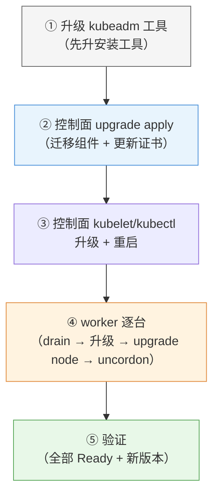
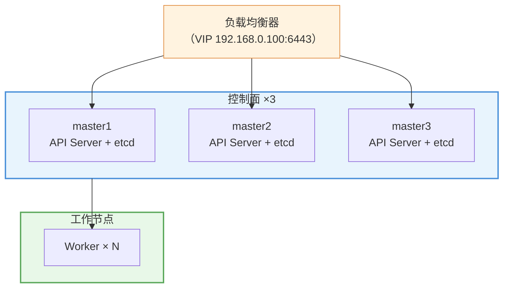

# 第 14 章 集群日常管理与维护

> 配套实验手册：《Kubernetes 实验手册》（manual/ 目录）**实验 12「集群维护与运维」**（3 个 Lab：etcd 备份恢复/kubeadm 升级/节点维护演练）。前 13 章讲"集群怎么用"，本章讲"集群怎么管"——从"会敲命令"升级为"懂流程"：维护窗口、升级流程、备份策略、高可用认知。机制层面的细节（证书、etcd）已在第 13 章讲透。

## 学习目标

学完本章，你应该能够：

1. 说出运维的四大对象（节点/控制面/数据/版本）与各自的例行动作
2. 执行完整的节点维护流程（cordon → drain → 维护 → uncordon），解释 PDB 在其中的保护作用
3. 描述集群升级的完整流程（准备 → 控制面 → worker 逐台 → 验证），解释顺序背后的原因
4. 说出升级的版本兼容窗口（为什么不能跳版本）与回滚预案
5. 设计 etcd 备份策略（周期/保留/异地/恢复演练），解释"恢复会丢什么"
6. 解释控制面高可用架构（多控制面 + 负载均衡）与 etcd Raft 奇数节点的原理
7. 掌握命名空间配额治理与对象清理的运维视角

---

## 14.1 运维思维：从"命令"到"流程"

前 13 章的每个机制（drain/备份/证书）在运维中不是孤立命令，而是**流程的一部分**。集群运维围绕四个对象：

| 运维对象 | 例行动作 | 机制来源 |
|---|---|---|
| **节点** | 维护窗口（cordon/drain/uncordon）、污点隔离 | 第 6 章 |
| **控制面** | 证书续期、etcd 备份、升级 | 第 13 章、本章 |
| **数据** | 备份策略、恢复演练 | 本章 |
| **版本** | 升级、回滚预案 | 本章 |

> **运维铁律**：**先备份再动集群**（升级/维护/恢复前），**先演练再上生产**（恢复演练、升级演练）——流程的价值在于"出事时有预案"。

---

## 14.2 节点管理流程

### 14.2.1 维护窗口三步曲（流程化）

第 6 章 §6.5 讲过机制，运维视角是**完整流程**：

<!-- 原 ASCII 图已转为 Mermaid -->


> 读图要点：**三步曲的节奏是"先挡新、再腾空、后恢复"**——cordon 与 drain 分开是为了平滑（存量业务不受影响）；drain 的"业务无感迁移"依赖第 4 章优雅终止 + 第 6 章 PDB（两条链路的汇合点）。

**为什么分三步**：cordon 与 drain 分开，是为了**平滑**——先挡新流量（存量业务不受影响），再逐台腾空（配合 PDB 保证可用性），维护完恢复。**"排空 = 业务无感迁移"依赖第 4 章的优雅终止与第 6 章的 PDB**（两条链路的汇合点）。

**Drain 异常处理**（维护中最常卡住的三个场景）：

| 卡住现象 | 原因 | 处理 |
|---|---|---|
| `cannot delete Pods with local storage` | Pod 挂了本地卷（emptyDir/hostPath） | drain 加 `cannot delete Pods with local storage`（确认数据可丢后）；或先处理这些 Pod |
| drain 一直 Pending（PDB 拦） | 应用可用副本已低于 PDB 下限 | 评估：等业务恢复 / 临时调 PDB / `--disable-eviction` 强驱（慎用） |
| 驱逐后 Pod 起不来 | 调度不满足（资源/亲和/污点） | 修调度条件；或 drain 加 `--force`（跳过驱逐校验，慎用） |

> 铁律：**`--force`/`--force` 是"明确后果"的开关**——先想清楚再传；PDB 卡住时优先"解决问题"而不是"绕开保护"。

### 14.2.2 PDB 与业务保护（回顾 + 运维视角）

第 6 章 §6.5.2 的 PDB 在运维中的意义：**没有 PDB，一次节点维护可能造成全量中断**（某应用副本恰好全在维护节点上）。运维规范：

- **核心服务必须配 PDB**（min-available 或 max-unavailable）
- drain 被 PDB 拦住（ALLOWED DISRUPTIONS = 0）时，**先评估再决定**：等业务恢复 / 调 PDB / 确认可以强驱
- 维护窗口前检查：`kubectl get pdb -A` 看各应用的保护状态

### 14.2.3 污点隔离（节点级运维手段）

第 6 章 §6.4 的污点在运维中的用途：

- **故障隔离**：节点异常先 `NoExecute` 驱逐业务（快速止损），再排查
- **专用节点**：GPU/高内存节点打污点，只让匹配的负载上来
- **灰度节点**：新版本节点先隔离，验证完再放开

---

## 14.3 集群升级：完整流程

### 14.3.1 升级前的准备（先做三件事）

1. **备份 etcd**（§14.4）——升级失败要能回滚
2. **确认版本窗口**：`kubeadm upgrade plan` 查看当前可升级的版本与依赖
3. **读兼容性说明**：升级到新版本的 breaking changes（如 API 移除）

### 14.3.2 升级顺序（为什么是这个顺序）

<!-- 原 ASCII 图已转为 Mermaid -->


> 读图要点：**顺序铁律：kubeadm → 控制面 → worker 逐台**——先升工具才能管理新版本；控制面先行让管理端就绪；worker 逐台保证任何时刻集群只少一台容量（业务无感）。

**顺序背后的原因**：

- **kubeadm 先升**：旧 kubeadm 不认识新版本的升级流程
- **控制面先行**：apiserver 新版本才能接受新版本 worker 的注册
- **worker 逐台**：一台一台 drain/升级/恢复——**集群容量只少一台，业务无感**
- **版本一致**：最终所有节点同版本（跨一个次版本兼容，但一致最稳）

### 14.3.3 升级中的业务保障（三条机制叠加）

```text
worker 升级时：
   drain（PDB 约束逐个驱逐）→ 业务 Pod 迁移到其他节点
   → 滚动/重建（第 5 章）→ 优雅终止（第 4 章）
   
三层保障：PDB（驱逐有保护）+ 优雅终止（下线不丢请求）+ 多副本（迁移有备份）
```

### 14.3.4 失败与回滚预案

- **升级失败先看 `kubeadm upgrade plan` 的兼容性提示**（多数失败是版本/依赖问题）
- **回滚手段**：etcd 快照恢复到升级前（§14.4）——**这就是"升级前备份"的意义**
- 部分失败（某 worker 没起来）：单独修复该节点，不要回滚整个集群

### 14.3.5 版本兼容窗口（不能跳版本）

kubeadm **不支持跨次要版本升级**：1.36 → 1.37 → 1.38（每次只升一个次版本）。原因：控制面与节点的版本差有上限（±1 次版本），跳版本会导致不兼容。**升级要一步一步来**（多次小版本升级 vs 一次大跳）。

### 14.3.6 Addons 升级管理（容易漏的一环）

**kubeadm upgrade 只升级核心组件（控制面 + kubelet）——不升级 Addons**（CNI 插件、CoreDNS、ingress-nginx、metrics-server 等）：

```text
升级后核对清单：
  ① CNI（Calico）：版本是否兼容新 K8s？→ 查官方兼容矩阵，按需升级（升级 CNI 是高风险操作，先 drain 或选低峰）
  ② CoreDNS：kubeadm 会提示可升级版本 → kubectl -n kube-system rollout restart deploy/coredns 前先确认镜像
  ③ 其他组件（ingress-nginx/metrics-server/dashboard）：各自按官方发布节奏升级
```

> **生产教训**：K8s 升级后"集群正常但功能异常"（网络策略失效/ingress 行为变化/指标没了），**八成是 Addons 版本不兼容**——**把 Addons 升级写进升级流程清单**（第 14.3.2 节顺序口诀的补充项）。节点自动扩缩（Cluster Autoscaler/Karpenter，云环境）概念见第 7 章 §7.3.2。

---

## 14.4 etcd 备份策略：不只是"存个快照"

第 13 章/实验 12 已实操快照命令，本章讲**策略**——备份的三个决策：

### 14.4.1 备份什么、多久、存哪

| 决策 | 建议 | 原因 |
|---|---|---|
| 频率 | 每日 + 每次重大变更（升级/迁移）后 | 恢复丢失窗口最小化 |
| 保留 | 滚动保留 N 份（如 7 天）+ 月度归档 | 防磁盘膨胀 + 可回退到更早 |
| 存放 | **异地**（与集群分离：另一台机器/对象存储） | 集群整体故障（机房挂）时备份还能用 |
| 加密 | 备份文件加密存储 | 备份里有 Secret（第 13 章 §13.3.3） |

### 14.4.2 恢复演练（"恢复会丢什么"）

**恢复（restore）意味着：集群回滚到快照时刻**——之后的所有变更（新建的 Pod/修改的配置）都会丢失。所以：

- **恢复前先想清楚**：快照时刻到现在丢了什么？丢得起吗？（往往"丢几分钟数据"优于"集群瘫痪"）
- **定期演练**：备份能不能用，**只有恢复过才知道**——CKA 的 etcd restore 题考的就是流程熟练度
- 恢复流程（实验 12 Lab 1 五步）：停 apiserver → snapshot restore 到新目录 → 替换数据目录 → 恢复 manifest → 验证

### 14.4.3 验证闭环

```text
备份（snapshot save）→ 验证（snapshot status）→ 演练（restore 到临时环境）
   → 定期循环——"备份 + 验证 + 演练"三件套缺一不可
```

> **运维铁律**：没有验证过的备份 = 没有备份。

---

## 14.5 控制面高可用（概念层）

### 14.5.1 为什么需要

第 3 章的单控制面集群（本课程）有一个**单点**：控制面节点挂了，`kubectl` 连不上、调度停摆、甚至业务 Pod 状态无法维持。生产环境控制面必须**冗余**。

### 14.5.2 多控制面架构（kubeadm 支持）

<!-- 原 ASCII 图已转为 Mermaid -->


> 读图要点：**kubectl/worker 只连 VIP**（负载均衡统一入口），VIP 背后是 3 个控制面节点——任一控制面节点挂掉，其他两个继续服务（控制面无单点）。kubeadm 用 `--control-plane-endpoint` 指定 VIP、`join --control-plane` 加入其余节点。

- **--control-plane-endpoint**：给多个控制面一个统一入口（负载均衡 VIP）——kubectl/worker 都连它
- 任一 控制面节点挂 → 其他控制面继续服务（控制面无单点）
- 架构细节（kubeadm 配置/证书分发）是进阶运维内容——**本章建立概念，知道生产长什么样**

### 14.5.3 etcd Raft：为什么是奇数节点

etcd 集群用 **Raft 共识算法**（第 2 章 §2.4.2）：**写操作需要多数派（超过一半）节点确认**：

```text
3 节点 etcd：容忍 1 台挂（2/3 仍是多数派）
5 节点 etcd：容忍 2 台挂（3/5 仍是多数派）

偶数节点（如 4）：挂 2 台 = 2/4 不是多数派 → 集群只读/不可用
   → 4 节点不比 3 节点更"高可用"（容错数相同），还多花钱
```

> **为什么奇数**：N 节点能容忍 (N-1)/2 台故障——3 和 4 容错都是 1 台，**4 没有意义**。所以 etcd 用 3/5/7 奇数节点。

### 14.5.4 设计指南：高可用与灾备架构（HA/DR）

> 从应用视角的端到端高可用设计框架（与第 6 章 PDB、第 16 章 SRE 联动）。

**高可用设计检查清单**：

```text
□ 控制面 HA：apiserver ≥3 + 前端 LB（VIP/SLB）；etcd 3/5 奇数 + SSD + 跨机架/AZ
              scheduler/controller-manager 内置 Leader 选举（多副本自动）
□ 应用层 HA：无状态 ≥2 副本（关键 ≥3）；topologySpreadConstraints 跨 AZ 打散（第 6 章）
              PDB 必配（maxUnavailable: 1）；探针三件套；优雅终止（preStop + grace）
□ 数据层 HA：有状态 → StatefulSet + 跨 AZ PV；数据库主从/集群 + 独立备份
```

**灾备等级与 RTO/RPO**：

| 灾备等级 | RTO | RPO | 实现方案 |
|---|---|---|---|
| L1 基础 | < 4h | < 24h | etcd 快照 + 异地存储（§14.4） |
| L2 标准 | < 1h | < 1h | etcd 快照 + PV 快照（第 10 章）+ **Velero**（见下） |
| L3 高级 | < 15min | ≈ 0 | 多集群主备 + 数据同步 + DNS 切换 |
| L4 同城双活 | ≈ 0 | 0 | 跨 AZ 集群 + 全局负载均衡 |

**故障域设计**：故障域从小到大（容器 → Pod → 节点 → 机架 → AZ → 区域）——**单个故障域失败不应导致服务完全不可用**；控制面跨 2 个故障域；核心业务 Pod 跨 2 个 AZ（topologyKey: zone）。

**应用级灾备：Velero**（etcd 快照只保"集群状态"，**Velero 备份"应用数据 + 应用对象"**）：

```text
Velero = 集群对象备份（Deployment/ConfigMap/...）+ PV 数据备份（配合存储快照）
   → 整应用级恢复：把 WordPress 全套（对象 + 数据库卷数据）恢复到另一个集群
   → 用途：跨集群迁移、集群级灾难恢复（etcd 都丢了也能救回应用）、测试环境克隆
```

> 决策逻辑：**etcd 快照保"集群本身"、Velero 保"业务应用"**——生产灾备是两者组合（L2 及以上等级标配 Velero）。

## 14.6 运维日历（SRE 例行动作）

> 第 16 章 SRE 规范的落地载体——把"该做的事"固定成日历，与第 16 章 SRE 规范配套：

| 频率 | 运维项目 | 执行标准 |
|---|---|---|
| 每日 | 监控告警巡检 + Pod 异常扫描 | 自动化巡检脚本 |
| 每周 | 资源利用率分析 + 容量趋势 | requests vs 实际使用 |
| 每月 | **证书有效期检查** + etcd 碎片整理 | 剩余 <90 天必须续期（第 13 章） |
| 每季度 | 安全漏洞扫描 + RBAC 权限审计 | Trivy + `kubectl auth can-i` |
| 每半年 | 灾备演练（etcd 恢复 + Velero 恢复） | 必须验证 RTO/RPO 达标 |
| 按需 | K8s 版本升级（不跨大版本） | 先 staging → 再 production |

---

## 14.7 命名空间与资源治理（运维视角）

第 7 章的资源治理机制，运维视角的例行动作：

- **配额巡检**：`kubectl get resourcequota -n <ns>`——哪些命名空间接近配额（该扩容/清理了）
- **对象清理**：无用命名空间直接删（连带清空）；残留的 Failed/Completed Pod（Job 历史）定期清理（CronJob 的 historyLimit 配合）
- **资源账单**：按命名空间聚合用量（`kubectl top` + 配额数据）——成本归属

---

## 14.8 实验演练指引

本章机制对应实验 **12「集群维护与运维」**（3 个 Lab）：

- **Lab 1 etcd 备份与恢复**：snapshot save/status/restore 五步 + 备份策略认知（§14.4 的实操）
- **Lab 2 kubeadm 集群升级**：先 kubeadm → 控制面 apply → worker 逐台 drain/upgrade/uncordon（§14.3 的实操；升级前先备份是铁律）
- **Lab 3 节点维护综合演练**：cordon/drain/uncordon + PDB 保护观察（§14.2 的实操）

> 教学建议：三个 Lab 对应本章三个核心流程（备份/升级/维护）；实验 12 做完，第 14 章概念全部落地。

---

## 本章小结

- **运维 = 流程**：维护窗口三步曲、升级五步走、备份三件套——每个动作都有"为什么这个顺序"
- **节点维护**：cordon（挡新）→ drain（排空，PDB 保护）→ 维护 → uncordon；污点用于故障隔离/专用节点
- **升级**：备份 → kubeadm 先升 → 控制面 apply → worker 逐台 → 验证；**不能跳版本**（±1 兼容窗口）；回滚靠 etcd 快照
- **备份策略**：每日 + 变更后、滚动保留、**异地存放**、定期恢复演练（"没验证过的备份 = 没有备份"）；恢复会丢"快照之后的变更"
- **控制面高可用**：多控制面 + VIP（--control-plane-endpoint）；etcd Raft 奇数节点（3/5/7，容错 (N-1)/2）
- **治理**：配额巡检、对象清理、按命名空间归账

**衔接**：第 15 章讲可观测性（监控/日志/事件三支柱）——"集群管得好不好"要用数据说话；第 16 章讲排障方法论（故障来了怎么查）。

## 思考题

1. 为什么维护节点要"先 cordon 再 drain"而不是直接 drain？
2. 升级 worker 时为什么要逐台而不是全部一起升？（提示：集群容量与业务）
3. 为什么 kubeadm 不能跨次要版本升级？跳版本会怎样？
4. etcd 备份恢复后，"丢失"的是什么？升级失败回滚时为什么能接受这个丢失？
5. 4 节点 etcd 比 3 节点更可靠吗？为什么？（提示：Raft 多数派）
6. "没有验证过的备份 = 没有备份"——怎么才算"验证过"？

> **CKA 考点标注**（对应域 1/5）：
> - **必考命令**：`etcdctl snapshot save/status/restore`、`etcdctl snapshot save/status/restore`、`etcdctl snapshot save/status/restore`、`etcdctl snapshot save/status/restore`
> - **必考流程**：etcd 备份恢复五步（CKA 实操题）、升级顺序、节点维护流程
> - **必考概念**：Raft 奇数节点、--control-plane-endpoint、版本兼容窗口
> - 排障关联（域 5）：升级失败（upgrade plan 看提示）、节点维护后业务异常（PDB/优雅终止排查）
