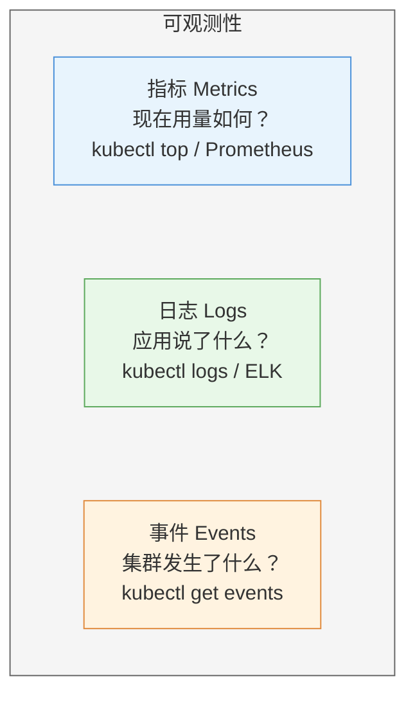
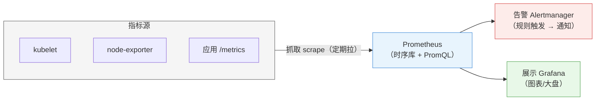

# 第 15 章 可观测性：监控、日志与事件

> 配套实验手册：《Kubernetes 实验手册》（manual/ 目录）**实验 05「性能与监控」** Lab 1/2（metrics-server/HPA——指标链路已在第 7 章详述）+ **实验 14「可观测性（可选·进阶）」**（Prometheus/Grafana 体系 + 日志收集）。本章把"看集群"的能力体系化：**指标（用量数据）+ 日志（应用说了什么）+ 事件（集群发生了什么）**三支柱——这是第 16 章排障方法论的数据基础。

## 学习目标

学完本章，你应该能够：

1. 说出可观测性三支柱（指标/日志/事件）各自回答什么问题
2. 区分实时指标（metrics-server/kubectl top）与完整监控（Prometheus 体系）的定位
3. 画出 Prometheus 体系的最小架构（采集/存储/告警/展示）——不深挖 PromQL
4. 解释 Kubernetes 的日志架构（stdout 标准）与两种收集模式（sidecar/daemonset）
5. 知道事件的来源与用途（kubectl get events）
6. 理解审计日志的概念（apiserver 请求全记录）
7. 用三支柱配合定位一个故障（哪个支柱回答哪一步）

---

## 15.1 可观测性三支柱

"集群出问题了吗？出在哪？为什么？"——三个问题对应三个数据源：

<!-- 原 ASCII 图已转为 Mermaid -->


> 读图要点：**三支柱各回答一个问题、互相印证**——事件指方向（哪里变了）、日志给细节（应用内部）、指标做佐证（资源层面）；生产可观测性是三者组合（Traces 见 §15.5）。

| 支柱 | 回答 | 数据来源 | 典型工具 |
|---|---|---|---|
| **指标（Metrics）** | "现在用量如何？" | kubelet/应用暴露的数字 | kubectl top、Prometheus |
| **日志（Logs）** | "应用说了什么？" | 容器 stdout/stderr | kubectl logs、ELK/Loki |
| **事件（Events）** | "集群发生了什么？" | apiserver 记录的对象变化 | kubectl get events |

> **排障时的分工**（第 16 章展开）：**事件**告诉你"发生了变更"（Pod 被删/探针失败），**日志**告诉你"应用内部怎么回事"（报错堆栈），**指标**告诉你"资源层面有没有异常"（内存暴涨）——三支柱互相印证。

---

## 15.2 指标（Metrics）

### 15.2.1 实时指标：metrics-server（第 7 章回顾）

第 7 章讲过指标链路（kubelet → metrics-server → metrics API）。运维视角的用途：

```bash
kubectl top node          # 每个节点的 CPU/内存用量
kubectl top pod -A        # 每个 Pod 的用量
```

- **特点**：实时快照、零配置、够 HPA 用
- **边界**：不存历史（看不了趋势）、不告警、粒度粗（节点/Pod 级）

### 15.2.2 完整监控：Prometheus 体系（概念）

生产级监控需要**历史、告警、可视化**——这就是 Prometheus 生态（CNCF 毕业项目，第 1 章提过）：

<!-- 原 ASCII 图已转为 Mermaid -->


> 读图要点：**Prometheus 主动拉取各指标源**（kubelet/node-exporter/应用），数据存时序库后两个消费端——告警（Alertmanager 规则触发通知）与展示（Grafana 大盘）。

- **抓取模型**：Prometheus **主动拉取**各端点的 `/metrics`（相比推送，配置简单、故障可观测）
- **告警规则**：`CPU > 80% 持续 5 分钟 → 通知`——生产值班的核心
- **Grafana**：可视化大盘（节点面板/应用面板）
- **部署形态**：kube-prometheus-stack（Prometheus + Grafana + 告警一体，Helm 一键装）——知道存在与用途即可，不用手搓

> **决策逻辑**：教学/小集群 → metrics-server 够用；生产 → Prometheus 体系（历史 + 告警 + 大盘）。

### 15.2.3 PromQL 极简实战（会看、会写一条就够）

Prometheus 查询语言（PromQL）——**至少掌握一条典型查询**：

```promql
# 节点 CPU 使用率（rate = 每秒增量，最常用的计数器处理）
100 - (avg by (instance) (rate(node_cpu_seconds_total{mode="idle"}[5m])) * 100)

# Pod 内存用量
container_memory_usage_bytes{namespace="default"}

# 告警规则示例（Alertmanager 触发条件）
- alert: NodeCPUHigh
  expr: (100 - (avg by (instance) (rate(node_cpu_seconds_total{mode="idle"}[5m])) * 100)) > 80
  for: 5m        # 持续 5 分钟才告警（防抖动）
```

**采集配置（ServiceMonitor 示例）**——Prometheus Operator 用 ServiceMonitor 声明"抓哪些服务的指标"：

```yaml
apiVersion: monitoring.coreos.com/v1
kind: ServiceMonitor
metadata:
  name: myapp
spec:
  selector:
    matchLabels:
      app: myapp            # 选 Service
  endpoints:
  - port: metrics           # Service 的指标端口（应用暴露 /metrics）
```

> **核心认知**：**指标采集的"最后一公里" = 应用暴露 /metrics + ServiceMonitor 声明抓取**——这就是第 17 章 Helm 装的 kube-prometheus-stack 帮你做好的事。

### 15.2.4 生产指标实践

- **利用率指标**：节点 CPU/内存利用率、Pod 用量与 requests 的比值（结合第 7 章）
- **应用指标**：请求量（QPS）、错误率、延迟（RED 指标，进阶）
- **告警分层**：节点级（NotReady/磁盘满）→ Pod 级（重启次数/探针失败）→ 应用级（错误率）

---

## 15.3 日志（Logs）

### 15.3.1 kubectl logs 的边界

```bash
kubectl logs <pod>               # 当前容器日志
kubectl logs <pod> -c <容器>      # 多容器指定容器
kubectl logs <pod> --previous    # 崩溃前的日志（排障核心，实验 10 Lab 2）
```

**注意**：容器重启后 `kubectl logs` 只能看到**当前容器**的日志——`kubectl logs` 看上一个（崩溃的）实例的输出。容器删除 = 日志消失（kubectl 层面）。

### 15.3.2 日志架构：stdout 是标准

Kubernetes 的日志约定：**容器把日志写到 stdout/stderr**，由容器运行时（containerd）捕获并轮转（每节点落盘 `/var/log/containers/`）。

- 应用**不需要写文件**——写文件（普通文件卷）反而麻烦（轮转/清理/收集都要自己管）
- kubelet 负责把 stdout 日志落到节点本地（供 kubectl logs 读取）

> **一句话**：**"打日志 = 打 stdout"**——这是 K8s 应用的日志铁律（镜像里配好日志到 stdout，后面收集才顺）。

### 15.3.3 日志收集模式（日志要"出集群"）

kubectl logs 只能看单 Pod；生产要把**所有 Pod 的日志集中**（检索/告警/合规）。两种收集模式：

**模式一：daemonset 收集（每节点一个采集器，主流）**

```text
每个节点一个日志采集 Pod（filebeat/fluentd/vector）
   │ 读 /var/log/containers/（该节点所有容器日志）
   ▼
发送到集中存储（ES/Loki/S3）→ 检索（Kibana/Grafana）
```

- 优点：**一个 DaemonSet 管全集群**、应用无感知（不用改应用）
- 缺点：采集器自己也要日志（注意循环）

**模式二：sidecar 收集（每 Pod 一个，特殊场景）**

```text
Pod 里：主容器（写日志文件）+ sidecar 容器（读文件转发）
```

- 优点：应用日志文件化（老应用只写文件）、可加过滤/格式转换
- 缺点：每个 Pod 多一个容器（资源/复杂度翻倍）

> **选型**：**默认 daemonset 模式**（第 5 章 DaemonSet 的典型场景）；sidecar 只用于"必须文件化"的老应用。

### 15.3.4 生产日志实践

- 日志分级（ERROR/WARN/INFO）与采样（防日志爆炸）
- 敏感信息脱敏（日志里别打密码——Secret 不落日志）
- 保留策略（合规要求 vs 存储成本）

---

## 15.4 事件（Events）与审计

### 15.4.1 事件：对象状态变化的流水账

**Event** 是 apiserver 记录的"对象发生了什么"（第 2 章 describe 里见过）：

```bash
kubectl get events -A                # 全集群事件
kubectl get events --sort-by=.lastTimestamp   # 按时间排
kubectl describe pod xxx             # 单对象的事件（Events 段）
```

典型事件：`Scheduled`（调度成功）、`Scheduled`（拉镜像）、`Scheduled`（调度失败）、`Scheduled`（探针失败）、`Scheduled`（终止）、`Scheduled`（重启退避）——**实验 10 的排障三板斧里，事件是"发生了什么"的第一手来源**。

> **注意**：Event 是**临时**的（默认 1 小时左右清理）——出问题要**及时看**；生产可配置事件持久化（进阶）。

### 15.4.2 审计日志：apiserver 请求全记录（概念）

**审计（Audit）** 比事件更底层：**记录所有访问 apiserver 的请求**（谁、什么时候、做了什么操作、结果如何）：

```bash
kubectl delete pod web-1
   → 审计日志：用户 kubernetes-admin 在 12:00:03 DELETE pods/web-1（200 OK）
```

- 用途：安全审计（谁删了 Secret？）、合规、取证
- 默认**不启用**（要配置 AuditPolicy 指定记录级别）
- 知道概念即可：**事件是"对象发生了什么"，审计是"谁对 apiserver 做了什么"**

## 15.5 分布式追踪（Tracing）：请求的一生

**问题**：微服务架构里一个请求经过 A → B → C 三个服务——出问题时"慢在哪一环"？日志和指标都答不了（日志是局部的、指标是统计的）。

**Tracing** 记录**一个请求的完整路径**（时间线）：

```text
用户请求 ──► 网关（span: 5ms）──► 订单服务（span: 120ms）──► 数据库（span: 95ms）
                                      │                    └─ 慢在这里！
                                      └► 库存服务（span: 40ms）
traceID 贯穿所有 span → 可视化：火焰图/瀑布图 → 一眼定位"慢在哪"
```

**核心概念**（OpenTelemetry 标准，云原生追踪事实标准）：

- **Trace（追踪）**：一个请求的全链路（由 traceID 关联）
- **Span（跨度）**：链路上的一段（一次服务调用/一个操作），含耗时与状态
- **传播**：请求头携带 traceID 在服务间传递（`traceparent` 头），各服务把 span 上报到追踪后端

**技术栈**：OpenTelemetry SDK（埋点/传播）+ Jaeger/Tempo（追踪后端展示）。

> **核心认知**：**Metrics 告诉你"出问题了"，Logs 告诉你"应用说了什么"，Traces 告诉你"请求慢在哪一环"**——三支柱齐备才能高效定位微服务故障（生产可观测性完整版）。

---

## 15.6 排障入口：三支柱怎么配合

用第 16 章会展开的方法论提前看一眼三支柱的配合：

```text
故障现象：应用 502
   │
   ① 事件：kubectl get events -A
      → 看到 "Unhealthy"（readiness 探针失败）→ 定位到某个 Pod
   │
   ② 日志：kubectl logs <pod> --previous
      → 看到 "OutOfMemoryError" / "connection refused to mysql" → 定位根因方向
   │
   ③ 指标：kubectl top pod
      → 内存 800Mi / limit 512Mi（OOM 佐证）→ 确认根因
   │
   修复：调内存 limits（第 4 章）→ 验证
```

> **分工记忆**：**事件指方向（哪里变了）、日志给细节（应用说了什么）、指标做佐证（资源层面证实）**——三步走是第 16 章排障方法论的数据侧。

---

## 15.7 实验演练指引

本章对应的动手内容：

- **实验 05 Lab 1 安装 metrics-server**：指标链路的搭建——`kubectl top node/pod` 有数（§15.2.1 的实操）
- **实验 05 Lab 2 启用 HPA**：指标的实际消费者（第 7 章内容，指标链路闭环）
- **实验 10 Lab 1 排查三板斧**：describe（事件）/logs/events 的标准动作（§15.6 的实操）

> 说明：Prometheus 体系（§15.2.2）与日志收集（§15.3.3）在**实验 14（可选·进阶）**提供实操：kube-prometheus-stack 一键部署、ServiceMonitor + PromQL 查询、filebeat DaemonSet 日志收集——想上手生产级可观测性就做它；时间紧张可只做实验 05 Lab 1/2 掌握指标链路。

---

## 本章小结

- **三支柱**：指标（用量）/日志（应用说了什么）/事件（集群发生了什么）——**互相印证**
- **指标**：metrics-server（实时、零配置、供 HPA）→ Prometheus 体系（历史 + 告警 + 大盘，生产标准）
- **日志**：**stdout 是标准**（应用写 stdout，运行时捕获）；收集默认 **daemonset 模式**（每节点采集器），sidecar 用于文件化老应用
- **事件**：对象状态变化流水账（describe 的 Events 段、get events）——**临时性（1 小时）要趁热看**
- **审计**：apiserver 请求全记录（谁做了什么）——默认不启用，安全/合规用
- **排障分工**：事件指方向 → 日志给细节 → 指标做佐证

**衔接**：第 16 章把这三支柱整合成完整的排障方法论（分层框架 + 证据链思维）。

## 思考题

1. 三支柱各自回答什么问题？"Pod 一直在重启"分别可以从哪个支柱看到什么？
2. metrics-server 与 Prometheus 的定位差异？（实时 vs 历史/告警）
3. 为什么应用要把日志打到 stdout 而不是写文件？写文件会有什么问题？
4. daemonset 收集和 sidecar 收集各自的取舍？默认选哪个？
5. 事件默认保留多久？为什么排障要"趁热看"？
6. 事件与审计日志的区别是什么？

> **CKA 考点标注**（对应域 5：故障排查 **30%**）：
> - **必考命令**：`kubectl logs <pod> --previous`、`kubectl logs <pod> --previous`、`kubectl logs <pod> --previous`、`kubectl logs <pod> --previous`
> - **必考机制**：日志架构（stdout 标准）、事件来源、metrics 链路
> - **排障依赖**：三支柱是域 5 全部排障题的数据获取手段——第 16 章的方法论全靠它们落地
> - 注意：Prometheus/审计属于了解级（生产实践，非 CKA 直接考点）
