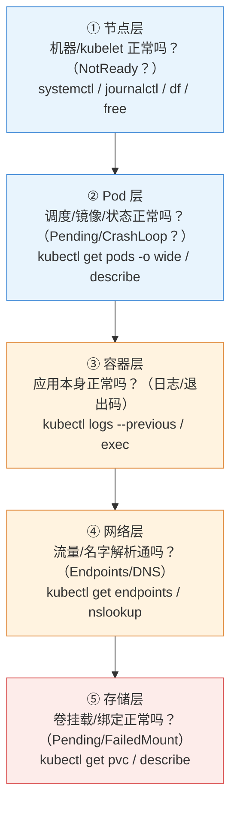

# 第 16 章 故障排查与可靠性

> 配套实验手册：《Kubernetes 实验手册》（manual/ 目录）**实验 10「故障排查」**（5 个 Lab：三板斧/CrashLoop/NotReady/Service 排查/可靠性演练）。本章是 **CKA 权重最高的域（域 5，30%）**——前 15 章的所有机制在这里变成"出问题时怎么查"，并补上"怎么让故障少发生"的可靠性工程。

## 学习目标

学完本章，你应该能够：

1. 说出分层排障框架（节点/Pod/容器/网络/存储）与每层的判断依据
2. 掌握证据链思维：从现象 → 事件 → 日志 → 根因的取证顺序
3. 熟记排障纪律：先恢复再排查、一次只改一个、报错即答案
4. 对每类典型故障（NotReady/ImagePullBackOff/CrashLoop/探针失败/PVC 挂载失败）说出排查路径
5. 解释可靠性工程三件套（滚动更新调优/优雅终止/PDB）如何让故障少发生
6. 解释主动演练（混沌思想）的意义与基本方法

---

## 16.1 排障方法论：先有框架，再动手

### 16.1.1 分层排查框架

故障一定发生在某个"层"——从外到内逐层定位（第 2 章架构图的排障版）：

<!-- 原 ASCII 图已转为 Mermaid -->


> 读图要点：**从外层往内层逐层排查，每层都有专属命令**——先确认下层没白查（节点挂了查 Pod 日志是浪费）；节点/Pod 层用 get 类命令、容器/网络层用 logs/exec/curl 类命令、存储层看 describe 的 FailedMount 事件。

> **原则：从外层往内层，每层都有专属命令**——先确认"下面一层没白查"（节点挂了，查 Pod 日志是浪费）。

### 16.1.2 证据链思维（第 15 章三支柱的整合）

```text
现象（用户报/监控告警）
   │
   ① 事件（集群视角）：kubectl get events -A / describe xxx
      → "发生了什么"（Scheduled/Pulled/Unhealthy/Killing...）
   │
   ② 日志（应用视角）：kubectl logs <pod> --previous
      → "应用说了什么"（报错堆栈/连接失败...）
   │
   ③ 指标（资源视角）：kubectl top
      → "资源层面佐证"（内存超限/OOM...）
   │
   根因定位 → 修复 → 验证
```

> **取证的顺序就是证据链**——不要一上来乱敲命令；**describe 的 Events 段永远是最快的切入点**（90% 的问题在事件 + 日志两步内定位）。

### 16.1.3 排障纪律（三条铁律）

1. **报错信息就是答案**：K8s 的报错几乎都直说"差在哪"（`manifest not found`=镜像名错、`manifest not found`=配额、`manifest not found`=调度条件）——**先读报错，再想别的**
2. **先恢复、再排查**：生产故障第一优先是恢复业务（`rollout undo` 回滚、scale 副本、重启），**恢复后再慢慢查根因**（第 5 章讲过：先恢复业务再排查）
3. **一次只改一个**：改完验证、不行再改下一个——**多变量同时改 = 无法定位**（与 Git 二分思路一致）

---

## 16.2 各层排障详解

### 16.2.1 节点层：NotReady

**判断依据**：`kubectl get nodes` 显示 NotReady（第 2 章：Ready 依赖 kubelet 心跳 + 网络就绪）。

```bash
kubectl get nodes                    # 哪台 NotReady？
kubectl describe node node2          # 看 Conditions/事件
ssh 到该节点：
  systemctl status kubelet           # kubelet 活着吗？
  journalctl -u kubelet -n 50        # kubelet 日志（第一手线索）
  df -h / free -m                    # 磁盘满/内存不足？（节点资源压力）
  ip a                               # 网络通吗？（CNI 依赖）
```

常见根因：kubelet 挂了/配置错、磁盘满（镜像清理）、内存压力、网络插件（calico）异常、证书问题。

### 16.2.2 Pod 层：Pending / ImagePullBackOff / CrashLoopBackOff

**判断依据**：`kubectl get pods -o wide` 看 STATUS。

| 状态 | 含义 | 排查路径 |
|---|---|---|
| `Pending` | 未调度/未就绪 | `Pending` 看 Events：`Pending`（资源/亲和/污点）或镜像拉取中 |
| `ImagePullBackOff` | 镜像拉不下来 | `ImagePullBackOff` 看 Events 的 `ImagePullBackOff`（镜像名/标签/私有仓库凭据/网络） |
| `CrashLoopBackOff` | 容器反复崩溃 | `CrashLoopBackOff` 看崩溃前输出；`CrashLoopBackOff` 看 Last State 的退出码 |
| 探针失败 | 被重启/被摘除 | `describe` 看 `describe` 事件（哪个探针、为什么失败） |

```text
CrashLoop 的退出码解读（第 4 章 §4.4.1）：
  0 = 正常退出（命令跑完就退——可能是任务型用了 Always）
  1 = 应用错误（看日志）
  127 = 命令不存在（镜像里没有该命令，如 busybox 无 bash）→ 检查命令拼写与镜像内容
  137 = SIGKILL（内存超限 OOM / 被强杀）→ 查 limits 与 top
  143 = SIGTERM（被优雅终止——可能正常下线）
```

### 16.2.3 容器层：应用自己

Pod Running 但功能不对 → 进容器看应用：

```bash
kubectl logs <pod> --tail=50              # 当前日志
kubectl logs <pod> --previous             # 崩溃前的日志
kubectl exec -it <pod> -- sh              # 进容器（v1.36 用 --）
kubectl describe pod <pod>                # 状态/环境变量/挂载（验证配置对不对）
```

> 常见坑：环境变量/配置注入错了（第 8 章）——`describe` 看 Containers 段的 Env 与 Mounts 是否符合预期。

**排障容器与临时容器（不用 SSH 进节点）**：

- **Pod 里没有 shell/工具**（精简镜像）怎么办？——**不要 SSH 进节点**（不干净、权限大），用 `kubectl debug`：

```bash
# ① 临时容器：给"正在运行的 Pod"加一个调试容器（共享进程/网络命名空间）
kubectl debug -it <pod> --image=nicolaka/netshoot --target=<容器名> -- sh
#    netshoot 预装全套网络排障工具（curl/nsloookup/tcpdump...）

# ② 副本调试：启动一个带调试镜像的副本（不改原 Pod）
kubectl debug <pod> -it --copy-to=debug-pod --image=busybox -- sh

# ③ 节点调试：在节点上起特权调试 Pod（替代 SSH）
kubectl debug node/<node名> -it --image=ubuntu
```

- **临时容器（ephemeral containers，v1.23+ 稳定）**：`kubectl debug` 的核心机制——**往运行中的 Pod 注入新容器**，不影响原容器（排障后自动消失）
- **替代 SSH 进节点的最佳实践**：`kubectl debug node/xxx` 起一个特权 Pod 检查节点（安全、可审计）

> 决策逻辑：**能进容器 → exec；容器没工具/进不去 → debug 临时容器；要查节点 → debug node**——全程 kubectl，不给 SSH 权限（生产安全要求）。

### 16.2.4 网络层：访问不通

**Service/DNS 排查流程**（第 9 章 §9.6 的从外到内）：

```text
① Service 有后端吗？kubectl get endpoints web-svc
   → ENDPOINTS 为空 = selector 没匹配上（检查 Service 与 Pod 标签）
② DNS 解析对吗？kubectl exec xxx -- nslookup web-svc.default.svc
   → 解析失败 = Service 名/命名空间写错，或 coredns 异常
③ 连通性：kubectl exec xxx -- wget -O- http://web-svc
   → 通 = 网络 OK；不通 = kube-proxy/CNI 问题
```

> **经典根因**：Service 的 selector 拼错标签（`app=web` vs `app=Web`）→ Endpoints 空 → 服务 502——**实验 10 Lab 4 亲手踩过**。

### 16.2.5 存储层：卷挂不上

```bash
kubectl get pvc                    # PVC 状态（Pending = 没绑定）
kubectl describe pvc              # Events：no persistent volumes available（没有匹配的 PV）
kubectl get pv                    # PV 存在吗/容量/访问模式/SC 匹配吗
kubectl describe pod              # Events 的 FailedMount（挂载失败：路径/权限/存储节点）
```

> **经典根因**（第 10 章 §10.3.4）：PVC Pending = PV 不匹配（容量/模式/SC）；FailedMount = 底层存储问题（节点挂了/权限）。

---

## 16.3 典型故障图谱（现象 → 根因 → 修复速查）

| 现象 | 第一查 | 常见根因 | 修复 |
|---|---|---|---|
| 节点 NotReady | journalctl -u kubelet | kubelet 挂/磁盘满/网络插件异常 | 修 kubelet/清磁盘/查 calico |
| Pod Pending | describe Events | 资源不足/亲和不满足/污点不容忍 | 调 requests/删约束/加容忍 |
| ImagePullBackOff | describe Events | 镜像名错/私有仓库没凭据/加速站失效 | 改镜像名/配 imagePullSecrets |
| CrashLoopBackOff | logs --previous | 命令错/配置错/启动即崩 | 改 command/配置 |
| 退出码 137 | top 看内存 | 超内存 limits 被 OOM | 调 limits/查内存泄漏 |
| Service 502 | get endpoints | selector 错 → Endpoints 空 | 修标签 |
| DNS 解析失败 | nslookup | 名字/命名空间错、coredns 挂 | 改名字/查 coredns |
| PVC Pending | describe pvc | PV 不匹配 | 补 PV/改 SC |
| FailedMount | describe pod | 存储节点问题/权限 | 修底层存储 |
| 探针 Unhealthy | describe pod | 探针路径/端口/阈值不对 | 调探针（第 4 章） |
| exceeded quota | get resourcequota | 命名空间配额用完 | 清资源/调配额 |
| Forbidden | auth can-i | RBAC 没配/规则错 | 配 Binding/修 rules |

> **记忆法**：这张表是"现象 → 第一步命令"的映射——**每类故障的第一条命令 + describe 的 Events 段**覆盖 90% 的排障。

---

## 16.4 可靠性工程：让故障少发生

排障是"出事怎么救"，可靠性是"怎么不出事"——三件套（实验 10 Lab 5 实操过）：

### 16.4.1 发布可靠性：滚动更新策略调优

```text
默认 25%/25%：允许短暂少 1 个副本（快速但有小中断）
核心服务 0/1：maxUnavailable: 0（任何时刻不少服务）+ maxSurge: 1（多起一个）
   → 新 Pod 就绪（readiness）→ 才停旧的 → 零中断发布
```

**前提**：新 Pod 必须配 readinessProbe（第 4 章）——**没有探针的滚动更新是"盲更新"**。

### 16.4.2 下线可靠性：优雅终止深化

第 4 章 §4.4.4 的完整流程（摘流量 → preStop → SIGTERM → grace period → SIGKILL）在生产中的关键配置：

- **preStop 里做反注册/排空**（sleep 或调注册中心 API）
- **grace period 要够**：应用收尾需要的时间 + 缓冲（默认 30s，不够就调大 `terminationGracePeriodSeconds`）
- **验证**：发布/缩容时观察旧 Pod 是否"优雅退出"（describe 看 Killing 事件时间线）

### 16.4.3 驱逐可靠性：PDB 保护计算

第 6 章 §6.5.2 的 PDB（ALLOWED DISRUPTIONS = 可用副本 - minAvailable）在生产中的价值：

- **节点维护/升级（第 14 章）时业务无损**的保障
- **核心服务必配**：数据库/网关/所有多副本应用
- 注意边界：**只保护自愿中断**（drain），节点宕机管不了（那是控制器自愈的事）

### 16.4.4 主动演练（混沌思想）

**"故障会来，不如主动让它来一次"**——混沌工程思想（Netflix 的 Chaos Monkey 起源）：

```text
受控演练（实验环境）：
  杀一个 Pod → 验证自愈（ReplicaSet 重建）
  停一台 worker（drain + 关机）→ 验证业务迁移 + PDB 保护
  断一个副本的网络 → 验证 Service 只把流量给就绪 Pod
```

- 目的：**验证"系统宣称的能力"真的存在**（自愈/优雅终止/PDB）——平时演练过，真出事才不慌
- 本课程实验 10 Lab 5 与实验 02 Lab 9 的删除对比，就是最小的主动演练

## 16.5 SRE 运营规范：把可靠性"制度化"

> 单个工程师的"靠谱"不可复制；**SLO/复盘/日历**把可靠性变成组织能力（运维日历见第 14 章 §14.6）。

### 16.5.1 SLO / Error Budget（用数字管理可靠性）

```text
SLI（服务级别指标）→ SLO（服务级别目标）→ SLA（对外承诺）

常见 SLI：可用性（成功请求/总请求）、延迟（P99）、吞吐
SLO 设计：
  核心交易服务：可用性 ≥ 99.95%，P99 < 500ms
  内部工具服务：可用性 ≥ 99.9%，P99 < 2s
Error Budget（故障预算）：
  99.95% SLO = 每月允许 21.9 分钟不可用
  预算耗尽 → 冻结新功能发布，聚焦稳定性；预算充足 → 可激进发布
```

### 16.5.2 故障复盘（Post-mortem）

```text
模板：① 事件概要（何时/多久/影响范围）② 时间线（精确到分钟）
      ③ 根因分析（5 Whys）④ 影响评估 ⑤ 改进措施（每条有 Owner + Deadline）⑥ 经验教训
文化：对事不对人（Blameless）；72 小时内完成初稿；改进项进入排期跟踪
```

> **核心认知**：**复盘的价值不在"追责"而在"系统改进"**——每个改进措施闭环，SLO 才会逐年提高（配合第 14 章 §14.6 运维日历执行）。

---

## 16.6 实验演练指引

本章机制对应实验 **10「故障排查」**（5 个 Lab）：

- **Lab 1 排查三板斧**：describe/logs/events 的标准动作（§16.1.2 的实操）
- **Lab 2 CrashLoopBackOff 排查**：bad-image（ImagePullBackOff）+ bad-cmd（CrashLoop）→ 退出码定位（§16.2.2）
- **Lab 3 节点 NotReady 排查**：kubelet 服务与日志定位（§16.2.1）
- **Lab 4 Service/DNS 排查**：selector 错 → Endpoints 空 → 修复闭环（§16.2.4）
- **Lab 5 可靠性演练**：滚动更新 0/1 调优 + preStop 优雅下线 + PDB 计算（§16.4）

> 教学建议：Lab 1-4 是排障（出事怎么查），Lab 5 是可靠性（怎么不出事）——**排障 + 可靠性 = 域 5 的完整能力**。

---

## 本章小结

- **分层框架**：节点 → Pod → 容器 → 网络 → 存储，从外到内、每层专属命令
- **证据链**：现象 → 事件（describe/get events）→ 日志（logs --previous）→ 指标（top）→ 根因
- **三条纪律**：报错即答案、先恢复再排查、一次只改一个
- **故障图谱**：11 类典型故障的现象 → 第一步 → 根因 → 修复（速查表）
- **可靠性三件套**：滚动更新 0/1（发布不中断，前提是 readiness）+ 优雅终止（下线不丢请求，preStop + grace）+ PDB（驱逐有保护）
- **主动演练**：杀 Pod/杀节点验证自愈——"宣称的能力"要演练过才算数

**衔接**：第 18 章综合实战——用 WordPress 把全书机制串成一个真实应用，排障方法论将在综合演练中再次被用到（全链路故障定位）。

## 思考题

1. 一个"503 Service Unavailable"，你的排查顺序是什么？（从分层框架出发写完整步骤）
2. `kubectl logs` 和 `kubectl logs` 的区别？什么场景必须用 --previous？
3. CrashLoop 退出码 137 和 143 分别意味着什么？怎么进一步确认？
4. "报错即答案"——举三个报错例子，说明它们各自直说了什么问题？
5. 滚动更新要"零中断"，除了 maxUnavailable: 0 还需要什么配置？（提示：readiness）
6. 为什么说"PDB 只管自愿中断"？节点宕机时谁在保护业务？
7. 主动演练的最小实践是什么？在实验环境怎么验证"自愈"？

> **CKA 考点标注**（对应域 5：故障排查 **30%，CKA 第一重**）：
> - **必考命令**：`kubectl describe`（Events 段）、`kubectl describe`、`kubectl describe`、`kubectl describe`、`kubectl describe`
> - **必考场景**：CrashLoopBackOff（退出码解读）、ImagePullBackOff、节点 NotReady（kubelet）、Service/DNS（Endpoints）、PVC Pending/FailedMount、Forbidden（RBAC）、exceeded quota
> - **必考机制**：探针失败与重启/摘除、优雅终止、PDB 计算、滚动更新
> - 备考策略：域 5 占 30%——**实验 10 的 5 个 Lab 全部亲手做一遍**，故障图谱（§16.3）作为考前速查
