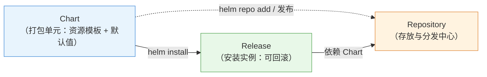
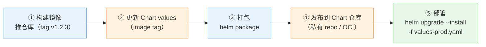
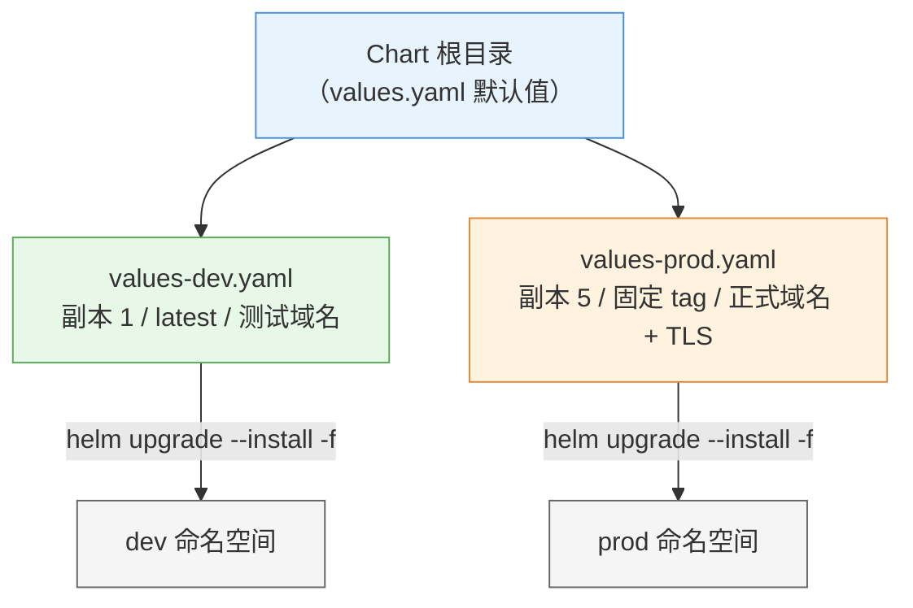

# 第 17 章 Helm 与 Kustomize（应用打包与部署）

> 配套实验手册：《Kubernetes 实验手册》（manual/ 目录）**实验 13「Helm 交付」**（全部 3 Lab：Chart 结构/打包发布/升级回滚 + values 多环境 + Kustomize）——此前**实验 09 Lab 6** 已用 helm 装过 dashboard（先熟悉命令）。第 18 章的综合实战用裸 YAML 讲原理，本章补上**企业级应用交付的工具链**——Helm（打包与发布）与 Kustomize（环境化定制）。**本课程基线 v1.36；Helm v3（本教材 Helm 均指 v3）**。

## 学习目标

学完本章，你应该能够：

1. 说出裸 YAML 管理在生产中的三个痛点，以及工具链的解决思路
2. 解释 Helm 的核心模型（Chart/Release/Repository）与 Chart 目录结构
3. 理解 Helm 模板化原理（values 注入 + 模板渲染）与 `helm install/upgrade/rollback` 的版本机制
4. 解释 Kustomize 的 base/overlay 定制机制，说出它与 Helm 的定位差异
5. 设计一个企业应用交付流程（Chart 版本化 + 多环境 values + CI/CD 集成）
6. 知道 CRD 与 Operator 是 Kubernetes 的扩展机制（为第 18 章展望铺垫）

---

## 17.1 为什么需要应用交付工具链

### 17.1.1 裸 YAML 管理的三个痛点

第 18 章的 WordPress 用十几个裸 YAML 手动管理——教学清晰，但生产会立刻遇到：

1. **重复**：每个环境（dev/staging/prod）都要一份几乎一样的 YAML，只差镜像 tag/副本数/域名——复制粘贴，改一处漏三处
2. **无法参数化**：同样的 Deployment 模板，环境不同值不同——yaml 里没有"变量"概念
3. **无版本管理**：YAML 文件散落，没有"应用包"的概念——回滚、分发、依赖管理无从谈起

### 17.1.2 工具链的定位（两个互补的工具）

| 工具 | 定位 | 类比 |
|---|---|---|
| **Helm** | **打包与发布**：把一组资源打包成 Chart（应用包），带模板和默认值，一条命令安装/升级/回滚 | Linux 的 apt/yum |
| **Kustomize** | **配置定制**：不引入模板语言，用 overlay 覆盖 base——"原样 + 差异" | 配置补丁 |

> **决策逻辑**：**应用要分发/复用 → Helm；自己项目的多环境定制 → Kustomize**；两者也可组合（Helm 渲染后 Kustomize 再补丁，生产常见）。本教材重点讲 Helm（更常用、CKAD 考点），Kustomize 讲清定位与机制。

---

## 17.2 Helm：Kubernetes 的包管理器

### 17.2.1 核心模型（三个概念）

<!-- 原 ASCII 图已转为 Mermaid -->


> 读图要点：**Chart 是安装包（helm install 变成 Release）、Repository 是软件源（Chart 从仓库获取/发布）**——同一 Chart 可多次 install 成多个 Release（如 dev/web、prod/web），Release 有版本号可回滚。

- **Chart**：应用的"安装包"（类比 .deb/.rpm）
- **Release**：一次安装的"运行实例"（有名字、有版本号、可回滚）
- **Repository**：Chart 的"软件源"（`helm repo add` 添加）

### 17.2.2 Chart 目录结构（解剖一个应用包）

```text
myapp/
├── Chart.yaml          # 元数据：name/version/appVersion/依赖
├── values.yaml         # 默认配置值（镜像 tag、副本数、域名...）
├── values-prod.yaml    # （可选）环境覆盖值
├── templates/          # 资源模板（Go template 语法，values 注入）
│   ├── deployment.yaml
│   ├── service.yaml
│   ├── ingress.yaml
│   └── _helpers.tpl    # 公共模板片段（名字生成等）
└── charts/             # （可选）子 Chart 依赖
```

> **核心认知**：Chart 的精华在 `values.yaml` + `values.yaml` 的组合——**模板里写结构、values 里写变化**（镜像版本/副本数/域名），安装时用 values 渲染出最终 YAML。

### 17.2.3 模板化原理

```yaml
templates/deployment.yaml（片段）：
  replicas: {{ .Values.replicaCount }}          ← 模板占位符
  image: {{ .Values.image.repository }}:{{ .Values.image.tag }}

values.yaml：
  replicaCount: 3
  image:
    repository: nginx
    tag: "1.27"

渲染结果：
  replicas: 3
  image: nginx:1.27
```

- 模板语言：Go template（`{{ .Values.xxx }}` 取值、`{{ .Values.xxx }}` 条件、`{{ .Values.xxx }}` 循环）
- **values 优先级**：`--set` 命令行 > 指定 values 文件 > values.yaml 默认值（`--set`）
- 渲染检查（不实际安装）：`helm template myapp ./myapp`——**先看渲染结果再装**（排障利器）

### 17.2.4 常用命令（安装/升级/回滚）

```bash
helm repo add bitnami https://charts.bitnami.com/bitnami    # 添加仓库
helm search repo nginx                                       # 搜索

helm install my-release ./myapp                              # 安装（首次）
helm install my-release ./myapp -f values-prod.yaml          # 带环境配置

helm upgrade my-release ./myapp --set image.tag=1.28         # 升级（改 values）
helm rollback my-release 1                                   # 回滚到 revision 1

helm list                                                    # 查看 Release
helm uninstall my-release                                    # 卸载
```

### 17.2.5 版本与回滚机制（与 Deployment 同源的思想）

```bash
helm install → revision 1
helm upgrade → revision 2（helm 记录历史）
helm upgrade → revision 3
helm rollback my-release 2 → 回到 revision 2 的状态
```

> 与第 5 章 Deployment 的 revision 机制同源：**每次变更留历史，出问题一键回滚**——这就是"包管理器"的价值（应用级回滚，不止是资源级）。

> 实验 09 Lab 6 已经用 helm 装过 dashboard（`helm repo add kubernetes-dashboard` + `helm repo add kubernetes-dashboard`）——`helm repo add kubernetes-dashboard` 是"有则升级、无则安装"的幂等写法，生产常用。

---

## 17.3 Kustomize：环境化定制

### 17.3.1 定位：不用模板，用覆盖

Kustomize 的理念与 Helm 相反：**不引入模板语言**——资源 YAML 保持原样（base），环境差异用"补丁/覆盖"（overlay）表达：

```text
base/（一份"标准"资源）
  deployment.yaml（replicas: 3, image: nginx:1.27）
  service.yaml
  kustomization.yaml（声明：这个目录包含哪些资源）

overlays/prod/（环境差异）
  kustomization.yaml（声明：base + 补丁）
    - 改 replicas: 5
    - 改 image tag: 1.28
    - 改域名
```

```bash
kubectl apply -k overlays/prod    # -k = kustomize（kubectl 内置支持）
```

### 17.3.2 机制

- **base**：一份标准资源（其他环境都从它派生）
- **overlay**：环境的差异描述（`patches` 补丁、`patches` 覆盖、`patches` 加前缀）
- **无需模板语法**：diff 式思维——"标准 + 差异"，容易 review（差异即变更）

### 17.3.3 Helm vs Kustomize（决策逻辑）

| 维度 | Helm | Kustomize |
|---|---|---|
| 核心机制 | 模板 + values（渲染） | base + overlay（覆盖） |
| 学习曲线 | 需学 Go template | 平缓（无模板语言） |
| 分发/复用 | **强**（Chart 可发布到仓库） | 弱（目录内使用） |
| 回滚 | **强**（Release revision） | 无（靠 git） |
| 依赖管理 | 支持（charts 依赖） | 无 |
| 适用 | **应用打包分发、第三方应用安装** | 项目内多环境定制 |

> **决策逻辑**：**装别人的应用 / 发布自己的应用包 → Helm；自己项目 dev/prod 差异化 → Kustomize**。生产常见组合：Helm 装基础组件（如 Prometheus Operator），Kustomize 管业务应用的环境差异。

---

## 17.4 企业发布流程（Helm + CI/CD）

### 17.4.1 Chart 版本化与仓库

<!-- 原 ASCII 图已转为 Mermaid -->


> 读图要点：**CI 五步闭环**——镜像与 Chart 都版本化（v1.2.3），部署用 `upgrade --install`（幂等）加环境 values；打包/发布在 CI 自动完成，部署时只传参数。

### 17.4.2 多环境管理

<!-- 原 ASCII 图已转为 Mermaid -->


> 读图要点：**一套 Chart 跑所有环境**——默认值在 values.yaml，各环境用独立的 values 文件覆盖（dev 小副本/测试域名，prod 大副本/正式域名/TLS）——"配置外部化"（第 8 章思想）在交付层的延伸。

```bash
helm upgrade --install myapp ./myapp -f values-dev.yaml --namespace dev
helm upgrade --install myapp ./myapp -f values-prod.yaml --namespace prod
```

> **一套 Chart 跑所有环境**——这就是"配置外部化"（第 8 章思想）在交付层的延伸。

### 17.4.3 安全（概念）

- Chart 签名验证（provenance，`--verify`）防供应链投毒
- 私有 Chart 仓库的访问控制
- 生产用**固定镜像 tag**（不用 latest——第 4 章拉取策略的认知在这里复用）

---

## 17.5 实验演练指引

本章对应的动手内容：

- **实验 09 Lab 6（dashboard）**：`helm repo add kubernetes-dashboard` + `helm repo add kubernetes-dashboard`——Helm 基本命令的真实使用
- **实验 11（综合演练）**：可扩展练习——把 WordPress 的裸 YAML 打包成 Chart（按 §17.2.2 结构组织），用 `helm install` 部署（课后进阶）

> 教学建议：按实验 13 顺序走（先解剖 Chart 结构，再走打包 → 安装 → 升级 → 回滚，最后做多环境 values + Kustomize 对比）。

---

## 本章小结

- **痛点**：裸 YAML 重复/无法参数化/无版本管理——工具链的解决思路
- **Helm**：Chart（包）→ Release（实例）→ Repository（仓库）；`values.yaml + templates/` 渲染出最终 YAML；`values.yaml + templates/` 全生命周期；**revision 机制支持应用级回滚**
- **Kustomize**：base + overlay（覆盖式定制，无模板语言）；`kubectl apply -k`
- **选型**：分发/装第三方 → Helm；项目内多环境 → Kustomize；可组合
- **企业流程**：Chart 版本化 + 多环境 values + CI/CD——"一套 Chart 跑所有环境"
- **扩展铺垫**：Helm 装的是"标准资源"；要装"会自我管理的资源"（如 Prometheus Operator）需要 CRD + Operator——第 18 章展望

**衔接**：第 18 章综合实战用裸 YAML 讲清原理后，可对照本章用 Helm 重新组织发布；第 18 章末的 CRD/Operator 展望补全"集群扩展"的最后一块拼图。

## 思考题

1. Chart、Release、Repository 分别是什么？两次 `helm install same-chart` 会产生什么？
2. values 的优先级顺序是什么？`--set` 和 `--set` 谁覆盖谁？
3. `helm template` 有什么用途？（提示：先看渲染结果再装）
4. Helm 与 Kustomize 的核心机制差异？什么场景选 Kustomize？
5. 为什么生产推荐固定镜像 tag 而不是 latest？（结合第 4 章拉取策略）
6. `helm upgrade --install` 的幂等语义是什么？生产为什么常用它？

> **CKA/CKAD 考点标注**：
> - CKA：Helm 非直接考点（实验 13 的 helm 操作为实践内容）
> - **CKAD**：Helm 是 CKAD 考点（Chart 安装/升级/回滚、values 定制）——本书覆盖 CKA 为主，本章为 CKAD 方向的延伸
> - Kustomize：`kubectl apply -k` 为常用操作（CKAD 范围）
