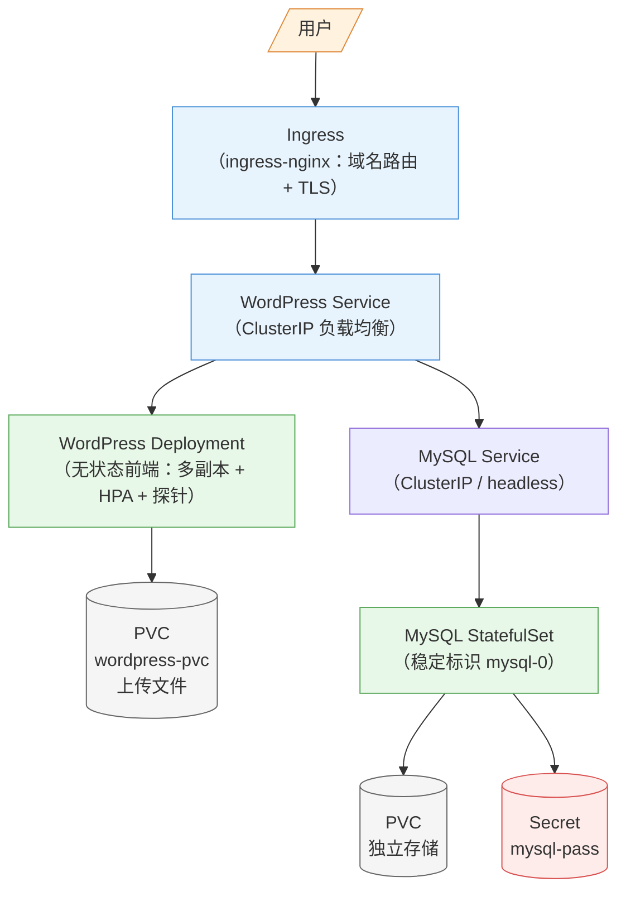

# 第 18 章 综合实战：应用发布全流程

> 配套实验手册：《Kubernetes 实验手册》（manual/ 目录）**实验 11「综合演练：WordPress 应用发布」**（5 个 Lab）。本章是**全书机制的"总装"**——用一个真实应用（WordPress 站点）把第 4-16 章的核心机制串成完整链路：架构设计 → 逐层落地 → 全面验证 → 规范清理。**看完全书再回来做这一章，是知识到能力的转化点**。

## 学习目标

学完本章，你应该能够：

1. 从需求出发设计一个 Web 应用的集群架构（数据/应用分离原则）
2. 用全书机制逐层落地：Secret/PVC（数据）→ Deployment/探针（应用）→ Service/Ingress（访问）→ HPA（扩展）→ PDB（保护）
3. 说出"为什么前端无状态、数据库有状态"的架构决策依据
4. 执行三层验证（全链路/持久化/扩展）并解释每个验证证明什么
5. 说出多副本共享存储的限制与应对（local-path 的边界认知）
6. 按规范顺序清理整套应用（先入口后数据）

---

## 18.1 从需求到架构

### 18.1.1 需求拆解

> 需求：发布一个 WordPress 博客站——用户通过域名访问、可注册发文、数据不能丢、流量大了能扛。

拆解成四个子问题（每个对应前面某章）：

| 子问题 | 技术决策 | 机制来源 |
|---|---|---|
| 数据放哪？ | MySQL 数据库（独立有状态） | 第 5 章 StatefulSet 思想、第 10 章存储 |
| 密码怎么管？ | Secret 注入（不落 yaml） | 第 8 章 |
| 前端怎么跑？ | WordPress 多副本 Deployment | 第 5 章 |
| 怎么访问？ | Service + Ingress（域名） | 第 9 章 |

### 18.1.2 架构设计：数据与应用分离（核心原则）

<!-- 原 ASCII 图已转为 Mermaid -->


> 读图要点：**一条入口、两条数据线**——所有流量经 Ingress → WordPress Service 分发；前端（WordPress）无状态多副本、数据挂 PVC；数据库（MySQL）有状态 StatefulSet、独立 PVC + Secret 密码——"数据与应用分离"在图中一目了然。

**为什么"前端无状态、数据库有状态"**（第 5 章选型决策树的落地）：

- **前端（WordPress）**：删了重建不影响业务连续性 → 多副本、可滚动更新、可扩展
- **数据库（MySQL）**：数据必须持久、身份必须稳定 → 独立 PVC（第 10 章）、稳定标识
- **分离的好处**：前端随便折腾（扩缩/更新），数据层稳定（不轻易动）

> **架构决策记忆**：**"能无状态就无状态，必须有状态就给它最稳妥的家"**——分离是容器化架构的第一原则。

---

## 18.2 逐层落地（全书机制总装）

### 18.2.1 数据层：MySQL + Secret + PVC（StatefulSet）

```text
① Secret：mysql-pass（密码只存 Secret，yaml 零明文）→ 第 8 章
② PVC 模板：volumeClaimTemplates（每个副本独立 PVC，数据落节点）→ 第 10 章
③ StatefulSet：mysql 单副本 + env 从 Secret 注入 + 稳定标识（mysql-0）→ 第 5 章
④ Service：mysql ClusterIP（headless，应用用服务名连接，不关心 Pod IP）→ 第 9 章
```

> **为什么数据库用 StatefulSet（而非 Deployment）**：即使单副本，也必须有**稳定的身份与存储绑定**——StatefulSet 提供：① 稳定命名 `mysql-0`（重建后不变）；② `mysql-0` 自动创建独立 PVC（数据与 Pod 绑定）；③ 有序启动（先 0 后 1...）。**用 Deployment 跑数据库是典型的反模式**（Pod 名随机、存储不绑定），会培养错误的心智模型。教学实验 11 使用 Deployment 仅为演示简化（yaml 少一层），**标准答案：有状态应用必须 StatefulSet**（第 5 章选型决策树）。

> 注意数据库的"单副本"决策：数据库不适合随意多副本（写冲突）——教学环境单点，生产用主从（第 14 章 HA 思想）。

### 18.2.2 应用层：WordPress + Deployment + PVC

```text
① PVC：wordpress-pvc（存主题/上传文件——用户数据的持久化）
② Deployment：多副本 + env（WORDPRESS_DB_HOST=mysql 服务名）→ 第 8 章
③ readinessProbe：就绪才接流量（滚动更新/Service 的前提）→ 第 4 章
```

> 上传的图片/主题属于"应用数据"——挂在 PVC 上（第 10 章"持久化"的意义：删 Pod 数据还在，实验 11 Lab 5 验证）。

### 18.2.3 访问层：Service + Ingress

```text
① Service：wordpress ClusterIP（内部负载均衡）→ 第 9 章 §9.2
② Ingress：wp.example.com → wordpress Service（域名路由）→ 第 9 章 §9.4
③ 访问验证：curl -H "Host: wp.example.com" 节点IP:NodePort
```

### 18.2.4 扩展层：HPA + 多副本（存储限制的认知）

```text
① scale 到多副本（同一节点可共存）→ 第 5 章
② HPA：CPU 超过目标自动扩缩 → 第 7 章
```

> ⚠️ **local-path 的边界在此显现**（第 10 章 §10.5.1）：wordpress-pvc 是节点本地存储——**多副本跨节点时 PVC 无法同时挂载**（RWO + 单节点）。所以教学环境的"多副本"堆在同一节点，**生产多副本共享存储必须用 NFS/云盘**——这个限制就是第 10 章选型知识的实战体现。

### 18.2.5 保护层：探针 / 优雅终止 / PDB（生产加配）

生产版还应有（本课程实验为教学简化版）：

- readinessProbe（已配）+ livenessProbe（防死锁）→ 第 4 章
- preStop 排空（发布不丢请求）→ 第 4 章
- PDB（min-available=1，节点维护有保护）→ 第 6 章
- ResourceQuota/LimitRange（命名空间治理）→ 第 7 章

> **"能跑"与"生产可用"的差距就在保护层**——教学演练跑通链路后，对照保护层清单逐项补配。

---

## 18.3 验证体系：怎么证明"能用了"

三个验证对应三层承诺：

### 18.3.1 全链路验证（证明"链路通了"）

```bash
curl -H "Host: wp.example.com" http://节点IP:NodePort/wp-admin/install.php
→ 返回 WordPress 安装页（<title>WordPress › Installation</title>）
→ 证明：Ingress 路由 ✓ → Service 转发 ✓ → Pod 运行 ✓ → MySQL 连通 ✓
```

> 注意：WordPress 首次访问返回 **302 重定向**到安装页（实验 11 实测）——验证用 `-L` 跟随或直接访问安装页路径。

### 18.3.2 持久化验证（证明"数据不丢"）

```text
① 写入标识：echo persistence-ok > /var/www/html/persist.txt（PVC 里）
② 删除全部 WordPress Pod（模拟故障/重建）
③ 新 Pod 读取：cat /var/www/html/persist.txt → persistence-ok
→ 证明：PVC 持久化生效（第 10 章"删 Pod 数据还在"）
```

### 18.3.3 扩展验证（证明"能扛流量"）

```text
① kubectl scale deployment wordpress --replicas=5 → Pod 变 5
② HPA 观察：kubectl get hpa（CPU 超目标自动扩）
→ 证明：弹性机制就绪（第 5/7 章）
```

> 三个验证分别回答：**通不通、丢不丢、够不够**——发布任何应用都按这个框架验证。

---

## 18.4 清理规范（先入口后数据）

**清理顺序的原则：先停流量、再删应用、最后删数据**（第 10 章"PVC 删除 = 数据删除"）：

```text
① 入口：删 Ingress、删 HPA（先停流量与伸缩）
② 应用：删 Deployment、删 Service（工作负载消失）
③ 数据：删 PVC（确认数据不要了才删！local-path 回收即删除）
④ 凭据：删 Secret；最后删命名空间（连带清空残留）
```

> **提醒**：PVC 删除 = 数据物理删除（local-path Delete 回收）——**确认不要数据再删**；想保留就留着 PVC。

## 18.5 展望：CRD 与 Operator 模式（集群扩展机制）

> 前 17 章用的是 Kubernetes **内置资源**（Pod/Deployment/Service...）。生产中还常见"会自我管理"的扩展资源（如 cert-manager 自动签发证书、Prometheus Operator 管理监控）——它们的底座就是本章讲的 **CRD + Operator**。

### 18.5.1 CRD：自定义资源定义

**CRD（CustomResourceDefinition）** 让 Kubernetes 认识"你自己的资源类型"——把业务对象变成一等公民：

```text
你定义：kind: Certificate（一个 CRD）
   → kubectl apply -f certificate.yaml 就能创建 Certificate 对象
   → kubectl get certificates 能查看
   → 但注意：CRD 只是"数据表"——对象创建了，**谁来处理它？**
```

### 18.5.2 Operator：CRD + 控制器

**Operator** 是"会处理自定义资源的控制器"（第 5 章控制循环模式的复用）：

```text
CRD 定义资源长什么样（数据层）
   +
控制器（Operator）监听这些资源（行为层）
   = 让 Kubernetes "懂"某个应用的运维逻辑

cert-manager 实例：
  你声明 Certificate（域名 + 签发方）→ cert-manager 控制器自动：
     申请证书 → 校验域名 → 签发 → 写入 tls Secret → 到期自动续期
  （第 9 章 Ingress TLS 的证书从此"自动化"）
```

### 18.5.3 典型 Operator 生态（概念）

| Operator | 管理什么 |
|---|---|
| cert-manager | 证书自动签发与续期 |
| Prometheus Operator | Prometheus/Grafana 实例的生命周期 |
| 云厂商 Operator | 云资源（数据库/负载均衡）即代码 |
| 数据库 Operator | MySQL/PostgreSQL 集群（主从/备份） |

> **决策逻辑**：资源是"标准 K8s 对象"→ 用 Helm 装（第 17 章）；需要"应用自身运维逻辑"→ 找/写 Operator（CRD + 控制器）。**Helm 解决"怎么装"，Operator 解决"装完怎么自我管理"**——两者是现代 Kubernetes 应用交付的两大支柱。

> 实操：`kubectl get crd` 看集群里已有哪些 CRD（calico 等组件自带）。

## 18.6 实验演练指引

本章机制对应实验 **11「综合演练：WordPress 应用发布」**（5 个 Lab）：

- **Lab 1 MySQL 数据库**：Secret + PVC + Service——数据层落地（§18.2.1）
- **Lab 2 发布 WordPress**：Deployment + env + PVC + readinessProbe——应用层（§18.2.2）
- **Lab 3 水平扩展**：多副本 + HPA——扩展层（§18.2.4）
- **Lab 4 Ingress 域名发布**：wp.example.com 路由 + 全链路验证（§18.2.3/18.3.1）
- **Lab 5 数据持久化验证 + 清理**：删 Pod 数据仍在 + 按序清理（§18.3.2/18.4）

> 教学建议：这一章是"毕业设计"——**不看书能独立完成 5 个 Lab 并解释每个配置为什么，才算真正掌握全书**。完成后再对照 §18.2.5 保护层清单补配（PDB/配额）做生产化练习。

---

## 本章小结

- **架构设计**：需求拆解（数据/前端/访问/扩展）→ **数据与应用分离**（无状态多副本 + 有状态独立）
- **逐层落地**：Secret/PVC（数据）→ Deployment/探针（应用）→ Service/Ingress（访问）→ HPA（扩展）→ PDB/配额（保护）——**每一层都是前面某章机制的"总装"**
- **local-path 边界**：多副本共享 PVC 受限（RWO/单节点）——生产用 NFS/云盘（第 10 章选型知识实战）
- **三层验证**：全链路（通不通）/持久化（丢不丢）/扩展（够不够）
- **清理规范**：先入口 → 再应用 → 后数据（PVC 删除 = 数据删除）
- **生产化差距**：保护层（liveness/preStop/PDB/配额）是"能跑"与"生产可用"的差距

**衔接**：第 19 章 CKA 考试指南——把全书知识转化为考试能力（考点速查、时间策略、模拟演练）。

## 思考题

1. 为什么 WordPress 前端可以多副本，MySQL 却保持单副本？（数据与应用分离原则）
2. 本演练中"多副本"实际堆在同一节点——为什么？生产怎么解决？
3. 验证"持久化"时，为什么要删除全部 Pod 再读？（而不是读正在运行的 Pod）
4. 清理时为什么"先删 Ingress/HPA 再删 Deployment"？（提示：流量与伸缩）
5. 如果你要发布一个"有上传文件、多副本、要扛流量"的站点，存储方案怎么选（对比 local-path/NFS/云盘）？
6. 这个演练里哪些配置属于"保护层"（生产必配但教学简化）？补全后的完整清单是什么？

> **CKA 考点标注**（综合运用，全部 5 域）：
> - 本章是**全书机制的综合演练**：每步配置都对应一个 CKA 考点（Secret 注入/RBAC、PVC/StorageClass、Service/Ingress、HPA、探针/优雅终止、PDB）
> - 备考建议：本章 Lab 能"不看实验手册独立完成" = 域 1-5 的实操能力达标
> - 综合场景题（如"发布带数据库的站点"）在 CKA 中常以多题组合形式出现——本章的架构决策思维直接复用
