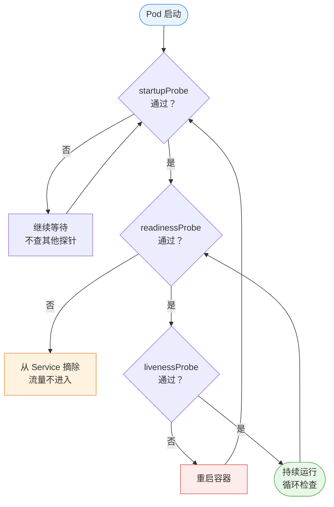
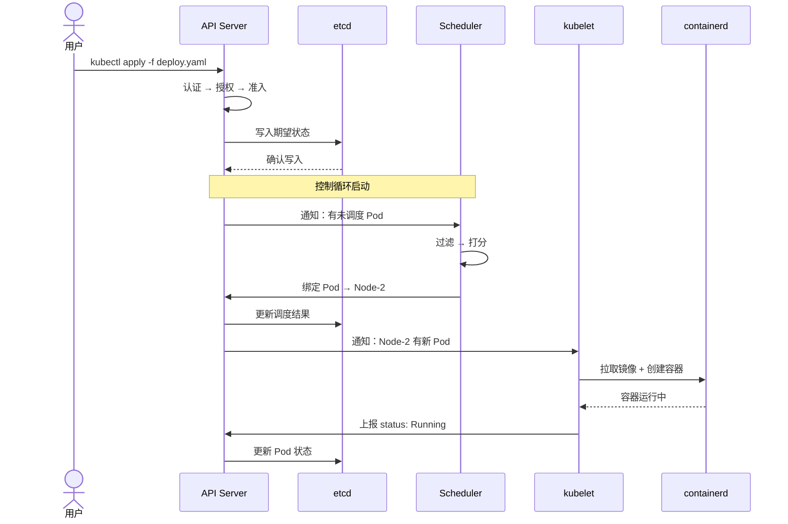
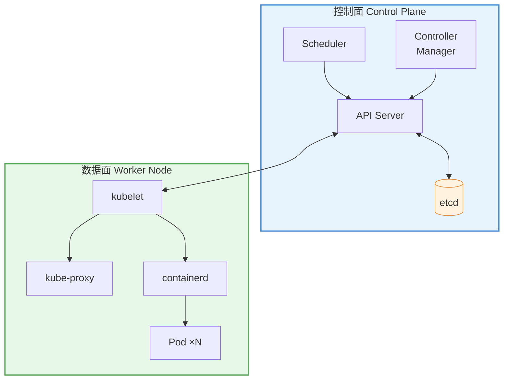
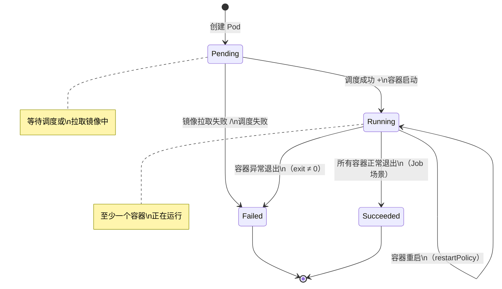
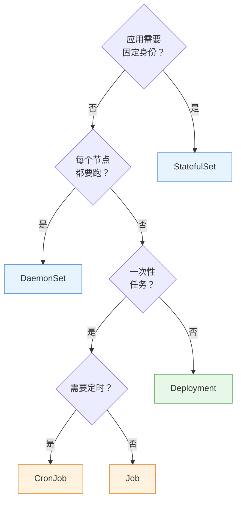
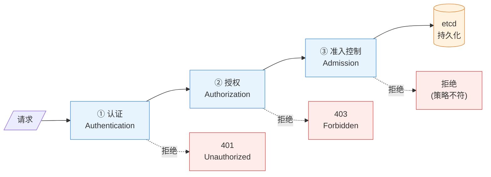

# 📊 教材图表 Mermaid 化规范

> **适用范围**：《Kubernetes 核心知识》教材全部 19 章  
> **目标**：在保持专业教材沉稳感的前提下，用 Mermaid 提升关键图表的可读性和可维护性  
> **原则**：**不是所有图都要改**——只改"值得改"的，保留"改了反而差"的

---

## 一、分类规则：哪些必须转、哪些保留、哪些可选

### ✅ 必须转为 Mermaid（~30 处）

| 图表类型 | 判定条件 | 理由 |
|---------|---------|------|
| **多步骤流程图** | 包含 3 个以上步骤 + 分支/判断 | ASCII 的 `──►` 箭头在分支时极难对齐，Mermaid `flowchart` 天生处理分支 |
| **组件通信/时序图** | 涉及 2 个以上组件的交互过程 | ASCII 画序列图需要手动对齐竖线，极难维护；Mermaid `sequenceDiagram` 自动排版 |
| **架构拓扑图** | 展示组件层级关系（如控制面/数据面） | 方框+连线是 Mermaid 最擅长的领域 |
| **状态流转图** | Pod 生命周期、证书状态等 | `stateDiagram-v2` 专为此设计 |

### ❌ 必须保留 ASCII（不转）

| 图表类型 | 判定条件 | 理由 |
|---------|---------|------|
| **简单层级树** | 纯缩进 `├──` `└──` 树形结构，无连线交叉 | ASCII 树比 Mermaid 更紧凑直观，转了反而臃肿 |
| **单列线性步骤** | 无分支的 `① → ② → ③` | 一行文字+箭头已经足够清晰 |
| **命令行输出模拟** | 模拟 `kubectl` 输出的等宽文本 | 这是代码块，不是图表 |
| **极简对照** | 两三行的 A vs B 对比 | 用表格即可 |

### 🔶 可选转换（编写组自行判断）

| 图表类型 | 建议 |
|---------|------|
| 决策树（判断分支） | 分支 ≤3 个用 ASCII 更紧凑；分支 >3 个建议 Mermaid |
| 包含框图的概念关系 | 如果当前 ASCII 版已经清晰美观，可保留 |

---

## 二、视觉风格规范——"沉稳专业，不花哨"

### 2.1 配色体系

> **核心原则**：使用低饱和度的蓝灰色系，避免荧光色、彩虹色。教材不是 PPT，配色要克制。

```
主色调（节点背景）:
  · 控制面组件:  #E8F4FD（浅蓝）边框 #4A90D9（蓝）
  · 数据面组件:  #E8F8E8（浅绿）边框 #5BA85B（绿）
  · 用户/外部:   #FFF3E0（浅橙）边框 #E08A3C（橙）
  · 危险/告警:   #FDECEA（浅红）边框 #D94F4F（红）
  · 中性/默认:   #F5F5F5（浅灰）边框 #666666（灰）

连线:
  · 正常流:  默认灰色实线
  · 关键路径: 加粗实线
  · 可选/降级: 虚线
```

### 2.2 节点形状约定

| 含义 | Mermaid 语法 | 形状 | 使用场景 |
|------|-------------|------|---------|
| 普通步骤/组件 | `A["API Server"]` | 方角矩形 | 组件、服务 |
| 判断/决策 | `B{"是否就绪？"}` | 菱形 | 流程分支 |
| 起止点 | `C(["开始"])` | 圆角矩形 | 流程的起点和终点 |
| 数据存储 | `D[("etcd")]` | 圆柱体 | 数据库、存储 |
| 外部实体 | `E[/"用户"/]` | 平行四边形 | 外部请求方 |

### 2.3 通用排版规则

```markdown
1. 方向统一：
   · 流程图默认 TD（从上到下）或 LR（从左到右）
   · 时序图无需指定方向
   · 同一章内的同类图方向一致

2. 节点 ID 命名：
   · 使用有意义的英文缩写（不用 A/B/C）
   · 如：api["API Server"]、sched["Scheduler"]、kubelet["kubelet"]

3. 中文标签必须用引号包裹：
   · ✅ api["API Server 认证"]
   · ❌ api[API Server 认证]  ← 空格会导致解析失败

4. 子图（subgraph）用于分组：
   · 控制面组件放一个 subgraph
   · 数据面组件放一个 subgraph
   · subgraph 标题用中文

5. 每个 Mermaid 图后必须保留 1-2 行文字说明：
   · 图是辅助理解的，不能让图"自己说话"
   · 文字说明要点：图中的关键路径、容易忽略的细节
```

---

## 三、六种图表类型模板

> 以下模板均取材自教材真实内容，编写组可直接参考改写。

### 模板 1：流程图（flowchart）— 用于多步骤带分支的流程

**适用**：探针决策流程、Pod 创建流程、滚动更新流程、节点维护流程等

````markdown

````

**对应原图**：ch04 §4.4.2 探针协作流程（当前为 ASCII `┌─ startupProbe 成功？──否──►`）

---

### 模板 2：时序图（sequenceDiagram）— 用于组件交互过程

**适用**：`kubectl apply` 全流程、Pod 创建接力、认证三阶段等

````markdown

````

**对应原图**：ch02 §2.6.3 `kubectl apply` 的组件协作全流程（当前为纯文字描述）

---

### 模板 3：架构图（flowchart + subgraph）— 用于组件拓扑

**适用**：控制面/数据面架构、多 master HA 拓扑、网络四层模型等

````markdown

````

**对应原图**：ch02 §2.4/§2.5 控制面与数据面组件关系（当前为分散的文字+ASCII 树）

---

### 模板 4：状态图（stateDiagram-v2）— 用于生命周期/状态流转

**适用**：Pod 生命周期、PV 回收状态、容器状态流转等

````markdown

````

**对应原图**：ch04 Pod 阶段流转（当前为文字描述）

---

### 模板 5：决策树（flowchart）— 用于复杂选型判断

**适用**：控制器选型、存储选型、CNI 选型、Service 类型选型等（分支 ≥4 个时使用）

````markdown

````

**对应原图**：ch05 §5.1.3 / §5.6 控制器选择决策树

---

### 模板 6：层级图（flowchart LR）— 用于安全纵深/准入链路

**适用**：认证→授权→准入三阶段、安全加固纵深防御层等

````markdown

````

**对应原图**：ch11 §11.1 API Server 的三道门

---

## 四、全书必须转换的图表清单

> 按章节列出约 30 处**必须**转为 Mermaid 的图表。编写组可逐个对照上方模板改写。

| 章节 | 位置 | 当前内容 | 目标 Mermaid 类型 |
|------|------|---------|:----------------:|
| ch02 | §2.2 六概念关系图 | ASCII 方框+连线 | `flowchart TD` + subgraph |
| ch02 | §2.3.3 控制循环 | 缩进树+箭头 | `flowchart TD` |
| ch02 | §2.3.4 Deployment 保证 3 副本 | 竖向箭头流 | `sequenceDiagram` |
| ch02 | §2.5.1 CRI 调用链 | ASCII 树 | `flowchart LR` |
| ch02 | §2.6.1-2.6.3 组件通信旅程 | 纯文字步骤 | `sequenceDiagram` ×3 |
| ch03 | §3.5 kubeadm init 七步 | 编号列表 | `flowchart TD` |
| ch04 | §4.4.2 探针协作流程 | ASCII `┌─` 判断 | `flowchart TD`（见模板 1）|
| ch04 | §4.4.4 优雅终止时间线 | 文字箭头 | `sequenceDiagram` |
| ch05 | §5.1.3/§5.6 控制器选型 | 文字决策树 | `flowchart TD`（见模板 5）|
| ch05 | §5.2.3 滚动更新过程 | 文字步骤 | `flowchart LR` |
| ch06 | §6.1.2 调度两阶段 | 文字箭头 | `flowchart LR` |
| ch07 | §7.2.2 HPA 指标链路 | ASCII 方框 | `flowchart LR` |
| ch07 | §7.4 三层治理防线 | ASCII 方框 | `flowchart TD` + subgraph |
| ch08 | §8.2.4 挂载方式决策 | 文字分支 | `flowchart TD` |
| ch09 | §9.2.2 kube-proxy 流量路径 | 文字箭头 | `flowchart LR` |
| ch09 | §9.6 网络排障路线图 | 文字步骤 | `flowchart TD` |
| ch10 | §10.5.2 存储选型决策树 | 文字分支 | `flowchart TD` |
| ch11 | §11.1 三道门模型 | 文字步骤 | `flowchart LR`（见模板 6）|
| ch12 | §12.1 准入控制链 | 文字箭头 | `flowchart LR` |
| ch13 | §13.1/§13.5 安全纵深防御 | 文字层级 | `flowchart TD` + subgraph |
| ch13 | §13.5 审计日志四阶段 | 文字列表 | `flowchart LR` |
| ch14 | §14.2.1 节点维护流程 | 文字步骤 | `flowchart LR` |
| ch14 | §14.3 集群升级流程 | 文字步骤 | `flowchart TD` |
| ch14 | §14.5.2 多 master HA 拓扑 | ASCII 方框 | `flowchart TB`（见模板 3）|
| ch15 | §15.1 可观测性三支柱 | 文字描述 | `flowchart TD` + subgraph |
| ch15 | §15.2.1 监控架构 | 文字描述 | `flowchart LR` |
| ch16 | §16.1 分层排障框架 | 文字层级 | `flowchart TD` |
| ch17 | §17.2.2 Helm 架构 | 文字描述 | `flowchart LR` |
| ch17 | §17.4.2 多环境发布流程 | 文字步骤 | `flowchart LR` |
| ch18 | §18.1 WordPress 架构 | 文字描述 | `flowchart TD` + subgraph |

---

## 五、禁止事项

| ❌ 禁止 | 说明 |
|---------|------|
| 花哨主题 | 不使用 `%%{init: {'theme': 'forest'}}%%` 等非默认主题，用 `style` 精确控制 |
| 彩虹配色 | 一张图最多 3 种底色（主色+辅色+强调色），不允许每个节点一个颜色 |
| 过长标签 | 节点文字不超过 15 个汉字，超出的拆成多行（用 `\n` 换行） |
| 巨型单图 | 一张图不超过 15 个节点；超出的拆成多张子图 |
| 无文字说明 | 每张 Mermaid 图后**必须**有 1-2 行文字点明关键路径 |
| 纯英文标签 | 节点标签使用中文（技术专有名词保持英文，如 `API Server`、`etcd`） |
| 嵌套 subgraph | 最多两层 subgraph，不允许三层及以上嵌套 |

---

## 六、常见 Mermaid 语法陷阱

| 陷阱 | 表现 | 解决方案 |
|------|------|---------|
| 中文含括号导致解析失败 | `A[认证（Auth）]` 报错 | 改为 `A["认证（Auth）"]`，加引号 |
| 节点 ID 含中文 | `认证 --> 授权` 可能报错 | 使用英文 ID：`auth["认证"] --> authz["授权"]` |
| 箭头标签含特殊字符 | `A -->|"是 > 否"| B` 报错 | 避免使用 `>` `<` `{` `}` 等字符 |
| subgraph 标题含引号 | `subgraph "控制面"` 某些版本报错 | 改为 `subgraph CP["控制面"]` |
| 代码块内嵌套反引号 | Markdown 渲染冲突 | 外层用 4 个反引号 `````，内层用 3 个 ``` |

---

## 七、执行建议

1. **分批执行**：按章节顺序，每次改 3-5 张图，改完自查渲染效果
2. **渲染验证**：每张图必须在 [Mermaid Live Editor](https://mermaid.live) 中验证通过后再提交
3. **保留原图注释**：在 Mermaid 代码块上方保留一行 HTML 注释 `<!-- 原 ASCII 图已转为 Mermaid -->`，方便追溯
4. **先改高价值章节**：优先处理 ch02（架构）、ch04（探针/终止）、ch05（控制器选型）、ch14（HA/升级），这四章的图表改善效果最显著
