# Kubernetes 容器云原生实战课程 · 教材合集

> 本合集由教材 19 章整合而成，用于分发与离线阅读。完整课程包（含实验手册、课件、大纲）见课程仓库。

> 基线版本：Kubernetes v1.36 · containerd 2.2 · Ubuntu 24.04 · 3 节点真实集群实测

## 目录

1. 第 1 章 容器与云原生基础
2. 第 2 章 Kubernetes 概述与架构
3. 第 3 章 集群安装与配置
4. 第 4 章 Pod 与容器
5. 第 5 章 工作负载控制器
6. 第 6 章 调度器与调度策略
7. 第 7 章 自动扩缩与资源治理
8. 第 8 章 配置管理：ConfigMap 与 Secret
9. 第 9 章 服务、负载均衡与网络
10. 第 10 章 存储
11. 第 11 章 认证与授权
12. 第 12 章 准入控制与容器安全
13. 第 13 章 集群安全加固
14. 第 14 章 集群日常管理与维护
15. 第 15 章 可观测性：监控、日志与事件
16. 第 16 章 故障排查与可靠性
17. 第 17 章 Helm 与 Kustomize（应用打包与部署）
18. 第 18 章 综合实战：应用发布全流程
19. 第 19 章 CKA 考试指南

---

# 第 1 章 容器与云原生基础

> 配套实验手册：本课程所有动手实验见《Kubernetes 实验手册》（manual/ 目录）。本章为基础铺垫，无强制实验；若需温故容器操作，可自行用 Docker 快速体验（见 1.2 节命令）。

## 学习目标

学完本章，你应该能够：

1. 解释容器的核心技术原理（命名空间隔离、cgroups 资源限制、镜像分层）
2. 说出 Docker 的镜像/容器/仓库三要素及常用操作
3. 分析容器化应用在**单机**场景下的痛点，理解"为什么需要编排器"
4. 说明云原生（Cloud Native）的定义与 CNCF 生态定位
5. 对比 Kubernetes / Docker Swarm / Mesos，说出 Kubernetes 胜出的核心理由

---

## 1.1 容器技术原理

### 1.1.1 从虚拟机到容器

| 维度 | 虚拟机（VM） | 容器 |
|---|---|---|
| 隔离级别 | 硬件级（Hypervisor 虚拟整机） | 操作系统级（内核共享） |
| 每个实例 | 完整 Guest OS（GB 级） | 仅应用 + 依赖（MB 级） |
| 启动时间 | 分钟级 | 秒级（进程级启动） |
| 密度 | 低（每台机几十个） | 高（每台机成百上千） |
| 性能 | 有虚拟化开销 | 接近原生 |

> **为什么容器更快更轻**：容器**共享宿主机内核**，不虚拟硬件和操作系统——它只是宿主上的**一组受约束的进程**。隔离和限制通过 Linux 内核的两个机制实现。

### 1.1.2 命名空间（Namespaces）：隔离"看得见"

命名空间让容器里的进程"以为"自己独占系统资源。每个容器创建时，内核为它建立独立的命名空间视图：

| 命名空间 | 隔离内容 | 容器里看到 |
|---|---|---|
| PID | 进程编号 | 自己是 PID 1，看不到宿主机其他进程 |
| Mount | 文件系统挂载点 | 只看到自己的根文件系统 |
| Network | 网络栈（网卡/IP/路由） | 自己的 IP 和端口 |
| UTS | 主机名 | 自己的 hostname |
| IPC | 进程间通信 | 独立的信号量/消息队列 |
| User | 用户 ID | 独立的 UID 映射（容器内 root ≠ 宿主机 root） |

### 1.1.3 cgroups：限制"能用多少"

cgroups（Control Groups）限制容器**能消耗多少资源**：

- `cpu`：CPU 份额与配额（如最多用 0.5 核）
- `memory`：内存上限（超限触发 OOM Killer）
- `cpuset`：绑定特定 CPU 核
- `blkio`：磁盘 IO 带宽

> **教学记忆**：**命名空间管"看不见"（隔离），cgroups 管"用多少"（限制）**——两者结合，容器既安全隔离又可被资源管控。

### 1.1.4 镜像分层（Layer）

镜像不是一个大文件，而是**只读层的堆叠**：

```text
┌─────────────────────┐
│  应用层（App）        │  ← 可写层（容器运行时在此写）
├─────────────────────┤
│  RUN 指令层          │
├─────────────────────┤
│  apt 安装层          │
├─────────────────────┤
│  基础镜像层（OS）     │
└─────────────────────┘
```

- 每层只存**与上一层的差异**（增量）
- 多个容器共享相同底层 → **磁盘占用小、启动快**
- 容器运行时的写入发生在**最上层可写层**——删除容器即可写层消失（这就是"容器无状态"的底层原因，第 4 章讲持久化）

### 1.1.5 OCI 标准：让"容器"不绑死某一家

**OCI（Open Container Initiative）** 是容器格式与运行时的**开放标准**（2015 年由 Docker 等发起，现由 Linux 基金会托管），由两个规范组成：

- **Image Spec（镜像规范）**：镜像的打包格式（分层/配置/manifest）——**任何符合规范的镜像，任何符合规范的运行时都能跑**
- **Runtime Spec（运行时规范）**：容器运行时的行为（进程/命名空间/cgroups 配置、生命周期钩子）

**为什么重要（本书的伏笔）**：

- Docker 构建的镜像（符合 OCI Image Spec）→ **containerd（符合 OCI Runtime Spec）直接运行**——第 3 章"K8s 用 containerd 替换 Docker"之所以无缝，正是因为**大家都遵守 OCI**
- 生态不绑死：镜像可以来自 Docker/Podman/Buildah，运行时可以是 containerd/CRI-O——**标准是生态互通的基石**

> **核心认知**：**OCI 是"容器界的 USB 接口"**——第 1 章学的镜像分层、第 3 章装的 containerd，都在 OCI 的框架内工作。Docker 只是"最流行的 OCI 实现之一"。

---

## 1.2 Docker 快速回顾（镜像 / 容器 / 仓库）

> 本课程不要求精通 Docker，但 K8s 使用 OCI 兼容的容器运行时（containerd），理解 Docker 的三要素有助于后续章节。

### 1.2.1 三大概念

| 概念 | 类比 | 说明 |
|---|---|---|
| 镜像（Image） | 安装包/模板 | 只读的打包产物，包含应用 + 依赖 + 配置 |
| 容器（Container） | 运行中的进程 | 镜像的运行实例，有独立命名空间与 cgroups |
| 仓库（Registry） | 应用商店 | 存放和分发镜像（Docker Hub / 私有仓库） |

### 1.2.2 常用命令速查

```bash
docker build -t myapp:v1 .        # 构建镜像
docker images                     # 查看本地镜像
docker pull nginx:latest          # 拉取镜像
docker run -d -p 8080:80 nginx    # 运行容器（后台、端口映射）
docker ps                         # 查看运行中容器
docker exec -it <容器> /bin/bash  # 进入容器
docker logs <容器>                # 查看日志
docker rm -f <容器>               # 删除容器
docker rmi <镜像>                 # 删除镜像
```

> **与 Kubernetes 的衔接**：K8s 用 containerd（兼容 OCI 镜像）替代 Docker 守护进程作为运行时，但**镜像的构建、仓库、分层机制完全一致**——实验 01 安装时配置的镜像加速就是针对 Docker Hub 的镜像分发。

---

## 1.3 容器化的价值与挑战

### 1.3.1 价值

- **可移植性**：构建一次，处处运行（开发/测试/生产一致）
- **资源效率**：高密度、秒级启动，弹性伸缩的基础
- **一致性**：环境差异消失（"在我机器上是好的"不再成立）
- **快速交付**：镜像即部署产物，CI/CD 流水线化

### 1.3.2 单机场景的挑战（编排器的需求来源）

用 Docker 跑**一个**容器很简单，但跑**一组**容器做生产时：

| 挑战 | 具体问题 |
|---|---|
| 单点故障 | 容器崩了谁重启？机器挂了谁迁移？ |
| 扩缩容 | 流量大了手动 `docker run` 复制十份？流量降了呢？ |
| 服务发现 | 容器 IP 每次重启都变，前端怎么找到后端？ |
| 负载均衡 | 多个副本之间流量怎么分发？ |
| 健康检查 | 容器"活着"不代表"能用"，谁来探测？ |
| 存储 | 容器删了数据没了，数据库怎么办？ |
| 配置与密钥 | 几十个容器的环境变量/密码怎么统一管理？ |

> **结论**：单机 Docker 解决"如何跑一个容器"，**编排器解决"如何运维一群容器"**——这正是 Kubernetes 的定位（第 2 章）。

---

## 1.4 云原生与 CNCF

### 1.4.1 云原生的定义

CNCF（Cloud Native Computing Foundation）对云原生的定义：

> 云原生技术使组织能够在**现代动态环境**（如公有云、私有云、混合云）中构建和运行可扩展的应用程序。容器、服务网格、微服务、不可变基础设施和声明式 API 是这一方法的典型特征。

核心要素：

- **容器化**：应用打包为容器（可移植、隔离）
- **微服务**：单体拆分为可独立部署的服务
- **动态编排**：Kubernetes 自动调度、扩缩、自愈
- **DevOps**：开发与运维一体化，CI/CD 自动化
- **声明式**：描述"期望状态"，系统自行达到（第 2 章核心概念）

### 1.4.2 CNCF 项目全景（与本课程相关）

| 层次 | 代表项目 | 本课程对应 |
|---|---|---|
| 编排 | **Kubernetes** | 全书 |
| 容器运行时 | containerd / CRI-O | 第 1、3 章 |
| 网络 | Calico / Cilium / Flannel | 第 9 章（实验手册（实验 07）） |
| 存储 | Rook / Longhorn | 第 10 章（实验手册（实验 08）） |
| 可观测性 | Prometheus / Grafana | 第 15 章 |
| 服务网格 | Istio / Linkerd | 进阶（本课程略） |

---

## 1.5 容器编排器对比：为什么是 Kubernetes

| 能力 | Docker Swarm | Apache Mesos | **Kubernetes** |
|---|---|---|---|
| 定位 | Docker 原生集群 | 数据中心级资源调度 | 容器编排事实标准 |
| 成熟度 | 简单但功能有限 | 复杂、运维门槛高 | 生态最完整 |
| 服务发现/负载均衡 | 内建（简单） | 需额外组件 | Service + Ingress（第 9 章） |
| 自愈/扩缩容 | 有限 | 有限 | Deployment/HPA（第 5、7 章） |
| 存储/网络插件 | 少 | 少 | 丰富的 CSI/CNI 生态 |
| 社区与生态 | 停滞 | 停滞 | **CNCF 最大项目，事实标准** |

**Kubernetes 胜出的核心理由**：

1. **声明式 API + 控制循环**：用户描述"期望状态"，控制器持续调和——设计优雅，可扩展
2. **可扩展性**：CRD、Operator、CNI/CSI 插件机制，生态爆炸式增长
3. **云厂商背书**：AWS/Azure/GCP/阿里云全部提供托管 K8s（EKS/AKS/GKE/ACK）
4. **CKA 认证体系**：人才市场认可（本课程目标）

---

## 实验演练指引

本章为基础铺垫，**无强制实验**。若希望热身，可在任意 Linux 机器上：

```bash
# 体验容器三要素（需已装 Docker/containerd）
docker run -d --name demo -p 8080:80 nginx
docker exec -it demo bash        # 进入容器：ps 看 PID 1、hostname 看隔离
docker rm -f demo                # 删除容器：进程消失，镜像还在
```

> 目的：直观感受"容器 = 隔离的进程"（PID 1、独立 hostname），为第 2 章"Pod 是 K8s 的最小调度单元"建立直觉。**不熟悉 Docker 不影响后续学习**，遇到镜像操作照抄实验手册命令即可。

## 本章小结

- 容器 = **命名空间（隔离）+ cgroups（限制）** 的受控进程，比虚拟机轻量得多
- 镜像 = **只读分层** + 可写层（容器运行时），共享底层省空间、启动快
- 单机 Docker 的六大痛点（故障/扩缩/发现/均衡/健康/存储）→ **编排器的需求来源**
- 云原生 = 容器 + 微服务 + 动态编排 + DevOps + 声明式
- Kubernetes 凭**声明式 API + 生态 + 云厂商背书**成为容器编排事实标准

**衔接**：第 2 章将进入 Kubernetes 本身——它的架构、组件与"声明式 API + 控制循环"的核心设计。

## 思考题

1. 容器与虚拟机共享内核，那容器内执行 `reboot` 会发生什么？为什么？
2. 为什么说"容器没有持久化"？镜像分层中哪一层解释了这一点？
3. 单机 Docker 的痛点中，你认为哪一个对生产影响最大？Kubernetes 用什么机制解决它（可以提前翻第 2/5 章找答案）？
4. 云原生的"声明式"与传统"命令式"运维的区别是什么？举一个生活中的例子。

> **CKA 考点标注**：本章为前置基础，**无直接 CKA 考点**；但容器原理是理解后续所有章节（尤其第 3 章运行时、第 4 章 Pod）的前提，考试中的排障题常要求理解容器生命周期。


---


# 第 2 章 Kubernetes 概述与架构

> 配套实验手册：《Kubernetes 实验手册》（manual/ 目录）。**本章把核心概念与架构机制讲透**——这是整门课的知识起点；动手实验（创建、配置、排障）安排在第 3 章起的各章及实验手册中，但**重要概念会在后续反复出现、逐步加深**，本章奠定完整图景。本章 2.9 节提供 Killercoda 在线沙盒演练，让概念先落地为直观印象。

## 学习目标

学完本章，你应该能够：

1. 用一段话说明 Kubernetes 是什么、解决什么、核心承诺是什么
2. 完整解释 6 个核心概念（集群/节点、Pod、工作负载、Service、命名空间、标签选择器）——不是"听说过"，而是能讲清原理
3. 深刻理解**命令式 vs 声明式**两种操作方式的本质区别与各自适用场景
4. 解释**控制循环**：期望状态与当前状态如何被持续调和（自愈与弹性的根源）
5. 详细讲解控制面四组件（apiserver/etcd/scheduler/controller-manager）各自**做什么、怎么做、为什么**
6. 详细讲解数据面三组件（kubelet/kube-proxy/容器运行时）各自职责与工作机制
7. 说清组件间**通信的全流程**（一次请求的旅程、TLS 安全、端口）
8. 完整理解对象模型：Group/Version/Kind 与 metadata/spec/status 每部分的含义
9. 熟练 kubectl 高频命令与 kubeconfig 上下文切换
10. 在 Killercoda 沙盒完成集群观察、Pod 创建、自愈验证、Service 与扩缩容演练

---

## 2.1 Kubernetes 是什么

### 2.1.1 定义与来历

**Kubernetes（K8s）** 是一个开源的**容器编排平台**——自动化容器的**部署、扩缩容、调度、网络、存储与自愈**。

- 名字：希腊语"舵手 / 领航员"；"K8s"是 K + 中间 8 个字母 + s 的缩写（kubernetes）
- 出身：由 Google 发起，源自其内部使用了十几年的集群管理系统 **Borg**（K8s 常被称为"开源版 Borg"）
- 2015 年捐赠给 **CNCF**（云原生计算基金会），现为 **CNCF 毕业项目**（Graduated，2018 年 3 月首个毕业项目）——同为 CNCF 毕业项目的还有 Prometheus（2018）、containerd（2019）等
- 当前事实标准：AWS(EKS)、Azure(AKS)、GCP(GKE)、阿里云(ACK)、华为云(CCE) 全部提供托管 Kubernetes

### 2.1.2 它解决什么（承接第 1 章痛点）

第 1 章讲过：Docker 擅长"跑一个容器"，但**运维一群容器**时有一堆问题。Kubernetes 针对每个痛点给出了机制：

| 单机容器痛点 | Kubernetes 的机制 | 本章/后续位置 |
|---|---|---|
| 容器崩了、机器挂了没人管 | **自愈**：控制器自动重建、节点故障驱逐 | §2.3 控制循环、第 5 章 |
| 流量波动需要扩缩容 | **弹性**：手动 scale + 自动 HPA | §2.9 演练、第 7 章 |
| 容器 IP 每次重启都变 | **Service**：稳定虚拟 IP + DNS 名 | §2.2.4、第 9 章 |
| 多副本流量如何分发 | **负载均衡**：Service + kube-proxy | §2.5.2、第 9 章 |
| "进程活着"不等于"服务可用" | **探针**：readiness/liveness 健康检查 | 第 4 章 |
| 容器删除数据丢失 | **持久化**：PV/PVC、StorageClass | 第 10 章 |
| 配置和密码散落在各处 | **ConfigMap / Secret** | 第 8 章 |
| 多个环境、多团队资源混用 | **命名空间 + 配额** | §2.2.5、第 7 章 |

### 2.1.3 核心承诺（设计宣言）

- **声明式，而非命令式**：你描述"最终要什么"，Kubernetes 负责"如何达成并持续维持"
- **自愈**：系统永不停止地把自己调和到期望状态——崩溃、驱逐、扩容都自动处理
- **可移植**：同样的集群和应用可以跑在裸机、虚拟机、任意公有云上
- **可扩展**：通过 CRD（自定义资源）、Operator、CNI/CSI 插件机制无限演进——K8s 不只是编排器，更是一个"可编程的平台底座"

---

## 2.2 六个核心概念详解

> 本节的每个概念都会**讲清原理**（不满足于一句话定义）；"怎么创建、怎么配"的实操在第 3 章起的各章，但概念本身现在就要完整建立。

### 2.2.1 集群与节点

**集群（Cluster）** 是一组机器的集合，Kubernetes 在这组机器上调度容器，对外呈现为一个整体。

**节点（Node）** 是集群中的一台机器（物理机或虚拟机）。按角色分两类：

- **控制面节点（Control Plane / 旧称 master）**：运行集群的**管理组件**（§2.4），相当于"大脑"。默认不运行业务容器（有污点保护，第 6 章讲污点）。生产环境通常部署 2-3 个控制面节点做高可用。
- **工作节点（Worker Node）**：运行**业务容器**的机器，数量按需扩展。

每个节点上都有固定的三件套：**kubelet**（节点代理）、**kube-proxy**（网络转发）、**容器运行时**（如 containerd）。节点通过 kubelet 定期向控制面上报心跳，控制面据此判断节点是否健康（`Ready`/`Ready`）。

> 判断集群规模：`kubectl get nodes` 显示所有节点及状态；这是排障的第一步（第 16 章）。

### 2.2.2 Pod：最小调度单元

**Pod 是 Kubernetes 调度的最小单位**——不是容器。理解这一点是全书基础。

**Pod 的组成**：一个 Pod 包含**一个或多个容器**，这些容器被 Kubernetes 打包在一起，共享：

- **同一个网络命名空间**：共享一个 IP（Pod IP）和端口空间——容器间用 `localhost` 通信
- **同一个 UTS 命名空间**：共享主机名
- **共享存储卷**：Pod 级卷可以被内部所有容器挂载
- **同一个生命周期**：一起创建、一起销毁（Pod 是"逻辑主机"）

**为什么需要 Pod**：有些应用需要"多个进程紧密协作、同生共死"（如主应用 + 日志采集 sidecar、Web + 代理）。把它们放在一个 Pod 里，共享网络和存储，比两个独立容器更容易管理。

**Pod IP**：每个 Pod 获得一个集群内唯一的 IP（本课程约定网段 `10.244.x.x`，由 CNI 网络插件分配，第 9 章）。**注意 Pod IP 是临时的**——Pod 重建 IP 就变，这是 Service 存在的原因。

**Pod 的生命周期**（概览，第 4 章展开）：

```text
Pending（已创建未调度）→ Running（容器运行中）→ Succeeded/Failed（正常/异常退出）
                                        └→ 被删除（Terminating）
```

**无状态 vs 有状态**：Pod 本身"无状态"（删了数据即失，第 1 章镜像分层已解释）；需要持久数据时挂卷（第 10 章）。

> **核心认知**：以后看到"调度、扩缩、自愈"都发生在 **Pod 级别**——控制器管理的是"多少个 Pod 处于期望状态"。

### 2.2.3 工作负载控制器（Workload Controllers）

控制器（Controller）是"管理 Pod 的 Pod"。你几乎从不直接创建裸 Pod，而是声明"我要这种 Pod、要 N 个、怎么更新"，由控制器负责维持。

**Deployment**（最常用）——管理**无状态多副本**应用：

- 通过 **ReplicaSet** 维护固定数量的副本（`replicas: 3` = 始终 3 个）
- 支持**滚动更新**与**回滚**（更新镜像版本时逐批替换，不中断服务）
- 支持**扩缩容**（`kubectl scale`、HPA 自动扩）
- 自愈：副本崩溃自动重建（§2.3 实例）

**StatefulSet**——管理**有状态、有序**应用（数据库等）：

- 每个 Pod 有**稳定且有序**的标识（`web-0`、`web-0`、`web-0`）
- 稳定的网络标识（DNS 名）与稳定的存储绑定（每个 Pod 独立 PVC）
- 部署/缩容**按顺序**进行（先 0 后 1...）

**DaemonSet**——保证**每个节点恰好运行一个**副本：

- 典型用途：网络插件（calico-node）、监控采集器（node-exporter）、日志采集（filebeat）
- 新节点加入集群，DaemonSet 自动在新节点上创建副本

**Job**——保证**一次性任务成功完成**：

- 跑一次（如数据迁移、批处理），成功（`Completed`）即结束
- `backoffLimit` 控制失败重试次数

**CronJob**——按 **cron 表达式定时**触发 Job：

- 如每天凌晨备份：`schedule: "0 2 * * *"`

> 选择口诀：**无状态用 Deployment、有状态用 StatefulSet、每节点守护用 DaemonSet、一次性用 Job、定时用 CronJob**。各控制器的完整实验在实验手册（实验 03）。

### 2.2.4 Service：稳定入口

**问题**：Pod IP 是临时的（重建即变），且多副本时"该访问哪个 IP"？

**Service 的答案**：提供一个**稳定的虚拟 IP（ClusterIP）+ DNS 名**，自动把流量负载均衡到后端 Pod。

**工作方式**：

1. 你创建 Service，声明 `selector`（选哪些 Pod 作为后端，按标签匹配，§2.2.6）
2. Kubernetes 为 Service 分配一个**稳定的虚拟 IP**（ClusterIP，如 `10.96.x.x`）——**这个 IP 不会变**
3. kube-proxy（§2.5.2）在每个节点上写入转发规则：发往 ClusterIP 的流量 → 随机分发到后端 Pod
4. 集群 DNS（coredns）把 Service 名解析为 ClusterIP——**应用用名字访问，不关心 Pod IP**

**Service 的类型**（第 9 章完整实验）：

| 类型 | 作用域 | 说明 |
|---|---|---|
| ClusterIP（默认） | 集群内 | 只允许集群内部访问，默认类型 |
| NodePort | 集群外 | 在每个节点上开一个端口（30000-32767），外部通过 `节点IP:端口` 访问 |
| LoadBalancer | 集群外 | 云厂商负载均衡器（依赖云环境） |
| ExternalName | 外部 | 把 Service 名映射为集群外域名（DNS CNAME） |
| headless（`clusterIP: None`） | 集群内 | 不要虚拟 IP，DNS 直接返回所有后端 Pod IP |

> **核心认知**：Pod 会死会变，**Service 是稳定的**——所以应用之间、外部访问都通过 Service，而不是直接连 Pod。

### 2.2.5 命名空间（Namespace）

**命名空间**把集群**逻辑隔离**成多个虚拟集群：

- **资源隔离**：Pod/Service/Deployment 等资源名在命名空间内唯一（同名不同命名空间互不冲突）
- **权限隔离**：RBAC 可以按命名空间授权（第 11 章）
- **配额隔离**：每个命名空间可设资源配额（第 7 章 ResourceQuota）
- **场景**：dev/test/prod 各一个命名空间，或每个团队一个

**内置命名空间**：

| 命名空间 | 用途 |
|---|---|
| `default` | 默认；没指定时资源都放这里 |
| `kube-system` | **系统组件**（apiserver/etcd/coredns 等，§2.4/2.5 的组件都在这里） |
| `kube-public` | 公开信息（集群内所有用户可读） |

> 操作：`kubectl get ns` 查看；`kubectl get ns` 指定命名空间；`kubectl get ns` 表示所有命名空间。

**注意**：命名空间隔离的是"名字"与"权限"，**不隔离网络**（跨命名空间的 Pod 默认可以互通；要隔离用 NetworkPolicy，第 9 章）。

### 2.2.6 标签与选择器（Label & Selector）

**标签（Label）** 是附加在对象上的**键值对**，如：

```text
app=web    env=prod    tier=frontend    version=v1.2
```

**标签的用途**：Kubernetes 的"关联机制"全靠标签——控制器选 Pod、Service 选后端、调度选节点（第 6 章），全部通过标签匹配。

**选择器（Selector）** 按标签筛选对象，两种写法：

- 等值：`kubectl get pods -l app=web`（=、!=）
- 集合：`kubectl get pods -l 'app in (web,api)'`（in/notin/exists）

**Selector 在 yaml 中的样子**（Deployment 用它管自己的 Pod，Service 用它选后端）：

```yaml
# Deployment 里：selector 匹配它管理的 Pod 模板标签
selector:
  matchLabels:
    app: web
```

```yaml
# Service 里：selector 决定哪些 Pod 是后端
selector:
  app: web
```

**标签 vs 注解（Annotation）**：

- **标签**：结构化键值对，**可被选择器选中**（用于关联/筛选）
- **注解**：任意键值对（可含长文本），**不能被选择器选中**（只做元数据说明，如版本说明、负责人）

> 记忆：**标签是"身份证号"（能被查），注解是"备注栏"（只能看）**。

### 2.2.7 六个核心概念关系图

<!-- 原 ASCII 图已转为 Mermaid -->
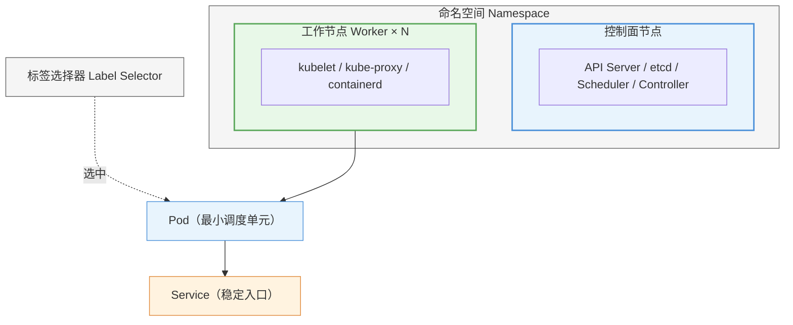

> 读图要点：**命名空间是逻辑边界**（包含控制面与工作节点上的所有资源）；Pod 运行在工作节点上，是调度的最小单元；Service 为 Pod 提供稳定入口；标签选择器把控制器/Service 与 Pod 关联起来——六概念的三个关系（包含、运行、关联）一图看清。

---

### 2.2.8 设计指南：企业级命名与标签规范

> 小团队随性命名没问题；**多人/多团队协作时，没有规范的命名与标签，集群就是"命名空间垃圾场"**——本小节给出可直接落地的生产基线。

**Kubernetes 官方推荐标签**（所有工作负载建议携带，Helm/监控/成本分析工具都识别它们）：

```yaml
metadata:
  labels:
    app.kubernetes.io/name: order-service      # 应用名
    app.kubernetes.io/version: "1.2.3"         # 版本号
    app.kubernetes.io/component: api           # 组件角色（api/worker/ui）
    app.kubernetes.io/part-of: e-commerce      # 所属系统
    app.kubernetes.io/managed-by: helm         # 管理工具
  annotations:
    team: trade-team                           # 负责团队（告警路由）
    oncall: zhangsan@example.com               # 值班联系人
    cost-center: "BU-001"                      # 成本中心（计费）
```

**命名空间命名规范**：

```text
格式：{团队/业务域}-{环境}
示例：order-dev / order-prod / infra-monitoring / shared-middleware
禁止：纯数字/无意义缩写、超过 63 字符（K8s 限制）、下划线（DNS 不兼容）
```

**对象命名规范**：

| 对象 | 格式 | 示例 |
|---|---|---|
| Deployment | `{app}-{component}` | `{app}-{component}`、`{app}-{component}` |
| Service | `{app}-{component}-svc` | `{app}-{component}-svc` |
| ConfigMap | `{app}-{用途}-config` | `{app}-{用途}-config` |
| Secret | `{app}-{用途}-secret` | `{app}-{用途}-secret` |
| Ingress | `{app}-{component}-ingress` | `{app}-{component}-ingress` |
| PVC | `{app}-{component}-data` | `{app}-{component}-data` |

> 决策逻辑：**命名是给"人"看的（可检索）、标签是给"机器"用的（可筛选）**——命名统一便于运维沟通与故障定位，标签齐全让监控/成本/权限工具自动工作。

---

## 2.3 命令式 vs 声明式，与控制循环 ⭐

> 这是全书最重要的两个设计思想。**先讲透"两种操作方式"，再讲"系统如何维持状态"**——理解它们，就理解了 Kubernetes 与"传统运维脚本"的根本区别。

### 2.3.1 命令式 vs 声明式：两种操作哲学

**命令式（Imperative）**——"告诉我**怎么做**"

- 你一步步下达具体指令，系统**只执行，不记忆**
- 例（传统方式）：`docker run nginx`、`docker run nginx`、`docker run nginx`
- 特点：直接、快速、适合临时操作；但**不记录意图**——下次还要重新敲一遍

**声明式（Declarative）**——"告诉我**要什么**"

- 你提交一份**期望状态**的描述（YAML），系统自己决定怎么做、并**持续维持**
- 例：`kubectl apply -f web.yaml`（yaml 里写着"3 个副本、镜像 nginx:1.27"）
- 特点：意图明确、可版本化（yaml 即代码）、可重复、**系统持续保证状态**（自愈）

**三种具体操作模式**（kubectl 层面）：

| 模式 | 方式 | 特点 | 例子 |
|---|---|---|---|
| 命令式命令 | `kubectl run/scale/delete` | 最快，但无状态记录 | `kubectl run/scale/delete` |
| 命令式对象 | `kubectl create/replace -f file.yaml` | 把 yaml 当"一次性指令"，覆盖执行 | `kubectl create/replace -f file.yaml` |
| **声明式对象** | `kubectl apply -f file.yaml` | **推荐**：以文件为唯一事实来源，可重复应用 | `kubectl apply -f file.yaml` |

**为什么生产用声明式（apply）**：

1. **意图即代码**：yaml 文件就是"配置即代码"，进 Git 版本管理、可 review、可回滚
2. **幂等**：同一份 yaml 反复 `apply` 结果一致——这是 CI/CD 的基础
3. **可自愈**：系统记住这份期望状态，任何偏离都被自动修复（下面控制循环）
4. **对比 `create` vs `create`**：`create` 在资源已存在时报错（只能建一次）；`create` 幂等更新（可反复执行）——所以**生产标准是 `create`**

> **一句话**：命令式是"手把手教系统做"，声明式是"给系统一张目标图，让它自己达成并守住"。

### 2.3.2 期望状态与当前状态

- **期望状态（Desired State）**：你在 YAML 的 `spec` 里声明的目标——"要 3 个副本、镜像 nginx:1.27"
- **当前状态（Current State）**：集群里实际发生的情况——"现在只有 2 个副本"、或"有个 Pod 崩溃了"

Kubernetes 把期望状态**持久化在 etcd 里**（§2.4.2），然后**永不停止地**把当前状态向期望状态调和。

### 2.3.3 控制循环（Control Loop）：自愈与弹性的根源

每个控制器（Controller）内部都在执行同一个无限循环：

<!-- 原 ASCII 图已转为 Mermaid -->
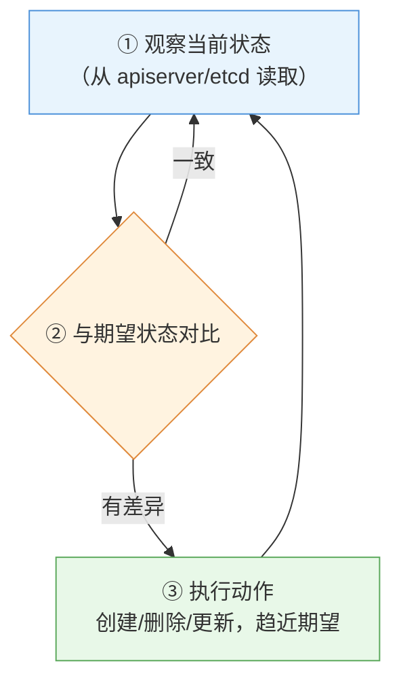

> 读图要点：**循环永不停止**——"一致"不是终点而是回到观察；"有差异"才执行动作。这就是自愈（删了补）与弹性（改期望即扩缩）的共同引擎。

**控制器的内部组成**（以 Deployment 控制器为例）：

- **Informer / Reflector**：监听 apiserver，收到"对象变化"事件（如 Pod 被删）
- **WorkQueue**：把待处理的对象放入队列
- **Worker**：取出对象，对比期望（spec）与当前（status），执行调和动作
- 调和后更新 status（如"当前副本数 3/3"）

> 所有控制器（deployment、replicaset、daemonset、job、namespace...）都是这个模式——**理解了控制循环，就理解了整个系统的自愈机制**。

### 2.3.4 实例走查：Deployment 如何保证"3 个副本"

<!-- 原 ASCII 图已转为 Mermaid -->
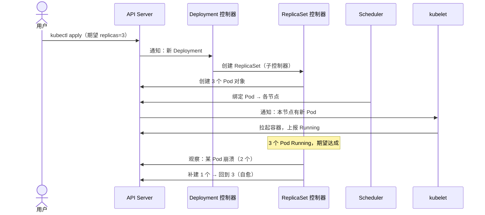

> 读图要点：**职责分层**（Deployment 管 RS → RS 管数量 → Scheduler 管落点 → kubelet 管运行）与**一切通过 apiserver**（没有组件直连）；"自愈"就是 RS 观察到副本数偏离后补建。

**要点**：

- **职责分层**：Deployment 管 ReplicaSet → ReplicaSet 管 Pod 数量 → scheduler 管落点 → kubelet 管运行
- **一切通过 apiserver**：控制器不直接碰 Pod，只读写 apiserver 的对象（§2.6）
- **弹性的来源**：`kubectl scale` 或 HPA 只是**修改了期望状态**（replicas 3→5），剩下的调和由控制器自动完成

---

## 2.4 控制面组件详解

> 控制面是集群的"大脑"。四个组件**各司其职、只与 apiserver 通信**（§2.6 展开通信机制）。本节逐个讲清"做什么、怎么做、为什么"。

### 2.4.1 kube-apiserver：集群的唯一入口

**地位**：整个集群的**大门**——所有请求（kubectl、各组件、Pod 内服务、控制台）都先到这里。设计原则是"**所有组件不直接互访，只通过 apiserver 交互**"（星型拓扑），这让认证、授权、审计集中在一点。

**一次请求在 apiserver 内部的完整流程**（这是理解 apiserver 的关键）：

```text
客户端请求（kubectl / 组件 / Pod）
   │
   ▼
① 认证 Authentication：你是谁？
   - 校验客户端证书（X.509）/ Token / 用户名密码
   - 通过 → 得到身份（user + group）
   │
   ▼
② 授权 Authorization：你能干什么？
   - 基于身份的 RBAC 检查（第 11 章）
   - 如"user 能否 get pods in namespace default"
   │
   ▼
③ 准入控制 Admission：请求合法吗？
   - 一组插件按顺序检查/修改请求（如 LimitRange 校验资源、PSA 检查 Pod 安全）
   - 可拒绝（Forbidden/validation 错误）——第 12 章
   │
   ▼
④ 持久化：写入 etcd（§2.4.2）
   │
   ▼
⑤ 返回结果 + 通知关注者（Watch 机制）
```

**apiserver 的另外两个关键能力**：

- **Watch（监听）机制**：各控制器通过 apiserver 的 Watch API **订阅**资源变化（"Pod 被删了"），这是控制循环的"眼睛"（§2.3.3）
- **API 发现**：`kubectl api-resources`、`kubectl api-resources` 都来自 apiserver 的发现接口

**为什么它是唯一入口**：集中管控 = 一处认证授权、一处审计、一处限流。即使 etcd 挂了，apiserver 的缓存也能让"读"暂时可用——所以排障时"apiserver 起不来 = 集群完全不可用"。

### 2.4.2 etcd：集群的状态存储

**地位**：集群的"数据库"——**所有对象的期望状态与当前状态都存这里**（Pod、Service、ConfigMap、Secret 的完整定义）。**丢了 etcd = 丢了整个集群**（第 3 章专门讲备份，CKA 必考）。

**存储内容**（键值对，按路径组织）：

```text
/registry/pods/default/nginx
/registry/deployments/default/web
/registry/secrets/default/mysql-pass
...
```

**技术要点**：

- **分布式一致性**：基于 **Raft 共识算法**——多节点 etcd（生产通常 3 个）之间通过投票保证数据一致；**需要奇数个节点**（3/5/7），因为 Raft 要求多数派（2/3、3/5）才能提交
- 数据**落盘**在 etcd 数据目录；Secret 等敏感数据**默认明文存储**（可配静态加密，实验手册（实验 09） Lab 9 实操）
- 客户端端口 **2379**（apiserver 用它读写），节点间通信端口 **2380**（仅 etcd 集群内部）
- **注意**：etcd 只存**集群状态**，不存应用数据（应用数据在 PV 里，第 10 章）

**为什么单独一个组件存状态**：控制面组件（scheduler/controller）**无状态**——它们可以从 etcd 读全量状态、崩溃重启后靠 etcd 恢复。etcd 是"集群的记忆"，其他都是"读记忆的人"。

### 2.4.3 kube-scheduler：调度器

**职责**：决定**新创建的 Pod 落在哪个节点上**。它不运行容器，只做"分配决策"。

**两阶段调度**（这是理解调度的关键）：

```text
新 Pod（Pending）进入调度队列
   │
   ▼
阶段一：过滤（Filtering / Predicates）——排除不合适的节点
   检查项举例：
   - 节点资源够吗？（可用 CPU/内存 ≥ Pod 的 requests，第 7 章）
   - 节点满足 Pod 的 nodeSelector / 亲和要求吗？（第 6 章）
   - 节点污点 Pod 能容忍吗？（第 6 章）
   - 端口冲突吗？磁盘压力？年龄？
   → 得到"候选节点集合"
   │
   ▼
阶段二：打分（Scoring / Priorities）——在候选中选最优
   打分因素举例：
   - 节点剩余资源越均衡分越高（资源均衡）
   - 与已有同应用 Pod 分散开（Pod 反亲和，第 6 章）
   - 亲和偏好（第 6 章）
   → 得分最高者胜出
   │
   ▼
调用 apiserver：把 Pod 绑定（bind）到选中节点 → kubelet 接手
```

**为什么需要专门的调度器**：把"放哪"从"怎么跑"中分离——调度策略可插拔、可自定义（自定义调度器）、可预测。

> 排障关联：Pod 一直 `Pending`，十有八九是调度阶段失败——用 `Pending` 看 Events 的 `Pending` 原因（第 16 章）。

### 2.4.4 kube-controller-manager：控制器集合

**职责**：运行**集群内置的各类控制器**，每个控制器负责调和一类资源（都是 §2.3 控制循环的实例）。

**内置控制器举例**（不止这些）：

| 控制器 | 盯什么 |
|---|---|
| Deployment 控制器 | Deployment 的副本/更新状态 |
| ReplicaSet 控制器 | 副本数量（创建/删除 Pod） |
| DaemonSet 控制器 | 每节点一个副本 |
| Job 控制器 | 一次性任务完成 |
| CronJob 控制器 | 定时触发 |
| Namespace 控制器 | 命名空间删除（先清空内容） |
| Service 控制器 | Service/Endpoints 更新 |
| Node 控制器 | 节点健康、驱逐（Node Lifecycle） |
| 各类 GC 控制器 | 垃圾回收（删除级联等） |

**为什么合并成一个进程（controller-manager）**：每个控制器逻辑上独立，但打包成一个二进制方便部署与升级（kubeadm 安装时只需管一个 Pod）。

> 排障关联：你想"删个 Pod 它又回来了"——不是魔法，是某个控制器在调和（用 `kubectl get <controller类型>` 看谁在管）。

### 2.4.5 cloud-controller-manager（云环境）

**职责**：对接**云厂商 API**（AWS/Azure/GCP/阿里云等）：

- 云负载均衡器（LoadBalancer Service 的创建/删除）
- 云路由（节点网络）
- 云磁盘（存储集成）

**裸机/教学集群没有它**——本课程 3 节点 kubeadm 集群不含此组件。知道它是"云环境的适配器"即可。

---

## 2.5 数据面组件详解

> 数据面（节点侧）是"执行者"：真正跑容器、转流量、报状态。三个组件缺一不可。

### 2.5.1 kubelet：节点上的"Kubernetes 代理"

**地位**：每个节点上的核心代理——**管理该节点所有 Pod 的生命周期**，并持续向控制面上报节点状态。

**kubelet 做什么**（收到 apiserver 的 Pod 调度指令后）：

```text
apiserver 通知: "Pod X 调度到本节点"
   │
   ▼
① 从 apiserver 读取 Pod 定义（spec）
   │
   ▼
② 通过 CRI（§2.5.3）调用容器运行时：
   - 创建 Pod 沙箱（pause 容器，§2.5.3）
   - 拉取镜像（若本地没有）
   - 创建并启动应用容器
   - 挂载卷、配置网络
   │
   ▼
③ 持续监控：
   - 执行探针（liveness 失败 → 重启容器；readiness 失败 → 摘除流量）
   - 采集容器资源使用（cAdvisor，供 kubectl top / HPA）
   │
   ▼
④ 心跳上报：定期（默认每 10s）向 apiserver 上报节点状态
   - 超过 grace period（默认 40s）无心跳 → 控制面判定节点 NotReady（第 16 章）
```

**关键点**：

- kubelet 是"节点侧唯一与 apiserver 对话的人"（容器运行时只听 kubelet 的）
- **节点 Ready 与否取决于 kubelet 心跳**——排查"节点 NotReady"= 排查 kubelet（第 16 章）
- 静态 Pod（static pod，kubelet 直接从 `/etc/kubernetes/manifests/` 读的 Pod，如 etcd/apiserver 自身）由 kubelet 直接管理，不经调度器（第 3 章安装时能看到）
- 端口 **10250**：apiserver 用 HTTPS 访问它（kubelet 的 API）

### 2.5.2 kube-proxy：Service 的"交通警察"

**职责**：实现 **Service 的负载均衡**——把发往 Service 虚拟 IP 的流量，转发到后端的某个 Pod。

**工作机制**（基于 Linux 内核）：

```text
应用访问 Service: http://10.96.x.x:80（ClusterIP）
   │
   ▼
进入节点内核（iptables 或 IPVS）
   │
   ▼
kube-proxy 提前写好的规则匹配到这个 Service IP
   │
   ▼
按规则随机/轮询选择后端 Pod IP（Endpoints 列表）
   │
   ▼
DNAT 改写目标地址 → 转发到 Pod 容器
```

- **iptables 模式**（默认）：为每个 Service 写 iptables 规则；请求在规则里随机命中一个后端（随机，不是加权轮询）
- **IPVS 模式**：内核级负载均衡，支持更多算法（rr/wrr/lc 等），性能更好、规则更少
- kube-proxy 监听 apiserver 的 Service/Endpoints 变化，**自动更新规则**——所以 Pod 增删时转发规则跟着变

> **性能根因（iptables vs IPVS）**：iptables 是**线性链表（O(n)）**——请求要逐条遍历规则匹配，Service 越多越慢；IPVS 是**哈希表（O(1)）**——直接查表命中。这就是"Service 数量大了，IPVS 明显优于 iptables"的底层原因（第 9 章展开）。

> **核心认知**：kube-proxy 只做"转发"，**不做服务发现**（发现靠 DNS/coredns）；它也不是代理进程——**规则写进内核，流量不经过 kube-proxy 进程**（性能关键）。

### 2.5.3 容器运行时与 CRI

**职责**：真正"跑容器"的引擎——**containerd**（本课程）或 CRI-O。

**CRI（Container Runtime Interface）**：kubelet 与运行时之间的**标准接口**（gRPC）：

<!-- 原 ASCII 图已转为 Mermaid -->
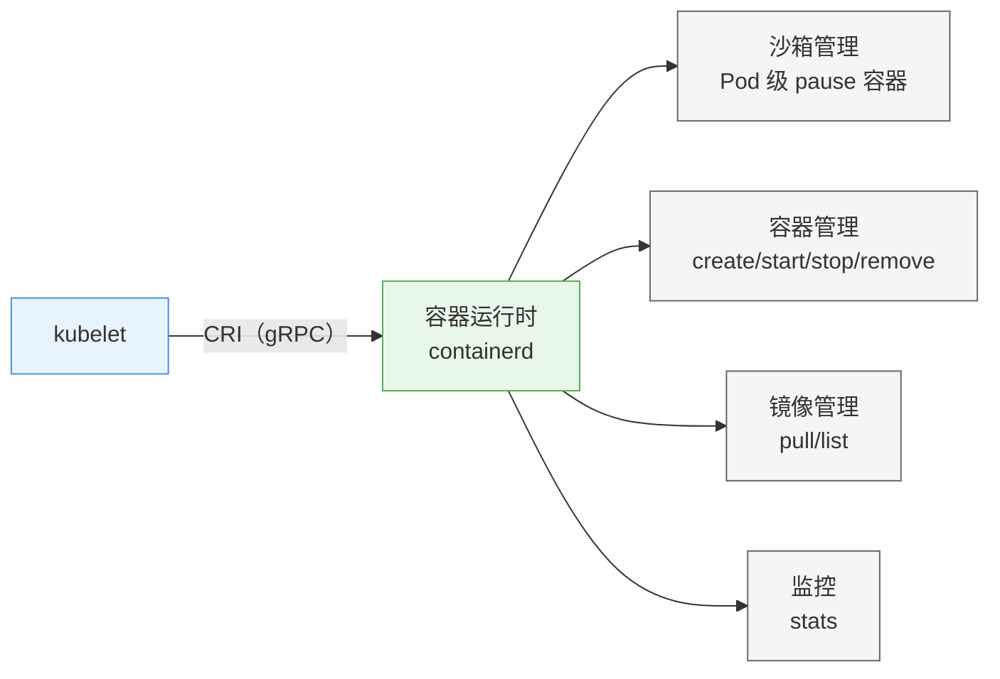

> 读图要点：kubelet 是唯一指挥者，**通过 CRI 标准接口**驱动 containerd 的四类能力——沙箱（Pod 级）、容器、镜像、监控；运行时只听 kubelet 的，这就是"节点侧唯一对话者"的体现。

**pause 容器（沙箱）**：每个 Pod 最先创建的一个"占位容器"（镜像 `pause`）——它持有 Pod 的网络命名空间等共享资源，应用容器"挂靠"进来。**Pod 的 IP 属于 pause 容器**，删 pause = 整个 Pod 消亡。

**OCI 标准**：镜像格式与运行时行为遵循 OCI（Open Container Initiative）标准——所以第 1 章学的 Docker 镜像（也符合 OCI）能被 containerd 直接使用；Docker 与 containerd 的差异主要在"守护进程架构"（Docker 多一层 daemon，containerd 更轻、更贴近 K8s）。

> 第 1 章容器原理（命名空间/cgroups/镜像分层）就是在这里被"执行"的——kubelet 通过 CRI 让 containerd 用这些内核机制跑起容器。

---

## 2.6 组件通信全流程

> 理解"一次操作背后的旅程"，就理解了集群内部如何协作。**所有通信都走 apiserver**（星型拓扑），且**全链路 HTTPS + 双向 TLS 证书**。

### 2.6.1 旅程一：`kubectl get pods` 读请求

<!-- 原 ASCII 图已转为 Mermaid -->
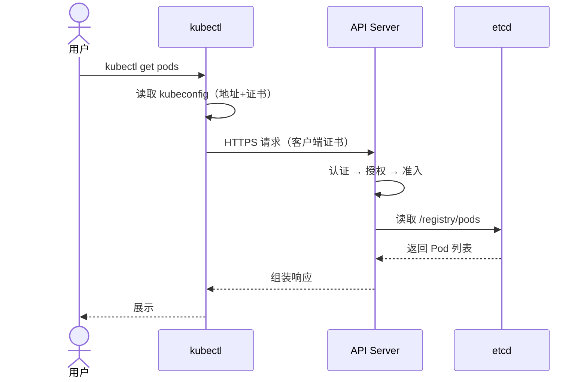

> 读请求短：**kubectl → apiserver → etcd → 回来**。注意 kubectl 通常走 apiserver 缓存（watch 已同步），不每次都打 etcd。

### 2.6.2 旅程二：`kubectl apply -f web.yaml` 创建 Deployment

<!-- 原 ASCII 图已转为 Mermaid -->
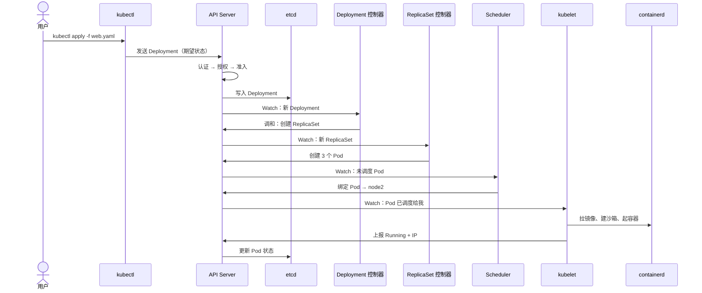

**协作要点**：

- 每一步都是"**写对象 → 通知关注者 → 下一个组件处理**"，全程通过 apiserver 的 Watch 传递
- 没有任何两个组件直连（scheduler 不告诉 kubelet"我调给你了"，而是改 Pod 对象的 `nodeName` 字段，kubelet watch 到才动手）
- **这就是声明式**：每个组件只负责自己那一小段，靠"对象状态"接力

### 2.6.3 通信安全：TLS 双向证书与端口

**双向 TLS（mTLS）**：通信双方都持有证书，互相验证身份。

- 集群有一个 **CA（Certificate Authority）**（第 3 章安装时生成）
- **每个组件有自己的证书**（apiserver、kubelet、etcd 各有证书对），由 CA 签发
- kubectl 连接用 **kubeconfig 里的客户端证书**（`kubernetes-admin`）
- 没有证书的请求在认证阶段（§2.4.1 ①）就被拒绝

**关键端口速查**：

| 组件 | 端口 | 谁连它 |
|---|---|---|
| kube-apiserver | 6443 | 所有组件 + kubectl |
| kubelet | 10250 | apiserver（上报/下发） |
| etcd 客户端 | 2379 | apiserver |
| etcd 节点间 | 2380 | etcd 节点互连 |
| kube-scheduler | 10259 | 健康检查（本地） |
| kube-controller-manager | 10257 | 健康检查（本地） |

> 排障关联："connection refused 到 6443" = apiserver 挂了；"节点 NotReady" 先查 10250（kubelet）——第 16 章。

---

## 2.7 对象模型详解

> "一切皆对象"——理解对象结构就是理解 Kubernetes 的"语法"。

### 2.7.1 Group / Version / Kind：如何定位一个资源

每个 API 对象由三个要素唯一定位：

```yaml
apiVersion: <group>/<version>   # 如 apps/v1、networking.k8s.io/v1、batch/v1
kind: <Kind>                    # 如 Deployment、Service、Pod
```

- **Group（API 组）**：资源的分类。**核心组（core）最特殊**——它没有组名，`apiVersion` 只写版本（`apiVersion`），如 Pod/Service/ConfigMap 都在核心组。其他组：`apiVersion`（Deployment/StatefulSet/DaemonSet）、`apiVersion`（Job/CronJob）、`apiVersion`（Ingress/NetworkPolicy）、`apiVersion`（Role）、`apiVersion`（HPA）...
- **Version（版本）**：`v1`（稳定，生产可用）、`v1`（测试）、`v1`（实验）
- **Kind**：资源类型名（首字母大写驼峰）。**同名 Kind 可能存在于不同组**（如 `apps/v1` 与 `apps/v1` 都有 Job？——不，Job 只在 batch；但 NetworkPolicy 在 networking.k8s.io 和 extensions 都有过历史版本）

**查看方式**：

```bash
kubectl api-resources          # 列出所有资源及其 group/version/短名
kubectl explain pod            # 查看 Pod 对象的字段结构（写 yaml 的字典）
kubectl explain deployment.spec   # 深入查看某字段
```

### 2.7.2 metadata：对象的"身份"

`metadata` 由用户编写，描述对象是谁：

| 字段 | 作用 |
|---|---|
| `name` | 名称（**命名空间内唯一**；必须符合 DNS 命名规范：小写字母/数字/`name`） |
| `namespace` | 所属命名空间（§2.2.5；集群级资源如 Node/PV 无此字段） |
| `labels` | 标签（§2.2.6，可被选择器选中） |
| `annotations` | 注解（非结构化元数据，不能被选择器选中） |
| `uid` | 系统分配的唯一标识（不可变；与 name 不同，name 可删了重建但 uid 不会重复） |
| `resourceVersion` | 对象的版本号（用于并发控制/乐观锁，一般不需要手写） |
| `creationTimestamp` | 创建时间（系统填） |

### 2.7.3 spec 与 status：期望 vs 当前

- **`spec`**：由**用户**编写——描述**期望状态**（要什么）
- **`status`**：由**系统**维护——描述**当前状态**（实际怎样），用户**不写**它

> 记忆：`spec` 是"心愿单"，`spec` 是"体检报告"。控制器对比两者来调和（§2.3）。

```bash
kubectl get pod nginx -o yaml
# 上半部分 spec：你写的期望
# 下半部分 status：系统填的实际（phase、podIP、conditions...）
```

### 2.7.4 完整示例：Deployment 对象逐字段

```yaml
apiVersion: apps/v1                 # 定位：apps 组的 v1 版本
kind: Deployment                    # 类型：Deployment
metadata:                           # 身份
  name: web                         # 名称（default 命名空间内唯一）
  namespace: default                # 命名空间
  labels:                           # 标签（本对象自己的标签）
    app: web
spec:                               # 期望状态（用户写）
  replicas: 3                       # 期望副本数 → 控制循环维护
  selector:                         # 选择器：管哪些 Pod
    matchLabels:
      app: web
  template:                         # Pod 模板：描述"要的 Pod 长什么样"
    metadata:
      labels:
        app: web                    # Pod 的标签（必须匹配上面的 selector）
    spec:
      containers:
      - name: nginx
        image: nginx:1.27           # 镜像
        ports:
        - containerPort: 80
# status 由系统填：availableReplicas、conditions 等
```

> 这四层结构（apiVersion/kind/metadata/spec）是**所有对象**的统一骨架——学会看一个，就会看所有。

---

## 2.8 kubectl 与 kubeconfig

### 2.8.1 kubectl 命令体系

kubectl 是操作 Kubernetes 的唯一命令行工具，统一格式：

```bash
kubectl <动词> <资源类型> [名称] [选项]
```

**高频动词**：

| 动词 | 作用 | 示例 |
|---|---|---|
| `get` | 查看资源列表（`get` 更多列、`get` 完整对象） | `get` |
| `describe` | 查看资源**详细状态 + 事件**（排障首选） | `describe` |
| `apply` | **声明式**创建/更新（幂等） | `apply` |
| `create` | 命令式对象创建（已存在会报错） | `create` |
| `run`/`run` | 命令式命令（快速创建 Pod/Service） | `run` |
| `delete` | 删除 | `delete` |
| `explain` | 查看字段结构（写 yaml 的字典） | `explain` |
| `logs` | 查看容器日志 | `logs` |
| `exec` | 进入容器执行命令（**v1.36 需 `exec` 分隔**） | `exec` |
| `scale` | 扩缩容 | `scale` |
| `label`/`label` | 打标签/注解 | `label` |
| `config` | 管理 kubeconfig/上下文 | `config` |

**常用选项**：`-n <ns>` 指定命名空间、`-n <ns>` 所有命名空间、`-n <ns>` 标签筛选、`-n <ns>` 从文件、`-n <ns>` 持续监听、`-n <ns>` 输出格式。

### 2.8.2 kubeconfig 与上下文

**kubeconfig**（默认 `~/.kube/config`）是 kubectl 的"通讯录 + 身份证"，三段结构：

```yaml
clusters:      # 集群：连哪个 apiserver（地址 + CA 证书）
- cluster:
    server: https://192.168.0.11:6443
    certificate-authority-data: <CA base64>
  name: kubernetes
users:         # 用户：用什么身份（客户端证书 / token）
- name: kubernetes-admin
  user:
    client-certificate-data: <证书 base64>
    client-key-data: <私钥 base64>
contexts:      # 上下文：集群 + 用户 + 命名空间的组合
- context:
    cluster: kubernetes
    user: kubernetes-admin
    namespace: default
  name: kubernetes-admin@kubernetes
current-context: kubernetes-admin@kubernetes   # 当前使用哪个上下文
```

**多集群/多身份切换**（CKA 考试高频操作）：

```bash
kubectl config get-contexts       # 查看所有上下文（* 标记当前）
kubectl config use-context 名字    # 切换
kubectl config current-context    # 看当前
```

> 为什么重要：生产上你可能有"开发集群/生产集群/只读账号/管理员账号"——靠上下文切换，而不是反复改文件。实验手册（实验 09） Lab 1-5 专门演练用户证书 + 上下文。

---

## 2.9 【沙盒演练】Killercoda：零成本接触真实集群

> **设计意图**：装集群要 90 分钟且受网络影响（第 3 章）。**本章先在 Killercoda 免费沙盒"玩"一个现成集群**——把 §2.2-2.8 的概念（组件、Pod、自愈、Service、scale）变成亲手操作的印象。等第 3 章搭好自有集群，一切就都眼熟了。

### 2.9.1 环境准备（5 分钟）

1. 浏览器打开 **https://killercoda.com/playgrounds/scenario/kubernetes**
2. 用 **GitHub 账号**注册登录（无 GitHub 可用国内邮箱，激活邮件可能稍慢）
3. 点击 **Start** 启动——约 1 分钟后右侧出现终端（已预装 kubectl 并连好集群）
4. 场景最长运行 **1 小时**，到期重置；演练约 30 分钟可完成

> 沙盒是**单节点集群**（控制面即唯一节点）。若 `kubectl get nodes` 看到节点带 `kubectl get nodes` 污点导致 Pod 无法调度，先执行：
> `kubectl taint nodes --all node-role.kubernetes.io/control-plane-`

### 2.9.2 演练 1：认识集群与组件（3 分钟）

```bash
kubectl get nodes -o wide          # 节点：NAME/STATUS/ROLES/VERSION
kubectl get pods -A                # 所有命名空间的 Pod
kubectl get pods -n kube-system    # 只看系统组件
```

**观察点**（对照 §2.4/2.5 架构）：
- `kubectl get pods -n kube-system` 里每个 Pod 就是一个组件：`kubectl get pods -n kube-system`、`kubectl get pods -n kube-system`、`kubectl get pods -n kube-system`、`kubectl get pods -n kube-system`（控制面）、`kubectl get pods -n kube-system`（数据面）、`kubectl get pods -n kube-system`（DNS）、`kubectl get pods -n kube-system` 或 `kubectl get pods -n kube-system`（CNI 插件）
- **架构图上的每个方块，在这里都是一个真实运行的 Pod**——这是全章最有"落地感"的一步

### 2.9.3 演练 2：describe 一个组件（5 分钟）

```bash
kubectl describe pod -n kube-system kube-apiserver-<节点名>
```

**观察点**：
- `Containers` 段：apiserver 镜像与**启动参数**（能看到 `Containers` 等——对应 §2.4.1）
- `Events` 段：Pod 创建时间线（Scheduled → Pulled → Created → Started）
- 这就是所有排障都要用的 `describe` 的标准动作

### 2.9.4 演练 3：创建第一个 Pod，看 spec vs status（5 分钟）

```bash
kubectl run nginx --image=nginx:1.27     # 命令式
kubectl get pods -o wide                  # 看 IP、节点
kubectl describe pod nginx
kubectl get pod nginx -o yaml             # 重点：上半 spec（你写的）+ 下半 status（系统填的）
```

**观察点**：
- `READY 1/1`、状态 `READY 1/1`、IP `READY 1/1`、所在节点
- `kubectl get pod nginx -o yaml`：亲眼看到 §2.7.3 的"spec 心愿单 vs status 体检报告"

### 2.9.5 演练 4：体验自愈（5 分钟）⭐

```bash
# 裸 Pod：删了不会重建（没有控制器管它）
kubectl delete pod nginx
kubectl get pods            # nginx 没了

# Deployment 管的 Pod：删了自动重建（有控制器，§2.3 控制循环）
kubectl create deployment web --image=nginx:1.27 --replicas=2
kubectl get pods -o wide    # 2 个副本
kubectl delete pod web-<随机后缀>
kubectl get pods            # 数秒后自动补 1 个（名字后缀变了 = 重建）
```

**观察点**（全书最重要的"哇"时刻）：
- 裸 Pod 删了就没了；**Deployment 的 Pod 删了自动补**——控制循环的自愈
- 新 Pod 名字后缀不同（`web-<新随机串>`）→ 证明是重建的
- 用 `kubectl describe deployment web` 看期望副本数 2/2 的调和

### 2.9.6 演练 5：Service 与扩缩容（5 分钟）

```bash
kubectl expose deployment web --port=80 --target-port=80 --type=ClusterIP --name=web-svc
kubectl get svc              # 看 CLUSTER-IP（10.96.x.x 稳定虚拟 IP）

# 从集群内访问 Service（负载均衡到后端 Pod，返回 nginx 页面）
kubectl run curl-test --image=curlimages/curl -it --rm -- sh -c "curl -s http://web-svc | head -1"

# 扩缩容（改期望状态，控制器自动达成）
kubectl scale deployment web --replicas=5
kubectl get pods             # 2 → 5

# 清理
kubectl delete deployment web
kubectl delete svc web-svc
```

**观察点**：
- Service 的 ClusterIP 稳定不变，Pod IP 却一直在变——§2.2.4 的"稳定入口"
- scale 5 只是**改了期望状态**，Pod 由 ReplicaSet 控制器自动补到 5 个（§2.3.4）

### 2.9.7 演练小结（对照自查）

| 演练 | 印证的概念 | 对应小节 |
|---|---|---|
| 看 kube-system | 组件 = 控制面/数据面 Pod | §2.4、§2.5 |
| describe 组件 | 对象结构、Events、启动参数 | §2.4.1、§2.7 |
| 建 Pod 看 yaml | 命令式、spec vs status | §2.3.1、§2.7.3 |
| 删 Pod 自愈 | 控制循环 | §2.3 |
| Service + scale | 稳定入口、弹性 | §2.2.4、§2.3.4 |

> **衔接实验手册**：这些命令的完整讲解见实验手册（实验 01） 「Kubectl 基础与公共操作」；第 3 章搭好自有集群后，回到实验手册（实验 01） 用同样命令完整过一遍。

---

## 本章小结

- **Kubernetes** = 容器编排平台：声明式、自愈、弹性、可移植、可扩展
- **六概念**：集群/节点（机器）、Pod（最小调度单元）、工作负载（控制器管 Pod）、Service（稳定入口）、命名空间（逻辑隔离）、标签选择器（关联机制）
- **两种操作**：命令式（告诉怎么做，快但不记忆）vs 声明式（告诉要什么，幂等可版本化、支持自愈）——生产标准 `kubectl apply`
- **控制循环**：期望状态（etcd 中）↔ 当前状态（持续观察）持续调和——**自愈与弹性的根源**；控制器内部 = Informer + WorkQueue + Worker
- **控制面**：apiserver（唯一入口：认证→授权→准入→持久化 + Watch）、etcd（状态存储、Raft、奇数节点）、scheduler（过滤+打分）、controller-manager（控制器集合）
- **数据面**：kubelet（管 Pod 生命周期 + 心跳）、kube-proxy（内核规则转发 Service 流量）、containerd（CRI 跑容器）
- **通信**：全组件仅与 apiserver 交互（星型拓扑）+ HTTPS 双向证书；一次创建请求经历"写对象→Watch 通知→下一组件处理"的接力
- **对象模型**：Group/Version/Kind 定位 + metadata（身份）+ spec（期望，用户写）+ status（当前，系统填）
- **kubectl/kubeconfig**：get/describe/apply/explain 高频四命令；上下文切换管理多集群
- **沙盒演练**：Killercoda 完成集群观察、describe、建 Pod、自愈、Service/scale

**衔接**：第 3 章用 kubeadm 从零搭建自己的 3 节点集群——你会"看到"本章每个组件被逐个装起来；第 4 章起深入 Pod 与各类对象的具体配置。

## 思考题

1. 为什么"Pod 是调度的最小单元"而不是容器？Pod 内多个容器共享什么？这带来什么好处（提示：sidecar）？
2. 控制循环中，"观察"靠什么机制（apiserver 的哪个能力）？"调和"由谁执行？
3. 如果 etcd 数据丢失，集群会发生什么？为什么第 3 章要反复强调 etcd 备份？
4. `kubectl create -f` 与 `kubectl create -f` 的根本区别是什么？为什么 CI/CD 必须用 apply？
5. 在 Killercoda 演练 4 中，裸 Pod 删除不重建而 Deployment 的会重建——用控制循环完整解释原因。
6. 一个请求从 kubectl 到容器启动，经过哪 5 个关键组件？每个组件做了什么？
7. kube-proxy 是"代理进程"吗？流量真的经过它吗？（提示：规则写入内核）

> **CKA 考点标注**（对应域 1：集群架构、安装与配置 25%）：
> - **架构必考**：各组件职责、apiserver 唯一入口、etcd 是状态存储、kubelet 心跳决定节点状态、端口（6443/10250/2379）
> - **命令必考**：kubectl get/describe/apply/explain、上下文切换（`kubectl config use-context`）、`kubectl config use-context` 读 spec/status
> - **机制必考**：声明式 vs 命令式（apply vs create/run）、控制循环自愈、Pod 调度流程
> - 本章是全部排障题（域 5，30%）的底层知识——"报错该看哪个组件"都源自这里


---


# 第 3 章 集群安装与配置

> 配套实验手册：《Kubernetes 实验手册》（manual/ 目录）**实验 01 「集群安装」**——本章讲**原理与决策**（为什么这么装、每一步在做什么、多个选项怎么选），**具体命令与操作步骤在实验手册**。第 2 章的每个组件（apiserver/etcd/kubelet...）将在本章讲清"它们是如何被安装、如何协同启动的"。

## 学习目标

学完本章，你应该能够：

1. 对比三种集群安装方式（kubeadm/托管/轻量单机），说出各自定位与选择逻辑，并解释本课程为什么选 kubeadm
2. 说清安装前必须规划的四个方面（形态/版本/网络/环境），每个决策背后的原理
3. 解释"容器运行时为什么是 containerd 而不是 Docker"，以及 CRI-O、Kata 等运行时各自适用场景
4. 完整描述 kubeadm 安装流程的三阶段与每个阶段在做什么（不是背命令，而是理解流程）
5. 解释 `kubeadm init` 每一步的原理：PKI 证书、静态 Pod、wait-control-plane、kubeconfig
6. 解释 worker 加入的 token 机制与 TLS bootstrap 原理
7. 对比主流 CNI 网络插件（Calico/Flannel/Cilium/Weave），说出本课程选 Calico 的理由
8. 知道"为什么必须装 CNI 节点才 Ready"、"为什么 Pod 网段必须与 CNI 一致"
9. 了解国内环境镜像获取的问题本质与变通思路（具体步骤在实验手册）
10. 知道装完集群要验证什么、为什么验证这些

---

## 3.1 安装方式的抉择：为什么是 kubeadm

搭建 Kubernetes 集群有三类主流方式，理解它们的定位差异，才知道教学与生产各自怎么选。

**云托管服务（EKS / AKS / GKE / ACK 等）**

- 云厂商一键创建集群，控制面完全托管（你只管业务）
- 优点：最快、最省心，生产落地主流
- 缺点：控制面是黑盒——**你学不到集群怎么运转**，出了问题只能提工单
- 定位：**生产使用，但不是学习途径**

**轻量单机方案（minikube / kind / k3s）**

- 在一台机器上模拟出集群（minikube 单节点、kind 用容器装节点、k3s 精简版）
- 优点：秒级起集群、资源占用小，适合本地快速体验
- 缺点：与生产多节点形态差异大（没有真正的跨节点调度/网络/存储）
- 定位：**开发调试、临时体验**

**kubeadm（本课程）**

- 官方推荐的**标准安装工具**：一条 `init` 命令生成完整控制面，`init` 命令加入工作节点
- 优点：**可控、可解释、可扩展**（从 3 节点到生产高可用都能用它）；过程透明——装完你对集群组成一清二楚
- 定位：**学习 + 生产两相宜**，且 **CKA 考试直接考察 kubeadm 流程**

> **决策逻辑**：学习阶段必须选"过程可见"的方式——kubeadm 把第 2 章讲的每个组件（etcd、apiserver、kubelet...）**一步步摆到你面前**；托管服务把这些全藏起来，学不到东西。

---

## 3.2 安装前必须想清楚的事

动手前有四个决策，每个都有原理支撑。

### 3.2.1 集群形态与资源

- **单节点**：1 台机器既是控制面又是工作节点——学习入门够用，但看不到跨节点调度与多节点网络
- **标准 3 节点**（本课程）：1 控制面 + 2 工作节点——能完整演练调度、网络、存储、故障转移，是学习的最优形态
- **生产高可用**：3 个控制面 + N 个工作节点——控制面自身也要冗余（多控制面 + 负载均衡，第 14 章）

资源底线：每节点 2 核 / 2GB / 20GB 磁盘（教学建议 4 核 8GB 更从容）。**关键前提：节点间内网互通**——集群的所有协作都建立在节点互访上。

### 3.2.2 版本策略

- 用**当前最新稳定版**（kubeadm 会告知可用版本），本课程基线 v1.36
- **kubelet / kubeadm / kubectl 三件套必须同版本**——它们之间通过版本对齐的协议交互，跨版本会告警甚至失败
- 工作节点与控制面版本一致（官方允许跨一个次版本，但一致最稳）
- 装完后**锁定版本**（apt-mark hold）——防止系统自动升级把集群搞崩

### 3.2.3 网络规划：三个网段不能打架

集群里有三个网络层次，规划时**必须互不重叠**：

| 网段 | 用途 | 本课程取值 | 为什么不能冲突 |
|---|---|---|---|
| 节点网段 | 机器的真实内网 IP | `192.168.0.0/24` | 物理基础 |
| **Pod 网段**（--pod-network-cidr） | 每个 Pod 的 IP | `10.244.0.0/16` | 与节点网段冲突会导致 Pod 与节点 IP 混淆、路由错乱 |
| Service 网段（--service-cidr） | Service 虚拟 IP | `10.96.0.0/12`（默认） | 同样不能与上面两个重叠 |

> **常见错误**：云主机内网常用 `192.168.x.x`，若 Pod 网段也选 `192.168.x.x`，两者重叠——流量会被路由到错误的地方。**选一个明显不同的网段（10.244.x.x）就对了**。

### 3.2.4 环境前置条件（每项的"为什么"）

- **关闭 swap（交换分区）**：kubelet 用 cgroup 精确限制 Pod 内存（limits），swap 会让"内存超限"变得不可控（先写磁盘再慢慢回收）——所以 kubeadm 预检**直接拒绝**开着 swap 的节点
- **内核模块 overlay**：容器镜像分层文件系统（第 1 章）的底层支撑，没有它 containerd 无法工作
- **内核模块 br_netfilter**：让经过网桥的流量也能被 iptables 处理——**CNI 的网络策略（第 9 章）依赖它**
- **ip_forward=1**：节点内核转发——跨节点 Pod 通信、Service 转发的必经之路
- **主机名与 hosts 解析**：kubeadm 用主机名标识节点，节点间必须能互相解析（不然证书请求和注册都会失败）

### 3.2.5 设计指南：集群容量规划与节点选型

> 从"给我一个业务需求"到"设计出一个集群"的规划链路（生产决策，教学环境按需参考）。

**节点规格选型决策树**：

```text
控制面节点（规模按集群节点数）：
  · 小型（<50 节点）：4C/8G/50G SSD
  · 中型（50-200 节点）：8C/16G/100G SSD
  · 大型（200+ 节点）：16C/32G/200G SSD（etcd 独立部署）

Worker 节点（按负载类型）：
  · 通用型：8C/32G（大多数微服务）
  · 计算密集型：16C/32G（CPU 密集）
  · 内存密集型：8C/64G（缓存/JVM 应用）
  · GPU 节点：按 AI/ML 需求独立规划

黄金法则：
  · 宁可多节点小规格，不要少节点大规格（爆炸半径更小）
  · 单节点 Pod 密度 ≤ 110（kubelet 默认上限）
  · 预留 kube-reserved + system-reserved ≈ 节点总资源的 15-20%
```

**CIDR 容量推演**（Pod 网段 vs 节点规模）：

| Pod 网段 | 每节点子网 | 最大节点数 | 最大 Pod 数 |
|----------|-----------|-----------|------------|
| /16 | /24 | 256 | 65,536 |
| /12 | /24 | 4,096 | 1,048,576 |

> 设计要点：Service CIDR 用 /12 通常足够（4096 个 Service）；**Pod CIDR 必须按"节点数 × 每节点最大 Pod 数"反推**——节点多、Pod 密时用 /12 而不是 /16。

**etcd 性能基线**（控制面的命脉）：

- etcd 对磁盘延迟**极度敏感**——生产必须 **SSD**（fsync 延迟 < 10ms，机械盘会导致选举超时、集群不稳定）
- 推荐 IOPS ≥ 3000；`etcdctl endpoint status` 的 **DB SIZE 超 2GB 告警、超 8GB 紧急处理**
- 定期 **compact（压缩）+ defrag（碎片整理）** 纳入运维日历（第 14 章）

**内核调优基线**（生产节点推荐 sysctl）：

```text
fs.inotify.max_user_watches         = 524288    # 大量 ConfigMap 挂载场景
fs.file-max                         = 1048576   # 高并发连接
net.netfilter.nf_conntrack_max      = 1048576   # Service 多时防 conntrack 表满
net.ipv4.tcp_keepalive_time         = 600       # 长连接优化
vm.max_map_count                    = 262144    # ES 等应用需要
```

> 决策逻辑：**先定业务规模（节点数/Pod 密度）→ 反推 CIDR 与节点规格 → 按 etcd 基线选磁盘 → 套内核调优**——容量规划不是"越大越好"，是"匹配业务 + 留余量"。

---

## 3.3 容器运行时：为什么是 containerd，而不是 Docker

### 3.3.1 运行时在集群中的角色

第 2 章讲过：kubelet 通过 **CRI（容器运行时接口）** 指挥"跑容器的引擎"。这个引擎就是**容器运行时**。它必须实现 CRI 接口（gRPC 协议），kubelet 才能驱动它。

### 3.3.2 Docker 与 containerd 的历史纠葛（重要背景）

**早期**：Kubernetes 直接对接 Docker（通过一个叫 dockershim 的适配层）。Docker 当时是事实标准，K8s 必须兼容它。

**问题**：Docker 是"全家桶"架构——守护进程（dockerd）+ 容器引擎（containerd）+ 上层 CLI/网络/存储抽象。对 Kubernetes 来说，**它只需要"跑容器"这一层**（containerd 的能力），Docker 的额外层是冗余，还引入了"守护进程里的守护进程"的稳定性问题。

**转折（v1.24）**：Kubernetes 官方宣布**移除 dockershim**——不再支持直接对接 Docker。因为：

- containerd 本身就是 Docker 的底层引擎，**直接实现了 CRI 接口**（Docker 反而是包了一层壳）
- 少一层抽象 = 少一个故障点 = 更轻、更快、更贴近内核
- containerd 由 CNCF 托管（与 K8s 同基金会），中立、可信

**现状**：containerd 成为 Kubernetes 的**默认/主流运行时**（本课程实测 2.2.x）。**你照样用 Docker 构建镜像**（镜像符合 OCI 标准，第 1 章），只是"跑容器"这步交给 containerd。

### 3.3.3 其他运行时：各有各的场景

| 运行时 | 特点 | 适用场景 |
|---|---|---|
| **containerd**（本课程） | 轻量、标准、CNCF 托管 | **默认选择**，绝大多数场景 |
| **CRI-O** | 专为 Kubernetes 而生，极简（只为 K8s 服务） | 偏爱极简、RedHat 生态（OpenShift 用） |
| **Kata Containers** | 每个容器跑在轻量虚拟机里（硬件级隔离） | **安全敏感场景**：多租户、不可信负载（牺牲性能换隔离） |
| gVisor | 用户态内核拦截系统调用 | 同样面向安全隔离场景 |

> **决策逻辑**：默认 containerd；要极致安全隔离考虑 Kata/gVisor；要用 OpenShift 生态考虑 CRI-O。本课程选 containerd = 主流、够用、简单。

### 3.3.4 关键配置项的原理：SystemdCgroup

安装 containerd 时有一个**必须改的配置**：`SystemdCgroup = true`。为什么？

cgroup（第 1 章）是内核限制资源（CPU/内存）的机制，而 **cgroup 有两种"驱动"**：systemd 或 cgroupfs。Ubuntu 用 systemd 管理整个系统的 cgroup 树——**kubelet 也用 systemd 驱动**。containerd 必须与 kubelet 用**同一种驱动**，否则两边对 cgroup 的管理会冲突，Pod 的资源限制（第 7 章 requests/limits）会失效。

> 一句话：**containerd 的 cgroup 驱动要和 kubelet 对齐（都是 systemd）**——这是安装时最容易漏、漏了最隐蔽（集群能跑但资源限制不生效）的配置。

---

## 3.4 kubeadm 安装流程总览

整个安装是一条流水线，先建立全局认知，再逐段理解：

```text
阶段一：准备（每台节点）
  系统参数（swap/内核/主机名）→ 容器运行时（containerd）→ kubeadm/kubelet/kubectl 三件套
        │
        ▼
阶段二：控制面（master 一台）
  kubeadm init → 生成证书与配置 → 拉起控制面静态 Pod → 配好 kubectl
        │（输出 join 命令）
        ▼
阶段三：加入与联网（worker 每台 + 控制面）
  kubeadm join（token + CA 校验）→ 装 CNI 网络插件 → 全部节点 Ready → 验收
```

**为什么是这个顺序**：

- 先准备好运行时，控制面才能被"跑起来"（apiserver 等也是容器）
- 先初始化控制面，才有 apiserver 可供 worker 注册
- 先加入 worker，最后装 CNI——因为 **CNI 是集群级组件**，装一次管所有节点（而装完它，所有节点才真正 Ready）

---

## 3.5 控制面初始化：kubeadm init 在做什么

`kubeadm init` 一条命令，背后是七个步骤——每一步对应第 2 章的一个知识点：

<!-- 原 ASCII 图已转为 Mermaid -->
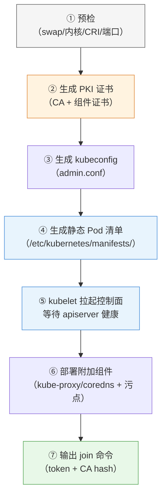

> 读图要点：**证书（②）与静态 Pod 清单（④）是承上启下的两步**——证书保证组件互信（第 2 章 §2.6.3 在此落地，⚠️ 默认 1 年有效期）；静态 Pod 清单让 kubelet 直接拉起整个控制面（第 2 章 §2.5.1）；最后输出的 join 命令是 worker 的"入场券"。

**关键参数及决策逻辑**：

- `--pod-network-cidr`：声明 Pod 网段（§3.2.3）——**必须与后面 CNI 的配置一致**（不一致 → Pod 拿不到 IP）
- `--apiserver-advertise-address`：apiserver 对外宣告的地址——**用节点内网 IP**（worker 和 kubectl 都要连它；填公网 IP 会导致内网通信出问题）
- `--image-repository`：控制面镜像从哪拉（默认 registry.k8s.io）——**国内环境的第一个变通点**（§3.9）
- `--cri-socket`：告诉 kubeadm/kubelet 用哪个容器运行时 socket（多运行时并存时显式指定更稳）

**初始化失败的排查思路**（具体命令在实验手册）：

- 卡在 wait-control-plane → 看 kubelet 日志找"第一个错误"（十有八九是**镜像拉不下来**：控制面镜像或 pause 沙箱镜像——§3.9）
- 预检报错 → 按提示逐项修复（swap/内核/端口），kubeadm 会明确指出缺什么
- 记住方法论：**报错信息永远指向下一步**（第 16 章展开）

**为什么失败后不要直接 `kubeadm reset`**：很多失败（如 pause 镜像问题）在**修复环境后重试 kubelet 即可恢复**——`kubeadm reset` 会清掉已生成的证书和配置，等于从头再来（实验手册有实测记录）。

---

## 3.6 工作节点加入：token 机制与 TLS bootstrap

worker 加入不是"复制个文件"，而是一个**带安全校验的引导流程**：

**token（入场券）**：init 时生成的一次性口令（默认 24 小时有效），worker 凭它向 apiserver 证明"我是被邀请加入的"。

**CA hash（防中间人）**：join 命令里带一个 `--discovery-token-ca-cert-hash`——apiserver 证书的指纹。worker 用它**校验对方真的是我们的 apiserver**（防止假 apiserver 骗取 worker 的证书）。token 与 CA hash 二者缺一不可。

**TLS bootstrap（引导时的证书交换）**：worker 加入后，kubelet 需要一张自己的客户端证书（§2.6.3 双向 TLS）——它用 token 向 apiserver 申请，apiserver 校验后由 CA 签发。**之后 kubelet 就用这张证书与 apiserver 通信**，不再用 token。

**join 后节点为什么是 NotReady**：worker 加入成功 = 节点注册进集群了，但**还没有网络插件**——kubelet 会一直检查"本节点网络是否就绪"（CNI 是否装好）。所以 **NotReady 是正常的中间态**，装完 CNI 自动变 Ready。这个现象也解释了第 2 章"节点 Ready 依赖 kubelet + 网络就绪"。

> 若 token 过期：在控制面节点上重新生成 join 命令即可（`kubeadm token create --print-join-command`）——token 只是引导凭证，丢了/过期不影响已加入的节点。

---

## 3.7 网络插件（CNI）的选择：为什么是 Calico

### 3.7.1 CNI 的角色

第 2 章说"每个 Pod 一个 IP"——这个 IP 由 **CNI（容器网络接口）插件**负责分配与打通：Pod 创建时给它分配 IP、配置网卡、建立跨节点的路由。**没有 CNI，Pod 没有 IP、节点间不通、节点不 Ready**——这是集群里"必须装"的组件。

> **CNI 不止管"连通"**：CNI 还包含 **IPAM（IP 地址管理）**——负责 Pod IP 的分配/回收（IP 池管理）。`--pod-network-cidr` 就是给 IPAM 划定"IP 池"范围：Calico 的 IPAM 从这个池里为每个 Pod 分配 IP，Pod 删除时回收复用。**理解 IPAM 才能理解"Pod IP 从哪来、为什么不会耗尽/冲突"**（IP 耗尽排障见第 16 章）。

### 3.7.2 主流 CNI 对比与适用场景

| 插件 | 网络模型 | 特点 | 适用场景 |
|---|---|---|---|
| **Flannel** | VXLAN 覆盖网络（overlay） | 最简单、最轻量，Pod 间二层互通 | 学习、小型集群、只要"能通"就行 |
| **Calico**（本课程） | **BGP 三层路由**（可选 overlay） | 性能好、**原生支持 NetworkPolicy**（第 9 章网络策略必须有它）、可扩展 | 生产主流；需要网络策略/性能的集群 |
| **Cilium** | eBPF 内核编程 | 性能最强、功能最丰富（网络策略/可观测/服务网格） | 大型生产、对性能和功能要求高的集群（学习曲线陡） |
| Weave | 覆盖网络 | 简单易用、自带 DNS 加密 | 小规模、追求简单 |
| （云厂商自带） | 云网络直通 | 与云 VPC 集成好 | 托管集群（EKS 等）默认 |

### 3.7.3 本课程为什么选 Calico

1. **性能与模型**：BGP 三层路由（数据走真实路由而非隧道封装）比 Flannel 的 VXLAN 性能好
2. **NetworkPolicy**：第 9 章要演练"网络策略隔离"——**Flannel 不支持 NetworkPolicy，Calico 原生支持**（这是教学刚需）
3. **生产主流**：学了就是生产可用的（大量生产集群用 Calico）
4. **实测稳定**：本课程在 v1.36 实测通过（多源拉取、三节点互通）

> **决策逻辑**：教学选型 = "性能可用 + 支持全部要教的功能（网络策略）+ 生产通用"。Flannel 适合"只想通网"的极简场景；Cilium 是"更强但更复杂"的进阶选项。

### 3.7.4 一个必须一致的参数：Pod 网段

Calico 配置里有一个 `CALICO_IPV4POOL_CIDR` 参数——**必须与 `CALICO_IPV4POOL_CIDR` 完全一致**。因为：init 时声明的网段是"集群的 Pod 网段约定"，Calico 的 IP 池是"实际分配 IP 的池子"——两者不一致，Calico 分配的 IP 落在约定网段之外，路由就乱了。**这个"一致性"是 CNI 安装中最常见的错误点**。

---

## 3.8 集群验证：验证什么、为什么

装完集群，验证不是"随便看看"，而是**对照第 2 章架构逐层确认**：

| 验证层 | 验证什么 | 为什么验证它 |
|---|---|---|
| 节点层 | 3 个节点全部 `Ready` | Ready = kubelet 心跳正常 + 网络就绪（第 2 章） |
| 组件层 | kube-system 的系统 Pod 全部 Running | 控制面四件套 + kube-proxy + coredns + calico 都在岗（第 2 章架构图） |
| 调度层 | 测试 Pod 能创建并落到 worker 节点 | 证明调度器工作 + 控制面污点生效（控制面不跑业务，第 6 章） |
| 镜像层 | 测试镜像能正常拉取启动 | 证明镜像获取链路可用（§3.9 的变通是否生效） |

**验证命令（少量即可）**：`kubectl get nodes`、`kubectl get nodes`、跑一个测试 Pod 看调度结果——具体命令在实验手册（实验 01）。

> 教学提示：测试 Pod 调度到 worker 而非控制面节点是**正常设计**（master 有 control-plane 污点）——第一次看到别以为是故障。

---

## 3.9 国内环境的镜像获取策略（问题本质与思路）

> 网络通畅的环境可跳过本节。**本节讲"为什么"与"有哪些思路"；具体脚本与实测记录在实验手册（实验 01） （附录 A-F）**。

**问题的本质**：Kubernetes 官方组件镜像在 `registry.k8s.io`、业务镜像在 `registry.k8s.io`，国内网络访问不稳定——**安装失败九成是镜像拉取失败**（§3.5 的 wait-control-plane 就是典型）。

**三类变通思路（按作用对象分）**：

**① 控制面镜像：换仓库**（init 时 `--image-repository` 指向国内可达仓库，如阿里云 `--image-repository`）。注意它的**边界**：只换控制面组件的镜像仓库，**管不到 kubelet 的沙箱镜像**——引出最大的坑：

**② kubelet 沙箱镜像（pause）：本地注入**。pause 容器（第 2 章 §2.5.3）由 kubelet 按内置默认名（`registry.k8s.io/pause:3.10.1`）拉取，且与 kubeadm 预热的版本可能差一个 patch——**解法思路**：从国内源拉 pause，tag 成 kubelet 期望的名字（多 tag 几个相近版本），重启 kubelet。**这是国内安装最大的坑**（实验手册（实验 01） 附录 F 有完整实测）。

**③ 业务/CNI 镜像（docker.io）：加速站**。containerd 支持 per-registry 镜像加速配置（hosts.toml 指向加速站）。要点：加速站可用性**随时间变化**（不同站对不同镜像表现不同，有的 403、有的慢）——所以**先实测再配置**，必要时多站兜底（实验手册（实验 01） 前置检查有预测试脚本）。

> **决策逻辑**：先测网络（版本源 + 镜像源各探一次）→ 决定要不要变通 → 变通按"换仓库/本地注入/加速站"分类处理。**先测再装，别装到一半才发现**。

---

## 3.10 安装之后：集群维护的起点

集群装完，有两件事是"立刻要做的维护"，**动手实验在实验 12「集群维护与运维」**（etcd 备份恢复 + kubeadm 升级 + 节点维护演练），完整流程在第 14 章（教材）展开：

- **etcd 备份**：第 2 章强调过——etcd 是集群的全部状态。**装完集群第一件事就是配置备份**（快照 + 周期策略 + 恢复演练），CKA 必考
- **升级认知**：kubeadm 升级有固定顺序（控制面先行、worker 逐台排空升级）——第 14 章展开

---

## 3.11 实验演练指引

本章对应的动手内容全部在实验手册 **实验 01**：

- **手动安装（10 步）**：按本章原理走完整流程（含国内变通与故障清单）
- **实验 12 集群维护**：etcd 备份恢复（Lab 1）+ kubeadm 升级（Lab 2）+ 节点维护演练（Lab 3）
- **附录 A-F**：加速站清单与预测试、配置原理、版本组合、worker 一键脚本、单节点安装、实测记录（9 个坑的根因与修复）
- **Kubectl 基础**：第 2 章 Killercoda 演练的命令，在自有集群完整过一遍

> 教学建议：先在 Killercoda（第 2 章）建立命令直觉 → 读本章理解原理 → 按实验手册（实验 01） 动手安装 → 对照 §3.8 验收。

---

## 本章小结

- **方式抉择**：kubeadm（过程可见、可扩展、CKA 考）＞ 托管（生产黑盒）＞ 轻量单机（本地体验）
- **规划四件事**：形态（3 节点教学最优）、版本（三件套一致 + 锁定）、网络（**三个网段互不重叠**）、环境（swap/内核参数每项都有原理）
- **运行时选型**：containerd（直接实现 CRI、轻量、CNCF 托管）取代 Docker 的 dockershim 时代；SystemdCgroup 必须与 kubelet 对齐
- **init 原理**：预检 → PKI 证书 → kubeconfig → 静态 Pod 清单 → kubelet 拉起控制面 → 附加组件 → 输出 join 命令；失败先查镜像拉取，别急着 reset
- **join 原理**：token（入场券）+ CA hash（防中间人）+ TLS bootstrap（换取长期证书）；NotReady 是等 CNI 的正常中间态
- **CNI 选型**：Calico（BGP 性能 + NetworkPolicy + 生产主流）vs Flannel（极简）vs Cilium（更强更复杂）；**Pod 网段必须与 init 一致**
- **验证四层**：节点 Ready / 组件 Running / 跨节点调度 / 镜像拉取
- **国内变通**：问题本质是镜像可达性；三类思路（换仓库/本地注入 pause/加速站）；先测再配
- **维护起点**：etcd 备份是装完第一件事

**衔接**：集群已就绪，第 4 章开始"在集群上跑应用"——Pod 的本质、生命周期与完整配置。

## 思考题

1. 为什么 Kubernetes v1.24 要移除 dockershim？用 containerd 和用 Docker 的本质区别是什么？
2. 三个网段（节点/Pod/Service）为什么必须互不重叠？如果 Pod 网段选了和节点一样的 192.168.0.0/16 会发生什么？
3. kubeadm init 的七步里，哪一步对应第 2 章的"静态 Pod"概念？控制面组件为什么用静态 Pod 而非 Deployment 管理？
4. worker join 为什么需要"token + CA hash"两样东西？缺一个会有什么风险？
5. 为什么没装 CNI 时节点一直是 NotReady？kubelet 是怎么知道"网络没就绪"的？
6. 如果让你给一个"只要求 Pod 能互通、不在乎网络策略"的小集群选 CNI，你选什么？为什么？

> **CKA 考点标注**（对应域 1：集群架构、安装与配置 25%，**考试权重最高的实操域**）：
> - **必考命令**：`kubeadm init`（参数含义）、`kubeadm init`（token 续发）、`kubeadm init`（镜像预热）、`kubeadm init`
> - **必考机制**：init 各阶段、join 的 token + CA hash、CNI 与 Ready 的关系、etcd 备份（snapshot save/restore，第 14 章展开）
> - **必考排查**：wait-control-plane（镜像/沙箱）、节点 NotReady（kubelet/CNI）、ImagePullBackOff
> - 考试环境网络通常可达官方源——**通用流程与原理是核心**，国内变通是环境加成


---


# 第 4 章 Pod 与容器

> 配套实验手册：《Kubernetes 实验手册》（manual/ 目录）**实验 02 「解析 Pod」**（全部 10 个 Lab）。本章讲 Pod 与容器的**全部核心机制**——它是"在集群上跑应用"的第一章，也是后面所有章节（控制器/网络/存储/调度）的地基。

## 学习目标

学完本章，你应该能够：

1. 解释"Pod 为什么是调度的最小单元"，说清 Pod 内多个容器共享什么、为什么要共享
2. 描述多容器 Pod 的三种协作模式（sidecar/适配器/大使）与各自场景
3. 解释镜像拉取策略三种取值的行为差异，以及"为什么默认策略由镜像 tag 决定"
4. 说清 `command`/`command` 与 Dockerfile `command`/`command` 的覆盖关系
5. 解释 Init 容器的工作机制（顺序/失败/共享）与适用场景
6. 完整讲解三种探针（startup/liveness/readiness）的职责与配合关系，以及三种探测方式的选择逻辑
7. 描述容器优雅终止的完整流程（preStop → SIGTERM → grace period → SIGKILL）
8. 区分 `requests`（调度承诺）与 `requests`（运行时上限）两个不同机制，解释 CPU 与内存超限的不同后果
9. 解释 Downward API 解决什么问题、能注入哪些元数据
10. 走查一个 Pod 从提交到删除的完整生命周期

---

## 4.1 Pod 的本质：为什么是"最小调度单元"

### 4.1.1 第 2 章回顾：Pod 是"逻辑主机"

第 2 章讲过：**Pod 是 Kubernetes 调度的最小单位**，一个 Pod 包含一个或多个容器，它们共享网络命名空间（一个 IP）、共享存储卷、同生共死。现在深入"为什么这样设计"。

**设计动机**：有些应用场景，多个进程必须**紧密耦合、同机共存**：

- 主应用 + 日志采集器（sidecar）：日志采集必须和主应用在同一台"机器"上才能读它的日志文件
- Web 服务 + 本地代理（如 Envoy）：代理必须在主应用旁边才能拦截它的流量
- 应用 + 配置刷新器：定期从外部拉配置写入共享目录

如果把它们放成独立 Pod，就会遇到：IP 不同（没法 localhost 通信）、存储不共享、生命周期不同步（一个挂了另一个还活着）。**Pod 把"这些进程必须绑在一起"的语义显式表达出来**——调度器把整个 Pod 当作一个整体调度到同一节点。

### 4.1.2 Pod 的共享边界（到底共享什么）

| Pod 内共享 | 含义 |
|---|---|
| 网络命名空间 | 一个 Pod IP + 一个端口空间；容器间用 `localhost` 互访 |
| UTS 命名空间 | 共享主机名 |
| 存储卷 | Pod 级卷可被所有容器挂载（如共享日志目录） |
| 生命周期 | 一起调度、一起终止 |

**不共享**：PID 命名空间（默认不共享——容器间看不到对方的进程）、cgroups（各自独立的资源限制）。

> 第 2 章讲过 pause 容器：Pod 的"沙箱"持有这些共享命名空间，应用容器挂靠进来。**Pod 的 IP 属于沙箱**——这也是"删 Pod = 整个 Pod 消亡"的技术根源。

### 4.1.3 单容器 vs 多容器：三种协作模式

绝大多数 Pod 只有一个容器；需要多容器时，有约定俗成的三种模式：

- **sidecar（边车）**：辅助主容器，如日志采集（filebeat）、指标暴露（prometheus-exporter）、本地文件同步。特点：**跟在主应用旁边，增强而不侵入**
- **Adapter（适配器）**：把主容器的输出**转换成统一格式**，如把应用日志转成标准 JSON、把指标转成监控系统格式
- **Ambassador（大使）**：代表主容器访问外部，如本地代理（连数据库的连接池代理、访问外部服务的代理）

> **决策逻辑**：先问"能不能一个容器搞定？"——单容器最简单，运维成本最低；只有当进程必须**同生命周期、共享本地资源**时才拆多容器（sidecar 等模式）。

---

## 4.2 容器的配置要素

### 4.2.1 镜像与拉取策略（imagePullPolicy）

**问题**：节点上已经有镜像了，还要不要重新拉？

**三种策略**：

- **IfNotPresent**：本地有就用本地，没有才拉
- **Always**：每次都到仓库拉（检查 digest，有变化就更新）
- **Never**：只用本地镜像，绝不拉取（离线环境）

**关键认知：默认策略由镜像 tag 决定**：

- 镜像带具体版本（`nginx:1.27`）→ 默认 **IfNotPresent**（版本不可变，本地有就不用重复拉）
- 镜像用 `:latest`（或没写 tag）→ 默认 **Always**（latest 是"移动靶"，每次启动都要确认最新）

> 这个默认行为的设计很巧妙：**版本化镜像假设"tag 即契约"（不可变），latest 假设"始终要最新"**。生产实践：永远用具体版本号 + IfNotPresent，避免 `:latest` 的不可预测性。

### 4.2.2 命令与参数（command / args）

容器镜像里定义了默认启动命令（Dockerfile 的 `ENTRYPOINT` 和 `ENTRYPOINT`）。Kubernetes 可以**覆盖**它们：

| Kubernetes 字段 | 覆盖 Dockerfile 的 | 作用 |
|---|---|---|
| `command` | `command` | 替换启动程序 |
| `args` | `args` | 替换启动参数 |

**覆盖规则**（容易混淆，重点记忆）：

- 只写 `args` → 程序不变（用镜像的 ENTRYPOINT），只换参数
- 只写 `command` → 程序换掉，参数用镜像默认 CMD（如果新程序不需要参数，要同时清掉 args）
- 都写 → 程序和参数全换

> **为什么需要覆盖**：同一镜像跑不同任务（如 busybox 镜像既当"睡眠容器"又当"一次性任务"）、调试（进容器跑 shell）、镜像默认命令在集群环境不适用时。kubectl 命令式创建时用 `--command -- <命令>`（**v1.36 必须带 `--command -- <命令>` 分隔符**）。

### 4.2.3 环境变量

环境变量是给容器传配置的最直接方式：

- **静态值**：`env: [{name: MODE, value: prod}]`——写死在 Pod 定义里
- **动态来源**：从 ConfigMap/Secret 引用（第 8 章）、从 Downward API 注入自身元数据（§4.5.4）

> 环境变量的局限：不适合传"文件型配置"（如整个配置文件）；文件型用 ConfigMap 卷挂载（第 8 章）。

### 4.2.4 标签与注解（Pod 层面）

第 2 章讲过两者的区别（标签可被选择器选中、注解只是说明）。在 Pod 层面补充两点：

- **Pod 的标签是"被管理的凭据"**：Deployment/Service 靠它选中 Pod——**标签与选择器必须精确匹配**，错了 Pod 就"没人管"（删了不重建、流量不进）
- **注解常用于声明"意图"**：如 `kubernetes.io/change-cause`（记录这次更新原因）、监控告警配置等——控制器/工具读取，但**不参与选择**

### 4.2.5 生产基线：SecurityContext 概览

**问题**：容器默认以 root 运行（第 1 章：容器内 root 与宿主机共享内核权限，被攻破有逃逸风险）。**SecurityContext** 是容器/Pod 的"安全设置区"，声明降权与加固（第 12 章深入）：

```yaml
spec:
  securityContext:                      # Pod 级：对 Pod 内所有容器生效
    runAsNonRoot: true                  # 禁止以 root（UID 0）运行，否则拒绝启动
    runAsUser: 1000                     # 指定运行用户（UID）
  containers:
  - name: app
    securityContext:                    # 容器级：只对本容器生效
      readOnlyRootFilesystem: true      # 根文件系统只读（防写入恶意文件）
      capabilities:
        drop: ["ALL"]                   # 丢弃全部 Linux 能力（最小能力原则）
```

| 字段 | 作用 | 防什么 |
|---|---|---|
| `runAsNonRoot` + `runAsNonRoot` | 非 root 运行 | 容器逃逸、root 权限滥用 |
| `readOnlyRootFilesystem` | 根文件系统只读 | 恶意文件写入（卷仍可写） |
| `capabilities.drop: ["ALL"]` | 丢弃能力 | 危险内核能力（SYS_ADMIN 等） |
| `allowPrivilegeEscalation: false` | 禁止提权 | 子进程提权 |

> **为什么在这里先提**：SecurityContext 是**容器配置的一部分**（第 12 章会讲 PSA 如何强制它）——先建立"容器默认不安全、要声明降权"的基线认知，第 12 章"自觉 vs 强制"才立得住。

---

## 4.3 Init 容器：启动前的"先决条件执行器"

### 4.3.1 为什么需要 Init 容器

主容器启动前，常常有必须先完成的准备工作：

- **等待依赖就绪**：数据库还没起来，主应用别急着连（如 `while ! nc -z mysql 3306; do sleep 1; done`）
- **预置数据/权限**：下载配置文件、初始化目录、设置文件权限
- **预热缓存**：启动前先把缓存填充好

这些工作如果放进主容器：会和主进程争抢资源、逻辑混杂、且"启动慢导致探针误杀"（§4.4.2）。**Init 容器的定位：在主容器之前按顺序完成准备，做完就退出**。

### 4.3.2 工作机制

```text
Pod 调度到节点
   │
   ▼
Init 容器按声明顺序逐个执行：
   init-1（等待数据库）──成功──► init-2（预置数据）──成功──► 主容器启动
        │ 失败                    │ 失败
        ▼                        ▼
   按重启策略重试（restartPolicy=Always 时整个 Pod 重启，重跑所有 init）
```

**关键规则**：

- **顺序执行**：多个 Init 容器严格按声明顺序，前一个成功后下一个才启动
- **失败即重来**：某个 Init 失败 → 整个 Pod 重启，**所有 Init 容器从头再跑**（不是从失败的继续）
- **共享卷**：Init 容器与主容器共享 Pod 卷——预置的数据写在共享卷里，主容器直接读
- **独立镜像**：Init 容器可以用与主容器不同的镜像（如主容器是精简运行时镜像，Init 用带工具的镜像下载数据）
- **与主容器隔离**：Init 容器不参与探针检查、不占用主容器的资源声明

> **为什么"失败从头跑"**：Init 容器可能修改共享卷的中间状态——从第一个重跑保证"准备动作的确定性"，避免半成品状态。

### 4.3.3 Init 容器 vs sidecar 容器

| 维度 | Init 容器 | sidecar 容器 |
|---|---|---|
| 运行时机 | 主容器**之前**，跑完即退出 | 与主容器**并行**长期运行 |
| 生命周期 | 一次性 | 与 Pod 同生共死 |
| 典型场景 | 等待依赖、预置数据 | 日志采集、代理 |

> 判断：**"做完就撤"的用 Init，"长期伴随"的用 sidecar**。

---

## 4.4 容器生命周期管理

### 4.4.1 容器的三种状态

kubelet 眼中的容器状态（`kubectl get pod -o yaml` 的 `kubectl get pod -o yaml`）：

- **Waiting**：正在准备（拉镜像、创建等）
- **Running**：正在运行
- **Terminated**：已退出（正常/异常，含退出码）

**退出码的意义**（排障必读）：0 = 正常退出；非 0 = 异常（1 通用错误、137 = SIGKILL（如内存超限被杀）、143 = SIGTERM）。**看到 137 先怀疑内存超限**（第 10 章排障展开）。

### 4.4.2 三种探针：各管一件事

Kubernetes 用探针（Probe）回答三个不同的问题：

**readinessProbe（就绪探针）——"能用了吗？"**

- 决定**是否把流量发给这个 Pod**（Service 后端列表是否包含它）
- 失败 → 从 Service 摘除（但 Pod 不重启）——服务"没准备好"时不让用户流量进来
- 典型场景：应用启动慢（要加载缓存、连数据库），ready 前流量不进

**livenessProbe（存活探针）——"还活着吗？"**

- 决定**是否重启这个容器**
- 失败 → kubelet 杀掉容器并按重启策略重建——自愈机制（死锁、内存泄漏、假死）
- 典型场景：进程活着但业务卡死（如死循环、goroutine 泄漏）

**startupProbe（启动探针）——"开始检查了吗？"**

- 决定 **liveness/readiness 什么时候开始检查**
- 启动阶段只查 startupProbe（成功后才开始查另外两个）——**解决"慢启动应用被误杀"**：如果应用要 60 秒才起来，liveness 默认 10 秒就开始查，会把"还在启动"误判为"死了"
- 典型场景：JVM 启动、加载大模型、冷启动慢的应用

**三者的配合关系**（一个图讲清）：

<!-- 原 ASCII 图已转为 Mermaid -->
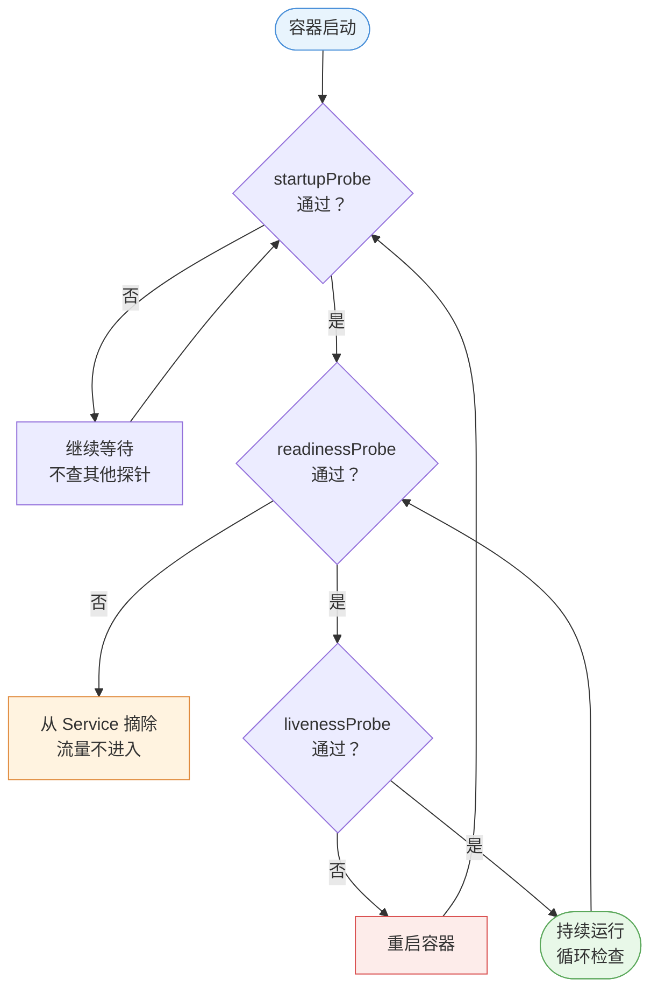

> 读图要点：**startup 通过前另外两个探针都不查**（慢启动保护）；readiness 失败只摘流量不重启；liveness 失败才重启——三个探针的失败后果各不相同（摘除/重启/等待）。

**探针的参数**（速查）：`initialDelaySeconds`（启动后等多久才第一次查）、`periodSeconds`（探测间隔）、`timeoutSeconds`（单次超时）、`failureThreshold`（连续几次失败才判定失败）、`successThreshold`（几次成功才判定成功）。

> **决策逻辑**：三个探针不是都要配——**最小化原则**：只配必要的。readiness（大多数有流量的服务要配）、liveness（有死锁/泄漏风险的配）、startup（启动超过默认 10s 的必须配，否则可能被 liveness 误杀）。

### 4.4.3 探针的实现方式：怎么探测

| 方式 | 原理 | 适用 |
|---|---|---|
| `httpGet` | 发 HTTP GET，**状态码 200-399** 视为成功 | HTTP 服务（最常用） |
| `tcpSocket` | 尝试建立 TCP 连接，能连上即成功 | 非 HTTP 协议（数据库、Redis） |
| `exec` | 容器内执行命令，**exit 0** 视为成功 | 无法用端口判断的场景（检查内部状态文件） |
| `grpc` | gRPC 健康检查协议（v1.24+） | **gRPC 微服务**（无需额外探针实现，走 gRPC 健康协议） |

> 选择逻辑：**HTTP 服务用 httpGet（最贴近真实可用性）；TCP 服务用 tcpSocket；都没有的用 exec；gRPC 服务用 grpc 探针**。注意探测路径要选"真实反映可用性"的端点（如 `/healthz`，而不是只返回 200 的静态页）。gRPC 探针要求服务端实现 gRPC 健康检查协议（`/healthz`）。

### 4.4.4 生命周期钩子与优雅终止

**postStart（启动后钩子）**：容器**启动后**立即执行的动作（如注册到注册中心、初始化脚本）。两个关键点：

- 与主进程**并发执行**——不是阻塞等待！主进程不会等 postStart 跑完
- 与探针无关——postStart 失败不会导致重启（只记录事件）

**preStop（终止前钩子）**：容器**被终止前**执行的动作（如通知注册中心下线、排空连接、保存状态）。它是**阻塞式**的——必须执行完（或超时）才继续终止流程。

**优雅终止的完整流程**（这是"发布不中断"的关键机制）：

<!-- 原 ASCII 图已转为 Mermaid -->
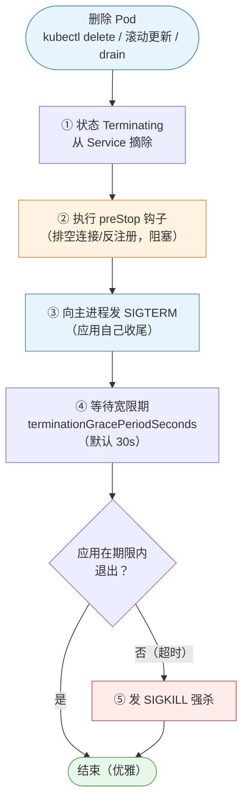

> 读图要点：**先摘流量（不再进新请求）→ preStop 排空（处理存量）→ SIGTERM 优雅退出 → 超时才 SIGKILL 兜底**——每一步都在为"不丢请求"服务。

**为什么这套流程重要**：生产发布/扩缩容/节点维护（drain）都走这个流程——**优雅终止 = 不丢请求**。应用要配合：捕获 SIGTERM 做收尾（关连接、刷数据）；如果收尾需要超过 30 秒，调大 `terminationGracePeriodSeconds`（实验手册（实验 02） Lab 9 实测 5.8s 完整流程）。

### 4.4.5 重启策略（restartPolicy）

容器失败/退出后**要不要重启**，由 `restartPolicy` 决定：

- **Always**（默认）：任何退出都重启——Deployment 等长期服务用
- **OnFailure**：只有异常退出（非 0）才重启——Job 等任务用
- **Never**：绝不重启——一次性任务（如批处理，跑完就完）

> 注意：重启策略是 **Pod 级**的；由控制器管理的 Pod 通常用默认 Always，Job 场景改为 OnFailure/Never。

---

## 4.5 资源模型：requests 与 limits

### 4.5.1 两个不同的机制（全书最容易混的点）

容器可以声明两种资源约束，**它们作用在不同环节、由不同组件执行**：

- **requests（请求量）——调度承诺**：告诉调度器"这个容器至少需要多少"——**决定 Pod 落在哪个节点**（scheduler 过滤依据，第 3 章讲过）
- **limits（上限）——运行时限制**：告诉 kubelet"最多能用多少"——**决定容器能跑多快/会不会被杀**（运行时执行）

```text
requests: CPU 0.5 / 内存 256Mi   ← 调度器：找剩余资源 ≥ 这个值的节点
limits:   CPU 1 / 内存 512Mi    ← kubelet：容器最多用这么多
```

**CPU 与内存的本质区别**（重要）：

- **CPU 是可压缩资源**：超限 → **节流（throttling）**——跑慢点，但不会死
- **内存是不可压缩资源**：超限 → **OOM 被杀（SIGKILL，退出码 137）**——没有"慢一点"选项

> 这就是为什么"内存 limit 必须设、CPU limit 可选"：不设 CPU limit 只是不节流（可接受）；**不设内存 limit，一个泄漏的容器可以把整台节点拖垮**（影响同节点的其他 Pod）——生产上内存 limits 是底线。

### 4.5.2 不设置会怎样

- 只有 requests 没 limits：调度有保障，但运行时不受限（可超用节点资源）
- 只有 limits 没 requests：**limits 隐式等于 requests**（Kubernetes 自动补）——注意这个隐含行为
- 都没有：调度"任何节点都行"（可能挤爆别人），运行时无上限（风险）

### 4.5.3 requests/limits 与 QoS 等级

Kubernetes 根据资源声明把 Pod 分成三个服务质量等级（QoS），**决定节点资源紧张时谁先被杀**：

- **Guaranteed（保证）**：requests = limits（都设且相等）——优先级最高，最后被杀
- **Burstable（可突发）**：requests < limits，或只设 requests——有最低保障，可超用，中间
- **BestEffort（尽力而为）**：什么都没设——最容易被杀

> 生产实践：核心服务配 Guaranteed（requests=limits）；一般服务 Burstable；BestEffort 只给测试任务。

### 4.5.4 Downward API：Pod 怎么"认识自己"

**问题**：容器内部怎么知道自己的 Pod 名、命名空间、IP、所在节点？

**Downward API**：把 **Pod 自身的元数据**注入容器（环境变量或文件）——注意它注入的是"自身信息"，不是外部配置（外部配置用 ConfigMap，第 8 章）：

- 环境变量方式：Pod 名、命名空间、节点名、Pod IP（部分字段限制：label/annotation 不能进 env）
- 文件方式（volume）：label/annotation 等全部字段（挂载成文件，支持热更新）

> **典型用途**：应用上报日志时带"我是哪个 Pod"、监控系统标记来源、按 Pod 标签决定行为。

---

## 4.6 走查：一个 Pod 的完整生命周期

把本章所有机制串起来，走查一个 Deployment 管的 Pod 从生到死：

```text
① 提交：kubectl apply deployment.yaml（期望：1 副本，带 readiness+liveness 探针）
   │
   ▼
② 调度：scheduler 按 requests 过滤打分，选中 node2
   │
   ▼
③ 创建：kubelet 建 pause 沙箱 → 拉镜像 → 创建容器（Waiting：Pulling）
   │
   ▼
④ 启动：容器 Running；postStart 钩子并发执行（注册/初始化）
   │
   ▼
⑤ 探针：startup 成功后 → readiness 成功 → 加入 Service 后端，开始接流量
   │        （liveness 持续检查：失败 → 重启容器，自愈）
   │
   ▼
⑥ 更新/删除（滚动更新、扩容缩容、节点维护 drain）：
   │  从 Service 摘除 → preStop 钩子（排空）→ SIGTERM → 优雅退出
   │  超时 → SIGKILL
   ▼
⑦ 回收：Pod 对象删除；如果内存超限，中途可能已因 OOM 被 SIGKILL（退出码 137）
```

> 对照第 2 章控制循环：这个 Pod 的生死由 ReplicaSet 控制器监视——它死了，控制器立刻补一个新的（自愈）。

---

## 4.7 实验演练指引

本章机制对应实验手册：

- **实验 02 「解析 Pod」**（7 个 Lab）：极简创建 → 多容器 → Init 容器 → 拉取策略 → 环境变量 → command/args → 标签注解
- **实验 02 Lab 8**（探针）：readiness 摘流量、liveness 重启，亲眼验证探针行为
- **实验 02 Lab 9**（钩子与优雅终止）：preStop 生效、**实测完整终止流程 5.8s**
- **实验 02 Lab 10**（资源限制）：requests/limits 生效、超限节流与 OOM

> 教学建议：先理解 4.1-4.5 的机制，再按实验手册逐个验证——每个 Lab 的"观察点"都对应本节一个机制。

---

## 本章小结

- **Pod 是调度最小单元**：多容器共享网络/IP/存储/生命周期；三种协作模式（sidecar/适配器/大使）
- **容器配置**：镜像策略默认由 tag 决定（版本化→IfNotPresent、latest→Always）；command/args 覆盖 ENTRYPOINT/CMD；env 传简单配置，文件型走 ConfigMap
- **Init 容器**：主容器前顺序执行、失败从头重跑、共享卷预置数据——"做完就撤"
- **探针三兄弟**：readiness（摘流量）/ liveness（重启）/ startup（慢启动保护）；httpGet/tcpSocket/exec 三种探测方式按协议选
- **优雅终止**：摘流量 → preStop → SIGTERM → grace period → SIGKILL——发布不丢请求的关键
- **资源模型**：requests 管调度、limits 管运行；CPU 可压缩（节流）、内存不可压缩（OOM 137）；QoS 三档决定被杀顺序；内存 limits 是生产底线
- **Downward API**：注入 Pod 自身元数据（env/文件两种方式）
- **生命周期走查**：提交→调度→创建→探针→接流量→优雅终止→回收，环环相扣

**衔接**：第 5 章讲"管 Pod 的人"——Deployment 等控制器如何基于本章的 Pod 机制实现滚动更新、扩缩容与自愈。

## 思考题

1. 为什么"内存超限"比"CPU 超限"危险？分别会发生什么（提示：可压缩 vs 不可压缩）？
2. 一个应用启动需要 90 秒，直接配 liveness 会发生什么？startup 探针怎么解决？
3. preStop 钩子里 `sleep 5` 的常见用途是什么？如果应用收尾需要 60 秒，要改什么配置？
4. Init 容器与 sidecar 容器都"在主容器旁做事"，它们的本质区别是什么？
5. 为什么"只设 requests 不设 limits"（内存）在生产上是危险的？
6. 镜像带 `:latest` 时默认拉取策略是 Always——这带来什么风险？怎么规避？

> **CKA 考点标注**（对应域 2：工作负载与调度 15%）：
> - **必考配置**：探针三件套（readiness/liveness/startup）与参数、资源 requests/limits、restartPolicy、imagePullPolicy
> - **必考命令**：`kubectl run --command --`（v1.36 分隔符）、`kubectl run --command --`、`kubectl run --command --`（看探针/事件）
> - **必考机制**：优雅终止流程（preStop/SIGTERM/SIGKILL）、OOM 退出码 137、Init 容器顺序执行
> - 域 5 排障（30%）大量题目围绕本章：CrashLoopBackOff（探针失败/退出码）、ImagePullBackOff（拉取策略/镜像名）


---


# 第 5 章 工作负载控制器

> 配套实验手册：《Kubernetes 实验手册》（manual/ 目录）**实验 03「工作负载」**（6 个 Lab：Deployment 维护/滚动更新/StatefulSet/Job/CronJob/DaemonSet）。本章讲各类控制器的**原理、机制与选型**——"如何管理 Pod"是工作负载的核心问题，也是第 4 章 Pod 知识的自然延伸。

## 学习目标

学完本章，你应该能够：

1. 解释"为什么需要控制器"（裸 Pod 的三个致命问题），说出控制器的共同骨架
2. 解释 Deployment 的三层结构（Deployment → ReplicaSet → Pod）与职责分层
3. 详细描述滚动更新的机制（maxUnavailable/maxSurge 如何控制节奏）与回滚原理
4. 解释 StatefulSet 如何解决有状态应用的三个难题（稳定标识/稳定存储/有序性）
5. 解释 DaemonSet 的机制与典型场景，说出它与 Deployment 的本质区别
6. 解释 Job 与 CronJob 的机制（成功语义、backoffLimit、并发策略）
7. 根据应用类型（无状态/有状态/守护/任务）做出控制器选型决策
8. 知道扩缩容与暂停机制背后的原理（修改期望状态）

---

## 5.1 控制器：管理 Pod 的"管理者"

### 5.1.1 为什么需要控制器

第 4 章讲过裸 Pod（直接创建的 Pod）——但生产上**几乎从不直接创建裸 Pod**，因为它有三个致命问题：

1. **不会自愈**：Pod 崩溃/被删，不会自动重建（第 2 章 Killercoda 演练 4 已验证）
2. **不会扩缩**：流量大了要手动一个个创建，流量降了要手动删
3. **没有更新能力**：镜像升级只能删了重建，无法滚动

**控制器（Controller）就是"管 Pod 的人"**：你声明"要什么样的 Pod、要几个"，控制器负责创建、维持、更新、扩缩。第 2 章的控制循环在这里具体化为：**控制器持续把"当前副本数"调和到"期望副本数"**。

### 5.1.2 控制器的共同骨架

所有工作负载控制器（Deployment/StatefulSet/DaemonSet/Job/CronJob）都有四个共同要素：

```text
① selector（选择器）：这个控制器管哪些 Pod（按标签匹配）
② template（Pod 模板）：要创建的 Pod 长什么样（镜像/端口/探针/卷）
③ replicas（副本数，部分控制器无）：期望多少个（Deployment/StatefulSet 有，DaemonSet/Job 没有）
④ 控制循环：持续观察 → 对比期望 → 调和（第 2 章 §2.3）
```

```text
用户声明（期望状态）
   │ selector 匹配
   ▼
控制器观察当前 Pod 数量
   │ 数量 < 期望？
   ├─ 是 → 按 template 创建 Pod（调度 → kubelet 运行）
   └─ 否 → 删除多余（或等待）
   ▼
再次观察（循环不止）
```

> **核心认知**：控制器不直接运行容器——它只**创建/删除 Pod 对象**，真正跑容器的是 kubelet（第 2 章职责分层）。你看到"Pod 删了又回来"，就是某个控制器在调和。

### 5.1.3 控制器选择决策树（先选对类型）

面对一个应用，先回答四个问题：

<!-- 原 ASCII 图已转为 Mermaid -->
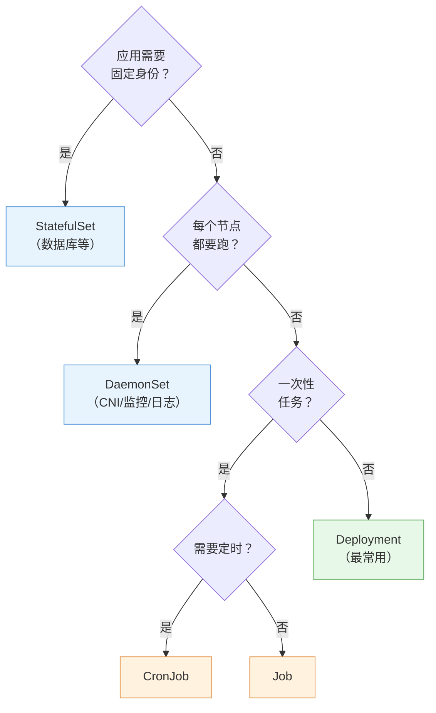

> 读图要点：**判断顺序是先问"身份"再问"分布"再问"任务"**——有身份 → StatefulSet；每节点 → DaemonSet；一次性 → Job/CronJob；其余全部落 Deployment。

> **决策逻辑**：默认 Deployment；应用有"身份"（名字/存储要固定）→ StatefulSet；按节点分布 → DaemonSet；跑完即走 → Job/CronJob。**选错类型是工作负载最常见的错误**——把有状态应用当 Deployment 跑，数据就悬了。

---

## 5.2 Deployment 与 ReplicaSet：无状态应用的标准答案

### 5.2.1 三层结构

Deployment 不是直接管 Pod 的，它下面还有一层 ReplicaSet：

```text
Deployment（描述：期望 3 副本、镜像版本、更新策略）
    │ 管理（每次更新生成新的 RS）
    ▼
ReplicaSet-1（当前版本的"副本管家"：维持 3 个 Pod）
    │ 创建/删除
    ▼
Pod × 3（真正跑应用的）
```

**为什么中间要隔一层 ReplicaSet**：为了**回滚**（§5.2.4）——每次更新都生成一个新的 ReplicaSet，旧 RS 保留（带旧版本镜像的"历史记录"），回滚 = 把流量切回旧 RS。

### 5.2.2 副本管理与自愈

`replicas: 3` 就是"期望副本数"，ReplicaSet 控制器负责维持：

- 某 Pod 崩溃 → RS 创建新 Pod（自愈）
- 某节点挂了 → 该节点上 Pod 消失 → RS 在其他节点补建（节点级自愈）
- `kubectl scale` → 只是**修改期望值**（3→5），RS 自动补建 2 个（第 2 章 §2.3.4 走查过）

### 5.2.3 滚动更新：发布不中断的节奏控制

**问题**：镜像升级（如 1.27 → 1.28）时，如果一次性全删全建，服务会中断。

**滚动更新（RollingUpdate）**：**分批替换**——新版本 Pod 先起来、就绪后，再停旧版本 Pod，循环直到全部替换。

节奏由两个参数控制：

- **maxUnavailable**：更新过程中**最多允许多少个副本不可用**（默认 25%）
- **maxSurge**：更新过程中**最多允许超出期望多少个副本**（默认 25%）

<!-- 原 ASCII 图已转为 Mermaid -->


> 读图要点（示例：3 副本，maxUnavailable=1，maxSurge=1）：**"新起一个 → 就绪 → 停一个旧的"循环交替**（阶段 2 到阶段 5），任何时刻 ≥2 个可用且不超 4 个——橙色阶段是新旧并存期。

**关键依赖**：新 Pod 必须配 **readinessProbe**（实验 02 Lab 8）——滚动更新靠它判断"新 Pod 就绪了没"：**就绪才停旧的**。没有 readinessProbe，新 Pod 一启动就被认为可用，更新可能在应用未就绪时切换流量。

> **生产调优**：核心服务用 `maxUnavailable: 0`（任何时刻都不能少服务）+ `maxSurge: 1`（一次多起一个）——**零中断发布**（实验 10 Lab 5 演练）。

### 5.2.4 回滚：出问题一键还原

**机制**：每次更新（模板变化）→ Deployment 生成**新的 ReplicaSet**（revision 递增，如 revision 2），旧 RS（revision 1）保留但缩到 0 副本。

```bash
kubectl set image deployment/web nginx=nginx:1.28   # 更新 → revision 2（新 RS）
kubectl rollout status deployment/web         # 等更新完成
kubectl rollout history deployment/web        # 看历史：REVISION 1（1.27）/ 2（1.28）
kubectl rollout undo deployment/web           # 回滚到上一个 revision
kubectl rollout undo deployment/web --to-revision=1   # 回滚到指定版本
```

**为什么能回滚**：旧 RS 的 Pod 模板还在（历史快照）——回滚 = 把期望状态改回旧模板，滚动更新反向执行。

> **排障关联**：更新后 CrashLoopBackOff（实验 10 Lab 2）→ 第一反应是 `rollout undo` 快速恢复，再慢慢查原因——**先恢复业务，再排查问题**。

### 5.2.5 扩缩容与暂停

- **扩缩容**：`kubectl scale deployment/web --replicas=5`——改期望值，RS 自动补齐/缩减（第 7 章 HPA 就是自动执行这一步）
- **暂停/恢复**：`kubectl rollout pause deployment/web`——暂停后**多次修改模板不会触发更新**（合并修改后 `kubectl rollout pause deployment/web` 一次性生效）——批量修改时避免每次改动都滚动一次

### 5.2.6 设计指南：生产发布策略

> 滚动更新是 Deployment 的内置策略；但**高风险变更**（数据库连接串变更、重大重构）需要更谨慎的发布方式。

**发布策略选型矩阵**：

| 策略 | 原理 | 回滚速度 | 资源开销 | 适用场景 | K8s 实现 |
|---|---|---|---|---|---|
| **滚动更新** | 逐批替换（§5.2.3） | 中 | 低（+1 Pod） | 大多数无状态服务 | Deployment 原生 |
| **蓝绿部署** | 新旧两套环境，切换 Service 指向 | **极快**（切 selector） | 高（2x 资源） | 需要瞬间切换/瞬间回滚 | 两个 Deployment + Service selector 切换 |
| **金丝雀发布** | 小比例流量验证后逐步放大 | 快 | 中 | 高风险变更 | 两个 Deployment + Ingress 权重 / Argo Rollouts |
| **A/B 测试** | 按用户特征分流 | 快 | 中 | 功能验证 | Ingress Header 路由 / Service Mesh |

**变更管理规范**（生产基线）：

```text
变更窗口：常规变更工作日 10:00-16:00；高风险变更周二/周三 10:00-14:00
         禁止：周五下午、节假日前一天、大促期间
标准流程：变更申请 → 同行评审 → 预发验证 → 灰度（≤10% 流量）→ 观察（≥15 分钟）→ 全量 → 验证
回滚决策：错误率 > 基线 2 倍 → 立即回滚；P99 延迟 > 基线 3 倍 → 立即回滚；任何数据异常 → 回滚并暂停
```

> 决策逻辑：**默认滚动更新（成本最低）**；要"瞬间切换/回滚" → 蓝绿；高风险变更要"小流量验证" → 金丝雀；功能对比 → A/B。**发布策略的核心是"可回滚 + 可控观察"**——第 16 章"先恢复再排查"的纪律在发布侧就是"随时能回滚"。

---

## 5.3 StatefulSet：有状态应用的正确打开方式

### 5.3.1 有状态应用的三个难题

数据库、消息队列这类应用与无状态 Web 不同：

1. **身份要稳定**：副本 `web-0` 永远是 `web-0`（集群里其他组件认它的名字）
2. **存储要固定**：每个副本的数据必须绑在自己的卷上（删了重建数据不能丢、不能串）
3. **启动要有序**：主从架构里，主库先起、从库后起（副本 0 先于副本 1）

Deployment 给不了这些（Pod 名随机、卷不绑定、无顺序）。**StatefulSet 就是为此设计的**。

### 5.3.2 稳定网络标识：web-0、web-1、web-2

StatefulSet 的每个 Pod 有**稳定且有序**的名字：`<sts名>-<序号>`（web-0、web-1、web-2）：

- 名字**从 0 开始编号，永不改变**（Pod 删了重建，还是叫 web-1）
- 配合 **headless Service**（实验 07 Lab 4），每个 Pod 有**稳定的 DNS 名**：`web-0.web-svc.namespace.svc`——集群内其他应用用这个固定名字找它（如从库连主库：`web-0.web-svc.namespace.svc`）

```text
StatefulSet: web（replicas=3）
   ├─ web-0  ←→ 稳定 DNS: web-0.web-svc.default.svc
   ├─ web-1  ←→ web-1.web-svc.default.svc
   └─ web-2  ←→ web-2.web-svc.default.svc
```

### 5.3.3 稳定存储：每个副本绑定自己的 PVC

StatefulSet 通过 **volumeClaimTemplates（卷声明模板）** 给每个副本自动创建独立的 PVC：

```text
web-0 → PVC web-data-web-0（数据落在自己的卷）
web-1 → PVC web-data-web-1（与 web-0 的卷完全独立）
web-2 → PVC web-data-web-2

Pod 删了重建 → 还绑同一个 PVC（数据不丢）
```

> 与 Deployment 的本质区别：Deployment 的所有副本**共享同一个卷**（或各自临时卷），StatefulSet 的每个副本**有自己专属的卷**——这就是"身份与数据绑定"。

### 5.3.4 有序部署/缩容/更新

- **部署有序**：web-0 先创建且 Running 后，才创建 web-1，再 web-2（`kubectl rollout status` 能看到依次就绪）
- **缩容有序**：从大到小删除（先 web-2、再 web-1、最后 web-0）
- **更新有序**：逆序逐个更新（web-2 → web-1 → web-0），保证主节点（web-0）最后更新

> **并发策略 `podManagementPolicy`**：默认 `podManagementPolicy`（严格有序）。**不需要启动顺序的应用**（如无主从关系的缓存集群）可以设 `podManagementPolicy`——**所有副本并行创建/删除，大幅提升扩缩容速度**（10 副本有序可能要几分钟，并行秒级）。判断标准：**副本间有无"谁先谁后"的依赖**——有则 OrderedReady，无则 Parallel。

### 5.3.5 StatefulSet vs Deployment（选型对照）

| 维度 | Deployment | StatefulSet |
|---|---|---|
| Pod 名称 | 随机后缀（web-abc12） | **稳定有序**（web-0/1/2） |
| 存储 | 副本共享/无绑定 | **每副本独立 PVC（volumeClaimTemplates）** |
| 顺序 | 无 | **创建/删除/更新都有序** |
| 网络标识 | 仅 Service | **headless + 稳定 DNS 名** |
| 适用 | 无状态（Web/API） | 有状态（数据库/消息队列/协调器） |

> **决策逻辑**：应用需要"被点名"（固定名字/固定存储）→ StatefulSet；应用无身份需求 → Deployment（更简单）。**判断标准：删掉这个 Pod，它的"身份/数据"需不需要保留？**

---

## 5.4 DaemonSet：每节点一个

### 5.4.1 机制

**DaemonSet 保证每个节点上恰好运行一个该应用的 Pod**——不是按副本数分布，而是**按节点分布**：

- 新节点加入集群 → DaemonSet 自动在新节点创建 Pod
- 节点删除 → 对应 Pod 一并消失
- 有节点被标记不可调度（cordon，实验 12 Lab 3）→ 该节点上不创建

### 5.4.2 典型场景

DaemonSet 都是"节点级服务"：

- **网络插件**：calico-node（每节点一个，管该节点 Pod 网络，实验 01 装过）
- **监控采集**：node-exporter（每节点采集主机指标）、metrics-server 的指标来源
- **日志采集**：filebeat/fluentd（每节点一个，收集该节点所有容器日志）
- **存储挂载**：部分 CSI 节点组件

### 5.4.3 与 Deployment 的本质区别

| 维度 | Deployment | DaemonSet |
|---|---|---|
| 分布逻辑 | 按副本数，调度器选节点 | **按节点，每节点恰好一个** |
| 新增节点 | 可能不上新节点 | **自动补上** |
| 副本数 | `replicas` 指定 | 无需指定（= 节点数） |

> **注意**：默认情况下 DaemonSet 只在**工作节点**运行——控制面节点有污点（第 6 章调度时展开）。要让 DaemonSet 也跑上控制面，需要容忍那个污点（实验 04 Lab 7 演练过）。

---

## 5.5 Job 与 CronJob：任务型工作负载

### 5.5.1 Job：一次性任务

**Job 保证"一个任务成功完成"**——与 Deployment（长期运行）完全不同的语义：

- **成功 = 完成**：Pod 正常退出（exit 0）→ Job 标记 `Completed`（任务完成，不再重跑）
- **失败 = 重试**：Pod 异常退出 → 按 `backoffLimit` 重试（默认 6 次），超限 Job 标记 `backoffLimit`
- **并行**：`parallelism` 控制同时跑几个 Pod（如 10 个任务并发 3 个）

```bash
kubectl create job my-job --image=busybox -- sh -c "echo done"
kubectl get job          # COMPLETIONS 1/1、STATUS Completed
```

> ⚠️ **生产必配：`ttlSecondsAfterFinished`（完成后自动清理）**——不配置的话，**已完成的 Job 及其 Pod 会无限堆积**（CronJob 每天跑一次 → 一年 365 个历史 Job 残留），导致 etcd 性能衰退。声明自动清理：

```yaml
spec:
  ttlSecondsAfterFinished: 3600   # Job 完成 1 小时后自动删除（含其 Pod）
```

> CronJob 场景还可以配合 `successfulJobsHistoryLimit` / `successfulJobsHistoryLimit`（第 5.5.2 节）限制历史记录数量——**任务型负载的"垃圾回收"是生产必做项**。

典型场景：数据迁移、批量处理、初始化任务、CI 中的一次性步骤。

### 5.5.2 CronJob：定时触发 Job

**CronJob 按 cron 表达式定时创建 Job**（cron 语法：`分 时 日 月 周`）：

```yaml
schedule: "0 2 * * *"     # 每天凌晨 2 点
schedule: "*/5 * * * *"   # 每 5 分钟
```

关键配置：

- **并发策略**：`concurrencyPolicy`——`concurrencyPolicy`（允许并发）/`concurrencyPolicy`（上次没跑完就不起新的）/`concurrencyPolicy`（替换上次）
- **历史保留**：`successfulJobsHistoryLimit` / `successfulJobsHistoryLimit`（保留多少次记录，防 etcd 膨胀）
- **时区**：`timeZone` 指定（默认按节点时区）

典型场景：定时备份、定时清理、定时报表。

### 5.5.3 任务型 vs 服务型（restartPolicy 的关键差异）

| 维度 | 服务型（Deployment 等） | 任务型（Job/CronJob） |
|---|---|---|
| 期望状态 | 容器**一直运行** | 容器**跑完退出** |
| restartPolicy | Always（退出就重启） | **OnFailure / Never**（跑完别重启） |
| 成功标志 | Running | **Completed（exit 0）** |

> **为什么 Job 的 Pod 不能配 Always**：Always 意味着"退出就重启"——任务跑完了还会被拉起来重跑，永远完不成。Job 语义要求"退出即结束"。

---

## 5.6 控制器选择总决策树（走查实例）

把本章所有控制器放进一个决策流程，用两个真实应用走一遍：

```text
新应用上线，先问：
① 它是"长期服务"还是"跑一次/定时"？
   ├─ 跑一次 → Job（backoffLimit 控制重试）
   ├─ 定时 → CronJob（schedule + 并发策略）
   └─ 长期服务 → 问 ②
② 每个节点都需要吗？
   ├─ 是（CNI/监控/日志）→ DaemonSet
   └─ 否 → 问 ③
③ 应用有"身份"吗（名字/存储要固定）？
   ├─ 是（数据库/消息队列）→ StatefulSet
   └─ 否（Web/API/网关）→ Deployment
```

**实例 1：WordPress 站点**——无状态 Web（WordPress）+ 有状态数据库（MySQL）：

- WordPress 前端 → **Deployment**（多副本、可滚动更新、挂共享卷存上传文件）
- MySQL → **StatefulSet**（稳定标识 `mysql-0`、独立 PVC 存数据、有序启动）——生产建议

**实例 2：监控体系**：

- node-exporter（每节点采集指标）→ **DaemonSet**
- 每日凌晨备份数据库 → **CronJob**（`0 2 * * *`）
- 一次性数据迁移 → **Job**

> 这个决策树是 CKA 工作负载题的**答题骨架**——看到场景先分类，再选控制器。

---

## 5.7 实验演练指引

本章机制对应实验 **03「工作负载」**（6 个 Lab）：

- **Lab 1 使用 deployment 维护服务数量**：副本/自愈/扩缩容——`kubectl scale` 改期望值，亲眼看到"删了自动补"
- **Lab 2 滚动更新与回滚**：`kubectl set image` 更新 → `kubectl set image`——maxUnavailable/maxSurge 默认值的观察
- **Lab 3 StatefulSet**：webserver-0/1/2 的稳定命名与 headless DNS——有序部署的观察
- **Lab 4 Job**：`Completed` 状态与 `Completed` 查看任务输出
- **Lab 5 CronJob**：`*/1 * * * *` 每分钟触发，`*/1 * * * *` 看调度记录
- **Lab 6 DaemonSet**：`kubectl get pods -o wide` 看"每节点一个"的分布

> 教学建议：每个 Lab 做完回到本章对应小节对照"机制 → 现象"——例如 Lab 2 的滚动更新观察点，就是 §5.2.3 的节奏图；Lab 3 的 `webserver-0` 命名，就是 §5.3.2 的稳定标识。

---

## 本章小结

- **为什么需要控制器**：裸 Pod 不自愈、不扩缩、不更新——控制器通过控制循环"维持期望状态"
- **共同骨架**：selector（管哪些）+ template（长什么样）+ replicas（几个）+ 控制循环
- **Deployment**：三层结构（Deployment→ReplicaSet→Pod，RS 为回滚而生）；滚动更新用 maxUnavailable/maxSurge 控节奏（**readinessProbe 是零中断的前提**）；rollout undo 一键回滚
- **StatefulSet**：解决有状态三难题——稳定有序命名（web-0）、独立 PVC（volumeClaimTemplates）、有序部署/更新
- **DaemonSet**：按节点分布（每节点一个），新节点自动补——CNI/监控/日志的标配
- **Job/CronJob**：成功 = Completed（exit 0）；restartPolicy 必须 OnFailure/Never；CronJob 定时触发 + 并发策略
- **选型决策树**：任务→Job/CronJob；每节点→DaemonSet；有身份→StatefulSet；其余→Deployment

**衔接**：第 6 章讲"Pod 落在哪个节点"——调度器与调度策略（nodeSelector/亲和/污点容忍/drain/PDB），届时 DaemonSet 的"控制面不上"之谜会解开。

## 思考题

1. 为什么 Deployment 要隔一层 ReplicaSet？没有它，回滚怎么实现？
2. 滚动更新时 `maxUnavailable: 0` 意味着什么代价？（提示：更新期间副本数会怎样）
3. 新 Pod 没配 readinessProbe，滚动更新会有什么风险？
4. StatefulSet 的 Pod 删了重建，为什么名字还是 web-1？数据还在吗？（提示：稳定标识 + volumeClaimTemplates）
5. 为什么 Job 的 Pod 不能配 restartPolicy: Always？
6. 用决策树判断：一个"每节点都要采集系统指标"的组件和"每天凌晨清理临时文件"的任务，分别用什么控制器？

> **CKA 考点标注**（对应域 2：工作负载与调度 15%）：
> - **必考操作**：`kubectl scale`、`kubectl scale`、`kubectl scale`、`kubectl scale`
> - **必考机制**：滚动更新（maxUnavailable/maxSurge）、回滚原理（RS 历史）、StatefulSet 稳定标识（headless + PVC 模板）、Job 的 Completed 语义与 backoffLimit、CronJob 并发策略
> - **必考选型**：控制器决策树（场景 → 类型）——CKA 场景题常考
> - 排障关联（域 5）：更新后 CrashLoop → `rollout undo` 快速恢复


---


# 第 6 章 调度器与调度策略

> 配套实验手册：《Kubernetes 实验手册》（manual/ 目录）**实验 04「集群资源调度」**（7 个 Lab：labels/nodeSelector/亲和/taint/tolerations/drain/PDB/控制面承载）。本章讲"Pod 落在哪个节点"的全部决策机制——从调度器的两阶段原理，到四种控制落点的手段（nodeSelector/亲和/污点容忍/节点维护），这是理解集群资源利用与高可用的关键。

## 学习目标

学完本章，你应该能够：

1. 解释调度器的两阶段决策过程（过滤 → 打分），知道哪些因素参与过滤与打分
2. 对比四种节点选择手段（nodeSelector/节点亲和/污点容忍/手动指定），说出各自适用场景
3. 解释节点亲和与反亲和的软硬约束（required/preferred）与表达式语法
4. 解释 Pod 亲和/反亲和的原理与 topologyKey（拓扑域）的概念，能设计多副本高可用分布
5. 解释污点与容忍的机制、三种 effect 的语义（含 NoExecute 驱逐时间）
6. 说出控制面节点"不跑业务"的实现机制（内置污点）
7. 解释 cordon/drain/uncordon 维护流程与 drain 的驱逐逻辑
8. 解释 PDB 如何保护驱逐（ALLOWED DISRUPTIONS 计算）
9. 综合运用：为一个 Pod 规划完整的落点控制方案

---

## 6.1 调度器：Pod 落点的决策者

### 6.1.1 调度的本质

**调度（Scheduling）** = 决定"这个新 Pod 放在哪台节点上"。第 2、3 章已经见过它的身影（scheduler 组件 + "过滤/打分"），本章把它讲透。

调度只发生在**新创建的 Pod**（Pending 状态）上：

```text
Pod 创建（未指定节点）→ 状态 Pending
   │
   ▼
调度器决策 → 把 nodeName 写进 Pod 对象（绑定）
   │
   ▼
目标节点 kubelet 通过 Watch 发现 → 拉起容器（第 2 章 §2.6.2 旅程）
```

> **核心认知**：调度器**不直接通知** kubelet"我调给你了"——它只修改 Pod 对象的 `spec.nodeName` 字段，kubelet 自己 Watch 到才动手。这是第 2 章"组件只与 apiserver 通信"的又一次体现。

### 6.1.2 两阶段决策：过滤与打分

调度器对每个待调度 Pod 执行两个阶段：

**阶段一：过滤（Filtering）——"哪些节点不合格"**

逐节点检查硬性条件，不满足直接排除：

- 资源够吗？（节点可用 CPU/内存 ≥ Pod 的 requests，第 4 章）
- 满足 nodeSelector 和节点亲和吗？（§6.2/6.3）
- 能容忍节点污点吗？（§6.4）
- 端口冲突吗？主机名/磁盘压力/年龄等其他硬条件
- 结果：候选节点集合（可能为空 → Pod 一直 Pending）

**阶段二：打分（Scoring）——"候选里选谁最优"**

对候选节点逐项打分（各策略加权求和），最高分胜出：

- **资源均衡**：剩余资源（CPU/内存）越均衡得分越高（避免某节点挤爆、其他闲置）
- **Pod 分布**：与同应用已有 Pod 尽量分散（反亲和偏好，§6.3）
- **节点亲和偏好**（preferred 部分）
- 结果：得分最高者被选中，Pod 绑定到它

<!-- 原 ASCII 图已转为 Mermaid -->
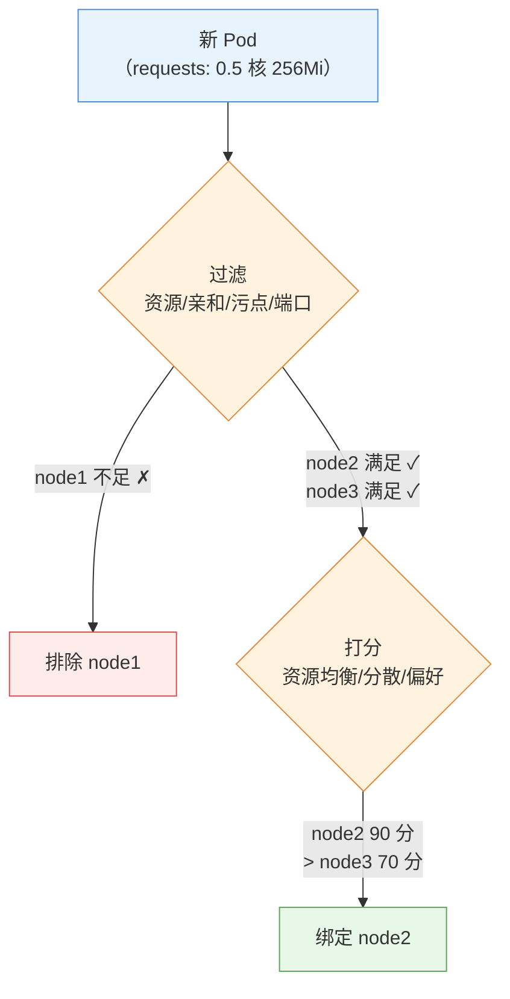

> 读图要点：**过滤是"一票否决"（不合格直接排除）、打分为"择优录取"（剩余里选最优）**——先保证可行性，再追求均衡性。

> **排障关联**：Pod 一直 Pending → `kubectl describe pod` 的 Events 看 `FailedScheduling`——**报错直接说"哪个条件不满足"**（如 `didn't match node selector`、`Insufficient cpu`、`Untolerated taint`），改对应配置即可（实验 10 Lab 1 三板斧）。

### 6.1.3 调度器的可替换性

调度器不是"硬编码"的：Pod 可以用 `schedulerName` 指定**自定义调度器**（如专门处理 GPU 任务的调度器）。默认调度器（kube-scheduler）覆盖绝大多数场景；知道"调度策略可插拔"即可（进阶内容）。

### 6.1.4 Descheduler：调度生命周期的闭环

**问题**：调度器**只在 Pod 创建时决策一次**——之后新节点加入、节点资源碎片化、副本增减，已运行的 Pod 不会重新平衡：

```text
场景：node1 挤满、node3 空着 → 新 Pod 调度到 node3
     但 node1 上的旧 Pod 不会自己挪过来 → 长期"贫富不均"
```

**Descheduler**（独立的控制器组件）定期扫描并**驱逐需要重新调度的 Pod**（按策略：低利用率节点合并、副本分散、节点年龄等）——被驱逐的 Pod 走优雅终止（第 4 章）后由控制器重建、重新调度（§6.1 流程）。

> **核心认知**：**Descheduler 与调度器互补**——调度器管"初始放置"，Descheduler 管"运行期再平衡"（配合 Cluster Autoscaler 第 14 章实现资源生命周期闭环）。教学环境可选安装，知道概念即可。

---

## 6.2 节点选择：把 Pod 定向到节点

### 6.2.1 nodeSelector：最简单的方式

给节点打标签，Pod 声明"只要带这个标签的节点"：

```yaml
# 节点标签
kubectl label node node2 disktype=ssd

# Pod 声明
spec:
  nodeSelector:
    disktype: ssd      # 只调度到 disktype=ssd 的节点
```

**特点与局限**：

- 简单直观，但**只能做"等值匹配"**（=）
- 不能表达"或"（ssd 或 nvme）、"非"（不要 CPU 密集节点）、"软性偏好"（最好在 SSD 上，没有也无妨）

> 需要更强表达力 → 节点亲和。

### 6.2.2 节点亲和/反亲和：表达式的力量

**节点亲和（nodeAffinity）** 是 nodeSelector 的升级版，支持**表达式匹配**与**软硬约束**：

- **requiredDuringScheduling**（硬性）：必须满足，否则不调度（≈ nodeSelector，但更强）
- **preferredDuringScheduling**（软性）：尽量满足，不满足也能调度（打分加权，§6.1.2）

```yaml
spec:
  affinity:
    nodeAffinity:
      requiredDuringSchedulingIgnoredDuringExecution:   # 硬性
        nodeSelectorTerms:
        - matchExpressions:
          - key: disktype
            operator: In
            values: ["ssd", "nvme"]      # 或：ssd 或 nvme
      preferredDuringSchedulingIgnoredDuringExecution:  # 软性
      - weight: 100                                    # 权重（打分用）
        preference:
          matchExpressions:
          - key: zone
            operator: In
            values: ["az-a"]             # 最好在 az-a，没有也行
```

### 6.2.3 matchExpressions 语法（operators）

| operator | 含义 | 示例 |
|---|---|---|
| `In` | 值在列表里 | `In` |
| `NotIn` | 值不在列表里 | 排除某些节点 |
| `Exists` | 键存在（不管值） | 节点有该标签 |
| `DoesNotExist` | 键不存在 | 节点没有该标签 |
| `Gt` / `Gt` | 值大于/小于（数值标签） | `Gt` |

> **为什么叫"节点亲和"而不是"节点选择"**：语义从"我选节点"升级为"节点与我的关系"——可以表达"我偏好在这些节点上"（软性），这是选择器做不到的。

### 6.2.4 三种节点选择手段的选型

| 手段 | 能力 | 适用 |
|---|---|---|
| `nodeName`（直接写节点名） | 指定唯一节点 | 特殊调试（**生产不推荐**：节点挂了 Pod 就困死） |
| `nodeSelector` | 等值匹配 | 简单场景（如"只上 GPU 节点"） |
| `nodeAffinity` | 表达式 + 软硬约束 | 需要"或/非/软偏好"的复杂场景 |

> **决策逻辑**：简单等值 → nodeSelector；需要表达式或软偏好 → nodeAffinity；`nodeName` 只在调试时用。

---

## 6.3 Pod 亲和/反亲和：Pod 之间的位置关系

### 6.3.1 为什么需要"Pod 之间的位置控制"

节点选择解决"Pod 与节点的关系"，但很多场景需要控制"**Pod 与 Pod 的关系**"：

- **反亲和（分散）**：同一应用的 3 个副本**不要放同一台节点**——一台挂了不至于全部副本一起挂（高可用）
- **亲和（聚合）**：缓存服务与计算服务**放在同一节点**——本地访问快（数据本地性）

nodeSelector/节点亲和做不了这个（它们只认节点标签，不关心其他 Pod 在哪）。

### 6.3.2 拓扑域（topologyKey）：用什么维度衡量"同一处"

Pod 亲和/反亲和的"就近/分散"需要一个**拓扑单位**——`topologyKey` 指定按哪个标签分组：

- `kubernetes.io/hostname`：按**节点**分（同一节点 = 同一拓扑域）
- `topology.kubernetes.io/zone`：按**可用区**分（同一机房 = 同一拓扑域）
- `topology.kubernetes.io/region`：按**地域**分

```yaml
topologyKey: kubernetes.io/hostname
   node1（web-1, web-2）│ node2（web-3）│ node3（）
   ↑ web-1 和 web-2 在同一拓扑域（同节点）→ 反亲和会避免这种情况
```

> **核心认知**：拓扑域 = "多分散/多聚合才算数"的度量单位。**同节点分散（hostname）是默认需求**；跨可用区分散（zone）是生产高可用的进阶需求。

### 6.3.3 podAffinity / podAntiAffinity

与节点亲和结构几乎一样，只是匹配对象从"节点标签"换成"**已运行 Pod 的标签**"：

```yaml
spec:
  affinity:
    podAntiAffinity:                       # 反亲和：分散
      requiredDuringSchedulingIgnoredDuringExecution:
      - labelSelector:
          matchLabels:
            app: web                       # 匹配"app=web 的已运行 Pod"
        topologyKey: kubernetes.io/hostname  # 以节点为单位分散
    podAffinity:                           # 亲和：聚合
      preferredDuringSchedulingIgnoredDuringExecution:
      - weight: 100
        podAffinityTerm:
          labelSelector:
            matchLabels:
              app: cache
          topologyKey: kubernetes.io/hostname  # 与 cache Pod 同节点最好
```

**硬性 vs 软性**（与节点亲和相同的语义）：

- `required`（硬）：**可能导致调度不上**——例如 5 个副本反亲和到 3 台节点（每节点最多 1 个），第 4、5 个会一直 Pending
- `preferred`（软）：尽量满足，打分加权

### 6.3.4 典型场景设计

**场景一：多副本高可用分布**

```text
3 副本 web + podAntiAffinity(required, hostname)
→ 每个节点最多 1 个 web 副本：一台节点挂了，另两台照常服务
```

> ⚠️ 注意：`required` 反亲和的副本数**不能超过节点数**（5 副本 × 3 节点 → 2 个永远 Pending）。高可用部署的标准组合是：**反亲和 + PDB + 多副本**（PDB 见 §6.5.2）。

**场景二：计算与缓存同地**

```text
计算 Pod（job） + podAffinity(preferred, app=cache, hostname)
→ 尽量调度到有 cache Pod 的节点：本地读缓存，不跨节点
```

### 6.3.5 Pod 拓扑分布约束（topologySpreadConstraints）

**问题**：podAntiAffinity 能做到"分散"，但表达力有限——只能按单一 topologyKey 写死规则，且是"有则避开"的硬逻辑。**现代多可用区/多节点均衡打散的最佳实践是 topologySpreadConstraints**：

```yaml
spec:
  topologySpreadConstraints:
  - maxSkew: 1                          # 允许的最大分布偏差（≤1 即"尽量均匀"）
    topologyKey: topology.kubernetes.io/zone   # 按可用区分组
    whenUnsatisfiable: DoNotSchedule     # 无法满足时：不调度（硬）/ScheduleAnyway（软）
    labelSelector:
      matchLabels:
        app: web
```

**与 podAntiAffinity 的对比**：

| 维度 | podAntiAffinity | topologySpreadConstraints |
|---|---|---|
| 语义 | "避开已有同标签 Pod" | "**按拓扑域均匀分布**"（偏差 ≤ maxSkew） |
| 多维度 | 单一 topologyKey | 可配多个约束（跨 zone + 跨节点同时约束） |
| 软硬 | required/preferred | DoNotSchedule / ScheduleAnyway |
| 适用 | 简单分散 | **跨可用区高可用、节点池均衡**（生产最佳实践） |

> **决策逻辑**：只是"同一节点别放两个" → podAntiAffinity 够用；要"跨可用区均匀分布、任何 zone 的 Pod 数差 ≤1" → topologySpreadConstraints（**生产高可用的标配**，常与 PDB、反亲和组合）。注意 `maxSkew` 过严可能导致调度不上（与 required 反亲和同样受节点数约束）。

---

## 6.4 污点与容忍：节点的"排斥力"与 Pod 的"通行证"

### 6.4.1 机制：两个方向的力量

前两节是 **Pod 主动挑节点**（亲和）；污点机制是 **节点主动排斥 Pod**：

- **污点（Taint）**：节点上打的"排斥标记"——默认情况下，带污点的节点**拒绝**没有相应容忍的 Pod
- **容忍（Toleration）**：Pod 声明的"通行证"——容忍了某个污点，才能被调度到该节点

```text
node1（带污点: dedicated=gpu:NoSchedule）
   ──► 普通 Pod：拒绝调度 ✗
   ──► 带容忍的 Pod：放行 ✓
```

### 6.4.2 三种 effect（排斥的强度）

| effect | 语义 | 典型用途 |
|---|---|---|
| `NoSchedule` | 不调度新 Pod（**已在跑的不管**） | 节点维护前隔离新负载 |
| `PreferNoSchedule` | 尽量不调度（软性，打分排斥） | 偏好性隔离 |
| `NoExecute` | 不调度新 Pod + **驱逐已在跑的**（不带容忍的 Pod 立即被赶走） | 节点故障/隔离的强手段 |

**NoExecute 的驱逐时间（tolerationSeconds）**：容忍可以带时长——`tolerationSeconds: 60` 表示"容忍 60 秒，之后被驱逐"。用于"故障节点上让 Pod 多活一会儿完成收尾"。

```bash
kubectl taint nodes node2 dedicated=gpu:NoSchedule     # 打污点
kubectl taint nodes node2 dedicated=gpu:NoSchedule-    # 去掉污点（末尾 -）
```

### 6.4.3 内置污点：你其实天天在用

集群里默认存在一些**系统污点**，理解了它们很多"奇怪现象"就通了：

- **控制面节点**：`node-role.kubernetes.io/control-plane:NoSchedule`——**这就是"控制面不跑业务 Pod"的实现机制**（第 2 章提到过；实验 04 Lab 6 就是去掉它让 控制面承载负载）
- **节点 NotReady**：`node.kubernetes.io/not-ready:NoExecute`——节点失联时驱逐其上 Pod（第 16 章排障相关）
- **磁盘/网络压力**：`node.kubernetes.io/disk-pressure` 等

> **DaemonSet 之谜解开**（第 5 章遗留问题）：calico-node 等 DaemonSet 为什么能跑在控制面节点上？——DaemonSet 的 Pod **自动容忍节点故障类污点**（not-ready/unreachable/disk-pressure 等，由 DaemonSet 控制器默认注入，保证节点异常时守护组件不被驱逐）；但 **control-plane 污点不自动容忍**——calico-node 能上控制面节点 是因为它的清单里**显式写了 tolerations**（实验 04 Lab 7 演练过）。

### 6.4.4 应用场景

- **专用节点**：GPU 节点打 `dedicated=gpu:NoSchedule`，只有带容忍的 AI 任务能上（防止普通任务挤占 GPU）
- **节点隔离**：节点出问题先 `NoExecute` 驱逐业务，再维护
- **控制面保护**：内置 control-plane 污点（§6.4.3）
- **混合环境**：隔离"测试节点"和"生产节点"

### 6.4.5 污点 vs 亲和（两个独立维度）

| 维度 | 谁主动 | 方向 |
|---|---|---|
| 亲和（nodeAffinity/podAffinity） | **Pod 主动挑** | Pod → 节点（我要去哪） |
| 污点/容忍 | **节点主动拒** | 节点 → Pod（我不要谁） |

两者**同时生效**（先过滤双方条件），配合使用：**亲和"要什么节点" + 容忍"能上什么节点"**——生产常用组合：GPU 任务 = nodeAffinity(要 gpu=true 的节点) + tolerations(容忍 gpu 污点)。

---

## 6.5 节点维护与驱逐保护

### 6.5.1 维护三步曲：cordon / drain / uncordon

节点要维护（升级/换硬件/重启）时，标准动作（实验 12 Lab 3 实操过）：

```bash
kubectl cordon node2      # ① 隔离：标记不可调度（已有 Pod 不受影响）
kubectl drain node2 --ignore-daemonsets   # ② 排空：驱逐所有业务 Pod（到其他节点）
[维护...]
kubectl uncordon node2    # ③ 恢复：重新可调度
```

- **cordon**：只挡新 Pod（= 打 `node.kubernetes.io/unschedulable` 标记）
- **drain**：驱逐 Pod（走第 4 章优雅终止流程：摘流量 → preStop → SIGTERM）——`--ignore-daemonsets` 跳过 DaemonSet（它们的 Pod 会由控制器在节点恢复后自动重建，驱逐无意义）
- **uncordon**：去掉隔离标记

> **为什么 drain 是安全的**：驱逐逐个进行、每个走优雅终止（实验 02 Lab 9）——业务无感迁移（配合 PDB，见下）。

### 6.5.2 PodDisruptionBudget：驱逐的保险丝

**问题**：drain node2 时，如果 node2 上正好有某应用的全部 3 个副本，一次全驱逐 = 服务中断。

**PDB（PodDisruptionBudget）**：约束"**主动驱逐**（drain 这类）最多能同时干掉几个副本"：

```yaml
apiVersion: policy/v1
kind: PodDisruptionBudget
metadata:
  name: web-pdb
spec:
  minAvailable: 2          # 至少保持 2 个可用
  selector:
    matchLabels:
      app: web
```

**ALLOWED DISRUPTIONS 计算**：

```text
当前可用副本数 3 - minAvailable 2 = 允许同时驱逐 1 个

kubectl get pdb
NAME      MIN AVAILABLE   ALLOWED DISRUPTIONS
web-pdb   2               1
```

**两个重要边界**：

1. PDB **只约束主动驱逐**（drain/自愿中断）——节点宕机、Pod 崩溃这类**非自愿中断不归它管**（控制器照样重建）
2. PDB 只保护"副本数量"——**不保护"这些副本是否可用"**：若 3 个副本里 2 个已经 CrashLoop（readiness 失败），PDB 可能直接阻止 drain（"可用数已经低于 minAvailable，不允许再驱逐"）

> **生产实践**：核心服务（数据库/网关/所有多副本应用）必须配 PDB——**否则一次节点维护就可能造成全量中断**。`maxUnavailable` 模式（上限）与 `maxUnavailable` 模式（保底）二选一。

---

## 6.6 综合走查：一个 Pod 的完整落点决策

把本章所有机制串起来——一个带完整约束的 Pod 从创建到落点：

```bash
kubectl apply -f gpu-job.yaml（期望：3 副本、要 GPU 节点、副本分散、容忍 GPU 污点）
   │
   ▼ 调度器过滤（阶段一）：
   ① 资源过滤：节点剩余 ≥ requests？
   ② 节点亲和：节点有 gpu=true 标签？（nodeAffinity required）
   ③ 污点过滤：节点有 GPU 污点 → Pod 有容忍吗？（tolerations）
   ④ Pod 反亲和：该节点已有 gpu-job 副本？（podAntiAffinity required, hostname）
   → 候选节点集
   │
   ▼ 打分（阶段二）：
   资源均衡度 + preferred 偏好（如"优先 zone-a"）
   → 选出最优节点 node2
   │
   ▼ 绑定：Pod.nodeName = node2 → kubelet 拉起
   │
   ▼ 之后（运行时保护）：
   节点维护 drain → PDB 限制同时驱逐数（minAvailable=2）→ 优雅终止迁移
```

> **设计顺序建议**：先定"应用类型与副本数"（第 5 章）→ 再定"落点约束"（本章：节点亲和 + 污点容忍 + Pod 反亲和）→ 最后加"运行期保护"（PDB + 探针）。三层约束各有各的职责，缺一不可。

---

## 6.7 实验演练指引

本章机制对应实验 **04「集群资源调度」**（7 个 Lab）：

- **Lab 1 labels 和 nodeSelector**：给节点打标签 + nodeSelector 定向调度——基础手段
- **Lab 2 亲和性**：nodeAffinity（matchExpressions）+ podAntiAffinity 分散副本——表达式与拓扑域
- **Lab 3 taint 和 tolerations**：给节点打污点 + Pod 加容忍——"排斥力与通行证"亲手验证
- **Lab 4 drain 和 uncordon**：节点排空与恢复——维护三步曲
- **Lab 5 PDB**：创建 PodDisruptionBudget，**drain 时被 PDB 拦截**（实测观察）
- **Lab 6 使 控制面承载工作负载**：去掉 control-plane 污点——内置污点的实操
- **Lab 7 部署在控制面节点上的 DaemonSet**：容忍控制面污点后 DaemonSet 上控制面节点——内置污点 + 容忍组合

> 教学建议：实验顺序就是本章小节顺序——Lab 1/2 对应 §6.2/6.3（Pod 主动挑），Lab 3 对应 §6.4（节点主动拒），Lab 4/5 对应 §6.5（维护与保护），Lab 6/7 对应 §6.4.3（内置污点实战）。

---

## 本章小结

- **调度本质**：新 Pod（Pending）→ 调度器两阶段（过滤硬条件 + 打分选最优）→ 写 nodeName → kubelet 拉起
- **过滤项**：资源/亲和/污点容忍/端口等；**打分项**：资源均衡/Pod 分散/软偏好
- **节点选择**：nodeSelector（等值）→ nodeAffinity（表达式 + 软硬）——需要"或/非/软偏好"用亲和
- **Pod 亲和**：topologyKey 定义"同一处"（hostname=同节点、zone=同可用区）；反亲和分散副本保高可用（**副本数 ≤ 拓扑域数**）
- **污点/容忍**：节点主动拒（NoSchedule 挡新/NoExecute 连旧一起驱逐）；内置污点解释了"控制面不跑业务"与"DaemonSet 上控制面节点"
- **维护三步曲**：cordon（挡新）→ drain（驱逐，走优雅终止）→ uncordon（恢复）
- **PDB**：只保护**主动驱逐**的副本数（ALLOWED = 可用 - minAvailable）——核心服务必配
- **三层设计**：副本数（第 5 章）+ 落点约束（本章）+ 运行期保护（PDB/探针）

**衔接**：第 7 章讲"资源不够了怎么办"——扩缩容（HPA）与资源治理（requests/limits 体系、LimitRange、ResourceQuota），调度器过滤里的"资源"就是第 7 章的主角。

## 思考题

1. 调度器过滤阶段和打分阶段各回答什么问题？举一个"过滤通过但打分靠后"的例子。
2. nodeSelector 与 nodeAffinity 的本质区别是什么？什么场景必须用亲和？
3. 5 个副本配 `podAntiAffinity(required, hostname)` 在 3 节点集群会发生什么？为什么？
4. taint 的 NoExecute 与 NoSchedule 的区别？容忍里 `tolerationSeconds: 60` 是什么意思？
5. 为什么 DaemonSet 的 Pod 能跑到带 control-plane 污点的 控制面节点上？
6. PDB 能防止节点宕机导致的业务中断吗？为什么？（提示：自愿 vs 非自愿中断）
7. 设计一个"GPU 推理服务"的落点方案：要 GPU 节点、副本分散、节点维护时业务无损——需要哪几层配置？

> **CKA 考点标注**（对应域 2：工作负载与调度 15%）：
> - **必考命令**：`kubectl label node`、`kubectl label node`、`kubectl label node`、`kubectl label node`
> - **必考机制**：两阶段调度、nodeAffinity（required/preferred + matchExpressions）、podAntiAffinity + topologyKey、污点三种 effect、PDB 计算（minAvailable/maxUnavailable）
> - **高频场景题**：给定需求（专用节点/分散高可用/维护窗口）→ 配置对应机制
> - 排障关联（域 5）：`FailedScheduling`（调度条件不满足，describe 看 Events）


---


# 第 7 章 自动扩缩与资源治理

> 配套实验手册：《Kubernetes 实验手册》（manual/ 目录）**实验 05「资源管理和监控」**（4 个 Lab：metrics-server/HPA/LimitRange/ResourceQuota）。本章讲两件事：**自动扩缩**（负载变了，副本数怎么自动跟随）与**资源治理**（怎么防止资源被滥用）——前者是"弹性"的实现，后者是"秩序"的保障，两者都围绕第 4 章的 requests/limits 展开。

## 学习目标

学完本章，你应该能够：

1. 解释指标链路（kubelet → metrics-server → metrics API），知道 HPA 和 kubectl top 的数据来源
2. 解释 HPA 的工作原理（控制循环 + 指标 → 期望副本数），说出指标类型与计算公式
3. 解释 HPA 的伸缩节奏（稳定窗口/冷却）与 behavior 策略
4. 区分三种扩缩（HPA 水平/VPA 垂直/ClusterAutoscaler 节点级）的定位
5. 解释资源治理三层防线（requests/limits → LimitRange → ResourceQuota）各自的管辖范围
6. 解释 LimitRange 与 ResourceQuota 的拒绝机制（准入控制）
7. 说出"没有限制"与"限制过严"的风险，设计合理的资源治理方案

---

## 7.1 指标链路：扩缩容的数据基础

### 7.1.1 谁提供"用量数据"

第 4 章讲过 requests/limits 是**静态声明**；但"实际用了多少"需要**动态数据**——这就是 metrics-server 的角色：

- **metrics-server**：集群内的**指标采集器**（kube-system 里的一个 Deployment，实验 01 安装）
- 它从每个节点的 **kubelet（cAdvisor）** 拉取节点与容器的 CPU/内存用量，聚合后暴露为标准 API

### 7.1.2 指标链路

```text
节点上的容器
   │ kubelet 内置 cAdvisor 采集（CPU/内存实际用量）
   ▼
metrics-server（默认单副本 Deployment，从各节点 kubelet 的 Summary API 拉取）
   │ 聚合
   ▼
metrics.k8s.io API（apiserver 暴露的标准接口）
   ├─ kubectl top node / top pod（人看）
   └─ HPA 控制器（机器用，§7.2）
```

> **核心认知**：没有 metrics-server，`kubectl top` 报 `kubectl top`，**HPA 也无法工作**（指标未知 → 无法决策）。所以实验 05 的 Lab 1 是 HPA 的前提。

> 注意：metrics-server 只提供**实时用量**（不存历史）；历史趋势与告警需要 Prometheus 这类完整监控（第 15 章可观测性展开）。

---

## 7.2 HPA：水平自动扩缩

### 7.2.1 原理：又一个控制循环

**HPA（HorizontalPodAutoscaler）** 把第 2 章的控制循环应用在"副本数"上：

<!-- 原 ASCII 图已转为 Mermaid -->
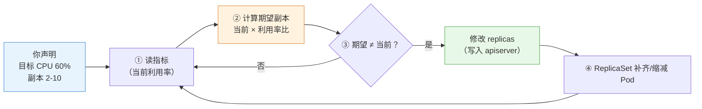

> 读图要点：**HPA 是控制循环的又一个实例**（周期约 15 秒）——读指标 → 算期望副本（当前 × 利用率比）→ 有差异才改 replicas；修改 replicas 只是改期望状态，真正补齐 Pod 的是 ReplicaSet（第 5 章）。

```text
示例：副本 3，目标 60%，当前利用率 90%
  期望副本 = 3 × (90% / 60%) = 4.5 → 取整 5
  → replicas 3 → 5（扩容）
```

### 7.2.2 指标类型（autoscaling/v2）

| 指标类型 | 含义 | 示例 |
|---|---|---|
| **Utilization**（利用率） | 实际用量 / requests 的百分比 | CPU 利用率 60%（最常用） |
| **AverageValue**（平均值） | 每副本的平均绝对用量 | 每副本内存 200Mi |
| **Value**（总值） | 整个工作负载的总量 | 总请求数 |
| 自定义/外部指标 | Prometheus 等来源（需适配器） | QPS、队列长度（进阶） |

> 注意 Utilization 的分母是 **requests**（不是节点容量）——所以 **HPA 的准确性依赖 requests 设置合理**（第 4 章资源模型的意义又一处体现）。

### 7.2.3 伸缩节奏：为什么不会"抖"？

指标是波动的——如果利用率在 59%/61% 间跳，副本数会不停增减（抖动）。HPA 用**稳定窗口**平滑：

- **scaleUp 稳定窗口**（默认 0 秒，可配置如 60s）：利用率持续超目标这么久才扩容
- **scaleDown 稳定窗口**（默认 5 分钟）：利用率持续低于目标这么久才缩容——**缩容比扩容谨慎**（扩错了最多多花钱，缩错了会扛不住流量）

### 7.2.4 behavior：精细控制伸缩

```yaml
behavior:
  scaleUp:
    stabilizationWindowSeconds: 60     # 扩容稳定窗口
    policies:
    - type: Percent
      value: 100                       # 一次最多翻倍
      periodSeconds: 60
  scaleDown:
    stabilizationWindowSeconds: 300    # 缩容稳定窗口（默认 5 分钟）
    policies:
    - type: Percent
      value: 50                        # 一次最多缩一半
```

> **生产要点**：默认行为（5 分钟缩容稳定窗口）通常够用；关键业务可收紧 scaleUp 窗口（更快扩容）、拉长 scaleDown 窗口（更稳的缩容）。

### 7.2.5 局限与注意

- **指标延迟**：metrics-server 采集有延迟（~15s），HPA 决策滞后于流量变化——**突发流量场景要预留余量**（目标利用率别设 90%，留 60-70%）
- **最小/最大副本**：`minReplicas` 保底（应对冷启动）、`minReplicas` 封顶（防失控）
- **与手动 scale 的关系**：手动 `kubectl scale` 会**被 HPA 覆盖**（HPA 是权威）——要么手动、要么 HPA，不要混用（调整 HPA 的 min/max 而不是手动 scale）
- **与第 4 章资源模型的关系**：HPA 只认 requests——**Pod 没配 requests，HPA 的 CPU 利用率指标不可用**

---

## 7.3 垂直扩缩与集群扩缩：另外两个维度

HPA 只是"水平"（加副本）。还有两个扩缩维度：

### 7.3.1 VPA（Vertical Pod Autoscaler）：调 requests 而不是副本数

- **原理**：根据历史用量**自动调整 Pod 的 requests/limits**（而不是副本数）
- **为什么需要**：应用实际需求会变（内存泄漏前的膨胀、业务高峰）——人工调 requests 很烦
- **机制**：VPA 建议 → 修改 Deployment 模板 → 滚动更新（**需要重建 Pod 生效**，因为是模板变化）
- **注意**：VPA 与 HPA 在 CPU/内存指标上**不能同时用**（会打架）——生产常用"VPA 调 requests + HPA 管副本"

> ⭐ **In-place Pod Resource Updates（v1.27+）**：Kubernetes 原生支持**不重启 Pod** 原地更新部分资源字段（`spec.containers[].resources` 的 Requests/Limits）——改变了 VPA 必须"重建 Pod"的运作模式。开启该特性后，VPA 或手动 `spec.containers[].resources` 修改资源可以**原地生效**（对重启敏感的有状态服务意义重大）。v1.36 已支持（部分字段需要 Pod 不在 QoS 突变范围）。

### 7.3.2 ClusterAutoscaler（CA）：节点级扩缩

- **原理**：集群资源不足时**自动增减节点**（云环境，调用云厂商 API）
- **为什么需要**：Pod 挤满所有节点（调度过滤失败 Pending）→ 加节点；节点长期空闲 → 减节点
- **注意**：需要云环境（裸机集群无法自动加机器）；与 HPA 配合形成"应用级 + 节点级"双层弹性

### 7.3.3 三种扩缩的定位

| 维度 | 调整什么 | 生效方式 | 适用 |
|---|---|---|---|
| **HPA**（水平） | 副本数 | 立即（改 replicas） | 无状态应用，最常用 |
| **VPA**（垂直） | requests/limits | 需重建 Pod（v1.27+ 可原地） | 有状态/不好水平扩展的应用 |
| **ClusterAutoscaler**（节点级） | 节点数 | 分钟级（云 API） | 集群容量不足时 |

> **决策逻辑**：**默认 HPA**（无状态应用的水平扩展是首选）；副本数不能随便加（有状态/单实例）→ VPA；节点容量瓶颈 → ClusterAutoscaler。三者可以组合（生产标准组合：HPA + CA）。

### 7.3.4 KEDA：事件驱动自动扩缩（进阶）

**HPA 的局限**：只认 CPU/内存（或需额外适配器接自定义指标）。生产中常见"**消息队列堆积量**触发扩容"（RabbitMQ/Kafka 积压 1 万条 → 加消费者）——这是 **KEDA（Kubernetes Event-driven Autoscaling）** 的场景：

- KEDA 内置 70+ **Scaler**（Kafka/RabbitMQ/Redis/HTTP 等），直接读外部系统指标
- 以"自定义指标源"形式接入 HPA（KEDA 负责把外部指标变成 HPA 能用的指标）
- 使用：安装 KEDA → 创建 `ScaledObject`（声明"队列长度 > N 时扩到 M 个"）

> 决策逻辑：**标准 CPU/内存 → HPA 原生；外部系统事件（队列/吞吐）驱动 → KEDA**（事件驱动弹性，Serverless 化工作负载的方向）。

---

## 7.4 资源治理三层防线

> 资源治理回答："怎么防止某个 Pod/命名空间把集群资源吃光？"——**三层防线，层层递进**（第 4 章 requests/limits 是地基）。

### 7.4.1 第一层：requests/limits（Pod 自己声明）

- 每容器声明"要多少/最多用多少"（实验 02 Lab 10）
- **问题**：靠自觉——Pod 不写就没有；写小了（requests）节点可能超卖；写大了浪费

### 7.4.2 第二层：LimitRange（命名空间内约束"单个 Pod"）

**LimitRange** 在**命名空间级别**给"单个对象"设默认值与上下限：

```text
命名空间 dev 的 LimitRange：
  - 每个 Pod 的 requests 必须在 50m~2 核、内存 32Mi~1Gi
  - Pod 没写 requests/limits → 自动填默认值（default/defaultRequest）
```

**三个动作**（准入控制实现，第 12 章展开）：

1. **校验**：Pod 声明超出范围 → **创建被拒**（`Forbidden`）
2. **填充**：Pod 没声明 → 自动补默认值（**防止"裸奔"Pod**——这是最重要的一条）
3. **约束**：统一命名空间的资源声明口径

```bash
kubectl -n dev apply -f lr-pod.yaml（requests 4 核 > 上限 2 核）
Error from server (Forbidden): ... maximum cpu usage per Pod is 2, but request is 4
```

> **核心认知**：LimitRange 解决"**单个 Pod 不守规矩**"——要么超限被拒，要么没写被填默认。

### 7.4.3 第三层：ResourceQuota（命名空间内约束"总量"）

**ResourceQuota** 约束**整个命名空间的累计用量**——所有 Pod 的 requests/limits **加起来**不能超过配额：

```text
命名空间 dev 的 ResourceQuota：
  requests.cpu: 10 核、requests.memory: 20Gi
  limits.cpu: 20 核、limits.memory: 40Gi
  pods: 100、services: 50、pvc: 20 ...
```

- 超过配额 → 新对象创建被拒（`exceeded quota`）
- **资源释放后自动恢复**（删掉占用后又能建）
- 还能配额对象数量（pods/services/pvc 等）——防止命名空间资源无限膨胀

```bash
kubectl -n dev apply -f new-pod.yaml
Error from server (Forbidden): exceeded quota: dev-quota, requested: requests.cpu=500m, used: requests.cpu=9.7, limited: requests.cpu=10
```

> **排障关联**：创建 Pod 报 `exceeded quota`（实验 10 Lab 1）→ `exceeded quota` 看 Used/Hard——**报错直说超了哪个配额**。

### 7.4.4 三层协作与设计建议

<!-- 原 ASCII 图已转为 Mermaid -->
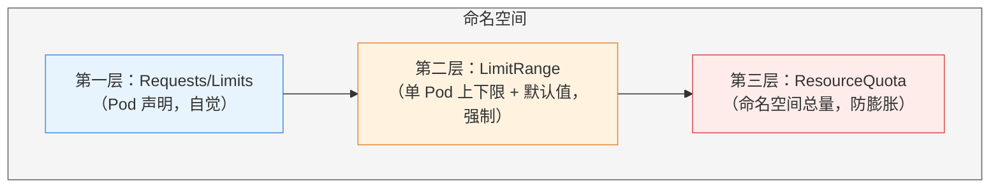

> 读图要点：**三层是"递进约束"**——Requests/Limits 是 Pod 自觉声明（不写就没人管）；LimitRange 在命名空间内强制单 Pod 的默认值与上下限；ResourceQuota 兜底命名空间总量——后两层都在准入控制执行（第 12 章）。

**设计建议**（生产视角）：

- 每个**生产命名空间**都配 ResourceQuota（总量兜底）
- 配 LimitRange 的 `default`（**强制每个 Pod 都有 requests**——HPA 依赖它、调度依赖它）
- 测试命名空间配额可以小（倒逼省资源）；生产按业务量评估
- 记住拒绝机制都在**准入控制**（创建时拦截，第 12 章展开原理）

### 7.4.5 设计指南：多租户治理体系

> 多团队/多业务共用一个集群时，"怎么隔离 + 怎么分资源"是核心治理问题——与第 11 章 RBAC 联动，构成完整的多租户体系。

**命名空间规划模型**（按组织规模选）：

```text
模型一：按环境划分（小团队）        dev / staging / production
模型二：按团队×环境（中型组织）     team-order-dev / team-payment-prod
模型三：按业务域划分（大型组织）    domain-trade / domain-payment
        域内按微服务部署，跨域用 NetworkPolicy 隔离（第 9 章）
```

**多租户隔离四层模型**（层层加固）：

| 层级 | 机制 | 隔离强度 | 适用 |
|---|---|---|---|
| L1 逻辑隔离 | Namespace + RBAC（第 11 章） | ⭐⭐ | 同信任域内团队 |
| L2 资源隔离 | ResourceQuota + LimitRange（本章） | ⭐⭐⭐ | 防 Noisy Neighbor（吵闹邻居） |
| L3 网络隔离 | NetworkPolicy（第 9 章） | ⭐⭐⭐⭐ | 跨团队安全边界 |
| L4 节点隔离 | Taint/Toleration + 专用节点池（第 6 章） | ⭐⭐⭐⭐⭐ | 合规/安全敏感负载 |

**资源超卖策略**（配额与 requests 的设计）：

```text
测试环境：超卖比 200-300%（requests 低、limits 高，允许争抢）
生产环境：超卖比 120-150%（requests 接近实际用量）
核心服务：超卖比 100%（Guaranteed QoS，requests = limits，零争抢）
监控指标：节点实际利用率 / requests 总和 = 实际超卖比，> 85% 触发扩容
```

> 决策逻辑：**先定租户模型（命名空间规划）→ 再定隔离级别（四层按需）→ 最后定超卖策略（配额/requests 比例）**——多租户治理 = "逻辑划分 + 资源约束 + 网络边界"三件套。

---

## 7.5 实验演练指引

本章机制对应实验 **05「资源管理和监控」**（4 个 Lab）：

- **Lab 1 安装 metrics-server**：指标链路的数据源——`kubectl top node/pod` 有数（requests/limits 基础在实验 02 Lab 10）
- **Lab 2 启用 HPA**：autoscaling/v2 配置 CPU/内存指标，压测观察副本自动增减
- **Lab 3 LimitRange**：`min/max/default/defaultRequest`——超限 Forbidden、缺省自动填充
- **Lab 4 ResourceQuota**：`hard` 配额 + `hard` 观察——超配额拒绝、释放恢复

> 教学建议：Lab 1 是 HPA 的前提（无指标无决策）；Lab 3/4 对比记忆——**LimitRange 管单个、ResourceQuota 管总量**。

---

## 本章小结

- **指标链路**：kubelet（cAdvisor）→ metrics-server → metrics API → kubectl top / HPA——**没 metrics-server 就没有 HPA**
- **HPA**：控制循环 + 指标 → 期望副本数（当前 × 利用率比）；Utilization 的分母是 **requests**；稳定窗口防抖动（缩容默认 5 分钟）
- **三种扩缩**：HPA 水平（加副本，首选）/ VPA 垂直（调 requests，需重建）/ CA 节点级（云环境加机器）——生产组合 HPA + CA
- **三层防线**：requests/limits（自觉）→ LimitRange（单 Pod 默认值/上下限，**强制有 requests**）→ ResourceQuota（命名空间总量）；拒绝都在准入控制（Forbidden/exceeded quota）
- **HPA 与资源模型联动**：requests 设得准 → 调度准、HPA 准、配额准

**衔接**：第 8 章讲配置管理（ConfigMap/Secret）——应用"运行参数"的外部化；资源治理管"用多少"，配置管理管"怎么配"。

## 思考题

1. 没有 metrics-server 时，HPA 会怎样？kubectl top 会怎样？
2. HPA 计算期望副本数时，为什么"当前利用率/目标利用率"用乘法？（提示：比例关系）
3. 为什么缩容稳定窗口默认比扩容长？极端情况下把两个窗口都设 0 会怎样？
4. 某 Pod 没配 requests，HPA 的 CPU 利用率指标为什么不可用？
5. LimitRange 与 ResourceQuota 的管辖范围分别是什么？"exceeded quota" 和 "Forbidden: maximum cpu" 分别来自哪层？
6. 为什么生产建议给每个命名空间配 LimitRange 的 default？（提示：HPA/调度/配额都依赖 requests）

> **CKA 考点标注**（对应域 2/5）：
> - **必考操作**：`kubectl autoscale deployment xxx --cpu=50% --min=2 --max=10`（v1.36 语法，旧 `kubectl autoscale deployment xxx --cpu=50% --min=2 --max=10` 已弃用）、`kubectl autoscale deployment xxx --cpu=50% --min=2 --max=10`、`kubectl autoscale deployment xxx --cpu=50% --min=2 --max=10`
> - **必考机制**：HPA 计算公式与稳定窗口、LimitRange（default/min/max/Forbidden）、ResourceQuota（hard/Used/exceeded quota）
> - **高频场景题**：给定资源策略需求 → 配置 LimitRange/ResourceQuota/HPA
> - 排障关联（域 5）：`exceeded quota`、`exceeded quota`、HPA 副本不动的排查


---


# 第 8 章 配置管理：ConfigMap 与 Secret

> 配套实验手册：《Kubernetes 实验手册》（manual/ 目录）**实验 06「ConfigMap 和 Secret」**（5 个 Lab + Secret 类型补充 + Downward API 补充）。本章承接第 4 章"容器怎么配置"（env/command 硬编码），讲**配置怎么外部化**——把配置从镜像/yaml 里"抽"出来，交给 ConfigMap 与 Secret 统一管理。

## 学习目标

学完本章，你应该能够：

1. 解释"配置外部化"的必要性（镜像不可变/多环境/敏感信息三痛点）
2. 解释 ConfigMap 的本质与两种消费方式（卷挂载 vs 环境变量）的机制差异
3. 解释"卷挂载支持热更新、env 注入需要重启"的底层原因
4. 解释 Secret 与 ConfigMap 的关系，以及"base64 是编码不是加密"的深刻含义
5. 说出 Secret 的四种类型及各自用途（Opaque/tls/dockerconfigjson/service-account-token）
6. 区分 ConfigMap/Secret（外部配置）与 Downward API（自身元数据）
7. 说出 Secret 的安全边界（RBAC/etcd 加密/最小权限）
8. 设计一个应用的完整配置方案（哪些进 ConfigMap、哪些进 Secret、哪些进 Downward API）

---

## 8.1 为什么需要"配置外部化"

### 8.1.1 配置写死在镜像/代码里的三个痛点

第 4 章学了 env 和 command——但如果把配置直接写进镜像或 Deployment yaml，会遇到：

1. **镜像不可变原则被破坏**：镜像（第 1 章分层）一旦构建就不该改——改了配置就得重新构建镜像、重新发布
2. **多环境无法复用**：dev/test/prod 的数据库地址、日志级别不同——写死一份镜像只能服务一个环境
3. **敏感信息暴露**：密码写进 yaml → 进 Git → 泄密；写进镜像 → 所有拉取镜像的人都能看到

### 8.1.2 配置外部化的原则

> 十二要素（12-Factor）的核心：**"配置"与"代码"分离**——同一份镜像，通过注入不同的配置运行在不同环境。

Kubernetes 的答案是两个专用对象：

- **ConfigMap**：非敏感配置（连接串、开关、日志级别）
- **Secret**：敏感配置（密码、Token、证书）

两者机制几乎一样，唯一的本质区别是**数据的敏感程度**。

---

## 8.2 ConfigMap：非敏感配置

### 8.2.1 本质与创建

**ConfigMap** 就是一个"键值对仓库"（`data` 区），键可以是短字符串，也可以是**整个配置文件的内容**：

```yaml
apiVersion: v1
kind: ConfigMap
metadata:
  name: app-config
data:
  LOG_LEVEL: info            # 键值对（短配置）
  APP_PORT: "8080"
  app.conf: |                # 键 = 文件名，值 = 文件内容（长配置）
    server.port=8080
    server.timeout=30
```

创建方式：

- `kubectl create configmap xxx --from-literal=KEY=VAL`（字面量）
- `kubectl create configmap xxx --from-file=app.conf`（文件）
- `kubectl create configmap xxx --from-file=conf.d/`（目录，每个文件一个键）
- 或声明式 yaml（生产推荐）

### 8.2.2 消费方式一：卷挂载（键变文件）

把 ConfigMap 挂成**卷**，每个键变成目录里的一个文件：

```yaml
spec:
  containers:
  - name: app
    volumeMounts:
    - name: config
      mountPath: /etc/app      # ConfigMap 挂到这里
  volumes:
  - name: config
    configMap:
      name: app-config
```

```text
/etc/app/
├── LOG_LEVEL     # 内容是 "info"
├── APP_PORT      # 内容是 "8080"
└── app.conf      # 内容是完整配置文本
```

适合：应用**读配置文件**的场景（配置文件是文件，不是环境变量）。

### 8.2.3 消费方式二：环境变量（键变变量）

把指定的键注入为**环境变量**：

```yaml
spec:
  containers:
  - name: app
    env:
    - name: LOG_LEVEL              # 环境变量名
      valueFrom:
        configMapKeyRef:
          name: app-config
          key: LOG_LEVEL           # 从 ConfigMap 取这个键
```

适合：应用**读环境变量**的场景（12-Factor 风格）。

### 8.2.4 两种方式对比

| 维度 | 卷挂载 | env 注入 |
|---|---|---|
| 形态 | 键 → 文件 | 键 → 环境变量 |
| 应用读取 | 读文件（配置类应用） | 读环境变量 |
| **热更新** | **改 ConfigMap 后文件自动更新**（无需重启） | **改后需重启 Pod 才生效** |
| 场景 | 配置文件、整个 conf 目录 | 少量开关、连接参数 |

<!-- 原 ASCII 图已转为 Mermaid -->
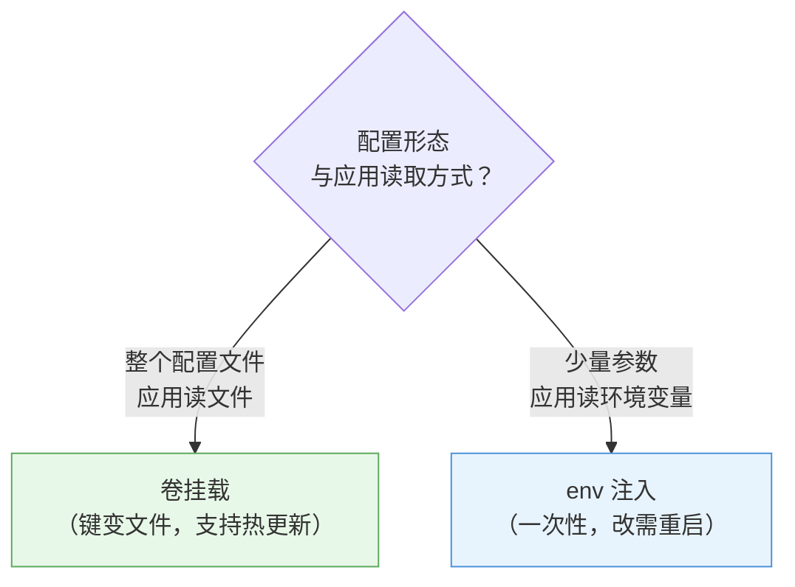

> 读图要点：**判断依据是"形态 + 读取方式"**——配置是文件 → 卷挂载；配置是少量键值且应用读 env → env 注入；热更新需求直接排除 env。

### 8.2.5 热更新的底层原理（重要）

- **卷挂载为什么能热更新**：kubelet 定期同步 ConfigMap 到本地缓存目录，挂载是"软链/绑定挂载"——ConfigMap 变了，**文件内容跟着变**，应用读到新值（应用自己要不要"重新读文件"取决于应用实现）
- **env 为什么不能**：环境变量是**进程启动时**注入的——进程已经跑起来了，改 env 不会进到正在运行的进程里，**只能重启 Pod**（新 Pod 用新值）

> **决策逻辑**：需要频繁改配置、应用读文件 → 卷挂载（热更新）；少量一次性参数、应用读 env → env 注入。

### 8.2.6 subPath 挂载陷阱（经典坑，必读）

**subPath** 让你只挂 ConfigMap 里的**单个文件**（而不是整个目录）：

```yaml
volumeMounts:
- name: config
  mountPath: /etc/nginx/nginx.conf   # 只挂这个文件
  subPath: nginx.conf                # 而不是整个 config 目录
```

**为什么是坑**：subPath 挂载是**直接复制文件**（不做软链接）——**ConfigMap 更新后，subPath 挂载的文件不会跟着变（彻底丧失热更新）**！要更新只能重启 Pod。

> **决策逻辑**：`subPath` 适合"只挂单个文件 + 配置基本不变"的场景；需要热更新的配置文件**不要用 subPath**（挂整个目录或目录里放单文件）。这是 K8s 社区最经典的配置坑之一。

### 8.2.7 immutable 与热更新工具（生产性能）

- **immutable（不可变）**：`immutable: true` 的 ConfigMap/Secret **禁止修改**（只能删除重建）——好处：kubelet 不再轮询检查变化，**大规模集群控制面压力大幅下降**；适合"基本不变"的配置（如公共证书、系统级配置）
- **Reloader 工具**（第三方）：自动监听 ConfigMap/Secret 变化并**滚动重启**关联 Deployment——解决"env/subPath 不能热更新"的自动化方案（`reloader.stakater.com/auto: "true"` 注解标记）

> **生产组合**：配置文件卷挂载（热更新）+ 少量参数 immutable（省轮询）+ 需要重启生效的场景用 Reloader 自动滚动。

---

## 8.3 Secret：敏感配置

### 8.3.1 与 ConfigMap 的关系

Secret 的结构与 ConfigMap **几乎一样**（`data` 区键值对），差别在：

- 值必须 **base64 编码**（ConfigMap 明文）
- `describe`/`describe` 默认**不显示内容**
- 有**类型**字段（§8.3.3）
- 访问控制更严格（RBAC 可单独授权，§8.3.5）

```yaml
apiVersion: v1
kind: Secret
metadata:
  name: mysql-pass
type: Opaque
data:
  password: d29yZHByZXNzMTIz    # "wordpress123" 的 base64
```

消费方式与 ConfigMap 相同（卷挂载 `secret` 卷 / env 的 `secret`）——挂载后**自动还原明文**（文件里是原始值，不是 base64）。

### 8.3.2 重要认知：base64 是编码，不是加密

- base64 只是"字节 → 可打印字符"的**编码**（第 2 章 kubeconfig 里的证书数据也是 base64）——**任何人都能解码**
- 证明：`kubectl get secret mysql-pass -o yaml` 拿到密文 → `kubectl get secret mysql-pass -o yaml` 秒还原（实验 06 Lab 4 亲手验证）
- **Secret 的真正安全依赖**：
  1. **RBAC**：谁能读 Secret（第 11 章授权机制）
  2. **etcd 静态加密**：落盘加密（实验 09 Lab 9 实操，防备份泄露）
  3. **最小权限**：不用的 Secret 不创建、不授权

> **一句话**：把 base64 当加密是新手最常见的误解——它只是"传输/存储格式"，安全靠权限和加密存储。

### 8.3.3 Secret 的类型

| 类型 | 用途 | 键要求 |
|---|---|---|
| `Opaque`（默认） | 通用敏感值（密码/Token/API Key） | 任意键 |
| `kubernetes.io/tls` | TLS 证书（Ingress 的 HTTPS） | 固定 `kubernetes.io/tls` + `kubernetes.io/tls` |
| `kubernetes.io/dockerconfigjson` | 私有镜像仓库凭据 | 固定 `kubernetes.io/dockerconfigjson` |
| `kubernetes.io/service-account-token` | SA 令牌（系统使用） | 自动管理 |

**两个"非通用"消费特例**（不通过 env/卷，而是被系统直接引用）：

- **tls 类型** → Ingress 的 `spec.tls.secretName`（实验 07 Ingress TLS）
- **dockerconfigjson 类型** → Pod 的 `imagePullSecrets`（拉私有镜像时用它认证）

```bash
kubectl create secret tls my-tls --cert=cert.crt --key=key.key
kubectl create secret docker-registry regcred --docker-server=... --docker-username=... --docker-password=...
```

### 8.3.4 消费方式

与 ConfigMap 完全相同（卷挂载 / env 注入）+ 上面两个系统级特例。区别只在**数据的敏感性**——设计上 Secret 更"金贵"：只给需要的 Pod 挂，别一把梭。

### 8.3.5 Secret 的安全边界

- **RBAC**：Secret 的读权限要单独收紧（`get secret` 就是拿到了全部值——第 11 章）
- **etcd 静态加密**：默认 etcd 里 Secret 明文存储——配 EncryptionConfiguration 落盘加密（实验 09 Lab 9）
- **最小权限**：一个 Secret 只给需要的命名空间/应用；定期轮换
- **外部密钥管理**（进阶）：生产可接 External Secrets（Vault/AWS Secrets Manager），集群里不落明文——知道存在即可

---

## 8.4 Downward API：注入"自己是谁"

第 4 章 §4.5.4 讲过 Downward API（实验 06 补充实操）。放在本章对比是为了建立完整图景——**三种"注入"的界限**：

| 注入来源 | 对象 | 典型内容 | 使用 |
|---|---|---|---|
| **ConfigMap** | 外部配置 | 数据库地址、开关、配置文件 | 应用"要什么" |
| **Secret** | 外部敏感配置 | 密码、Token、证书 | 应用"凭什么" |
| **Downward API** | **Pod 自身元数据** | Pod 名、命名空间、节点名、labels | 应用"我是谁" |

```text
┌─────────────────────────────────────────┐
│  应用容器（env / 卷 两种注入通道）        │
│    ├─ ConfigMap → 外部配置（第 8 章）     │
│    ├─ Secret     → 敏感配置（第 8 章）    │
│    └─ Downward   → 自身元数据（第 4 章）  │
└─────────────────────────────────────────┘
```

> **判断标准**：数据是"环境给的"（CM/Secret）还是"我自己身上的"（Downward）？

---

## 8.5 配置管理最佳实践（生产）

1. **配置全进对象，yaml 零硬编码**：Deployment yaml 里不该出现环境相关值（地址/密码/开关）
2. **按敏感性分流**：非敏感 → ConfigMap；敏感 → Secret（别图省事全放 CM）
3. **文件名即配置**：配置文件用卷挂载（支持热更新）；少量参数用 env
4. **Secret 最小权限**：RBAC 收紧 + etcd 加密 + 定期轮换
5. **多环境复用**：同一镜像 + 不同命名空间的 CM/Secret = 一套镜像跑 dev/prod
6. **修改流程**：改 CM（卷方式）→ 应用自动感知（热更新）；改 env → 滚动重启 Pod

---

## 8.6 实验演练指引

本章机制对应实验 **06「ConfigMap 和 Secret」**（5 Lab + 2 补充）：

- **Lab 1 文件型 ConfigMap**：`--from-file` 创建、卷挂载进 mysql（配置外部化实例）
- **Lab 2 键值对 ConfigMap**：`--from-literal` 创建、键变文件
- **Lab 3 env 映射 ConfigMap**：`configMapKeyRef` 注入环境变量
- **Lab 4 Secret 保存敏感信息**：base64 编码、`secretKeyRef` 注入 mysql 密码——**亲手验证"base64 秒还原"**
- **Lab 5 文件型 Secret**：整个配置文件封装进 Secret、挂载自动还原明文
- **补充：Secret 类型**：tls/dockerconfigjson（Ingress/私有仓库）
- **补充：Downward API**：fieldRef env 注入 + downwardAPI 卷（labels/annotations 文件）

> 教学建议：Lab 1-3 对比记忆"卷 vs env"两种消费；Lab 4 重点体验"编码≠加密"；补充小节对应 §8.3.3 与 §8.4。

---

## 本章小结

- **为什么外部化**：镜像不可变、多环境复用、敏感信息不落地——同一镜像跑所有环境
- **ConfigMap**：非敏感键值对；**卷挂载**（键变文件、**热更新**）vs **env 注入**（一次性、需重启）——读文件用卷、读 env 用 env
- **Secret**：结构与 CM 同构 + base64；**base64 ≠ 加密**（安全靠 RBAC + etcd 加密 + 最小权限）；四种类型（Opaque/tls/dockerconfigjson/SA-token），后两种是系统级消费特例
- **Downward API**：注入"自己是谁"（与外部配置界限分明）
- **生产实践**：配置全进对象、按敏感性分流、Secret 最小权限、多环境复用

**衔接**：第 9 章讲网络（Service/Ingress）——tls 类型的 Secret 就是 Ingress HTTPS 的原料；第 11 章 RBAC 会给 Secret 的访问控制提供机制。

## 思考题

1. 为什么"改 env 注入的配置"要重启 Pod，而"改卷挂载的配置"不用？（提示：进程启动时注入 vs 文件系统挂载）
2. `kubectl get secret xxx -o yaml` 里能看到密码吗？怎么防？（提示：编码 vs 加密）
3. 私有镜像仓库的凭据用什么 Secret 类型？Pod 怎么用它？
4. 数据库密码、日志级别、Pod 所在节点名，分别应该用 CM/Secret/Downward 哪个？
5. 为什么 Secret 的"值"要 base64 编码？ConfigMap 为什么不用？

> **CKA 考点标注**（对应域 1/2）：
> - **必考操作**：`kubectl create configmap/secret`（--from-literal/--from-file）、`kubectl create configmap/secret`（base64 解码）
> - **必考配置**：configMapKeyRef/secretKeyRef（env）、configMap/secret 卷（文件）、imagePullSecrets、`kubectl create secret tls/docker-registry`
> - **必考认知**：卷挂载热更新 vs env 需重启、base64 是编码不是加密
> - 排障关联（域 5）：`secret "xxx" not found`（引用名错/命名空间错）、env 没生效（改了没重启）


---


# 第 9 章 服务、负载均衡与网络

> 配套实验手册：《Kubernetes 实验手册》（manual/ 目录）**实验 07「网络和服务」**（6 个 Lab + 补充：Service 三类型/headless/Ingress/NetworkPolicy/多端口/ExternalName）。本章是 **CKA 核心域（域 3，20%）**——讲清楚"流量怎么进集群、怎么到 Pod、怎么隔离"的完整机制。

## 学习目标

学完本章，你应该能够：

1. 画出集群的四个网络层次（节点/Pod/Service/集群外）及各自网段
2. 解释 Service 的完整机制：Endpoints 选择后端 + kube-proxy 写入转发规则（iptables/IPVS）
3. 对比 Service 的四种类型与 headless，说出各自适用场景
4. 解释集群 DNS（coredns）的解析规则与命名空间作用域
5. 解释 Ingress 的原理（对象 + 控制器 + host/path 路由 + TLS 终止），说出它与 Service 的分工
6. 解释 NetworkPolicy 的隔离原理（默认全通 → 白名单）与典型策略设计
7. 走查"外部用户 → 应用 Pod"的完整路径（哪个组件做了什么）

---

## 9.1 网络全景：四个层次

Kubernetes 集群里有四个网络层次，各司其职（第 3 章规划过网段）：

```text
① 节点网络（物理）   192.168.0.0/24   机器真实 IP，节点互通
② Pod 网络（虚拟）   10.244.0.0/16    每个 Pod 一个 IP（CNI 分配）
③ Service 网络（虚拟）10.96.0.0/12     Service 虚拟 IP（ClusterIP）
④ 集群外访问         节点 IP:端口 / 域名 → 负载均衡器 / Ingress
```

> 补充：**IPv6 双栈**——现代 Kubernetes 支持集群同时跑 IPv4 + IPv6（`--pod-cidrs` 配双网段、Service `--pod-cidrs`）。对刚接触 K8s 的读者，知道"双栈是选项、默认单栈 IPv4"即可；云环境 IPv6 出口是独立能力。

**② Pod 网络的关键模型（第 2 章回顾）**：**每个 Pod 一个 IP**（属于 Pod 沙箱），Pod 之间直接互通（不需要 NAT）——由 CNI 插件实现（第 3 章装的 Calico：BGP 三层路由）。**没有 CNI，Pod 无 IP、节点不 Ready**（第 3 章验证过）。

---

## 9.2 Service：稳定入口的完整原理

### 9.2.1 为什么需要 Service

Pod IP 是**临时**的（重建即变），且多副本时"该访问哪个 IP"——Service 提供**稳定虚拟 IP + DNS 名**（第 2 章概念，本章讲机制）。

### 9.2.2 机制：Endpoints + kube-proxy

Service 的负载均衡由两个部件协作：

```text
① Endpoints（谁在服务）：控制器把"selector 匹配的 Pod IP:端口"写进 Endpoints 对象
   Service web → selector app=web → Endpoints: [10.244.1.5:80, 10.244.2.8:80, 10.244.3.2:80]

② kube-proxy（怎么转发）：每个节点上把转发规则写进内核
   发往 ClusterIP:80 的流量 → 随机/轮询选一个 Endpoints → DNAT 到 Pod IP
```

**iptables 与 IPVS 两种实现**：

- **iptables 模式**（默认）：为每个 Service/Endpoints 生成 iptables 规则链；每个请求在规则里**随机命中**一个后端（随机算法，不是加权轮询）
- **IPVS 模式**：内核级负载均衡（LVS），支持 rr/wrr/lc 等算法，规则更少、性能更好（大量 Service 时明显）

<!-- 原 ASCII 图已转为 Mermaid -->
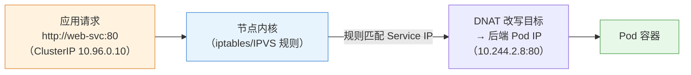

> 读图要点：**规则由 kube-proxy 提前写进内核，转发发生在内核里**——请求路径完全不经过 kube-proxy 进程；kube-proxy 只是"规则的搬运工"。

> **核心认知**（易错点）：kube-proxy **不是代理进程**——流量不经过它（它只负责把规则写进内核）；它也不做服务发现（发现靠 DNS）。**"规则写内核、转发在内核"是性能的关键**。

### 9.2.3 Service 的四种类型

| 类型 | 作用域 | 机制 | 适用 |
|---|---|---|---|
| **ClusterIP**（默认） | 集群内 | 虚拟 IP，仅集群内可达 | 内部服务间调用（默认首选） |
| **NodePort** | 集群外 | 每个节点开一个端口（30000-32767）→ 转发到 ClusterIP | 测试/小规模外部访问 |
| **LoadBalancer** | 集群外 | 云厂商创建负载均衡器 → 指向 NodePort | 云环境生产对外 |
| **ExternalName** | 集群外 | DNS CNAME 指向外部域名（无 IP 无转发） | 把集群外服务"伪装"成集群内服务 |

```text
NodePort 的访问链：
外部用户 → 任意节点 IP:31230 → kube-proxy 规则 → ClusterIP:80 → Pod

LoadBalancer 的访问链：
外部用户 → 云负载均衡器 → 节点 IP:NodePort → ClusterIP → Pod
```

> **NodePort 端口范围**：30000-32767（固定）——实验 07 Lab 3 看 `443:30573/TCP` 就是它。

### 9.2.4 headless Service：不要虚拟 IP

`clusterIP: None` 的 Service 不创建虚拟 IP——**DNS 直接返回所有后端 Pod IP 列表**，调用方自己选（轮询/随机）。

```text
普通 Service：DNS 解析 web-svc → 1 个 ClusterIP（kube-proxy 转发）
headless：   DNS 解析 web-svc → N 个 Pod IP（调用方自行选择）
```

**典型用途**（第 5 章 StatefulSet 的配套）：

- StatefulSet 的每个 Pod 需要**稳定 DNS 名**：`web-0.web-svc.namespace.svc`——这要求 Service 是 headless（Pod 名解析由 StatefulSet 控制器写入 DNS）
- 需要"拿到所有后端 IP 自己控制负载"的场景（如数据库客户端自己挑从库）

> **关键点**：headless 的"稳定 DNS 名"只有配合 StatefulSet 才有（普通 Deployment 的 Pod 没有 `pod名.svc` 解析）。

### 9.2.5 多端口与端口命名

一个 Service 可以暴露多个端口（如 80 HTTP + 443 HTTPS），**每个端口必须有名字**：

```yaml
spec:
  ports:
  - name: http
    port: 80
    targetPort: 8080      # 转发到 Pod 的 8080
  - name: https
    port: 443
    targetPort: 8443
```

> `targetPort` 可以是端口号或**容器端口名**（第 4 章 ports.name）——用名字的好处：改端口号不用改 Service。

---

## 9.3 集群 DNS：名字解析

### 9.3.1 coredns 的角色

集群内每个 Pod 的 `/etc/resolv.conf` 指向 coredns（kube-system 里的 Deployment，第 2 章 Killercoda 见过）。**应用用 Service 名访问，DNS 解析成 ClusterIP**。

### 9.3.2 解析规则

```text
<svc名>                     → 当前命名空间的 Service（简写）
<svc名>.<命名空间>            → 指定命名空间
<svc名>.<命名空间>.svc        → 完整形式（FQDN，svc 是固定段）
<svc名>.<命名空间>.svc.cluster.local → 带集群域（默认 cluster.local）
```

**命名空间作用域**（易错点）：Pod 里写 `mysql` 只解析**当前命名空间**的 mysql；跨命名空间必须写 `mysql`。

### 9.3.3 排障视角

`kubectl exec -it xxx -- nslookup <svc>.<ns>.svc` 返回 IP = DNS 正常；解析失败先查：Service 存在吗（名字/命名空间对了吗）→ coredns 正常吗（实验 10 Lab 4 完整流程）。

---

## 9.4 Ingress：七层入口

### 9.4.1 为什么需要 Ingress

NodePort/LoadBalancer 是**四层**（IP+端口）——问题：

- 每个服务都要开一个端口（端口资源有限、管理混乱）
- 没有"按域名/路径路由"能力（两个域名共用 80 端口做不到）

**Ingress 是七层（HTTP/HTTPS）入口**：一个入口点，按 **host（域名）和 path（路径）** 路由到不同 Service。

### 9.4.2 原理：对象 + 控制器

```text
Ingress 对象（声明路由规则：哪个域名/路径 → 哪个 Service）
   │ 控制器（ingress-nginx，实验 07 安装）Watch 它
   ▼
ingress-nginx 控制器生成 nginx 配置（server_name/location 规则）并加载
   │
   ▼
外部流量 → ingress-nginx（NodePort/LoadBalancer）→ 按规则路由
```

**关键认知**：Ingress **对象本身不做转发**——它只是"规则声明"；真正转发的是 **Ingress 控制器**（通常 ingress-nginx，一个跑在集群里的反向代理）。**没有控制器，Ingress 对象是死的**。

### 9.4.3 路由规则：host 与 path

```yaml
apiVersion: networking.k8s.io/v1
kind: Ingress
metadata:
  name: web-ingress
spec:
  ingressClassName: nginx        # 指定用哪个控制器
  rules:
  - host: shop.example.com        # 域名 A
    http:
      paths:
      - path: /
        pathType: Prefix
        backend:
          service:
            name: shop-svc        # → shop 服务
            port:
              number: 80
  - host: blog.example.com        # 域名 B
    http:
      paths:
      - path: /admin
        pathType: Prefix
        backend:
          service:
            name: blog-admin      # → admin 服务（按路径再细分）
```

- `host` 匹配域名（Host 头）；`host` 前缀匹配 / `host` 精确匹配
- 无 host 的规则 = 兜底（匹配所有域名）
- **访问验证**（无 DNS 时）：`curl -H "Host: shop.example.com" http://节点IP:NodePort`

### 9.4.4 TLS 终止

HTTPS 的证书加解密（TLS 终止）由 Ingress 完成（后端 Pod 保持 HTTP 简单）：

```yaml
spec:
  tls:
  - hosts: [shop.example.com]
    secretName: shop-tls          # kubernetes.io/tls 类型的 Secret（第 8 章）
  rules:
  - host: shop.example.com
    ...
```

> 证书原料就是第 8 章的 `kubernetes.io/tls` Secret（`kubernetes.io/tls` + `kubernetes.io/tls`）——**第 8 章的知识在这里落地**。生产上证书由 cert-manager 自动签发续期（进阶）。

### 9.4.5 Ingress 与 Service 的分工（易混点）

```text
Ingress（七层：域名/路径路由 + TLS）→ Service（四层：负载均衡）→ Pod
   路由决策                          稳定入口 + 转发           真正干活
```

> **一句话**：**Service 负责"负载均衡"（四层），Ingress 负责"路由"（七层）**——Ingress 的 backend 指向 Service，不是直接指向 Pod。

### 9.4.6 展望：Gateway API（Ingress 的继任者）

**Ingress 的局限**（生产暴露的问题）：

- 能力被"注解"绑架（不同控制器各自发明注解，不可移植）
- 只能管"南北向"（外部进集群），管不了"东西向"（服务间流量）
- 路由/流量治理能力有限（权重分流要靠控制器扩展）

**Gateway API**（Kubernetes 官方力推的下一代流量管理 API）的核心模型：

```text
GatewayClass（控制器实现声明，类比 StorageClass）
   │
   ▼
Gateway（入口实例：监听端口/TLS）
   │
   ▼
HTTPRoute（路由规则：host/path/权重/Header）→ 绑定到 Service
   → 与 Ingress 最大的不同：路由规则是**独立对象**（可组合、可跨命名空间引用）
```

**与 Ingress 的关系**：

- 不是"替换即弃"——Ingress 仍被广泛支持；Gateway API 是**演进方向**（v1.36 已 GA）
- 关键优势：**标准化**（不再依赖控制器注解）、支持南北向 + 东西向、权重分流/Header 路由内建（金丝雀/A-B 的天然载体，第 5 章发布策略）

> 决策逻辑：**现有集群继续用 Ingress（成熟稳定）；新架构/需要高级流量治理 → 评估 Gateway API**。知道模型（GatewayClass/Gateway/HTTPRoute）即可，用法与 Ingress 思路一脉相承。

---

## 9.5 NetworkPolicy：网络隔离

### 9.5.1 默认全通（现状与风险）

**默认情况下集群内所有 Pod 互通**（Pod 网络扁平）——攻击面：一个 Pod 被攻破，可以横向访问任何其他 Pod（包括数据库）。

**NetworkPolicy** 实现**网络层白名单**：声明"谁可以访问哪些 Pod"。

### 9.5.2 原理

```yaml
apiVersion: networking.k8s.io/v1
kind: NetworkPolicy
metadata:
  name: db-allow-app
  namespace: default
spec:
  podSelector:                    # 策略作用对象：哪些 Pod
    matchLabels:
      app: mysql
  policyTypes:                    # 生效方向
  - Ingress
  - Egress
  ingress:                        # 入站规则：谁可以访问 mysql
  - from:
    - podSelector:                # 允许：带 app=web 标签的 Pod
        matchLabels:
          app: web
    - ipBlock:                    # 允许：特定网段（外部/监控）
        cidr: 10.0.0.0/8
  egress:                         # 出站规则：mysql 可以访问谁
  - to:
    - podSelector:
        matchLabels:
          app: web
    ports:
    - protocol: TCP
      port: 3306
```

**关键语义**：

- 匹配的 Pod **一旦被某个 NetworkPolicy 覆盖，默认全通就失效**——只允许规则里写明的来源（**白名单制**）
- `policyTypes` 不写的方向不受影响（如只限制 Ingress，Egress 仍全通）
- **注意**：应用要访问集群 DNS（coredns）→ egress 规则要**放行 DNS（53/UDP）**，否则 Pod 域名解析都断了（实验 07 Lab 6 实测踩坑）

### 9.5.3 典型策略设计

```text
默认：全通（无策略）

生产基线：
① 数据库层：只允许业务 Pod 访问（podSelector: app=web）+ 监控网段（ipBlock）
② 业务层：只允许 Ingress 入口访问 + 放行 DNS
③ 拒绝一切兜底：空规则 NetworkPolicy（podSelector: {} + 空 ingress）
```

> **决策逻辑**：先想"谁必须能访问我"（白名单）→ 逐条写 from/to；**宁缺毋滥但要有**——生产至少给数据库加隔离。

### 9.5.4 依赖 CNI（重要）

**NetworkPolicy 必须由支持它的 CNI 实现**：

- **Calico**（本课程）：原生支持 ✓
- Flannel：**不支持**（这就是第 3 章选 Calico 的原因之一）
- Cilium：支持（更强）

> 验证：`kubectl apply` 策略后，`kubectl apply` 能列出，且实际访问被拒——实验 07 Lab 6 用 nginx 实测。

---

## 9.6 综合走查：外部用户访问应用的完整路径

把本章所有机制串起来（对应实验 11 的 WordPress 案例）：

<!-- 原 ASCII 图已转为 Mermaid -->
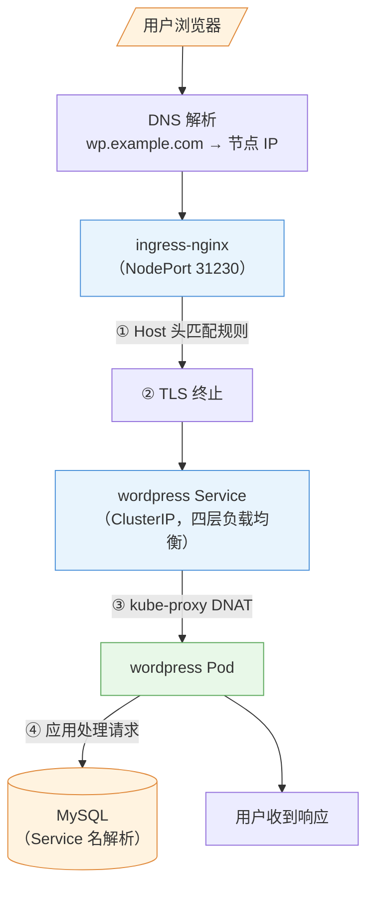

> 读图要点：**五跳链路**（DNS → Ingress → Service → Pod → MySQL），每层职责不同——Ingress 管域名路由与 TLS、Service 管负载均衡、kube-proxy 管转发、应用管业务；**排障从外层往内层逐层验证**（实验 10 Lab 4 的 Service/DNS 排查就是这个顺序）。

**每层职责回顾**：DNS（名字 → IP）→ Ingress（域名/路径路由 + TLS）→ Service（负载均衡）→ kube-proxy（转发规则）→ Pod（干活）。

---

## 9.7 实验演练指引

本章机制对应实验 **07「网络和服务」**（6 Lab + 补充）：

- **Lab 1 katacoda deployment**：准备多副本测试应用
- **Lab 2 ClusterIP Service**：虚拟 IP + 负载均衡观察（多次访问返回不同 Pod）
- **Lab 3 NodePort Service**：外部访问（节点 IP:端口）
- **Lab 4 headless Service + DNS**：`clusterIP: None`，nslookup 返回所有 Pod IP
- **Lab 5 Ingress**：安装 ingress-nginx + host 路由 + **TLS**（补充）
- **Lab 6 NetworkPolicy**：白名单隔离 + **DNS 放行**（实测踩坑点）
- **补充**：多端口 Service、ExternalName

> 教学建议：Lab 2-4 是 Service 三连（内部→外部→无头）；Lab 5 对应 §9.4（路由与 TLS）；Lab 6 对应 §9.5（隔离，注意 DNS 放行）。

---

## 本章小结

- **四层网络**：节点（物理）/Pod（每 Pod 一 IP，CNI）/Service（虚拟 IP）/外部（NodePort/LB/Ingress）
- **Service 机制**：Endpoints（选后端）+ kube-proxy（规则写内核，iptables 随机/IPVS 轮询）——**流量不经过 kube-proxy 进程**
- **四种类型**：ClusterIP（内部）/NodePort（节点端口）/LoadBalancer（云 LB）/ExternalName（外部伪装）；headless 返回 Pod IP 列表（StatefulSet 稳定 DNS 名）
- **DNS**：coredns 解析 `svc.ns.svc`；**命名空间作用域**是易错点
- **Ingress**：对象声明规则 + 控制器真正转发；host/path 路由 + TLS 终止（原料是 tls Secret）——**Ingress 管路由（七层）、Service 管负载均衡（四层）**
- **NetworkPolicy**：默认全通 → 白名单制；podSelector/ipBlock + ingress/egress；**依赖支持它的 CNI（Calico 行、Flannel 不行）**；注意放行 DNS
- **走查**：DNS → Ingress → Service → kube-proxy → Pod，排障从外到内

**衔接**：第 10 章讲存储（PV/PVC/StorageClass）——"应用数据放哪"；第 11 章 RBAC 会给网络策略之外的"谁能做什么"提供另一层安全。

## 思考题

1. 流量真的经过 kube-proxy 进程吗？iptables 和 IPVS 模式的本质区别是什么？
2. headless Service 的 DNS 返回什么？为什么 StatefulSet 需要 headless？
3. 跨命名空间访问 Service，DNS 名怎么写？只写 `mysql` 会发生什么？
4. Ingress 对象不部署控制器会怎样？Ingress 的 backend 为什么指向 Service 而不是 Pod？
5. 给数据库配了只允许 app 访问的 NetworkPolicy，为什么数据库 Pod 突然"域名解析失败"了？
6. 外部用户访问 WordPress 的完整路径中，哪一层做域名路由、哪一层做负载均衡、哪一层做端口转发？

> **CKA 考点标注**（对应域 3：服务与网络 **20%，CKA 第二重**）：
> - **必考操作**：`kubectl expose`、`kubectl expose`（host/path + TLS）、`kubectl expose`、`kubectl expose`
> - **必考机制**：Service 类型与转发（kube-proxy/Endpoints）、headless + StatefulSet、Ingress 规则与控制器、NetworkPolicy（podSelector/ipBlock、ingress/egress）
> - **高频场景题**：暴露服务（NodePort vs Ingress）、网络隔离（给 DB 加策略）、Service 排障（Endpoints 为空 → selector 错）
> - 排障关联（域 5）：Endpoints 为空、DNS 解析失败、Ingress 404/502、NetworkPolicy 误拦


---


# 第 10 章 存储

> 配套实验手册：《Kubernetes 实验手册》（manual/ 目录）**实验 08「实现基本存储」**（4 个 Lab：卷基础/hostPath 应用/PV 静态绑定/StorageClass 动态交付——**StorageClass 在 Lab 4 才安装**，与本章讲解顺序一致）。本章讲"应用数据放哪、怎么持久化"——从 Pod 级卷到集群级 PV/PVC 再到自动化的 StorageClass，理解存储的抽象层次。

## 学习目标

学完本章，你应该能够：

1. 解释容器存储的痛点（文件系统临时性）与三种卷类型（emptyDir/hostPath/配置卷）的适用边界
2. 解释 PV/PVC 解耦设计的价值（应用声明需求、管理员提供资源）
3. 描述 PV/PVC 的生命周期（Provision/Bind/Use/Reclaim）与访问模式、回收策略
4. 区分静态绑定（手动建 PV）与动态供应（StorageClass 自动建）
5. 解释 StorageClass 的机制（provisioner/默认类/绑定模式/回收策略）
6. 说出 local-path 的本质与局限（单节点），理解为什么多副本共享存储需要 NFS/云盘
7. 为有状态应用做出存储选型决策

---

## 10.1 存储问题全景

### 10.1.1 容器文件系统为什么"靠不住"

第 1 章讲过镜像分层：容器运行时的写入发生在**可写层**——容器删除，可写层一起消失。这意味着：

- Pod 重建 → 容器内文件**全部丢失**
- Pod 被调度到其他节点 → 原节点上的数据**够不着**

```text
第 4 章 Pod 的"无状态"认知 → 需要持久数据的应用（数据库/上传文件）必须显式挂存储
```

### 10.1.2 三个存储需求

1. **持久化**：数据跨 Pod 生命周期存活（删了重建数据还在）
2. **共享**：Pod 内多个容器共享数据（sidecar 读主容器日志）
3. **解耦**：应用不关心存储底层细节（本地盘/网络盘/云盘都一样用）

Kubernetes 用**层层抽象**回答这三个需求：卷 → PV/PVC → StorageClass。

---

## 10.2 卷（Volume）：Pod 内的存储抽象

**卷（Volume）** 是 Pod 级的概念：声明在 Pod 里，挂载进容器，生命周期与 Pod 一致。常用类型：

**emptyDir：Pod 内的临时共享盘**

- 创建时为空目录，**Pod 存在期间数据都在**（容器重启不丢，**Pod 删除即清空**）
- 典型用途：Pod 内容器间共享（sidecar 读主容器日志）、临时缓存
- 注意：Pod 被调度到别的节点 = 新 Pod = 新 emptyDir（数据不迁移）

**hostPath：宿主机目录（单节点绑定）**

- 直接挂宿主机的一个目录（如 `/data/mysql`）
- **数据在节点磁盘上**——Pod 删了数据还在，**但只在该节点**：Pod 漂移到其他节点就找不到数据了
- 典型用途：单节点实验、需要读宿主机文件的系统组件（如 kubelet 自身）

**configMap/secret 卷**：第 8 章的配置注入（键变文件）——本质也是卷（只读配置卷）。

> **卷的边界认知**：emptyDir 和 hostPath 都**绑定节点**——它们是"单机思维"的存储。多节点集群里要"数据跟着应用走"，需要集群级抽象（PV/PVC）。

---

## 10.3 PV 与 PVC：存储解耦（核心）

### 10.3.1 为什么需要两层

直接让应用指定"用哪个宿主机目录"（hostPath）的问题：

- 应用 yaml 里写死了存储细节（路径/机器）——**换存储就要改应用**
- 管理员想统一管理存储资源（哪些盘可用、多大、怎么回收）没有抓手

**解耦设计**（与 RBAC 的 Subject/Binding 思想同源）：

```text
PV（PersistentVolume）——集群级资源：一块"已就绪的存储"
   · 由管理员创建（或 StorageClass 自动创建）
   · 描述：容量、访问模式、回收策略、底层实现（hostPath/NFS/云盘）

PVC（PersistentVolumeClaim）——命名空间级请求：应用"要一块存储"
   · 由应用声明：需要多大、什么访问模式
   · 应用只写 PVC，不写底层细节

绑定：PVC 匹配到满足条件的 PV → 状态 Bound → 应用挂载 PVC 使用
```

```text
管理员视角：PV（我提供什么）
应用视角：  PVC（我需要什么）——不知道也不关心底层是 NFS 还是云盘
```

### 10.3.2 PV：存储资源的"货架"

```yaml
apiVersion: v1
kind: PersistentVolume
metadata:
  name: mysqldata-pv
spec:
  capacity:
    storage: 5Gi
  accessModes:
  - ReadWriteOnce
  persistentVolumeReclaimPolicy: Retain   # 回收策略
  hostPath:                                # 底层实现（也可以是 nfs/云盘 CSI）
    path: /data/mysql
```

**访问模式（Access Modes）**：一块 PV 能被几个节点/几个 Pod 同时用

| 模式 | 含义 |
|---|---|
| `ReadWriteOnce`（RWO） | 单节点读写（数据库标配） |
| `ReadOnlyMany`（ROX） | 多节点只读 |
| `ReadWriteMany`（RWX） | 多节点读写（共享存储如 NFS 才支持） |

**回收策略（Reclaim Policy）**：PVC 删除后，PV 怎么处理

| 策略 | 行为 |
|---|---|
| `Retain` | 保留数据（PV 变 Released，管理员手动处理——**数据安全**） |
| `Delete` | 自动删除底层存储（云盘等可自动删） |
| `Recycle`（已废弃） | 清理后复用 |

> **核心认知**：**访问模式是"底层存储能力"的约束**——hostPath 只能 RWO；NFS 支持 RWX。应用声明 PVC 时选的模式必须 PV 支持。

### 10.3.3 PVC：应用的存储请求

```yaml
apiVersion: v1
kind: PersistentVolumeClaim
metadata:
  name: mysqldata
spec:
  accessModes:
  - ReadWriteOnce
  storageClassName: ""        # 禁用动态供应（§10.4），强制匹配手动 PV
  resources:
    requests:
      storage: 5Gi
```

**匹配规则**（静态绑定时）：容量 ≥ 请求 && 访问模式匹配 &&（storageClassName 匹配）→ 一个 PV 绑定一个 PVC（一对一）。

> ⚠️ **实测易错点**：集群里存在默认 StorageClass 时，PVC 不写 `storageClassName` 会走**动态供应**（不匹配手动 PV）——要强制静态绑定必须写 `storageClassName`（实验 08 Lab 3 实测修正）。

### 10.3.4 生命周期

```text
Provision（供应）→ Bind（绑定）→ Use（使用）→ Reclaim（回收）
  管理员建 PV /        PVC 匹配 PV         Pod 挂载 PVC      PVC 删除 →
  动态供应自动建       状态 Bound           写数据            按回收策略处理 PV
```

```text
状态流转：
PV:  Available（待绑定）→ Bound（已绑定）→ Released（PVC 删了，Retain 后）→ Available/删除
PVC: Pending（等待匹配）→ Bound（匹配成功）→ 删除
```

> **排障关联**：PVC 一直 `Pending` → 看 Events：`Pending`（没有匹配的 PV）——检查 PV 是否存在/容量/访问模式/SC 是否一致（实验 10 Lab 1 三板斧）。

### 10.3.5 静态绑定 vs 动态供应

| | 静态绑定 | 动态供应 |
|---|---|---|
| 谁建 PV | **管理员手动建** | **StorageClass 自动建** |
| 适用 | 存储资源固定/要精细控制 | 大量 PVC、云环境自动扩 |
| 成本 | 每个 PV 都要手工 | 声明即用 |

---

## 10.4 StorageClass：动态供应（自动化）

### 10.4.1 为什么需要

静态绑定的问题：**每个应用都要管理员先手动建好 PV**——应用多了根本忙不过来，且 PV 容量是死的（应用要 8G 但只建了 5G 的 PV？）。

**StorageClass** 让"建 PV"自动化：PVC 声明 `storageClassName`，**provisioner（供应商）自动创建匹配的 PV 并绑定**——声明即用。

### 10.4.2 机制

```yaml
apiVersion: storage.k8s.io/v1
kind: StorageClass
metadata:
  name: local-path
provisioner: rancher.io/local-path     # 谁负责自动建 PV（本课程：本地目录方案）
reclaimPolicy: Delete                   # 动态供应的 PV 默认回收策略
volumeBindingMode: WaitForFirstConsumer # 绑定时机
```

```text
PVC（storageClassName: local-path）
   │
   ▼ provisioner 收到请求 → 自动创建 PV（底层：在节点本地目录建文件夹）
   │
   ▼ 自动绑定 → PVC Bound → Pod 挂载使用
```

**默认 StorageClass**：`storageclass.kubernetes.io/is-default-class: "true"` 注解标记默认类——**PVC 不写 storageClassName 时自动用它**（本课程教学顺序：实验 08 Lab 4 才安装，见下）。

### 10.4.3 绑定模式（VolumeBindingMode）

- **Immediate**：PVC 创建就绑定（PV 立即建好）——可能建在与 Pod 无关的节点上
- **WaitForFirstConsumer**：**等第一个 Pod 调度后再绑定**——PV 建在 Pod 所在节点（**local-path 这类"节点本地存储"必须用这个**：提前绑定可能建在别的节点，Pod 调度过来时数据在别处）

### 10.4.4 回收策略

动态供应的 PV 回收策略跟随 StorageClass（`reclaimPolicy: Delete` 常见）——**PVC 删除 = 数据删除**（local-path 会删掉本地目录）。要保留数据：临时改 PV 的回收策略为 Retain 或用备份。

### 10.4.5 PVC 在线扩容（Volume Expansion）

**问题**：磁盘满了怎么办？生产刚需——**在线扩容**（不重建 Pod）：

```yaml
# StorageClass 开启扩容能力
apiVersion: storage.k8s.io/v1
kind: StorageClass
metadata:
  name: local-path
provisioner: rancher.io/local-path
allowVolumeExpansion: true      # 关键：声明支持扩容

# 扩容操作：改 PVC 的 storage 请求（大一点）
kubectl patch pvc mysqldata -p '{"spec":{"resources":{"requests":{"storage":"10Gi"}}}}'
```

- 前提：**StorageClass 的 `allowVolumeExpansion: true`**（未开启则 PVC 的 storage 不可改）
- 生效：底层存储支持在线扩容时**应用无感**（local-path 支持）；部分存储需要 Pod 重启
- **只能扩不能缩**（缩减有数据风险，K8s 不支持）

### 10.4.6 Volume Snapshots：存储快照与恢复（数据保护）

**VolumeSnapshot**（CSI 快照）给 PVC 打"时间点快照"——**数据保护的又一手段**（比拷贝文件更一致、更快）：

```yaml
apiVersion: snapshot.storage.k8s.io/v1
kind: VolumeSnapshot
metadata:
  name: mysqldata-snap
spec:
  volumeSnapshotClassName: <存储支持的快照类>
  source:
    persistentVolumeClaimName: mysqldata   # 给哪个 PVC 打快照
```

- 用途：**备份前的快速一致快照、数据库迁移、测试环境克隆**
- 恢复：从快照创建新 PVC（`VolumeSnapshotContent` → 新 PVC 的 `VolumeSnapshotContent`）
- 前提：底层存储（CSI 驱动）支持快照——local-path 不支持；云盘/NFS 类支持
- 与第 14 章 etcd 快照的区别：**etcd 快照保"集群状态"、VolumeSnapshot 保"应用数据"**——两者互补（Velero 灾备就是组合使用，第 14 章）

> **教学顺序说明（本课程设计）**：StorageClass 是"讲到概念再安装"的典型——**实验 08 Lab 4 才安装 local-path**（安装阶段不装，第 3 章 §3.8 验收清单里它是"延迟项"）。学完 10.3（静态）再学 10.4（动态），对比最清晰。

---

## 10.5 存储方案选型：本地 vs 共享 vs 云盘

### 10.5.1 local-path：本地方案的本质与局限

本课程用的 local-path：**PV 就是节点上的一个本地目录**（`/opt/local-path-provisioner/<pvc名>`）。

- 优点：零成本、快（本地盘）、教学演示动态供应足够
- **局限（必须理解）**：
  1. **单节点**：数据只在创建它的节点上——Pod 漂移/扩容到其他节点 → 数据够不着
  2. **多副本挂同一 PVC（RWX）不支持**：local-path 只能 RWO——第 5 章多副本共享 PVC 的场景它做不了
  3. **节点故障 = 数据风险**：本地盘没有冗余

> 这正是实验 11（WordPress 综合演练）里"多副本共享 PVC"受限的原因——**水平扩展的前提是存储可共享**。

### 10.5.2 共享存储（NFS/云盘）：多节点可访问

| 方案 | 特点 | 适用 |
|---|---|---|
| **NFS** | 网络文件系统，一台服务器导出目录，**所有节点挂载**（支持 RWX） | 自建环境的多副本共享存储（教学扩展首选） |
| **云盘**（云厂商 CSI） | 云盘挂到节点，一般 RWO；对象存储 OSS/S3 天然共享 | 云环境生产 |
| **分布式存储**（Ceph/Longhorn） | 软件定义存储，强一致/多副本 | 大规模生产 |

**选型逻辑（决策树）**：

<!-- 原 ASCII 图已转为 Mermaid -->
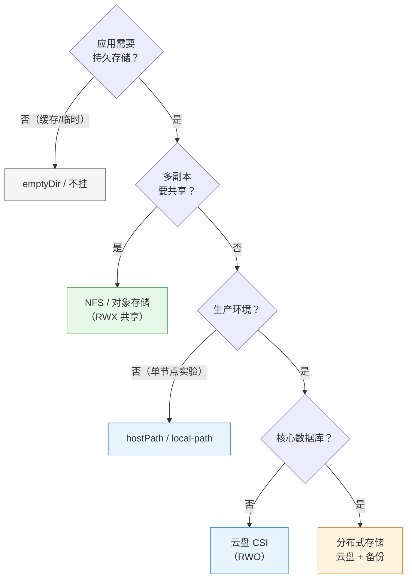

> 读图要点：**判断顺序：持久与否 → 是否共享 → 是否生产 → 是否核心**——"共享"与"生产"是两条最关键的岔路：要共享必须 RWX 方案（local-path 不行）、生产必须可托底的方案（云盘/分布式）。

### 10.5.3 CSI：标准接口

**CSI（Container Storage Interface）**：Kubernetes 与存储厂商之间的标准接口（类似第 3 章的 CRI）——任何存储（云盘/NFS/Ceph）实现 CSI 就能被 K8s 动态供应。**生产里"装一个 CSI 驱动"就是接入了某类存储**。

> **分布式存储实例：Rook-Ceph**——Ceph（分布式存储，自带多副本/自愈）通过 Rook（K8s 的 Operator，第 18 章展望的模式）部署进集群，对外以 CSI 驱动提供动态供应（StorageClass）。**"K8s 里跑一个软件定义存储集群"是自建环境生产存储的常见选择**（比 NFS 单点更可靠，比云盘更可控）。知道这个部署模式即可（实施属于进阶）。

---

## 10.6 实验演练指引

本章机制对应实验 **08「实现基本存储」**（4 个 Lab，顺序与本章一致）：

- **Lab 1 卷基础（hostPath/emptyDir）**：Pod 级卷的挂载与生命周期——emptyDir 随 Pod 消失、hostPath 绑定节点
- **Lab 2 hostPath 应用**：mysql 数据写到宿主机目录（应用级持久化）
- **Lab 3 使用 PVC 和 PV**：手动建 PV + PVC 静态绑定（`storageClassName: ""` 实测修正点）
- **Lab 4 使用存储类动态交付**：**安装 local-path** + PVC 声明即用（WaitForFirstConsumer 观察）

> 教学建议：Lab 3 与 Lab 4 对比 = 静态 vs 动态（§10.3.5 的表格亲手验证）；Lab 4 安装 local-path 时观察"PV 自动生成、目录自动创建"。

---

## 本章小结

- **卷（Pod 级）**：emptyDir（临时共享）/hostPath（宿主机目录，绑节点）/配置卷（CM/Secret）——**单机思维**
- **PV/PVC（集群级）**：PV=管理员提供的存储资源（容量/访问模式/回收策略），PVC=应用的存储请求，**绑定一对一**——解耦"提供"与"使用"
- **生命周期**：Provision → Bind → Use → Reclaim；访问模式（RWO/ROX/RWX）是底层能力约束；回收策略（Retain 保数据/Delete 自动删）
- **StorageClass（自动化）**：provisioner 自动建 PV——声明即用；默认类（不写 SC 就用它）；WaitForFirstConsumer 是**节点本地存储的必需**
- **选型**：local-path 单节点（局限：Pod 漂移/多副本共享都不行）→ NFS/云盘（共享）→ CSI 生态（生产标准）；**多副本共享的前提是存储可共享**
- **本课程教学顺序**：StorageClass 在实验 08 Lab 4 才安装（讲概念再动手）

**衔接**：第 11 章讲安全（认证/授权）——存储的权限控制（谁能用哪个 PVC/Secret）也是安全的一部分；第 18 章综合演练里 WordPress 的持久化（PVC + local-path）就是本章知识的落地。

## 思考题

1. 容器内写的文件，Pod 删除后还在吗？emptyDir 和 hostPath 的数据分别在什么情况下会丢？
2. PV 与 PVC 各自是谁创建的？为什么应用只写 PVC 不写 PV？
3. PVC 一直 Pending，可能的原因有哪些（至少三个）？怎么排查（提示：describe 看 Events）？
4. local-path 的 PV 为什么必须是 WaitForFirstConsumer 绑定？
5. 一个 3 副本应用要共享同一个 PVC，local-path 行吗？应该用什么方案？
6. 为什么说"水平扩展的前提是存储可共享"？（结合第 5 章 StatefulSet 与本章 local-path）

> **CKA 考点标注**（对应域 4：存储 **10%**）：
> - **必考操作**：`kubectl create -f pv.yaml/pvc.yaml`、`kubectl create -f pv.yaml/pvc.yaml`、`kubectl create -f pv.yaml/pvc.yaml`（看绑定/事件）
> - **必考机制**：PV/PVC 绑定与生命周期、访问模式、回收策略、StorageClass（provisioner/默认类/绑定模式）
> - **高频场景题**：给应用配持久化（静态 vs 动态）、PVC 排障（Pending → 匹配条件）、多副本共享存储选型
> - 排障关联（域 5）：PVC Pending（Events 报错）、Pod 挂载失败（`FailedMount`）


---


# 第 11 章 认证与授权

> 配套实验手册：《Kubernetes 实验手册》（manual/ 目录）**实验 09「认证与授权」**（Lab 1-6：证书目录/用户证书/SA/用户授权/SA 授权/dashboard 综合演练）。本章讲安全模型的**前两道门**：认证（你是谁）与授权（你能干什么）——理解它们，就理解了"为什么能登录但不让操作"这类核心现象。第 12 章讲第三道门（准入控制）。

## 学习目标

学完本章，你应该能够：

1. 说出 Kubernetes 安全模型的三道门（认证/授权/准入）与各自回答的问题
2. 区分两种身份（User 给人、ServiceAccount 给程序）与两种认证凭据（证书/Token）
3. 解释 X.509 证书认证的机制（CA 签发、CN 即用户名、kubeconfig 携带）
4. 解释 v1.24+ 的 SA Token 机制（动态签发，无长期 token）
5. 完整解释 RBAC 三要素（Subject/Role/ClusterRole/Binding）与两种范围
6. 写出自定义 Role 的 rules（apiGroups/resources/verbs）
7. 解释"认证 ≠ 授权"（能登录但 Forbidden）并用实例说明
8. 应用最小权限原则设计授权方案（含 `kubectl auth can-i` 验证）

---

## 11.1 安全模型总览：三道门

第 2 章 §2.4.1 讲过 apiserver 的请求处理流程，安全部分展开就是**三道门**：

<!-- 原 ASCII 图已转为 Mermaid -->
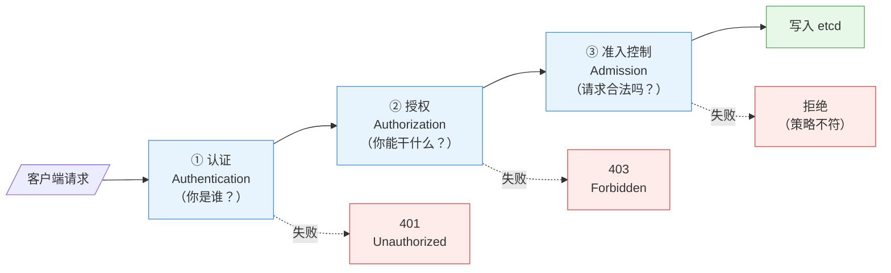

> 读图要点：**三道门依次通过、各自有独立的拒绝出口**——认证失败 401、授权失败 403、准入失败策略不符；"能登录但不让操作"就是第一道门过了、第二道门没过。

| 门 | 问题 | 拒绝结果 | 对应实验 |
|---|---|---|---|
| 认证 | 你是谁？ | 401 Unauthorized | Lab 1/2 |
| 授权 | 你能干什么？ | 403 Forbidden | Lab 3/4/5 |
| 准入 | 请求本身合法吗？ | Forbidden/校验错误 | 实验 09 Lab 7/8 |

> **核心认知**：三道门**依次通过**——认证通过但授权不足 → Forbidden（"能登录但不让操作"）；授权通过但准入拦截 → 也拒绝（第 12 章）。

---

## 11.2 认证：你是谁

### 11.2.1 两种身份

| 身份 | 给谁用 | 凭据 | 用户名格式 |
|---|---|---|---|
| **User** | 人（管理员/开发） | 客户端证书 / token | `train`、`train` |
| **ServiceAccount（SA）** | 程序（Pod 内应用） | Token（Bearer） | `system:serviceaccount:<ns>:<名字>` |

> 注意：Kubernetes **没有 User 对象**（User 是"外部概念"，通过证书 CN 识别）；**SA 是真实对象**（存在集群里）。

### 11.2.2 认证方式（apiserver 支持的）

- **X.509 客户端证书**（最常用）：kubeconfig 里带证书，apiserver 用 CA 校验签名
- **Bearer Token**：SA 的 token（HTTP 头 `Authorization: Bearer <token>`）
- **基础认证**（用户名/密码，一般不启用）
- **OIDC**（企业单点登录，见下）
- 其他（Webhook 认证等）

**OIDC 企业集成（生产人员认证的事实标准）**：

> 企业环境里"给每个人签发证书"不可行（人进人出、证书管理爆炸）——**人员认证几乎 100% 对接 OIDC**（Keycloak/Dex/企业 SSO）：

```text
用户 → 企业 SSO 登录（Keycloak/AD/Okta）→ 拿 ID Token（JWT）
   → kubectl 用 token 访问 apiserver
   → apiserver 的 OIDC 认证器验证签名 → 提取 username/groups（来自 token 声明）
   → 之后的 RBAC 照常工作（username/groups 参与授权）
```

- 配置：apiserver 加 `--oidc-issuer-url/--oidc-client-id/--oidc-username-claim/--oidc-groups-claim`（kubeadm 环境改 manifest）
- 好处：**统一账号体系**（员工离职一个按钮禁用）、支持 MFA、组（groups）随 SSO 自动映射到 RBAC
- 实操：`kubectl oidc-login` 插件完成登录换 token 流程（进阶）

> **核心认知**：**证书认证适合"少量管理员"，OIDC 适合"大量企业用户"**——考试不考 OIDC 配置，但真实企业环境绕不开。

### 11.2.3 X.509 证书认证的机制

第 3 章安装时生成了集群 CA（第 2 章 §2.6.3 双向 TLS）。用户证书认证的完整链路：

```text
① 管理员用 CA 签发用户证书：openssl 生成密钥 → 用 ca.key 签发
   · 证书的 CN（Common Name）= 用户名（如 CN=train → 用户 train）
   · O（Organization）= 用户组
② kubeconfig 里配置：cluster（apiserver 地址 + CA）+ user（客户端证书）+ context
③ 请求时：kubectl 出示客户端证书 → apiserver 用 CA 校验签名 → 通过
④ 认证结果：用户名 = 证书 CN（如 train），进入授权环节
```

> **核心认知**：**"签发证书"就是"创建用户"**——集群没有用户注册表，信任链就是 CA 签名。证书泄露 = 身份泄露（所以私钥要保管好）。

### 11.2.4 ServiceAccount 与 Token（v1.24+ 的重要变化）

**SA 是给 Pod/程序用的身份**：Pod 可以指定 `serviceAccountName`，容器内自动挂载 SA 的 token 文件——应用用它调 apiserver。

**v1.24+ 的变化**（实验 09 Lab 2 实测）：

- **旧机制**：SA 创建时自动生成一个**长期 token secret**（永不过期）——安全风险：泄露就永远有效
- **新机制**：**不再自动创建 token secret**；用 `kubectl create token <sa>` **动态签发**短期 token（默认 1 小时，过期重新签发）——安全得多

```bash
kubectl create token chengzh            # 动态签发（1 小时有效）
eyJhbGciOiJSUzI1NiIsImtpZCI6...        # JWT 格式（第 3 章见过）
```

> 考试/实操注意：`kubectl describe secret` 找 token 是旧版做法；**v1.36 用 `kubectl describe secret`**。

### 11.2.5 kubeconfig 多身份（第 2 章 §2.8.2 深化）

一个 kubeconfig 可以装多个 cluster/user/context——**用 context 切换身份**：

```bash
kubectl config get-contexts        # 列出（* 当前）
kubectl config use-context train@kubernetes    # 切到 train 身份
```

> 这就是"同一台机器上，管理员和普通用户身份并存"的实现——实验 09 Lab 1/2 亲手建了多个 context。

---

## 11.3 授权：你能干什么（RBAC）

### 11.3.1 RBAC 三要素

**RBAC（基于角色的访问控制）** 的核心是三个对象：

```text
Subject（谁）＋ Role/ClusterRole（权限）＋ Binding（关联）＝ 授权
  User/SA/Group       rules 列表           把谁和什么权限绑一起
```

**Group（用户组）绑定机制**：Subject 不只是单个 User/SA——**Group（组）**可以整体授权，管理成本大幅下降：

```text
① 来源：证书的 O（Organization）字段 = 组名（如 CN=train, O=devs → 用户 train 属于 devs 组）
          OIDC 的 groups claim = 组（第 11.2.2 节）
② 绑定：给组授权，组里所有用户生效
   kubectl create clusterrolebinding devs-readonly --clusterrole=view --group=devs
③ 内置特殊组：
   - system:masters  → 绑定 cluster-admin 的超级管理员组（kubeadm 的 admin.conf 用户在此组）
   - system:serviceaccounts:<ns> → 某命名空间的所有 SA
   - system:authenticated → 所有认证通过的用户
```

> **认知**：**给"组"授权是生产惯例**（人进人出只改 SSO 组成员，不改 K8s 绑定）；`system:masters` 是最高权限组（第 3 章 super-admin.conf 的 O 字段就是它）。

```text
Subject: User train ──┐
                      ▼
ClusterRoleBinding ──► ClusterRole: cluster-admin（全权）
（全集群生效）          Role: dev-role（自定义只读 dev 资源）
```

### 11.3.2 Role vs ClusterRole（权限的范围）

| | Role | ClusterRole |
|---|---|---|
| 作用域 | **命名空间内**（如 default 里） | **全集群**（所有命名空间 + 集群级资源） |
| 管理什么 | 该命名空间的 Pod/Svc 等 | 全部命名空间 + Node/PV/Namespace 等集群资源 |
| 创建时 | 必须指定命名空间 | 无命名空间 |

> **注意（易混点）**：Role 是"权限集合"，范围由**绑定方式**决定——**ClusterRole 被 RoleBinding 绑定时，只在那个命名空间生效**（实验 09 Lab 4 实测：权限范围被限制在绑定命名空间）。

### 11.3.3 RoleBinding vs ClusterRoleBinding（生效范围）

| | RoleBinding | ClusterRoleBinding |
|---|---|---|
| 生效范围 | **一个命名空间** | **全集群** |
| 授权对象 | 该命名空间内的资源权限 | 所有命名空间 + 集群级资源 |
| 可绑定的角色 | Role 或 ClusterRole | Role（仅本命名空间？不——ClusterRoleBinding 绑 Role 会报错，只能绑 ClusterRole） | 

> **准确规则**：**RoleBinding 可以绑 Role 或 ClusterRole**（绑 ClusterRole 时限制在命名空间内）；**ClusterRoleBinding 只能绑 ClusterRole**（全集群生效）。

### 11.3.4 rules 写法（自定义权限）

Role/ClusterRole 的核心是 `rules`——"对哪些资源的哪些操作"：

```yaml
apiVersion: rbac.authorization.k8s.io/v1
kind: Role
metadata:
  name: dev-role
  namespace: default
rules:
- apiGroups: [""]                    # 核心组（Pod/Service/ConfigMap 等）
  resources: ["pods", "pods/log"]    # 资源（pods/log 是子资源）
  verbs: ["get", "list", "watch"]    # 操作（读）
- apiGroups: ["apps"]                # apps 组（Deployment 等）
  resources: ["deployments"]
  verbs: ["get", "list", "watch", "create", "update", "patch", "delete"]  # 读写
- apiGroups: ["batch"]
  resources: ["jobs"]
  verbs: ["get", "list", "watch", "create"]
```

**三要素写法**（CKA 必考）：

- **apiGroups**：API 组——核心组用 `""`（空字符串），`""`、`""`、`""` 等（第 2 章 §2.7.1；查法：`""` 看 APIGROUP 列）
- **resources**：资源名（复数）——pods/services/deployments/nodes...（子资源如 `pods/log`）
- **verbs**：get/list/watch/create/update/patch/delete（`*` 表示全部）

> **常见错误**：写错了 apiGroups（核心组写成 "core"/"v1"）→ 权限不生效（返回 Forbidden）——**先 `kubectl api-resources` 确认 APIGROUP**。

### 11.3.5 内置角色（现成的权限模板）

| 角色 | 范围 | 能力 |
|---|---|---|
| `cluster-admin` | 全集群 | 超级管理员（绑给 admin.conf） |
| `admin` | 命名空间 | 命名空间内全权（含 RBAC 管理） |
| `edit` | 命名空间 | 读写（不含 RBAC） |
| `view` | 命名空间 | 只读 |

> 常用组合：普通开发 → view/edit；项目负责人 → admin；运维/管理员 → cluster-admin。**优先用内置角色，不够再自定义**。

### 11.3.6 认证 vs 授权（核心辨析）

```text
证书有效（认证通过）≠ 有权限（授权通过）

实例（实验 09 Lab 1/3）：
  ① 签发用户证书 train → kubectl 能连上 apiserver（认证通过）
  ② 但 get pods → Forbidden：pods is forbidden: User "train" cannot list resource "pods"
     （授权未配置——train 没有任何 Role/Binding）
  ③ 创建 ClusterRoleBinding（cluster-admin → train）→ 立刻能操作
     （授权是即时生效的，不需要重启任何组件）
```

> **一句话**：认证回答"你是谁"，授权回答"你能干啥"——**"能登录"和"能操作"是两件独立的事**，这是本章最重要的认知。

---

## 11.4 最小权限设计

### 11.4.1 原则

**最小权限（Least Privilege）**：只给完成工作所需的最小权限。

- 开发只读 → view；要改配置 → edit；不要给所有人 cluster-admin
- 按团队/项目拆分命名空间 + RoleBinding（隔离授权范围）
- SA 只挂自己需要的权限（Pod 不该有集群管理权限）
- 定期审计：谁的权限过期了、谁还挂着 cluster-admin

### 11.4.2 验证工具：kubectl auth can-i

**不用真试**就能检查"某个身份能不能做某个操作"：

```bash
kubectl auth can-i get pods                          # 当前身份
kubectl auth can-i create deployments --as=dev-user  # 模拟 dev-user
kubectl auth can-i list secrets --as=system:serviceaccount:default:my-sa
```

> **实战价值**：给权限之前先验证、给完再验证一次；排障"为什么 Forbidden"时用它确认是授权没配还是规则写错。

---

## 11.5 实验演练指引

本章机制对应实验 **09「认证与授权」** Lab 1-6：

- **Lab 1 生成用户证书**：openssl 用 CA 签发 train 证书 + kubeconfig 三段式——**认证≠授权的 Forbidden 实例**（§11.2.3/11.3.6）
- **Lab 2 创建 SA**：`kubectl create token` 动态签发——v1.24+ 新机制（§11.2.4）
- **Lab 3 给用户授权**：ClusterRoleBinding + 自定义 Role rules——三要素写法（§11.3.4）
- **Lab 4 给 SA 授权**：RoleBinding 命名空间级 + 跨命名空间失败——两种 Binding 对比（§11.3.3）
- **Lab 5 用户证书 API 方式**（补充）：CSR API 签发证书（进阶）
- **Lab 6 dashboard 综合演练**：SA + RBAC + Token 完整链路（§11.2-11.4 的"总装"）

> 教学建议：Lab 1 重点体验"认证通过但 Forbidden"；Lab 3/4 对比两种 Binding 的生效范围；Lab 6 是把全章机制串起来的综合演练（浏览器输 Token 登录的背后就是本章全部机制）。

---

## 本章小结

- **三道门**：认证（你是谁）→ 授权（你能干啥）→ 准入（请求合法吗）——依次通过
- **认证**：User（人，证书 CN 即用户名）/ SA（程序，动态 token）；**签发证书 = 创建用户**；v1.24+ 用 `kubectl create token` 动态签发
- **RBAC 三要素**：Subject + Role/ClusterRole + Binding——**Role 定权限内容、Binding 定生效范围**
- **两种范围**：Role（命名空间）/ClusterRole（集群）；RoleBinding（命名空间）/ClusterRoleBinding（全集群）；**RoleBinding 绑 ClusterRole 时限制在命名空间内**
- **rules 三要素**：apiGroups（核心组 `""`）/resources（复数）/verbs——写错 apiGroups 是最常见错误
- **内置角色**：cluster-admin/admin/edit/view——优先内置，不够自定义
- **认证 ≠ 授权**：Forbidden 实例（能登录但不让操作）；授权即时生效
- **最小权限**：够用就行 + `kubectl auth can-i` 验证

**衔接**：第 12 章讲第三道门（准入控制与容器安全）——PSA 强制安全标准、SecurityContext 容器加固；第 13 章讲集群级安全（证书续期/etcd 加密）。

## 思考题

1. "签发一张用户证书"在 Kubernetes 里相当于"创建一个用户"——为什么？
2. v1.24 之前 SA 自动创建长期 token，为什么被改掉？
3. Role 与 ClusterRole、RoleBinding 与 ClusterRoleBinding 的交叉组合，生效范围分别是什么？
4. 自定义 Role 里 `apiGroups: [""]` 是什么意思？写成 `apiGroups: [""]` 会怎样？
5. 用户 train 证书有效但 get pods 报 Forbidden——问题出在哪道门？怎么修？
6. 给一个"只能看 default 命名空间 Pod 和日志"的账号，写出完整的 RBAC 方案（Role + Binding + 验证命令）。

> **CKA 考点标注**（对应域 1/2/3，**考试高频**）：
> - **必考操作**：`kubectl create role/clusterrole/rolebinding/clusterrolebinding`、`kubectl create role/clusterrole/rolebinding/clusterrolebinding`、`kubectl create role/clusterrole/rolebinding/clusterrolebinding`、`kubectl create role/clusterrole/rolebinding/clusterrolebinding`
> - **必考机制**：RBAC 三要素与范围规则（Role vs ClusterRole、两种 Binding）、rules 三要素、认证 vs 授权
> - **高频场景题**：给用户/SA 配权限（场景 → Role/Binding 组合）、跨命名空间访问失败排查
> - 排障关联（域 5）：Forbidden（授权未配/规则写错）——`kubectl auth can-i` 定位


---


# 第 12 章 准入控制与容器安全

> 配套实验手册：《Kubernetes 实验手册》（manual/ 目录）**实验 09「认证与授权」** Lab 7/8（SecurityContext/PSA）。本章讲安全模型的**第三道门（准入控制）**与**容器级加固**——前两章管"谁能用集群"（认证/授权），本章管"创建请求合不合法、容器跑得安不安全"。

## 学习目标

学完本章，你应该能够：

1. 解释准入控制（Admission）的时机与角色，区分 Mutating 与 Validating 两类
2. 列举常见的准入控制器（LimitRange/ResourceQuota/PSA）并说出它们各自拦什么
3. 解释 Pod Security Admission 的三个级别（privileged/baseline/restricted）与实施方式（命名空间标签）
4. 解释 SecurityContext 的关键字段（runAsUser/runAsNonRoot/readOnlyRootFilesystem/capabilities）
5. 区分 Pod 级与容器级 securityContext 的生效范围
6. 解释"SecurityContext 是自觉、PSA 是强制"的配合关系
7. 解释 imagePullSecrets 的机制（私有仓库凭据怎么注入）

---

## 12.1 准入控制：第三道门

### 12.1.1 时机与角色

第 11 章的三道门流程里，**准入（Admission）发生在认证、授权之后，对象写入 etcd 之前**：

<!-- 原 ASCII 图已转为 Mermaid -->
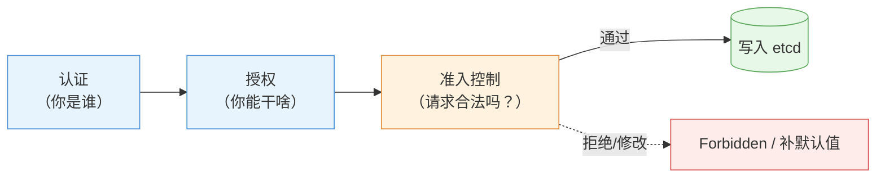

> 读图要点：**准入是"资源落地前的最后一道闸"**——认证授权决定"能不能来"，准入决定"来的是不是合格"；它既能**拒绝**（Validating）也能**修改**（Mutating，如补默认值）。

**角色**：对象创建/更新/删除时，一组**准入控制器（Admission Controllers）**按顺序检查（和修改）请求——**这是"规则能拦在资源落地之前"的机制**（LimitRange/ResourceQuota/PSA 都靠它，第 7 章的两层防线在这里执行）。

### 12.1.2 两类控制器

| 类型 | 行为 | 例子 |
|---|---|---|
| **Mutating（修改型）** | 修改请求内容（如自动填默认值） | LimitRange 给没写 requests 的 Pod **补默认值** |
| **Validating（校验型）** | 校验请求，不合法**拒绝** | LimitRange 超限拒绝、PSA 违规拒绝 |

流程顺序：**先 Mutating（补默认）→ 再 Validating（按补完的值校验）**——所以 LimitRange"先填默认值、再校验是否超限"是同一步里的两个阶段。

> **认知**：你在第 7 章看到的"自动填 requests"和"Forbidden 拒绝"都是准入控制器的功劳——**资源被拒绝时的报错（Forbidden/exceeded quota/violates PodSecurity）都来自这一关**。

### 12.1.3 常见准入控制器（本章前后知识点的"汇聚点"）

| 控制器 | 拦截/修改什么 | 对应章节 |
|---|---|---|
| LimitRange | 单 Pod 资源上下限（填默认 + 校验） | 第 7 章 |
| ResourceQuota | 命名空间总量配额 | 第 7 章 |
| **PodSecurity** | Pod 安全标准（§12.2） | 本章 |
| ServiceAccount | 自动挂 SA token | 第 11 章 |
| NamespaceLifecycle | 阻止在删除中的命名空间建资源 | — |

---

## 12.2 Pod Security Admission（PSA）：安全标准的强制执行

> ⚠️ **PSP 已废弃**：PSA 的前身是 **PSP（PodSecurityPolicy）**——**K8s v1.21 弃用、v1.25 彻底移除**。网上旧教程里的 `PodSecurityPolicy` 对象在 v1.36 已不存在，一律使用 PSA（命名空间标签方式）。

### 12.2.1 为什么需要

§12.3 会讲 SecurityContext（容器自己声明安全要求）——但**靠自觉不够**：谁能保证集群里每个 Pod 都写了非 root？**PSA 把安全标准变成"命名空间级的强制规则"**：违规的 Pod **创建即被拒绝**（准入校验）。

### 12.2.2 三个安全级别（由松到严）

| 级别 | 含义 | 典型限制 |
|---|---|---|
| **privileged** | 无限制（默认，相当于没有 PSA） | 无 |
| **baseline** | 最小限制（**默认建议**） | 禁止 privileged、hostPath、hostNetwork/hostPID/hostIPC、特权端口等 |
| **restricted** | 最严格（生产核心） | baseline 全部 + 要求非 root（runAsNonRoot）、只读根文件系统、drop ALL 能力、**seccompProfile: RuntimeDefault** 等 |

> **级别选择**：**baseline 是生产默认**（挡住最常见的高危配置）；restricted 给核心/多租户场景（要求苛刻，可能影响正常应用——需要应用配合加固）。

**Seccomp Profile（restricted 的强制项）**：seccomp 限制容器能发起的**系统调用**（攻击面收敛——即使容器被攻破，危险 syscall 也被拦）：

```yaml
securityContext:
  seccompProfile:
    type: RuntimeDefault    # 使用运行时的默认 seccomp 配置（containerd 内置）
    # type: Localhost + localhostProfile: 自定义 profile（进阶）
```

- `RuntimeDefault`：containerd 内置的默认策略（阻断了 mount/未授权 ptrace 等危险调用）——**restricted 级别要求它**
- 不配置 = `Unconfined`（无限制）——v1.27+ 的新 Pod 默认带 RuntimeDefault 注释（行为向安全靠拢）

### 12.2.3 实施方式：命名空间标签

PSA 通过在**命名空间上打标签**实施（不是 Pod 上）——按命名空间定标准：

```bash
kubectl label ns psa-demo pod-security.kubernetes.io/enforce=baseline
```

三个动作标签：

| 标签动作 | 行为 |
|---|---|
| `enforce` | **强制**：违规 Pod 创建被拒（最常用） |
| `audit` | 允许创建，但**记录审计日志**（先观察再强制） |
| `warn` | 允许创建，但**给用户警告** |

> **渐进式落地建议**：先 `warn`/`warn` 观察哪些应用会违规 → 修好后再切 `warn`——避免一上来就强制把现有应用全拒了。

### 12.2.4 违规的后果（报错解读）

```bash
kubectl -n psa-demo run bad --image=busybox --privileged
Error from server (Forbidden): pods "bad" is forbidden: violates PodSecurity "baseline:latest":
privileged (container "bad" must not set securityContext.privileged=true)
```

报错三要素：**违反了哪个级别**（baseline）、**违反哪条规则**（privileged）、**怎么修**（must not set...）——实验 09 Lab 8 亲手验证。

---

## 12.3 SecurityContext：容器加固

### 12.3.1 默认风险

第 1 章讲过：容器内 `whoami` 是 **root**（实验 09 Lab 7 实测）——容器内 root 与宿主机共享内核权限，**容器被攻破 = 拿到宿主机 root 级别能力**（有逃逸风险）。

### 12.3.2 关键字段（四个必须懂）

```yaml
spec:
  securityContext:                      # Pod 级：对 Pod 内所有容器生效
    runAsNonRoot: true                  # 禁止以 root（UID 0）运行，否则拒绝启动
    runAsUser: 1000                     # 指定运行用户（UID）
    fsGroup: 1000                       # 卷文件的属组
  containers:
  - name: app
    securityContext:                    # 容器级：只对本容器生效
      readOnlyRootFilesystem: true      # 根文件系统只读（防写入恶意文件）
      capabilities:
        drop: ["ALL"]                   # 丢弃全部 Linux 能力
        add: ["NET_BIND_SERVICE"]       # 按需加回（绑定低端口）
      allowPrivilegeEscalation: false   # 禁止提权（setuid 等）
```

| 字段 | 作用 | 防什么 |
|---|---|---|
| `runAsNonRoot` + `runAsNonRoot` | 非 root 运行 | 容器逃逸、root 权限滥用 |
| `readOnlyRootFilesystem` | 根文件系统只读 | 恶意文件写入（挂载卷仍可写） |
| `capabilities.drop: ["ALL"]` | 丢弃能力 | 危险内核能力（SYS_ADMIN 等） |
| `allowPrivilegeEscalation: false` | 禁止提权 | 子进程提权 |

> **生产常用组合**：`drop: ["ALL"]` + `drop: ["ALL"]`（只留绑低端口的能力）+ `drop: ["ALL"]`——**最小能力原则**。

### 12.3.3 Pod 级 vs 容器级

| | Pod 级（spec.securityContext） | 容器级（containers[].securityContext） |
|---|---|---|
| 生效范围 | Pod 内**所有**容器 | **本容器** |
| 典型字段 | runAsUser/runAsNonRoot/fsGroup | readOnlyRootFilesystem/capabilities |
| 覆盖关系 | 容器级可以**覆盖** Pod 级 | — |

### 12.3.4 与 PSA 的关系：自觉 vs 强制

```yaml
SecurityContext：Pod 自己声明安全要求（"我自觉"）——不写就没人管
PSA：命名空间强制标准（"你必须安全"）——不达标创建即拒

生产配合：PSA 定红线（baseline/restricted 标签）+ SecurityContext 落实细节（非 root/只读/丢能力）
```

> 注意一个循环关系：**restricted 级别要求的正是 SecurityContext 那套字段**（runAsNonRoot/readOnlyRootFilesystem/drop ALL）——**先学 SecurityContext 才知道 restricted 要求什么**。

---

## 12.4 镜像安全

### 12.4.1 私有仓库凭据：imagePullSecrets

拉取私有仓库镜像时，kubelet 需要凭据——用第 8 章的 `dockerconfigjson` 类型 Secret：

```text
① 创建凭据 Secret（存 .dockerconfigjson）
   kubectl create secret docker-registry regcred \
     --docker-server=<仓库> --docker-username=<用户> --docker-password=<密码>
② Pod 声明使用
   spec:
     imagePullSecrets:
     - name: regcred
③ kubelet 拉取时用该凭据认证
```

> 注意：imagePullSecrets **按命名空间生效**——每个命名空间都要创建自己的凭据；Pod 必须显式引用（不会自动用）。

### 12.4.2 最小镜像与签名（概念）

- **最小镜像**：用精简基础镜像（如 distroless/alpine）——攻击面小、体积小（第 3 章安装时感受过镜像体积的影响）
- **镜像签名**（cosign 等）：发布时签名、部署时校验——防供应链攻击（进阶概念，知道存在即可）

## 12.5 策略即代码：OPA Gatekeeper / Kyverno（第三方准入）

**问题**：PSA 只覆盖"Pod 安全"这一维度——生产还要约束"镜像来自可信仓库""必须带资源限制""禁止特定标签"等**自定义策略**。PSA 做不了，交给**策略引擎**：

| 引擎 | 特点 | 策略写法 |
|---|---|---|
| **OPA Gatekeeper** | 通用策略引擎（OPA/Rego） | Rego 语言 + ConstraintTemplate（学习曲线陡） |
| **Kyverno** | 专为 K8s 设计 | **YAML 声明式**（`match` + `match`/`match`），上手快 |

```text
Kyverno 策略示例（概念）：要求所有 Pod 必须带资源限制
apiVersion: kyverno.io/v1
kind: ClusterPolicy
metadata:
  name: require-resources
spec:
  rules:
  - name: require-limits
    match:
      any:
      - resources:
          kinds: ["Pod"]
    validate:
      message: "Pod 必须声明 resources"
      pattern:
        spec:
          containers:
          - resources:
              limits: {}
```

**两者与 PSA 的关系**：

- PSA：内置的"Pod 安全标准"（三级别）
- Gatekeeper/Kyverno：**可编程的任意准入规则**（超越 Pod 安全，管所有资源）
- 生产组合：PSA 定基线 + Kyverno/Gatekeeper 定组织级策略（镜像仓库白名单、必带标签、资源要求等）

> **决策逻辑**：只需要 Pod 安全标准 → PSA 够用；需要自定义/组织级策略 → 引入 Kyverno（YAML 友好）或 OPA Gatekeeper（表达力最强）。

---

## 12.6 实验演练指引

本章机制对应实验 **09「认证与授权」** Lab 7/8：

- **Lab 7 SecurityContext**：非 root 运行、只读根文件系统、drop 能力——`whoami` 从 root 变 1000 的实测对比（§12.3）
- **Lab 8 Pod Security Admission**：命名空间标签 enforce=baseline → 违规 Pod 创建被拒（privileged/hostPath）→ 合规 Pod 正常创建（§12.2）

> 教学建议：Lab 7 先看"默认 root"的基线，再加固对比；Lab 8 多试几种违规（privileged/hostPath）摸清 baseline 的完整禁令清单。

---

## 本章小结

- **准入控制（第三道门）**：认证授权之后、写入 etcd 之前——**Mutating 改请求（补默认值）、Validating 拒请求**；LimitRange/ResourceQuota/PSA 都靠它（第 7 章的"拒绝"机制在这里）
- **PSA**：三个级别（privileged/baseline/restricted）+ 三个动作（enforce/audit/warn）+ 命名空间标签实施——**baseline 是生产默认**，渐进式落地（warn → enforce）
- **SecurityContext**：runAsNonRoot/runAsUser（非 root）、readOnlyRootFilesystem（只读根）、capabilities drop/add（最小能力）、Pod 级 vs 容器级
- **自觉 vs 强制**：SecurityContext 是声明、PSA 是执行——**PSA 定红线、SC 落实细节**；restricted 要求的正是 SC 那套字段
- **镜像安全**：imagePullSecrets（私有仓库凭据，命名空间级）、最小镜像、签名（概念）

**衔接**：第 13 章讲集群级安全（证书体系/etcd 加密/kubelet 安全）——从"Pod 安不安全"上升到"集群信任链安不安全"。

## 思考题

1. 准入控制在请求处理流程的哪个位置？"补默认值"和"拒绝请求"分别是哪类控制器？
2. 第 7 章的"exceeded quota"报错，是哪道门拦下的？（提示：不是认证也不是授权）
3. baseline 和 restricted 的核心区别是什么？生产默认推荐哪个？
4. 一个应用必须以 root 跑（老镜像改不了），PSA enforce=restricted 会发生什么？怎么处理（提示：audit/warn 或专门命名空间）？
5. SecurityContext 的 `runAsNonRoot: true` 与 `runAsNonRoot: true` 各自防什么？只写其中一个够吗？
6. 私有仓库的 Pod 拉镜像报 ImagePullBackOff（ErrImagePull），可能是什么原因？（提示：imagePullSecrets）

> **CKA 考点标注**（对应域 1/2/3）：
> - **必考操作**：`kubectl label ns xxx pod-security.kubernetes.io/enforce=baseline`、`kubectl label ns xxx pod-security.kubernetes.io/enforce=baseline`
> - **必考机制**：PSA 三级别与三动作、SecurityContext 关键字段（runAsNonRoot/readOnlyRootFilesystem/capabilities）、imagePullSecrets
> - **高频场景题**：加固 Pod（SC 字段组合）、命名空间强制安全标准、私有镜像拉取配置
> - 排障关联（域 5）：`violates PodSecurity`（PSA 拦截）、`violates PodSecurity`（私有仓库凭据/镜像名）


---


# 第 13 章 集群安全加固

> 配套实验手册：《Kubernetes 实验手册》（manual/ 目录）**实验 09「认证与授权」** Lab 1/7/8/9（证书体系/SC/PSA/集群加固）。第 11 章管"谁能用集群"、第 12 章管"Pod 安不安全"，本章上升到**集群级信任链**：证书体系、数据加密、节点安全——"集群本身可不可信"。

## 学习目标

学完本章，你应该能够：

1. 画出集群的信任链（CA → 各组件证书 → 双向 TLS），说出"证书过期 = 集群瘫痪"的机制
2. 执行证书检查与续期（check-expiration/renew）并知道续期后的注意事项
3. 解释 etcd 静态加密的机制（EncryptionConfiguration、aescbc、identity 兜底）与验证方法
4. 解释 kubelet 的认证授权模式（anonymous 禁用 + Webhook）
5. 汇总 Secret 的安全边界（RBAC + 加密存储 + 最小权限）
6. 说出"数据安全"的两道防线（静态加密 + 网络隔离）及各自防什么

---

## 13.1 集群信任链总览

第 2 章讲过"所有组件只与 apiserver 通信 + HTTPS 双向证书"——展开成三条安全线：

<!-- 原 ASCII 图已转为 Mermaid -->
```mermaid
flowchart TD
    CA[("CA\n（第 3 章生成）")] --> CERT["签发所有组件证书"]
    CERT --> L1["① 证书线\napiserver/etcd/kubelet\n（过期即瘫痪）→ §13.2"]
    CERT --> L2["② 数据线\netcd 里的数据\n（Secret 默认明文）→ §13.3 静态加密"]
    CERT --> L3["③ 节点线\nkubelet API 访问控制\n→ §13.4"]

    style CA fill:#FFF3E0,stroke:#E08A3C
    style CERT fill:#E8F4FD,stroke:#4A90D9
    style L1 fill:#E8F4FD,stroke:#4A90D9
    style L2 fill:#FDECEA,stroke:#D94F4F
    style L3 fill:#E8F8E8,stroke:#5BA85B
```

> 读图要点：**信任根是 CA**，由它签发全部组件证书；三条安全线各守一段——证书线管"通信可信"、数据线管"落盘安全"、节点线管"入口不裸奔"，缺一不可。

**一句话总览**：**证书保证"通信可信"，静态加密保证"落盘安全"，kubelet 安全保证"节点入口不裸奔"**——三条线缺一不可。

---

## 13.2 证书体系与续期

### 13.2.1 组件证书全景（谁有证书）

第 3 章 kubeadm init 时生成的 PKI 体系（`/etc/kubernetes/pki/`）：

| 证书 | 用途 |
|---|---|
| `ca.crt/ca.key` | **信任根**：签发所有其他证书（最宝贵，必须保管好） |
| `apiserver.crt/key` | apiserver 对外服务（kubectl/组件连它时验证） |
| `apiserver-kubelet-client.crt` | apiserver → kubelet（§13.4 的客户端身份） |
| `apiserver-etcd-client.crt` | apiserver → etcd |
| `etcd/ca.crt` + server/peer | etcd 集群内部与客户端 |
| `front-proxy-ca.crt` | 聚合 API（扩展 apiserver） |
| `sa.pub/sa.key` | ServiceAccount token 签名（第 11 章） |

> **注意**：`ca.key` 是签发一切的私钥——泄露 = 攻击者可伪造任何组件身份；备份但要加密保管。

### 13.2.2 证书过期 = 集群瘫痪（为什么）

组件之间靠**双向 TLS** 通信（第 2 章 §2.6.3）——证书有过期时间（kubeadm 默认 **1 年**）：

```text
某组件证书过期 → 对方校验失败（x509: certificate has expired）→ 通信失败
   apiserver 证书过期 → kubectl 连不上、所有组件连不上 → 集群"瘫痪"
```

**所以"证书续期"是集群的例行运维**（不是可选项）——这也是实验 12 讲运维、本章讲机制的原因。

### 13.2.3 检查与续期

```bash
kubeadm certs check-expiration        # 检查：每个证书的到期时间与剩余时间
```

```text
CERTIFICATE                EXPIRES                  RESIDUAL TIME
admin.conf                 Aug 15, 2027 13:52 UTC   364d
apiserver                  Aug 15, 2027 13:52 UTC   364d
...
kubelet.conf               Aug 15, 2027 13:52 UTC   364d
```

```bash
kubeadm certs renew all                # 续期全部（到期时间顺延 1 年）
```

**续期后的注意事项**：

- 控制面静态 Pod 由 kubelet **自动重建**（加载新证书）
- 但 **kubeconfig（admin.conf 等）不会自动更新**——admin.conf 也过期的话要重新生成（`kubeadm init phase kubeconfig admin`）
- 续期后验证：`kubectl get nodes` 正常 + `kubectl get nodes` 剩余时间顺延

> **生产实践**：证书续期纳入例行维护（配合实验 12 的维护窗口）；剩余 <90 天就安排续期；**kubelet 等节点组件的证书由 kubelet 自动轮换**（不需要手动管）。

**TLS 密码套件加固（安全敏感环境）**：金融/合规场景还要求限制 TLS 版本与密码套件（apiserver 启动参数）：

```text
--tls-min-version=VersionTLS12        # 最低 TLS 1.2（禁止旧版本弱协议）
--tls-cipher-suites=...               # 显式指定强密码套件（如 TLS_ECDHE_RSA_WITH_AES_128_GCM_SHA256）
```

> **核心认知**：**默认配置"安全够用"**（Go 默认已排除弱套件）；等保/金融合规要求显式声明时按上例配置（kubeadm 环境改 apiserver manifest，§13.5 审计日志同类操作）。

### 13.2.4 kubeconfig 与证书（回顾）

kubeconfig 里的 `client-certificate-data` 就是用户身份证书（第 11 章 Lab 1 亲手签发过）——**"身份"在 Kubernetes 里就是一张 CA 签发的证书**，这条线从安装贯穿到用户管理。

---

## 13.3 etcd 安全

### 13.3.1 TLS：通信加密

etcd 全链路 TLS（第 3 章安装生成 etcd CA/证书）：apiserver 用 `apiserver-etcd-client` 证书连 etcd（2379）；etcd 节点间用 peer 证书（2380）——**通信层面没有明文**。

### 13.3.2 静态加密：落盘加密（数据线核心）

**问题**：etcd 里存的 **Secret 默认是明文**——base64 只是格式（第 8 章）！**能拿到 etcd 备份/数据文件的人 = 看到所有密码**。

**静态加密（EncryptionConfiguration）**：apiserver 写数据前加密、读数据时解密——**落盘即密文**：

```yaml
apiVersion: apiserver.config.k8s.io/v1
kind: EncryptionConfiguration
resources:
- resources: ["secrets"]
  providers:
  - aescbc:
      keys:
      - name: key1
        secret: <32字节随机密钥(base64)>
  - identity: {}        # 兜底：解密旧的未加密数据（必须放在最后）
```

**机制要点**：

- 配置通过 apiserver 的 `--encryption-provider-config` 参数启用（改 manifest，静态 Pod 自动重启）
- **provider 顺序 = 加密算法优先级**：`aescbc` 加密写入，`aescbc` 兜底解密存量明文
- 只对**新写入**的数据加密；旧数据在下次更新时加密（可读但未加密，最终一致）
- **密钥管理**：密钥泄露 = 数据可解——生产用 KMS（云厂商密钥服务）托管密钥

**验证（实验 09 Lab 9 实测）**：

```bash
# 创建新 Secret 后，直接读 etcd 里的原始数据：
kubectl -n kube-system exec etcd-node1 -- etcdctl \
  --endpoints=https://127.0.0.1:2379 \
  --cacert=/etc/kubernetes/pki/etcd/ca.crt \
  --cert=/etc/kubernetes/pki/etcd/server.crt \
  --key=/etc/kubernetes/pki/etcd/server.key \
  get /registry/secrets/<ns>/<name>
# 输出以 k8s:enc:aescbc:v1:key1: 开头（密文）→ 加密生效
# 而 kubectl get secret 仍正常返回明文 → 对应用透明
```

> **为什么需要 etcdctl 进容器执行**：kubeadm 集群的宿主机不带 etcdctl 二进制（实验 09 Lab 9 实测修正）——etcd 静态 Pod 走 hostNetwork，容器内 127.0.0.1 即宿主 etcd。

### 13.3.3 备份安全

第 14 章/实验 12 的 etcd 备份（快照）**也含明文 Secret**（如果没配静态加密）——**备份文件要当敏感数据对待**（加密存储、异地、访问控制）。

---

## 13.4 kubelet 安全

### 13.4.1 kubelet 也有 API（10250）

kubelet 提供 API（第 2 章 §2.5.1）：apiserver 用它在节点上执行操作（取日志、执行命令、metrics）。**这个入口必须认证授权**，否则任何人连 10250 就能操作节点上的容器。

### 13.4.2 默认配置（kubeadm 的安全基线）

```yaml
# /var/lib/kubelet/config.yaml
authentication:
  anonymous:
    enabled: false      # 禁止匿名访问（默认：匿名请求直接拒绝）
  webhook:
    enabled: true       # 用 TokenReview 认证（token 交给 apiserver 验证）
authorization:
  mode: Webhook         # 用 SubjectAccessReview 授权（走 apiserver 的 RBAC）
```

**机制解读**：

- **认证**：kubelet 收到请求 → 把请求者的 token 交给 apiserver 的 TokenReview 接口验证（Webhook 认证）——**kubelet 自己不存用户，全部委托 apiserver**
- **授权**：同样的，kubelet 把"这个用户能不能对 pod/xxx 做 exec"交给 apiserver 的 SubjectAccessReview（Webhook 授权）——**与集群 RBAC 一套规则**

> **一句话**：**kubelet 的入口与 apiserver 共用同一套身份体系**——匿名被禁、认证授权全部 Webhook 委托。**生产不要改成 anonymous 允许或 AlwaysAllow**（那等于节点裸奔）。

## 13.5 API Server 审计日志（集群的"天眼"）

### 13.5.1 审计与事件的区别（第 15 章回顾）

- **事件（Events）**：对象状态变化的流水账（第 15 章，1 小时 TTL）
- **审计（Audit）**：**所有访问 apiserver 的请求全记录**——谁（用户/SA）、何时、做了什么操作、结果如何——安全审计/合规/入侵检测的"天眼"

### 13.5.2 Audit Policy：记录什么（配置逻辑）

审计按**策略文件**决定记录哪些请求（`/etc/kubernetes/audit-policy.yaml`，通过 apiserver 的 `/etc/kubernetes/audit-policy.yaml` 启用）：

```yaml
apiVersion: audit.k8s.io/v1
kind: Policy
rules:
- level: Metadata            # 记录请求元数据（谁/什么操作/结果）
  resources:
  - group: ""
    resources: ["secrets"]   # 重点盯 Secret 的访问
- level: RequestResponse     # 记录请求与响应体（最详细）
  resources:
  - group: ""
    resources: ["pods"]
- level: None                # 兜底：其余不记录
```

**四个审计阶段（level 的粒度）**：

<!-- 原 ASCII 图已转为 Mermaid -->
```mermaid
flowchart LR
    none["None\n不记录"] --> meta["Metadata\n元数据（默认推荐）"]
    meta --> req["Request\n+ 请求体"]
    req --> resp["RequestResponse\n+ 响应体（最贵）"]

    style none fill:#F5F5F5,stroke:#666666
    style meta fill:#E8F8E8,stroke:#5BA85B
    style req fill:#FFF3E0,stroke:#E08A3C
    style resp fill:#FDECEA,stroke:#D94F4F
```

> 读图要点：**记录粒度从左到右递增、成本也随之递增**——生产默认 Metadata（够审计用），只有敏感资源（Secret/证书）才单独加细到 Request 级；RequestResponse 极少用（性能代价大）。

### 13.5.3 存储与用途

- 审计日志经 apiserver 输出到文件/webhook 后端（`--audit-log-path` 等参数）——**集中采集**（第 15 章日志管道）
- **用途**：谁删了 Secret？（取证）→ 合规审查（等保/审计要求）→ 入侵检测（异常请求模式）
- **成本**：越详细越贵（控制面压力）——**生产建议 Metadata 起步，敏感资源（Secret/证书）单独加细**

> **运维提示**：审计日志默认**不启用**（要配 policy 文件 + apiserver 参数，改 manifest 重启生效）——生产安全要求高时必须开（等保合规常见要求）。

## 13.6 密钥与数据安全（汇总）

### 13.6.1 Secret 的三道保护（第 8 章 §8.3.5 深化）

```text
① RBAC：谁能读 Secret（第 11 章授权）——读 Secret = 拿到全部值
② 静态加密：etcd 落盘密文（§13.3.2）——防备份/磁盘泄露
③ 最小权限：只创建/挂载需要的 Secret；定期轮换
```

> 三者**缺一不可**：只有 RBAC，备份泄露就全完；只有加密，授权失控也没用——**纵深防御**。

### 13.6.2 网络隔离（第 9 章 NetworkPolicy 的安全视角）

静态加密防"数据被读走"；**网络隔离防"流量到不了数据"**（第 9 章 §9.5）：

- 数据库只允许业务 Pod 访问（podSelector 白名单）→ 攻击者即使进集群也够不着数据库
- 这是纵深防御的**第一道物理防线**（在加密/权限之前）

> **纵深防御全景**（把第 9-13 章串起来）：网络隔离（流量到不了）→ RBAC（权限拿不到）→ 静态加密（读走也解不开）→ 审计（出事查得到）。

---

## 13.7 实验演练指引

本章机制对应实验 **09「认证与授权」** Lab 1/7/8/9：

- **Lab 1 查看证书目录**：master 证书体系全景（§13.2.1 的实物对照）
- **Lab 7 SecurityContext**：容器加固（第 12 章内容，实验文件顺序如此）
- **Lab 8 PSA**：强制安全标准（第 12 章内容）
- **Lab 9 集群安全加固**：`kubeadm certs check-expiration` + 续期 + **etcd 静态加密完整实操**（enc.yaml → apiserver manifest → 容器内 etcdctl 验证加密前缀）+ kubelet 安全配置查看

> 教学建议：Lab 9 是本章核心——先做静态加密实操（亲眼看到 `k8s:enc:aescbc:v1:key1:` 前缀），再对照 §13.2/13.4 理解证书与 kubelet 配置。

---

## 本章小结

- **信任链三线**：证书（通信可信）/ 静态加密（落盘安全）/ kubelet 安全（节点入口）
- **证书体系**：CA 签发所有组件证书（ca.key 最宝贵）；**过期 = 集群瘫痪**；`check-expiration` 例行检查、`check-expiration` 续期（kubeconfig 需手动重生）；剩余 <90 天就安排
- **etcd 静态加密**：EncryptionConfiguration（aescbc 写 + identity 兜底读存量）——**防备份/磁盘泄露**；验证看 `k8s:enc:aescbc:v1:key1:` 前缀；密钥生产用 KMS
- **kubelet 安全**：anonymous 禁用 + 认证授权全 Webhook 委托 apiserver——与集群一套身份体系
- **Secret 三道保护**：RBAC + 静态加密 + 最小权限——纵深防御
- **全景**：网络隔离 → RBAC → 静态加密 → 审计

**衔接**：第 14 章讲集群日常运维（升级/备份/维护窗口）——证书续期、etcd 备份正是运维的例行动作，机制在本章、流程在下章。

## 思考题

1. 为什么说"证书过期 = 集群瘫痪"？apiserver 证书过期和 kubelet 证书过期，影响面分别是什么？
2. 静态加密只对新写入的数据生效，旧 Secret 怎么办？（提示：identity 兜底 + 更新时加密）
3. 拿到 etcd 备份文件能解密吗？如果没配静态加密呢？配了但密钥也泄露了呢？
4. kubelet 的 anonymous 改成允许会有什么风险？Webhook 模式的意义是什么？
5. 数据安全的纵深防御有几层？各防什么？（网络隔离/RBAC/静态加密）
6. 证书续期后为什么 kubeconfig 可能需要重新生成？

> **CKA 考点标注**（对应域 1/3）：
> - **必考命令**：`kubeadm certs check-expiration/renew`、`kubeadm certs check-expiration/renew`（第 14 章）
> - **必考机制**：证书体系与过期影响、EncryptionConfiguration（aescbc/identity）、kubelet 认证授权（Webhook）、Secret 安全边界
> - **高频场景题**：证书续期流程、启用静态加密、kubelet 安全配置检查
> - 排障关联（域 5）：`x509: certificate has expired`（证书过期）、`x509: certificate has expired`（证书不匹配）


---


# 第 14 章 集群日常管理与维护

> 配套实验手册：《Kubernetes 实验手册》（manual/ 目录）**实验 12「集群维护与运维」**（3 个 Lab：etcd 备份恢复/kubeadm 升级/节点维护演练）。前 13 章讲"集群怎么用"，本章讲"集群怎么管"——从"会敲命令"升级为"懂流程"：维护窗口、升级流程、备份策略、高可用认知。机制层面的细节（证书、etcd）已在第 13 章讲透。

## 学习目标

学完本章，你应该能够：

1. 说出运维的四大对象（节点/控制面/数据/版本）与各自的例行动作
2. 执行完整的节点维护流程（cordon → drain → 维护 → uncordon），解释 PDB 在其中的保护作用
3. 描述集群升级的完整流程（准备 → 控制面 → worker 逐台 → 验证），解释顺序背后的原因
4. 说出升级的版本兼容窗口（为什么不能跳版本）与回滚预案
5. 设计 etcd 备份策略（周期/保留/异地/恢复演练），解释"恢复会丢什么"
6. 解释控制面高可用架构（多控制面 + 负载均衡）与 etcd Raft 奇数节点的原理
7. 掌握命名空间配额治理与对象清理的运维视角

---

## 14.1 运维思维：从"命令"到"流程"

前 13 章的每个机制（drain/备份/证书）在运维中不是孤立命令，而是**流程的一部分**。集群运维围绕四个对象：

| 运维对象 | 例行动作 | 机制来源 |
|---|---|---|
| **节点** | 维护窗口（cordon/drain/uncordon）、污点隔离 | 第 6 章 |
| **控制面** | 证书续期、etcd 备份、升级 | 第 13 章、本章 |
| **数据** | 备份策略、恢复演练 | 本章 |
| **版本** | 升级、回滚预案 | 本章 |

> **运维铁律**：**先备份再动集群**（升级/维护/恢复前），**先演练再上生产**（恢复演练、升级演练）——流程的价值在于"出事时有预案"。

---

## 14.2 节点管理流程

### 14.2.1 维护窗口三步曲（流程化）

第 6 章 §6.5 讲过机制，运维视角是**完整流程**：

<!-- 原 ASCII 图已转为 Mermaid -->
```mermaid
flowchart LR
    start(["维护窗口开始"]) --> cor["① cordon node2\n（隔离：新 Pod 不调度）"]
    cor --> dra["② drain node2\n（排空：业务优雅迁移，PDB 约束）"]
    dra -->|"验证：业务全在别处"| mnt["③ 执行维护\n（换硬件/重启）"]
    mnt --> unc["④ uncordon node2\n（恢复调度）"]
    unc -->|"验证：节点 Ready"| done(["维护窗口结束"])

    style start fill:#E8F4FD,stroke:#4A90D9
    style cor fill:#E8F4FD,stroke:#4A90D9
    style dra fill:#FFF3E0,stroke:#E08A3C
    style mnt fill:#F5F5F5,stroke:#666666
    style unc fill:#E8F8E8,stroke:#5BA85B
```

> 读图要点：**三步曲的节奏是"先挡新、再腾空、后恢复"**——cordon 与 drain 分开是为了平滑（存量业务不受影响）；drain 的"业务无感迁移"依赖第 4 章优雅终止 + 第 6 章 PDB（两条链路的汇合点）。

**为什么分三步**：cordon 与 drain 分开，是为了**平滑**——先挡新流量（存量业务不受影响），再逐台腾空（配合 PDB 保证可用性），维护完恢复。**"排空 = 业务无感迁移"依赖第 4 章的优雅终止与第 6 章的 PDB**（两条链路的汇合点）。

**Drain 异常处理**（维护中最常卡住的三个场景）：

| 卡住现象 | 原因 | 处理 |
|---|---|---|
| `cannot delete Pods with local storage` | Pod 挂了本地卷（emptyDir/hostPath） | drain 加 `cannot delete Pods with local storage`（确认数据可丢后）；或先处理这些 Pod |
| drain 一直 Pending（PDB 拦） | 应用可用副本已低于 PDB 下限 | 评估：等业务恢复 / 临时调 PDB / `--disable-eviction` 强驱（慎用） |
| 驱逐后 Pod 起不来 | 调度不满足（资源/亲和/污点） | 修调度条件；或 drain 加 `--force`（跳过驱逐校验，慎用） |

> 铁律：**`--force`/`--force` 是"明确后果"的开关**——先想清楚再传；PDB 卡住时优先"解决问题"而不是"绕开保护"。

### 14.2.2 PDB 与业务保护（回顾 + 运维视角）

第 6 章 §6.5.2 的 PDB 在运维中的意义：**没有 PDB，一次节点维护可能造成全量中断**（某应用副本恰好全在维护节点上）。运维规范：

- **核心服务必须配 PDB**（min-available 或 max-unavailable）
- drain 被 PDB 拦住（ALLOWED DISRUPTIONS = 0）时，**先评估再决定**：等业务恢复 / 调 PDB / 确认可以强驱
- 维护窗口前检查：`kubectl get pdb -A` 看各应用的保护状态

### 14.2.3 污点隔离（节点级运维手段）

第 6 章 §6.4 的污点在运维中的用途：

- **故障隔离**：节点异常先 `NoExecute` 驱逐业务（快速止损），再排查
- **专用节点**：GPU/高内存节点打污点，只让匹配的负载上来
- **灰度节点**：新版本节点先隔离，验证完再放开

---

## 14.3 集群升级：完整流程

### 14.3.1 升级前的准备（先做三件事）

1. **备份 etcd**（§14.4）——升级失败要能回滚
2. **确认版本窗口**：`kubeadm upgrade plan` 查看当前可升级的版本与依赖
3. **读兼容性说明**：升级到新版本的 breaking changes（如 API 移除）

### 14.3.2 升级顺序（为什么是这个顺序）

<!-- 原 ASCII 图已转为 Mermaid -->
```mermaid
flowchart TD
    s1["① 升级 kubeadm 工具\n（先升安装工具）"] --> s2["② 控制面 upgrade apply\n（迁移组件 + 更新证书）"]
    s2 --> s3["③ 控制面 kubelet/kubectl\n升级 + 重启"]
    s3 --> s4["④ worker 逐台\n（drain → 升级 → upgrade node → uncordon）"]
    s4 --> s5["⑤ 验证\n（全部 Ready + 新版本）"]

    style s1 fill:#F5F5F5,stroke:#666666
    style s2 fill:#E8F4FD,stroke:#4A90D9
    style s4 fill:#FFF3E0,stroke:#E08A3C
    style s5 fill:#E8F8E8,stroke:#5BA85B
```

> 读图要点：**顺序铁律：kubeadm → 控制面 → worker 逐台**——先升工具才能管理新版本；控制面先行让管理端就绪；worker 逐台保证任何时刻集群只少一台容量（业务无感）。

**顺序背后的原因**：

- **kubeadm 先升**：旧 kubeadm 不认识新版本的升级流程
- **控制面先行**：apiserver 新版本才能接受新版本 worker 的注册
- **worker 逐台**：一台一台 drain/升级/恢复——**集群容量只少一台，业务无感**
- **版本一致**：最终所有节点同版本（跨一个次版本兼容，但一致最稳）

### 14.3.3 升级中的业务保障（三条机制叠加）

```text
worker 升级时：
   drain（PDB 约束逐个驱逐）→ 业务 Pod 迁移到其他节点
   → 滚动/重建（第 5 章）→ 优雅终止（第 4 章）
   
三层保障：PDB（驱逐有保护）+ 优雅终止（下线不丢请求）+ 多副本（迁移有备份）
```

### 14.3.4 失败与回滚预案

- **升级失败先看 `kubeadm upgrade plan` 的兼容性提示**（多数失败是版本/依赖问题）
- **回滚手段**：etcd 快照恢复到升级前（§14.4）——**这就是"升级前备份"的意义**
- 部分失败（某 worker 没起来）：单独修复该节点，不要回滚整个集群

### 14.3.5 版本兼容窗口（不能跳版本）

kubeadm **不支持跨次要版本升级**：1.36 → 1.37 → 1.38（每次只升一个次版本）。原因：控制面与节点的版本差有上限（±1 次版本），跳版本会导致不兼容。**升级要一步一步来**（多次小版本升级 vs 一次大跳）。

### 14.3.6 Addons 升级管理（容易漏的一环）

**kubeadm upgrade 只升级核心组件（控制面 + kubelet）——不升级 Addons**（CNI 插件、CoreDNS、ingress-nginx、metrics-server 等）：

```text
升级后核对清单：
  ① CNI（Calico）：版本是否兼容新 K8s？→ 查官方兼容矩阵，按需升级（升级 CNI 是高风险操作，先 drain 或选低峰）
  ② CoreDNS：kubeadm 会提示可升级版本 → kubectl -n kube-system rollout restart deploy/coredns 前先确认镜像
  ③ 其他组件（ingress-nginx/metrics-server/dashboard）：各自按官方发布节奏升级
```

> **生产教训**：K8s 升级后"集群正常但功能异常"（网络策略失效/ingress 行为变化/指标没了），**八成是 Addons 版本不兼容**——**把 Addons 升级写进升级流程清单**（第 14.3.2 节顺序口诀的补充项）。节点自动扩缩（Cluster Autoscaler/Karpenter，云环境）概念见第 7 章 §7.3.2。

---

## 14.4 etcd 备份策略：不只是"存个快照"

第 13 章/实验 12 已实操快照命令，本章讲**策略**——备份的三个决策：

### 14.4.1 备份什么、多久、存哪

| 决策 | 建议 | 原因 |
|---|---|---|
| 频率 | 每日 + 每次重大变更（升级/迁移）后 | 恢复丢失窗口最小化 |
| 保留 | 滚动保留 N 份（如 7 天）+ 月度归档 | 防磁盘膨胀 + 可回退到更早 |
| 存放 | **异地**（与集群分离：另一台机器/对象存储） | 集群整体故障（机房挂）时备份还能用 |
| 加密 | 备份文件加密存储 | 备份里有 Secret（第 13 章 §13.3.3） |

### 14.4.2 恢复演练（"恢复会丢什么"）

**恢复（restore）意味着：集群回滚到快照时刻**——之后的所有变更（新建的 Pod/修改的配置）都会丢失。所以：

- **恢复前先想清楚**：快照时刻到现在丢了什么？丢得起吗？（往往"丢几分钟数据"优于"集群瘫痪"）
- **定期演练**：备份能不能用，**只有恢复过才知道**——CKA 的 etcd restore 题考的就是流程熟练度
- 恢复流程（实验 12 Lab 1 五步）：停 apiserver → snapshot restore 到新目录 → 替换数据目录 → 恢复 manifest → 验证

### 14.4.3 验证闭环

```text
备份（snapshot save）→ 验证（snapshot status）→ 演练（restore 到临时环境）
   → 定期循环——"备份 + 验证 + 演练"三件套缺一不可
```

> **运维铁律**：没有验证过的备份 = 没有备份。

---

## 14.5 控制面高可用（概念层）

### 14.5.1 为什么需要

第 3 章的单控制面集群（本课程）有一个**单点**：控制面节点挂了，`kubectl` 连不上、调度停摆、甚至业务 Pod 状态无法维持。生产环境控制面必须**冗余**。

### 14.5.2 多控制面架构（kubeadm 支持）

<!-- 原 ASCII 图已转为 Mermaid -->
```mermaid
flowchart TB
    LB["负载均衡器\n（VIP 192.168.0.100:6443）"]
    subgraph CP["控制面 ×3"]
        M1["master1\nAPI Server + etcd"]
        M2["master2\nAPI Server + etcd"]
        M3["master3\nAPI Server + etcd"]
    end
    subgraph WN["工作节点"]
        W["Worker × N"]
    end

    LB --> M1
    LB --> M2
    LB --> M3
    CP --> W

    style LB fill:#FFF3E0,stroke:#E08A3C
    style CP fill:#E8F4FD,stroke:#4A90D9,stroke-width:2px
    style WN fill:#E8F8E8,stroke:#5BA85B,stroke-width:2px
```

> 读图要点：**kubectl/worker 只连 VIP**（负载均衡统一入口），VIP 背后是 3 个控制面节点——任一控制面节点挂掉，其他两个继续服务（控制面无单点）。kubeadm 用 `--control-plane-endpoint` 指定 VIP、`join --control-plane` 加入其余节点。

- **--control-plane-endpoint**：给多个控制面一个统一入口（负载均衡 VIP）——kubectl/worker 都连它
- 任一 控制面节点挂 → 其他控制面继续服务（控制面无单点）
- 架构细节（kubeadm 配置/证书分发）是进阶运维内容——**本章建立概念，知道生产长什么样**

### 14.5.3 etcd Raft：为什么是奇数节点

etcd 集群用 **Raft 共识算法**（第 2 章 §2.4.2）：**写操作需要多数派（超过一半）节点确认**：

```text
3 节点 etcd：容忍 1 台挂（2/3 仍是多数派）
5 节点 etcd：容忍 2 台挂（3/5 仍是多数派）

偶数节点（如 4）：挂 2 台 = 2/4 不是多数派 → 集群只读/不可用
   → 4 节点不比 3 节点更"高可用"（容错数相同），还多花钱
```

> **为什么奇数**：N 节点能容忍 (N-1)/2 台故障——3 和 4 容错都是 1 台，**4 没有意义**。所以 etcd 用 3/5/7 奇数节点。

### 14.5.4 设计指南：高可用与灾备架构（HA/DR）

> 从应用视角的端到端高可用设计框架（与第 6 章 PDB、第 16 章 SRE 联动）。

**高可用设计检查清单**：

```text
□ 控制面 HA：apiserver ≥3 + 前端 LB（VIP/SLB）；etcd 3/5 奇数 + SSD + 跨机架/AZ
              scheduler/controller-manager 内置 Leader 选举（多副本自动）
□ 应用层 HA：无状态 ≥2 副本（关键 ≥3）；topologySpreadConstraints 跨 AZ 打散（第 6 章）
              PDB 必配（maxUnavailable: 1）；探针三件套；优雅终止（preStop + grace）
□ 数据层 HA：有状态 → StatefulSet + 跨 AZ PV；数据库主从/集群 + 独立备份
```

**灾备等级与 RTO/RPO**：

| 灾备等级 | RTO | RPO | 实现方案 |
|---|---|---|---|
| L1 基础 | < 4h | < 24h | etcd 快照 + 异地存储（§14.4） |
| L2 标准 | < 1h | < 1h | etcd 快照 + PV 快照（第 10 章）+ **Velero**（见下） |
| L3 高级 | < 15min | ≈ 0 | 多集群主备 + 数据同步 + DNS 切换 |
| L4 同城双活 | ≈ 0 | 0 | 跨 AZ 集群 + 全局负载均衡 |

**故障域设计**：故障域从小到大（容器 → Pod → 节点 → 机架 → AZ → 区域）——**单个故障域失败不应导致服务完全不可用**；控制面跨 2 个故障域；核心业务 Pod 跨 2 个 AZ（topologyKey: zone）。

**应用级灾备：Velero**（etcd 快照只保"集群状态"，**Velero 备份"应用数据 + 应用对象"**）：

```text
Velero = 集群对象备份（Deployment/ConfigMap/...）+ PV 数据备份（配合存储快照）
   → 整应用级恢复：把 WordPress 全套（对象 + 数据库卷数据）恢复到另一个集群
   → 用途：跨集群迁移、集群级灾难恢复（etcd 都丢了也能救回应用）、测试环境克隆
```

> 决策逻辑：**etcd 快照保"集群本身"、Velero 保"业务应用"**——生产灾备是两者组合（L2 及以上等级标配 Velero）。

## 14.6 运维日历（SRE 例行动作）

> 第 16 章 SRE 规范的落地载体——把"该做的事"固定成日历，与第 16 章 SRE 规范配套：

| 频率 | 运维项目 | 执行标准 |
|---|---|---|
| 每日 | 监控告警巡检 + Pod 异常扫描 | 自动化巡检脚本 |
| 每周 | 资源利用率分析 + 容量趋势 | requests vs 实际使用 |
| 每月 | **证书有效期检查** + etcd 碎片整理 | 剩余 <90 天必须续期（第 13 章） |
| 每季度 | 安全漏洞扫描 + RBAC 权限审计 | Trivy + `kubectl auth can-i` |
| 每半年 | 灾备演练（etcd 恢复 + Velero 恢复） | 必须验证 RTO/RPO 达标 |
| 按需 | K8s 版本升级（不跨大版本） | 先 staging → 再 production |

---

## 14.7 命名空间与资源治理（运维视角）

第 7 章的资源治理机制，运维视角的例行动作：

- **配额巡检**：`kubectl get resourcequota -n <ns>`——哪些命名空间接近配额（该扩容/清理了）
- **对象清理**：无用命名空间直接删（连带清空）；残留的 Failed/Completed Pod（Job 历史）定期清理（CronJob 的 historyLimit 配合）
- **资源账单**：按命名空间聚合用量（`kubectl top` + 配额数据）——成本归属

---

## 14.8 实验演练指引

本章机制对应实验 **12「集群维护与运维」**（3 个 Lab）：

- **Lab 1 etcd 备份与恢复**：snapshot save/status/restore 五步 + 备份策略认知（§14.4 的实操）
- **Lab 2 kubeadm 集群升级**：先 kubeadm → 控制面 apply → worker 逐台 drain/upgrade/uncordon（§14.3 的实操；升级前先备份是铁律）
- **Lab 3 节点维护综合演练**：cordon/drain/uncordon + PDB 保护观察（§14.2 的实操）

> 教学建议：三个 Lab 对应本章三个核心流程（备份/升级/维护）；实验 12 做完，第 14 章概念全部落地。

---

## 本章小结

- **运维 = 流程**：维护窗口三步曲、升级五步走、备份三件套——每个动作都有"为什么这个顺序"
- **节点维护**：cordon（挡新）→ drain（排空，PDB 保护）→ 维护 → uncordon；污点用于故障隔离/专用节点
- **升级**：备份 → kubeadm 先升 → 控制面 apply → worker 逐台 → 验证；**不能跳版本**（±1 兼容窗口）；回滚靠 etcd 快照
- **备份策略**：每日 + 变更后、滚动保留、**异地存放**、定期恢复演练（"没验证过的备份 = 没有备份"）；恢复会丢"快照之后的变更"
- **控制面高可用**：多控制面 + VIP（--control-plane-endpoint）；etcd Raft 奇数节点（3/5/7，容错 (N-1)/2）
- **治理**：配额巡检、对象清理、按命名空间归账

**衔接**：第 15 章讲可观测性（监控/日志/事件三支柱）——"集群管得好不好"要用数据说话；第 16 章讲排障方法论（故障来了怎么查）。

## 思考题

1. 为什么维护节点要"先 cordon 再 drain"而不是直接 drain？
2. 升级 worker 时为什么要逐台而不是全部一起升？（提示：集群容量与业务）
3. 为什么 kubeadm 不能跨次要版本升级？跳版本会怎样？
4. etcd 备份恢复后，"丢失"的是什么？升级失败回滚时为什么能接受这个丢失？
5. 4 节点 etcd 比 3 节点更可靠吗？为什么？（提示：Raft 多数派）
6. "没有验证过的备份 = 没有备份"——怎么才算"验证过"？

> **CKA 考点标注**（对应域 1/5）：
> - **必考命令**：`etcdctl snapshot save/status/restore`、`etcdctl snapshot save/status/restore`、`etcdctl snapshot save/status/restore`、`etcdctl snapshot save/status/restore`
> - **必考流程**：etcd 备份恢复五步（CKA 实操题）、升级顺序、节点维护流程
> - **必考概念**：Raft 奇数节点、--control-plane-endpoint、版本兼容窗口
> - 排障关联（域 5）：升级失败（upgrade plan 看提示）、节点维护后业务异常（PDB/优雅终止排查）


---


# 第 15 章 可观测性：监控、日志与事件

> 配套实验手册：《Kubernetes 实验手册》（manual/ 目录）**实验 05「性能与监控」** Lab 1/2（metrics-server/HPA——指标链路已在第 7 章详述）+ **实验 14「可观测性（可选·进阶）」**（Prometheus/Grafana 体系 + 日志收集）。本章把"看集群"的能力体系化：**指标（用量数据）+ 日志（应用说了什么）+ 事件（集群发生了什么）**三支柱——这是第 16 章排障方法论的数据基础。

## 学习目标

学完本章，你应该能够：

1. 说出可观测性三支柱（指标/日志/事件）各自回答什么问题
2. 区分实时指标（metrics-server/kubectl top）与完整监控（Prometheus 体系）的定位
3. 画出 Prometheus 体系的最小架构（采集/存储/告警/展示）——不深挖 PromQL
4. 解释 Kubernetes 的日志架构（stdout 标准）与两种收集模式（sidecar/daemonset）
5. 知道事件的来源与用途（kubectl get events）
6. 理解审计日志的概念（apiserver 请求全记录）
7. 用三支柱配合定位一个故障（哪个支柱回答哪一步）

---

## 15.1 可观测性三支柱

"集群出问题了吗？出在哪？为什么？"——三个问题对应三个数据源：

<!-- 原 ASCII 图已转为 Mermaid -->
```mermaid
flowchart LR
    subgraph P["可观测性"]
        M["指标 Metrics\n现在用量如何？\nkubectl top / Prometheus"]
        L["日志 Logs\n应用说了什么？\nkubectl logs / ELK"]
        E["事件 Events\n集群发生了什么？\nkubectl get events"]
    end
    M ~~~ L ~~~ E

    style P fill:#F5F5F5,stroke:#666666
    style M fill:#E8F4FD,stroke:#4A90D9
    style L fill:#E8F8E8,stroke:#5BA85B
    style E fill:#FFF3E0,stroke:#E08A3C
```

> 读图要点：**三支柱各回答一个问题、互相印证**——事件指方向（哪里变了）、日志给细节（应用内部）、指标做佐证（资源层面）；生产可观测性是三者组合（Traces 见 §15.5）。

| 支柱 | 回答 | 数据来源 | 典型工具 |
|---|---|---|---|
| **指标（Metrics）** | "现在用量如何？" | kubelet/应用暴露的数字 | kubectl top、Prometheus |
| **日志（Logs）** | "应用说了什么？" | 容器 stdout/stderr | kubectl logs、ELK/Loki |
| **事件（Events）** | "集群发生了什么？" | apiserver 记录的对象变化 | kubectl get events |

> **排障时的分工**（第 16 章展开）：**事件**告诉你"发生了变更"（Pod 被删/探针失败），**日志**告诉你"应用内部怎么回事"（报错堆栈），**指标**告诉你"资源层面有没有异常"（内存暴涨）——三支柱互相印证。

---

## 15.2 指标（Metrics）

### 15.2.1 实时指标：metrics-server（第 7 章回顾）

第 7 章讲过指标链路（kubelet → metrics-server → metrics API）。运维视角的用途：

```bash
kubectl top node          # 每个节点的 CPU/内存用量
kubectl top pod -A        # 每个 Pod 的用量
```

- **特点**：实时快照、零配置、够 HPA 用
- **边界**：不存历史（看不了趋势）、不告警、粒度粗（节点/Pod 级）

### 15.2.2 完整监控：Prometheus 体系（概念）

生产级监控需要**历史、告警、可视化**——这就是 Prometheus 生态（CNCF 毕业项目，第 1 章提过）：

<!-- 原 ASCII 图已转为 Mermaid -->
```mermaid
flowchart LR
    subgraph SRC["指标源"]
        K["kubelet"]
        NE["node-exporter"]
        APP["应用 /metrics"]
    end
    SRC -->|"抓取 scrape（定期拉）"| PROM["Prometheus\n（时序库 + PromQL）"]
    PROM --> ALERT["告警 Alertmanager\n（规则触发 → 通知）"]
    PROM --> GRAF["展示 Grafana\n（图表/大盘）"]

    style SRC fill:#F5F5F5,stroke:#666666
    style PROM fill:#E8F4FD,stroke:#4A90D9
    style ALERT fill:#FDECEA,stroke:#D94F4F
    style GRAF fill:#E8F8E8,stroke:#5BA85B
```

> 读图要点：**Prometheus 主动拉取各指标源**（kubelet/node-exporter/应用），数据存时序库后两个消费端——告警（Alertmanager 规则触发通知）与展示（Grafana 大盘）。

- **抓取模型**：Prometheus **主动拉取**各端点的 `/metrics`（相比推送，配置简单、故障可观测）
- **告警规则**：`CPU > 80% 持续 5 分钟 → 通知`——生产值班的核心
- **Grafana**：可视化大盘（节点面板/应用面板）
- **部署形态**：kube-prometheus-stack（Prometheus + Grafana + 告警一体，Helm 一键装）——知道存在与用途即可，不用手搓

> **决策逻辑**：教学/小集群 → metrics-server 够用；生产 → Prometheus 体系（历史 + 告警 + 大盘）。

### 15.2.3 PromQL 极简实战（会看、会写一条就够）

Prometheus 查询语言（PromQL）——**至少掌握一条典型查询**：

```promql
# 节点 CPU 使用率（rate = 每秒增量，最常用的计数器处理）
100 - (avg by (instance) (rate(node_cpu_seconds_total{mode="idle"}[5m])) * 100)

# Pod 内存用量
container_memory_usage_bytes{namespace="default"}

# 告警规则示例（Alertmanager 触发条件）
- alert: NodeCPUHigh
  expr: (100 - (avg by (instance) (rate(node_cpu_seconds_total{mode="idle"}[5m])) * 100)) > 80
  for: 5m        # 持续 5 分钟才告警（防抖动）
```

**采集配置（ServiceMonitor 示例）**——Prometheus Operator 用 ServiceMonitor 声明"抓哪些服务的指标"：

```yaml
apiVersion: monitoring.coreos.com/v1
kind: ServiceMonitor
metadata:
  name: myapp
spec:
  selector:
    matchLabels:
      app: myapp            # 选 Service
  endpoints:
  - port: metrics           # Service 的指标端口（应用暴露 /metrics）
```

> **核心认知**：**指标采集的"最后一公里" = 应用暴露 /metrics + ServiceMonitor 声明抓取**——这就是第 17 章 Helm 装的 kube-prometheus-stack 帮你做好的事。

### 15.2.4 生产指标实践

- **利用率指标**：节点 CPU/内存利用率、Pod 用量与 requests 的比值（结合第 7 章）
- **应用指标**：请求量（QPS）、错误率、延迟（RED 指标，进阶）
- **告警分层**：节点级（NotReady/磁盘满）→ Pod 级（重启次数/探针失败）→ 应用级（错误率）

---

## 15.3 日志（Logs）

### 15.3.1 kubectl logs 的边界

```bash
kubectl logs <pod>               # 当前容器日志
kubectl logs <pod> -c <容器>      # 多容器指定容器
kubectl logs <pod> --previous    # 崩溃前的日志（排障核心，实验 10 Lab 2）
```

**注意**：容器重启后 `kubectl logs` 只能看到**当前容器**的日志——`kubectl logs` 看上一个（崩溃的）实例的输出。容器删除 = 日志消失（kubectl 层面）。

### 15.3.2 日志架构：stdout 是标准

Kubernetes 的日志约定：**容器把日志写到 stdout/stderr**，由容器运行时（containerd）捕获并轮转（每节点落盘 `/var/log/containers/`）。

- 应用**不需要写文件**——写文件（普通文件卷）反而麻烦（轮转/清理/收集都要自己管）
- kubelet 负责把 stdout 日志落到节点本地（供 kubectl logs 读取）

> **一句话**：**"打日志 = 打 stdout"**——这是 K8s 应用的日志铁律（镜像里配好日志到 stdout，后面收集才顺）。

### 15.3.3 日志收集模式（日志要"出集群"）

kubectl logs 只能看单 Pod；生产要把**所有 Pod 的日志集中**（检索/告警/合规）。两种收集模式：

**模式一：daemonset 收集（每节点一个采集器，主流）**

```text
每个节点一个日志采集 Pod（filebeat/fluentd/vector）
   │ 读 /var/log/containers/（该节点所有容器日志）
   ▼
发送到集中存储（ES/Loki/S3）→ 检索（Kibana/Grafana）
```

- 优点：**一个 DaemonSet 管全集群**、应用无感知（不用改应用）
- 缺点：采集器自己也要日志（注意循环）

**模式二：sidecar 收集（每 Pod 一个，特殊场景）**

```text
Pod 里：主容器（写日志文件）+ sidecar 容器（读文件转发）
```

- 优点：应用日志文件化（老应用只写文件）、可加过滤/格式转换
- 缺点：每个 Pod 多一个容器（资源/复杂度翻倍）

> **选型**：**默认 daemonset 模式**（第 5 章 DaemonSet 的典型场景）；sidecar 只用于"必须文件化"的老应用。

### 15.3.4 生产日志实践

- 日志分级（ERROR/WARN/INFO）与采样（防日志爆炸）
- 敏感信息脱敏（日志里别打密码——Secret 不落日志）
- 保留策略（合规要求 vs 存储成本）

---

## 15.4 事件（Events）与审计

### 15.4.1 事件：对象状态变化的流水账

**Event** 是 apiserver 记录的"对象发生了什么"（第 2 章 describe 里见过）：

```bash
kubectl get events -A                # 全集群事件
kubectl get events --sort-by=.lastTimestamp   # 按时间排
kubectl describe pod xxx             # 单对象的事件（Events 段）
```

典型事件：`Scheduled`（调度成功）、`Scheduled`（拉镜像）、`Scheduled`（调度失败）、`Scheduled`（探针失败）、`Scheduled`（终止）、`Scheduled`（重启退避）——**实验 10 的排障三板斧里，事件是"发生了什么"的第一手来源**。

> **注意**：Event 是**临时**的（默认 1 小时左右清理）——出问题要**及时看**；生产可配置事件持久化（进阶）。

### 15.4.2 审计日志：apiserver 请求全记录（概念）

**审计（Audit）** 比事件更底层：**记录所有访问 apiserver 的请求**（谁、什么时候、做了什么操作、结果如何）：

```bash
kubectl delete pod web-1
   → 审计日志：用户 kubernetes-admin 在 12:00:03 DELETE pods/web-1（200 OK）
```

- 用途：安全审计（谁删了 Secret？）、合规、取证
- 默认**不启用**（要配置 AuditPolicy 指定记录级别）
- 知道概念即可：**事件是"对象发生了什么"，审计是"谁对 apiserver 做了什么"**

## 15.5 分布式追踪（Tracing）：请求的一生

**问题**：微服务架构里一个请求经过 A → B → C 三个服务——出问题时"慢在哪一环"？日志和指标都答不了（日志是局部的、指标是统计的）。

**Tracing** 记录**一个请求的完整路径**（时间线）：

```text
用户请求 ──► 网关（span: 5ms）──► 订单服务（span: 120ms）──► 数据库（span: 95ms）
                                      │                    └─ 慢在这里！
                                      └► 库存服务（span: 40ms）
traceID 贯穿所有 span → 可视化：火焰图/瀑布图 → 一眼定位"慢在哪"
```

**核心概念**（OpenTelemetry 标准，云原生追踪事实标准）：

- **Trace（追踪）**：一个请求的全链路（由 traceID 关联）
- **Span（跨度）**：链路上的一段（一次服务调用/一个操作），含耗时与状态
- **传播**：请求头携带 traceID 在服务间传递（`traceparent` 头），各服务把 span 上报到追踪后端

**技术栈**：OpenTelemetry SDK（埋点/传播）+ Jaeger/Tempo（追踪后端展示）。

> **核心认知**：**Metrics 告诉你"出问题了"，Logs 告诉你"应用说了什么"，Traces 告诉你"请求慢在哪一环"**——三支柱齐备才能高效定位微服务故障（生产可观测性完整版）。

---

## 15.6 排障入口：三支柱怎么配合

用第 16 章会展开的方法论提前看一眼三支柱的配合：

```text
故障现象：应用 502
   │
   ① 事件：kubectl get events -A
      → 看到 "Unhealthy"（readiness 探针失败）→ 定位到某个 Pod
   │
   ② 日志：kubectl logs <pod> --previous
      → 看到 "OutOfMemoryError" / "connection refused to mysql" → 定位根因方向
   │
   ③ 指标：kubectl top pod
      → 内存 800Mi / limit 512Mi（OOM 佐证）→ 确认根因
   │
   修复：调内存 limits（第 4 章）→ 验证
```

> **分工记忆**：**事件指方向（哪里变了）、日志给细节（应用说了什么）、指标做佐证（资源层面证实）**——三步走是第 16 章排障方法论的数据侧。

---

## 15.7 实验演练指引

本章对应的动手内容：

- **实验 05 Lab 1 安装 metrics-server**：指标链路的搭建——`kubectl top node/pod` 有数（§15.2.1 的实操）
- **实验 05 Lab 2 启用 HPA**：指标的实际消费者（第 7 章内容，指标链路闭环）
- **实验 10 Lab 1 排查三板斧**：describe（事件）/logs/events 的标准动作（§15.6 的实操）

> 说明：Prometheus 体系（§15.2.2）与日志收集（§15.3.3）在**实验 14（可选·进阶）**提供实操：kube-prometheus-stack 一键部署、ServiceMonitor + PromQL 查询、filebeat DaemonSet 日志收集——想上手生产级可观测性就做它；时间紧张可只做实验 05 Lab 1/2 掌握指标链路。

---

## 本章小结

- **三支柱**：指标（用量）/日志（应用说了什么）/事件（集群发生了什么）——**互相印证**
- **指标**：metrics-server（实时、零配置、供 HPA）→ Prometheus 体系（历史 + 告警 + 大盘，生产标准）
- **日志**：**stdout 是标准**（应用写 stdout，运行时捕获）；收集默认 **daemonset 模式**（每节点采集器），sidecar 用于文件化老应用
- **事件**：对象状态变化流水账（describe 的 Events 段、get events）——**临时性（1 小时）要趁热看**
- **审计**：apiserver 请求全记录（谁做了什么）——默认不启用，安全/合规用
- **排障分工**：事件指方向 → 日志给细节 → 指标做佐证

**衔接**：第 16 章把这三支柱整合成完整的排障方法论（分层框架 + 证据链思维）。

## 思考题

1. 三支柱各自回答什么问题？"Pod 一直在重启"分别可以从哪个支柱看到什么？
2. metrics-server 与 Prometheus 的定位差异？（实时 vs 历史/告警）
3. 为什么应用要把日志打到 stdout 而不是写文件？写文件会有什么问题？
4. daemonset 收集和 sidecar 收集各自的取舍？默认选哪个？
5. 事件默认保留多久？为什么排障要"趁热看"？
6. 事件与审计日志的区别是什么？

> **CKA 考点标注**（对应域 5：故障排查 **30%**）：
> - **必考命令**：`kubectl logs <pod> --previous`、`kubectl logs <pod> --previous`、`kubectl logs <pod> --previous`、`kubectl logs <pod> --previous`
> - **必考机制**：日志架构（stdout 标准）、事件来源、metrics 链路
> - **排障依赖**：三支柱是域 5 全部排障题的数据获取手段——第 16 章的方法论全靠它们落地
> - 注意：Prometheus/审计属于了解级（生产实践，非 CKA 直接考点）


---


# 第 16 章 故障排查与可靠性

> 配套实验手册：《Kubernetes 实验手册》（manual/ 目录）**实验 10「故障排查」**（5 个 Lab：三板斧/CrashLoop/NotReady/Service 排查/可靠性演练）。本章是 **CKA 权重最高的域（域 5，30%）**——前 15 章的所有机制在这里变成"出问题时怎么查"，并补上"怎么让故障少发生"的可靠性工程。

## 学习目标

学完本章，你应该能够：

1. 说出分层排障框架（节点/Pod/容器/网络/存储）与每层的判断依据
2. 掌握证据链思维：从现象 → 事件 → 日志 → 根因的取证顺序
3. 熟记排障纪律：先恢复再排查、一次只改一个、报错即答案
4. 对每类典型故障（NotReady/ImagePullBackOff/CrashLoop/探针失败/PVC 挂载失败）说出排查路径
5. 解释可靠性工程三件套（滚动更新调优/优雅终止/PDB）如何让故障少发生
6. 解释主动演练（混沌思想）的意义与基本方法

---

## 16.1 排障方法论：先有框架，再动手

### 16.1.1 分层排查框架

故障一定发生在某个"层"——从外到内逐层定位（第 2 章架构图的排障版）：

<!-- 原 ASCII 图已转为 Mermaid -->
```mermaid
flowchart TD
    L1["① 节点层\n机器/kubelet 正常吗？（NotReady？）\nsystemctl / journalctl / df / free"]
    L2["② Pod 层\n调度/镜像/状态正常吗？（Pending/CrashLoop？）\nkubectl get pods -o wide / describe"]
    L3["③ 容器层\n应用本身正常吗？（日志/退出码）\nkubectl logs --previous / exec"]
    L4["④ 网络层\n流量/名字解析通吗？（Endpoints/DNS）\nkubectl get endpoints / nslookup"]
    L5["⑤ 存储层\n卷挂载/绑定正常吗？（Pending/FailedMount）\nkubectl get pvc / describe"]

    L1 --> L2 --> L3 --> L4 --> L5

    style L1 fill:#E8F4FD,stroke:#4A90D9
    style L2 fill:#E8F4FD,stroke:#4A90D9
    style L3 fill:#FFF3E0,stroke:#E08A3C
    style L4 fill:#FFF3E0,stroke:#E08A3C
    style L5 fill:#FDECEA,stroke:#D94F4F
```

> 读图要点：**从外层往内层逐层排查，每层都有专属命令**——先确认下层没白查（节点挂了查 Pod 日志是浪费）；节点/Pod 层用 get 类命令、容器/网络层用 logs/exec/curl 类命令、存储层看 describe 的 FailedMount 事件。

> **原则：从外层往内层，每层都有专属命令**——先确认"下面一层没白查"（节点挂了，查 Pod 日志是浪费）。

### 16.1.2 证据链思维（第 15 章三支柱的整合）

```text
现象（用户报/监控告警）
   │
   ① 事件（集群视角）：kubectl get events -A / describe xxx
      → "发生了什么"（Scheduled/Pulled/Unhealthy/Killing...）
   │
   ② 日志（应用视角）：kubectl logs <pod> --previous
      → "应用说了什么"（报错堆栈/连接失败...）
   │
   ③ 指标（资源视角）：kubectl top
      → "资源层面佐证"（内存超限/OOM...）
   │
   根因定位 → 修复 → 验证
```

> **取证的顺序就是证据链**——不要一上来乱敲命令；**describe 的 Events 段永远是最快的切入点**（90% 的问题在事件 + 日志两步内定位）。

### 16.1.3 排障纪律（三条铁律）

1. **报错信息就是答案**：K8s 的报错几乎都直说"差在哪"（`manifest not found`=镜像名错、`manifest not found`=配额、`manifest not found`=调度条件）——**先读报错，再想别的**
2. **先恢复、再排查**：生产故障第一优先是恢复业务（`rollout undo` 回滚、scale 副本、重启），**恢复后再慢慢查根因**（第 5 章讲过：先恢复业务再排查）
3. **一次只改一个**：改完验证、不行再改下一个——**多变量同时改 = 无法定位**（与 Git 二分思路一致）

---

## 16.2 各层排障详解

### 16.2.1 节点层：NotReady

**判断依据**：`kubectl get nodes` 显示 NotReady（第 2 章：Ready 依赖 kubelet 心跳 + 网络就绪）。

```bash
kubectl get nodes                    # 哪台 NotReady？
kubectl describe node node2          # 看 Conditions/事件
ssh 到该节点：
  systemctl status kubelet           # kubelet 活着吗？
  journalctl -u kubelet -n 50        # kubelet 日志（第一手线索）
  df -h / free -m                    # 磁盘满/内存不足？（节点资源压力）
  ip a                               # 网络通吗？（CNI 依赖）
```

常见根因：kubelet 挂了/配置错、磁盘满（镜像清理）、内存压力、网络插件（calico）异常、证书问题。

### 16.2.2 Pod 层：Pending / ImagePullBackOff / CrashLoopBackOff

**判断依据**：`kubectl get pods -o wide` 看 STATUS。

| 状态 | 含义 | 排查路径 |
|---|---|---|
| `Pending` | 未调度/未就绪 | `Pending` 看 Events：`Pending`（资源/亲和/污点）或镜像拉取中 |
| `ImagePullBackOff` | 镜像拉不下来 | `ImagePullBackOff` 看 Events 的 `ImagePullBackOff`（镜像名/标签/私有仓库凭据/网络） |
| `CrashLoopBackOff` | 容器反复崩溃 | `CrashLoopBackOff` 看崩溃前输出；`CrashLoopBackOff` 看 Last State 的退出码 |
| 探针失败 | 被重启/被摘除 | `describe` 看 `describe` 事件（哪个探针、为什么失败） |

```text
CrashLoop 的退出码解读（第 4 章 §4.4.1）：
  0 = 正常退出（命令跑完就退——可能是任务型用了 Always）
  1 = 应用错误（看日志）
  127 = 命令不存在（镜像里没有该命令，如 busybox 无 bash）→ 检查命令拼写与镜像内容
  137 = SIGKILL（内存超限 OOM / 被强杀）→ 查 limits 与 top
  143 = SIGTERM（被优雅终止——可能正常下线）
```

### 16.2.3 容器层：应用自己

Pod Running 但功能不对 → 进容器看应用：

```bash
kubectl logs <pod> --tail=50              # 当前日志
kubectl logs <pod> --previous             # 崩溃前的日志
kubectl exec -it <pod> -- sh              # 进容器（v1.36 用 --）
kubectl describe pod <pod>                # 状态/环境变量/挂载（验证配置对不对）
```

> 常见坑：环境变量/配置注入错了（第 8 章）——`describe` 看 Containers 段的 Env 与 Mounts 是否符合预期。

**排障容器与临时容器（不用 SSH 进节点）**：

- **Pod 里没有 shell/工具**（精简镜像）怎么办？——**不要 SSH 进节点**（不干净、权限大），用 `kubectl debug`：

```bash
# ① 临时容器：给"正在运行的 Pod"加一个调试容器（共享进程/网络命名空间）
kubectl debug -it <pod> --image=nicolaka/netshoot --target=<容器名> -- sh
#    netshoot 预装全套网络排障工具（curl/nsloookup/tcpdump...）

# ② 副本调试：启动一个带调试镜像的副本（不改原 Pod）
kubectl debug <pod> -it --copy-to=debug-pod --image=busybox -- sh

# ③ 节点调试：在节点上起特权调试 Pod（替代 SSH）
kubectl debug node/<node名> -it --image=ubuntu
```

- **临时容器（ephemeral containers，v1.23+ 稳定）**：`kubectl debug` 的核心机制——**往运行中的 Pod 注入新容器**，不影响原容器（排障后自动消失）
- **替代 SSH 进节点的最佳实践**：`kubectl debug node/xxx` 起一个特权 Pod 检查节点（安全、可审计）

> 决策逻辑：**能进容器 → exec；容器没工具/进不去 → debug 临时容器；要查节点 → debug node**——全程 kubectl，不给 SSH 权限（生产安全要求）。

### 16.2.4 网络层：访问不通

**Service/DNS 排查流程**（第 9 章 §9.6 的从外到内）：

```text
① Service 有后端吗？kubectl get endpoints web-svc
   → ENDPOINTS 为空 = selector 没匹配上（检查 Service 与 Pod 标签）
② DNS 解析对吗？kubectl exec xxx -- nslookup web-svc.default.svc
   → 解析失败 = Service 名/命名空间写错，或 coredns 异常
③ 连通性：kubectl exec xxx -- wget -O- http://web-svc
   → 通 = 网络 OK；不通 = kube-proxy/CNI 问题
```

> **经典根因**：Service 的 selector 拼错标签（`app=web` vs `app=Web`）→ Endpoints 空 → 服务 502——**实验 10 Lab 4 亲手踩过**。

### 16.2.5 存储层：卷挂不上

```bash
kubectl get pvc                    # PVC 状态（Pending = 没绑定）
kubectl describe pvc              # Events：no persistent volumes available（没有匹配的 PV）
kubectl get pv                    # PV 存在吗/容量/访问模式/SC 匹配吗
kubectl describe pod              # Events 的 FailedMount（挂载失败：路径/权限/存储节点）
```

> **经典根因**（第 10 章 §10.3.4）：PVC Pending = PV 不匹配（容量/模式/SC）；FailedMount = 底层存储问题（节点挂了/权限）。

---

## 16.3 典型故障图谱（现象 → 根因 → 修复速查）

| 现象 | 第一查 | 常见根因 | 修复 |
|---|---|---|---|
| 节点 NotReady | journalctl -u kubelet | kubelet 挂/磁盘满/网络插件异常 | 修 kubelet/清磁盘/查 calico |
| Pod Pending | describe Events | 资源不足/亲和不满足/污点不容忍 | 调 requests/删约束/加容忍 |
| ImagePullBackOff | describe Events | 镜像名错/私有仓库没凭据/加速站失效 | 改镜像名/配 imagePullSecrets |
| CrashLoopBackOff | logs --previous | 命令错/配置错/启动即崩 | 改 command/配置 |
| 退出码 137 | top 看内存 | 超内存 limits 被 OOM | 调 limits/查内存泄漏 |
| Service 502 | get endpoints | selector 错 → Endpoints 空 | 修标签 |
| DNS 解析失败 | nslookup | 名字/命名空间错、coredns 挂 | 改名字/查 coredns |
| PVC Pending | describe pvc | PV 不匹配 | 补 PV/改 SC |
| FailedMount | describe pod | 存储节点问题/权限 | 修底层存储 |
| 探针 Unhealthy | describe pod | 探针路径/端口/阈值不对 | 调探针（第 4 章） |
| exceeded quota | get resourcequota | 命名空间配额用完 | 清资源/调配额 |
| Forbidden | auth can-i | RBAC 没配/规则错 | 配 Binding/修 rules |

> **记忆法**：这张表是"现象 → 第一步命令"的映射——**每类故障的第一条命令 + describe 的 Events 段**覆盖 90% 的排障。

---

## 16.4 可靠性工程：让故障少发生

排障是"出事怎么救"，可靠性是"怎么不出事"——三件套（实验 10 Lab 5 实操过）：

### 16.4.1 发布可靠性：滚动更新策略调优

```text
默认 25%/25%：允许短暂少 1 个副本（快速但有小中断）
核心服务 0/1：maxUnavailable: 0（任何时刻不少服务）+ maxSurge: 1（多起一个）
   → 新 Pod 就绪（readiness）→ 才停旧的 → 零中断发布
```

**前提**：新 Pod 必须配 readinessProbe（第 4 章）——**没有探针的滚动更新是"盲更新"**。

### 16.4.2 下线可靠性：优雅终止深化

第 4 章 §4.4.4 的完整流程（摘流量 → preStop → SIGTERM → grace period → SIGKILL）在生产中的关键配置：

- **preStop 里做反注册/排空**（sleep 或调注册中心 API）
- **grace period 要够**：应用收尾需要的时间 + 缓冲（默认 30s，不够就调大 `terminationGracePeriodSeconds`）
- **验证**：发布/缩容时观察旧 Pod 是否"优雅退出"（describe 看 Killing 事件时间线）

### 16.4.3 驱逐可靠性：PDB 保护计算

第 6 章 §6.5.2 的 PDB（ALLOWED DISRUPTIONS = 可用副本 - minAvailable）在生产中的价值：

- **节点维护/升级（第 14 章）时业务无损**的保障
- **核心服务必配**：数据库/网关/所有多副本应用
- 注意边界：**只保护自愿中断**（drain），节点宕机管不了（那是控制器自愈的事）

### 16.4.4 主动演练（混沌思想）

**"故障会来，不如主动让它来一次"**——混沌工程思想（Netflix 的 Chaos Monkey 起源）：

```text
受控演练（实验环境）：
  杀一个 Pod → 验证自愈（ReplicaSet 重建）
  停一台 worker（drain + 关机）→ 验证业务迁移 + PDB 保护
  断一个副本的网络 → 验证 Service 只把流量给就绪 Pod
```

- 目的：**验证"系统宣称的能力"真的存在**（自愈/优雅终止/PDB）——平时演练过，真出事才不慌
- 本课程实验 10 Lab 5 与实验 02 Lab 9 的删除对比，就是最小的主动演练

## 16.5 SRE 运营规范：把可靠性"制度化"

> 单个工程师的"靠谱"不可复制；**SLO/复盘/日历**把可靠性变成组织能力（运维日历见第 14 章 §14.6）。

### 16.5.1 SLO / Error Budget（用数字管理可靠性）

```text
SLI（服务级别指标）→ SLO（服务级别目标）→ SLA（对外承诺）

常见 SLI：可用性（成功请求/总请求）、延迟（P99）、吞吐
SLO 设计：
  核心交易服务：可用性 ≥ 99.95%，P99 < 500ms
  内部工具服务：可用性 ≥ 99.9%，P99 < 2s
Error Budget（故障预算）：
  99.95% SLO = 每月允许 21.9 分钟不可用
  预算耗尽 → 冻结新功能发布，聚焦稳定性；预算充足 → 可激进发布
```

### 16.5.2 故障复盘（Post-mortem）

```text
模板：① 事件概要（何时/多久/影响范围）② 时间线（精确到分钟）
      ③ 根因分析（5 Whys）④ 影响评估 ⑤ 改进措施（每条有 Owner + Deadline）⑥ 经验教训
文化：对事不对人（Blameless）；72 小时内完成初稿；改进项进入排期跟踪
```

> **核心认知**：**复盘的价值不在"追责"而在"系统改进"**——每个改进措施闭环，SLO 才会逐年提高（配合第 14 章 §14.6 运维日历执行）。

---

## 16.6 实验演练指引

本章机制对应实验 **10「故障排查」**（5 个 Lab）：

- **Lab 1 排查三板斧**：describe/logs/events 的标准动作（§16.1.2 的实操）
- **Lab 2 CrashLoopBackOff 排查**：bad-image（ImagePullBackOff）+ bad-cmd（CrashLoop）→ 退出码定位（§16.2.2）
- **Lab 3 节点 NotReady 排查**：kubelet 服务与日志定位（§16.2.1）
- **Lab 4 Service/DNS 排查**：selector 错 → Endpoints 空 → 修复闭环（§16.2.4）
- **Lab 5 可靠性演练**：滚动更新 0/1 调优 + preStop 优雅下线 + PDB 计算（§16.4）

> 教学建议：Lab 1-4 是排障（出事怎么查），Lab 5 是可靠性（怎么不出事）——**排障 + 可靠性 = 域 5 的完整能力**。

---

## 本章小结

- **分层框架**：节点 → Pod → 容器 → 网络 → 存储，从外到内、每层专属命令
- **证据链**：现象 → 事件（describe/get events）→ 日志（logs --previous）→ 指标（top）→ 根因
- **三条纪律**：报错即答案、先恢复再排查、一次只改一个
- **故障图谱**：11 类典型故障的现象 → 第一步 → 根因 → 修复（速查表）
- **可靠性三件套**：滚动更新 0/1（发布不中断，前提是 readiness）+ 优雅终止（下线不丢请求，preStop + grace）+ PDB（驱逐有保护）
- **主动演练**：杀 Pod/杀节点验证自愈——"宣称的能力"要演练过才算数

**衔接**：第 18 章综合实战——用 WordPress 把全书机制串成一个真实应用，排障方法论将在综合演练中再次被用到（全链路故障定位）。

## 思考题

1. 一个"503 Service Unavailable"，你的排查顺序是什么？（从分层框架出发写完整步骤）
2. `kubectl logs` 和 `kubectl logs` 的区别？什么场景必须用 --previous？
3. CrashLoop 退出码 137 和 143 分别意味着什么？怎么进一步确认？
4. "报错即答案"——举三个报错例子，说明它们各自直说了什么问题？
5. 滚动更新要"零中断"，除了 maxUnavailable: 0 还需要什么配置？（提示：readiness）
6. 为什么说"PDB 只管自愿中断"？节点宕机时谁在保护业务？
7. 主动演练的最小实践是什么？在实验环境怎么验证"自愈"？

> **CKA 考点标注**（对应域 5：故障排查 **30%，CKA 第一重**）：
> - **必考命令**：`kubectl describe`（Events 段）、`kubectl describe`、`kubectl describe`、`kubectl describe`、`kubectl describe`
> - **必考场景**：CrashLoopBackOff（退出码解读）、ImagePullBackOff、节点 NotReady（kubelet）、Service/DNS（Endpoints）、PVC Pending/FailedMount、Forbidden（RBAC）、exceeded quota
> - **必考机制**：探针失败与重启/摘除、优雅终止、PDB 计算、滚动更新
> - 备考策略：域 5 占 30%——**实验 10 的 5 个 Lab 全部亲手做一遍**，故障图谱（§16.3）作为考前速查


---


# 第 17 章 Helm 与 Kustomize（应用打包与部署）

> 配套实验手册：《Kubernetes 实验手册》（manual/ 目录）**实验 13「Helm 交付」**（全部 3 Lab：Chart 结构/打包发布/升级回滚 + values 多环境 + Kustomize）——此前**实验 09 Lab 6** 已用 helm 装过 dashboard（先熟悉命令）。第 18 章的综合实战用裸 YAML 讲原理，本章补上**企业级应用交付的工具链**——Helm（打包与发布）与 Kustomize（环境化定制）。**本课程基线 v1.36；Helm v3（本教材 Helm 均指 v3）**。

## 学习目标

学完本章，你应该能够：

1. 说出裸 YAML 管理在生产中的三个痛点，以及工具链的解决思路
2. 解释 Helm 的核心模型（Chart/Release/Repository）与 Chart 目录结构
3. 理解 Helm 模板化原理（values 注入 + 模板渲染）与 `helm install/upgrade/rollback` 的版本机制
4. 解释 Kustomize 的 base/overlay 定制机制，说出它与 Helm 的定位差异
5. 设计一个企业应用交付流程（Chart 版本化 + 多环境 values + CI/CD 集成）
6. 知道 CRD 与 Operator 是 Kubernetes 的扩展机制（为第 18 章展望铺垫）

---

## 17.1 为什么需要应用交付工具链

### 17.1.1 裸 YAML 管理的三个痛点

第 18 章的 WordPress 用十几个裸 YAML 手动管理——教学清晰，但生产会立刻遇到：

1. **重复**：每个环境（dev/staging/prod）都要一份几乎一样的 YAML，只差镜像 tag/副本数/域名——复制粘贴，改一处漏三处
2. **无法参数化**：同样的 Deployment 模板，环境不同值不同——yaml 里没有"变量"概念
3. **无版本管理**：YAML 文件散落，没有"应用包"的概念——回滚、分发、依赖管理无从谈起

### 17.1.2 工具链的定位（两个互补的工具）

| 工具 | 定位 | 类比 |
|---|---|---|
| **Helm** | **打包与发布**：把一组资源打包成 Chart（应用包），带模板和默认值，一条命令安装/升级/回滚 | Linux 的 apt/yum |
| **Kustomize** | **配置定制**：不引入模板语言，用 overlay 覆盖 base——"原样 + 差异" | 配置补丁 |

> **决策逻辑**：**应用要分发/复用 → Helm；自己项目的多环境定制 → Kustomize**；两者也可组合（Helm 渲染后 Kustomize 再补丁，生产常见）。本教材重点讲 Helm（更常用、CKAD 考点），Kustomize 讲清定位与机制。

---

## 17.2 Helm：Kubernetes 的包管理器

### 17.2.1 核心模型（三个概念）

<!-- 原 ASCII 图已转为 Mermaid -->
```mermaid
flowchart LR
    CH["Chart\n（打包单元：资源模板 + 默认值）"]
    RE["Release\n（安装实例：可回滚）"]
    RP["Repository\n（存放与分发中心）"]

    CH -- "helm install" --> RE
    CH -. "helm repo add / 发布" .-> RP
    RE -- "依赖 Chart" --> RP

    style CH fill:#E8F4FD,stroke:#4A90D9
    style RE fill:#E8F8E8,stroke:#5BA85B
    style RP fill:#FFF3E0,stroke:#E08A3C
```

> 读图要点：**Chart 是安装包（helm install 变成 Release）、Repository 是软件源（Chart 从仓库获取/发布）**——同一 Chart 可多次 install 成多个 Release（如 dev/web、prod/web），Release 有版本号可回滚。

- **Chart**：应用的"安装包"（类比 .deb/.rpm）
- **Release**：一次安装的"运行实例"（有名字、有版本号、可回滚）
- **Repository**：Chart 的"软件源"（`helm repo add` 添加）

### 17.2.2 Chart 目录结构（解剖一个应用包）

```text
myapp/
├── Chart.yaml          # 元数据：name/version/appVersion/依赖
├── values.yaml         # 默认配置值（镜像 tag、副本数、域名...）
├── values-prod.yaml    # （可选）环境覆盖值
├── templates/          # 资源模板（Go template 语法，values 注入）
│   ├── deployment.yaml
│   ├── service.yaml
│   ├── ingress.yaml
│   └── _helpers.tpl    # 公共模板片段（名字生成等）
└── charts/             # （可选）子 Chart 依赖
```

> **核心认知**：Chart 的精华在 `values.yaml` + `values.yaml` 的组合——**模板里写结构、values 里写变化**（镜像版本/副本数/域名），安装时用 values 渲染出最终 YAML。

### 17.2.3 模板化原理

```yaml
templates/deployment.yaml（片段）：
  replicas: {{ .Values.replicaCount }}          ← 模板占位符
  image: {{ .Values.image.repository }}:{{ .Values.image.tag }}

values.yaml：
  replicaCount: 3
  image:
    repository: nginx
    tag: "1.27"

渲染结果：
  replicas: 3
  image: nginx:1.27
```

- 模板语言：Go template（`{{ .Values.xxx }}` 取值、`{{ .Values.xxx }}` 条件、`{{ .Values.xxx }}` 循环）
- **values 优先级**：`--set` 命令行 > 指定 values 文件 > values.yaml 默认值（`--set`）
- 渲染检查（不实际安装）：`helm template myapp ./myapp`——**先看渲染结果再装**（排障利器）

### 17.2.4 常用命令（安装/升级/回滚）

```bash
helm repo add bitnami https://charts.bitnami.com/bitnami    # 添加仓库
helm search repo nginx                                       # 搜索

helm install my-release ./myapp                              # 安装（首次）
helm install my-release ./myapp -f values-prod.yaml          # 带环境配置

helm upgrade my-release ./myapp --set image.tag=1.28         # 升级（改 values）
helm rollback my-release 1                                   # 回滚到 revision 1

helm list                                                    # 查看 Release
helm uninstall my-release                                    # 卸载
```

### 17.2.5 版本与回滚机制（与 Deployment 同源的思想）

```bash
helm install → revision 1
helm upgrade → revision 2（helm 记录历史）
helm upgrade → revision 3
helm rollback my-release 2 → 回到 revision 2 的状态
```

> 与第 5 章 Deployment 的 revision 机制同源：**每次变更留历史，出问题一键回滚**——这就是"包管理器"的价值（应用级回滚，不止是资源级）。

> 实验 09 Lab 6 已经用 helm 装过 dashboard（`helm repo add kubernetes-dashboard` + `helm repo add kubernetes-dashboard`）——`helm repo add kubernetes-dashboard` 是"有则升级、无则安装"的幂等写法，生产常用。

---

## 17.3 Kustomize：环境化定制

### 17.3.1 定位：不用模板，用覆盖

Kustomize 的理念与 Helm 相反：**不引入模板语言**——资源 YAML 保持原样（base），环境差异用"补丁/覆盖"（overlay）表达：

```text
base/（一份"标准"资源）
  deployment.yaml（replicas: 3, image: nginx:1.27）
  service.yaml
  kustomization.yaml（声明：这个目录包含哪些资源）

overlays/prod/（环境差异）
  kustomization.yaml（声明：base + 补丁）
    - 改 replicas: 5
    - 改 image tag: 1.28
    - 改域名
```

```bash
kubectl apply -k overlays/prod    # -k = kustomize（kubectl 内置支持）
```

### 17.3.2 机制

- **base**：一份标准资源（其他环境都从它派生）
- **overlay**：环境的差异描述（`patches` 补丁、`patches` 覆盖、`patches` 加前缀）
- **无需模板语法**：diff 式思维——"标准 + 差异"，容易 review（差异即变更）

### 17.3.3 Helm vs Kustomize（决策逻辑）

| 维度 | Helm | Kustomize |
|---|---|---|
| 核心机制 | 模板 + values（渲染） | base + overlay（覆盖） |
| 学习曲线 | 需学 Go template | 平缓（无模板语言） |
| 分发/复用 | **强**（Chart 可发布到仓库） | 弱（目录内使用） |
| 回滚 | **强**（Release revision） | 无（靠 git） |
| 依赖管理 | 支持（charts 依赖） | 无 |
| 适用 | **应用打包分发、第三方应用安装** | 项目内多环境定制 |

> **决策逻辑**：**装别人的应用 / 发布自己的应用包 → Helm；自己项目 dev/prod 差异化 → Kustomize**。生产常见组合：Helm 装基础组件（如 Prometheus Operator），Kustomize 管业务应用的环境差异。

---

## 17.4 企业发布流程（Helm + CI/CD）

### 17.4.1 Chart 版本化与仓库

<!-- 原 ASCII 图已转为 Mermaid -->
```mermaid
flowchart LR
    A["① 构建镜像\n推仓库（tag v1.2.3）"] --> B["② 更新 Chart values\n（image tag）"]
    B --> C["③ 打包\nhelm package"]
    C --> D["④ 发布到 Chart 仓库\n（私有 repo / OCI）"]
    D --> E["⑤ 部署\nhelm upgrade --install\n-f values-prod.yaml"]

    style A fill:#E8F4FD,stroke:#4A90D9
    style B fill:#FFF3E0,stroke:#E08A3C
    style C fill:#E8F4FD,stroke:#4A90D9
    style D fill:#FFF3E0,stroke:#E08A3C
    style E fill:#E8F8E8,stroke:#5BA85B
```

> 读图要点：**CI 五步闭环**——镜像与 Chart 都版本化（v1.2.3），部署用 `upgrade --install`（幂等）加环境 values；打包/发布在 CI 自动完成，部署时只传参数。

### 17.4.2 多环境管理

<!-- 原 ASCII 图已转为 Mermaid -->
```mermaid
flowchart TB
    CH["Chart 根目录\n（values.yaml 默认值）"]
    DV["values-dev.yaml\n副本 1 / latest / 测试域名"]
    DP["values-prod.yaml\n副本 5 / 固定 tag / 正式域名 + TLS"]

    CH --> DV
    CH --> DP
    DV -->|"helm upgrade --install -f"| NSD["dev 命名空间"]
    DP -->|"helm upgrade --install -f"| NSP["prod 命名空间"]

    style CH fill:#E8F4FD,stroke:#4A90D9
    style DV fill:#E8F8E8,stroke:#5BA85B
    style DP fill:#FFF3E0,stroke:#E08A3C
    style NSD fill:#F5F5F5,stroke:#666666
    style NSP fill:#F5F5F5,stroke:#666666
```

> 读图要点：**一套 Chart 跑所有环境**——默认值在 values.yaml，各环境用独立的 values 文件覆盖（dev 小副本/测试域名，prod 大副本/正式域名/TLS）——"配置外部化"（第 8 章思想）在交付层的延伸。

```bash
helm upgrade --install myapp ./myapp -f values-dev.yaml --namespace dev
helm upgrade --install myapp ./myapp -f values-prod.yaml --namespace prod
```

> **一套 Chart 跑所有环境**——这就是"配置外部化"（第 8 章思想）在交付层的延伸。

### 17.4.3 安全（概念）

- Chart 签名验证（provenance，`--verify`）防供应链投毒
- 私有 Chart 仓库的访问控制
- 生产用**固定镜像 tag**（不用 latest——第 4 章拉取策略的认知在这里复用）

---

## 17.5 实验演练指引

本章对应的动手内容：

- **实验 09 Lab 6（dashboard）**：`helm repo add kubernetes-dashboard` + `helm repo add kubernetes-dashboard`——Helm 基本命令的真实使用
- **实验 11（综合演练）**：可扩展练习——把 WordPress 的裸 YAML 打包成 Chart（按 §17.2.2 结构组织），用 `helm install` 部署（课后进阶）

> 教学建议：按实验 13 顺序走（先解剖 Chart 结构，再走打包 → 安装 → 升级 → 回滚，最后做多环境 values + Kustomize 对比）。

---

## 本章小结

- **痛点**：裸 YAML 重复/无法参数化/无版本管理——工具链的解决思路
- **Helm**：Chart（包）→ Release（实例）→ Repository（仓库）；`values.yaml + templates/` 渲染出最终 YAML；`values.yaml + templates/` 全生命周期；**revision 机制支持应用级回滚**
- **Kustomize**：base + overlay（覆盖式定制，无模板语言）；`kubectl apply -k`
- **选型**：分发/装第三方 → Helm；项目内多环境 → Kustomize；可组合
- **企业流程**：Chart 版本化 + 多环境 values + CI/CD——"一套 Chart 跑所有环境"
- **扩展铺垫**：Helm 装的是"标准资源"；要装"会自我管理的资源"（如 Prometheus Operator）需要 CRD + Operator——第 18 章展望

**衔接**：第 18 章综合实战用裸 YAML 讲清原理后，可对照本章用 Helm 重新组织发布；第 18 章末的 CRD/Operator 展望补全"集群扩展"的最后一块拼图。

## 思考题

1. Chart、Release、Repository 分别是什么？两次 `helm install same-chart` 会产生什么？
2. values 的优先级顺序是什么？`--set` 和 `--set` 谁覆盖谁？
3. `helm template` 有什么用途？（提示：先看渲染结果再装）
4. Helm 与 Kustomize 的核心机制差异？什么场景选 Kustomize？
5. 为什么生产推荐固定镜像 tag 而不是 latest？（结合第 4 章拉取策略）
6. `helm upgrade --install` 的幂等语义是什么？生产为什么常用它？

> **CKA/CKAD 考点标注**：
> - CKA：Helm 非直接考点（实验 13 的 helm 操作为实践内容）
> - **CKAD**：Helm 是 CKAD 考点（Chart 安装/升级/回滚、values 定制）——本书覆盖 CKA 为主，本章为 CKAD 方向的延伸
> - Kustomize：`kubectl apply -k` 为常用操作（CKAD 范围）


---


# 第 18 章 综合实战：应用发布全流程

> 配套实验手册：《Kubernetes 实验手册》（manual/ 目录）**实验 11「综合演练：WordPress 应用发布」**（5 个 Lab）。本章是**全书机制的"总装"**——用一个真实应用（WordPress 站点）把第 4-16 章的核心机制串成完整链路：架构设计 → 逐层落地 → 全面验证 → 规范清理。**看完全书再回来做这一章，是知识到能力的转化点**。

## 学习目标

学完本章，你应该能够：

1. 从需求出发设计一个 Web 应用的集群架构（数据/应用分离原则）
2. 用全书机制逐层落地：Secret/PVC（数据）→ Deployment/探针（应用）→ Service/Ingress（访问）→ HPA（扩展）→ PDB（保护）
3. 说出"为什么前端无状态、数据库有状态"的架构决策依据
4. 执行三层验证（全链路/持久化/扩展）并解释每个验证证明什么
5. 说出多副本共享存储的限制与应对（local-path 的边界认知）
6. 按规范顺序清理整套应用（先入口后数据）

---

## 18.1 从需求到架构

### 18.1.1 需求拆解

> 需求：发布一个 WordPress 博客站——用户通过域名访问、可注册发文、数据不能丢、流量大了能扛。

拆解成四个子问题（每个对应前面某章）：

| 子问题 | 技术决策 | 机制来源 |
|---|---|---|
| 数据放哪？ | MySQL 数据库（独立有状态） | 第 5 章 StatefulSet 思想、第 10 章存储 |
| 密码怎么管？ | Secret 注入（不落 yaml） | 第 8 章 |
| 前端怎么跑？ | WordPress 多副本 Deployment | 第 5 章 |
| 怎么访问？ | Service + Ingress（域名） | 第 9 章 |

### 18.1.2 架构设计：数据与应用分离（核心原则）

<!-- 原 ASCII 图已转为 Mermaid -->
```mermaid
flowchart TD
    U[/"用户"/] --> ING["Ingress\n（ingress-nginx：域名路由 + TLS）"]
    ING --> WS["WordPress Service\n（ClusterIP 负载均衡）"]
    WS --> WP["WordPress Deployment\n（无状态前端：多副本 + HPA + 探针）"]
    WP --> WPV[("PVC\nwordpress-pvc\n上传文件")]
    WS --> MS["MySQL Service\n（ClusterIP / headless）"]
    MS --> MY["MySQL StatefulSet\n（稳定标识 mysql-0）"]
    MY --> MYV[("PVC\n独立存储")]
    MY --> SC[("Secret\nmysql-pass")]

    style U fill:#FFF3E0,stroke:#E08A3C
    style ING fill:#E8F4FD,stroke:#4A90D9
    style WS fill:#E8F4FD,stroke:#4A90D9
    style WP fill:#E8F8E8,stroke:#5BA85B
    style MY fill:#E8F8E8,stroke:#5BA85B
    style WPV fill:#F5F5F5,stroke:#666666
    style MYV fill:#F5F5F5,stroke:#666666
    style SC fill:#FDECEA,stroke:#D94F4F
```

> 读图要点：**一条入口、两条数据线**——所有流量经 Ingress → WordPress Service 分发；前端（WordPress）无状态多副本、数据挂 PVC；数据库（MySQL）有状态 StatefulSet、独立 PVC + Secret 密码——"数据与应用分离"在图中一目了然。

**为什么"前端无状态、数据库有状态"**（第 5 章选型决策树的落地）：

- **前端（WordPress）**：删了重建不影响业务连续性 → 多副本、可滚动更新、可扩展
- **数据库（MySQL）**：数据必须持久、身份必须稳定 → 独立 PVC（第 10 章）、稳定标识
- **分离的好处**：前端随便折腾（扩缩/更新），数据层稳定（不轻易动）

> **架构决策记忆**：**"能无状态就无状态，必须有状态就给它最稳妥的家"**——分离是容器化架构的第一原则。

---

## 18.2 逐层落地（全书机制总装）

### 18.2.1 数据层：MySQL + Secret + PVC（StatefulSet）

```text
① Secret：mysql-pass（密码只存 Secret，yaml 零明文）→ 第 8 章
② PVC 模板：volumeClaimTemplates（每个副本独立 PVC，数据落节点）→ 第 10 章
③ StatefulSet：mysql 单副本 + env 从 Secret 注入 + 稳定标识（mysql-0）→ 第 5 章
④ Service：mysql ClusterIP（headless，应用用服务名连接，不关心 Pod IP）→ 第 9 章
```

> **为什么数据库用 StatefulSet（而非 Deployment）**：即使单副本，也必须有**稳定的身份与存储绑定**——StatefulSet 提供：① 稳定命名 `mysql-0`（重建后不变）；② `mysql-0` 自动创建独立 PVC（数据与 Pod 绑定）；③ 有序启动（先 0 后 1...）。**用 Deployment 跑数据库是典型的反模式**（Pod 名随机、存储不绑定），会培养错误的心智模型。教学实验 11 使用 Deployment 仅为演示简化（yaml 少一层），**标准答案：有状态应用必须 StatefulSet**（第 5 章选型决策树）。

> 注意数据库的"单副本"决策：数据库不适合随意多副本（写冲突）——教学环境单点，生产用主从（第 14 章 HA 思想）。

### 18.2.2 应用层：WordPress + Deployment + PVC

```text
① PVC：wordpress-pvc（存主题/上传文件——用户数据的持久化）
② Deployment：多副本 + env（WORDPRESS_DB_HOST=mysql 服务名）→ 第 8 章
③ readinessProbe：就绪才接流量（滚动更新/Service 的前提）→ 第 4 章
```

> 上传的图片/主题属于"应用数据"——挂在 PVC 上（第 10 章"持久化"的意义：删 Pod 数据还在，实验 11 Lab 5 验证）。

### 18.2.3 访问层：Service + Ingress

```text
① Service：wordpress ClusterIP（内部负载均衡）→ 第 9 章 §9.2
② Ingress：wp.example.com → wordpress Service（域名路由）→ 第 9 章 §9.4
③ 访问验证：curl -H "Host: wp.example.com" 节点IP:NodePort
```

### 18.2.4 扩展层：HPA + 多副本（存储限制的认知）

```text
① scale 到多副本（同一节点可共存）→ 第 5 章
② HPA：CPU 超过目标自动扩缩 → 第 7 章
```

> ⚠️ **local-path 的边界在此显现**（第 10 章 §10.5.1）：wordpress-pvc 是节点本地存储——**多副本跨节点时 PVC 无法同时挂载**（RWO + 单节点）。所以教学环境的"多副本"堆在同一节点，**生产多副本共享存储必须用 NFS/云盘**——这个限制就是第 10 章选型知识的实战体现。

### 18.2.5 保护层：探针 / 优雅终止 / PDB（生产加配）

生产版还应有（本课程实验为教学简化版）：

- readinessProbe（已配）+ livenessProbe（防死锁）→ 第 4 章
- preStop 排空（发布不丢请求）→ 第 4 章
- PDB（min-available=1，节点维护有保护）→ 第 6 章
- ResourceQuota/LimitRange（命名空间治理）→ 第 7 章

> **"能跑"与"生产可用"的差距就在保护层**——教学演练跑通链路后，对照保护层清单逐项补配。

---

## 18.3 验证体系：怎么证明"能用了"

三个验证对应三层承诺：

### 18.3.1 全链路验证（证明"链路通了"）

```bash
curl -H "Host: wp.example.com" http://节点IP:NodePort/wp-admin/install.php
→ 返回 WordPress 安装页（<title>WordPress › Installation</title>）
→ 证明：Ingress 路由 ✓ → Service 转发 ✓ → Pod 运行 ✓ → MySQL 连通 ✓
```

> 注意：WordPress 首次访问返回 **302 重定向**到安装页（实验 11 实测）——验证用 `-L` 跟随或直接访问安装页路径。

### 18.3.2 持久化验证（证明"数据不丢"）

```text
① 写入标识：echo persistence-ok > /var/www/html/persist.txt（PVC 里）
② 删除全部 WordPress Pod（模拟故障/重建）
③ 新 Pod 读取：cat /var/www/html/persist.txt → persistence-ok
→ 证明：PVC 持久化生效（第 10 章"删 Pod 数据还在"）
```

### 18.3.3 扩展验证（证明"能扛流量"）

```text
① kubectl scale deployment wordpress --replicas=5 → Pod 变 5
② HPA 观察：kubectl get hpa（CPU 超目标自动扩）
→ 证明：弹性机制就绪（第 5/7 章）
```

> 三个验证分别回答：**通不通、丢不丢、够不够**——发布任何应用都按这个框架验证。

---

## 18.4 清理规范（先入口后数据）

**清理顺序的原则：先停流量、再删应用、最后删数据**（第 10 章"PVC 删除 = 数据删除"）：

```text
① 入口：删 Ingress、删 HPA（先停流量与伸缩）
② 应用：删 Deployment、删 Service（工作负载消失）
③ 数据：删 PVC（确认数据不要了才删！local-path 回收即删除）
④ 凭据：删 Secret；最后删命名空间（连带清空残留）
```

> **提醒**：PVC 删除 = 数据物理删除（local-path Delete 回收）——**确认不要数据再删**；想保留就留着 PVC。

## 18.5 展望：CRD 与 Operator 模式（集群扩展机制）

> 前 17 章用的是 Kubernetes **内置资源**（Pod/Deployment/Service...）。生产中还常见"会自我管理"的扩展资源（如 cert-manager 自动签发证书、Prometheus Operator 管理监控）——它们的底座就是本章讲的 **CRD + Operator**。

### 18.5.1 CRD：自定义资源定义

**CRD（CustomResourceDefinition）** 让 Kubernetes 认识"你自己的资源类型"——把业务对象变成一等公民：

```text
你定义：kind: Certificate（一个 CRD）
   → kubectl apply -f certificate.yaml 就能创建 Certificate 对象
   → kubectl get certificates 能查看
   → 但注意：CRD 只是"数据表"——对象创建了，**谁来处理它？**
```

### 18.5.2 Operator：CRD + 控制器

**Operator** 是"会处理自定义资源的控制器"（第 5 章控制循环模式的复用）：

```text
CRD 定义资源长什么样（数据层）
   +
控制器（Operator）监听这些资源（行为层）
   = 让 Kubernetes "懂"某个应用的运维逻辑

cert-manager 实例：
  你声明 Certificate（域名 + 签发方）→ cert-manager 控制器自动：
     申请证书 → 校验域名 → 签发 → 写入 tls Secret → 到期自动续期
  （第 9 章 Ingress TLS 的证书从此"自动化"）
```

### 18.5.3 典型 Operator 生态（概念）

| Operator | 管理什么 |
|---|---|
| cert-manager | 证书自动签发与续期 |
| Prometheus Operator | Prometheus/Grafana 实例的生命周期 |
| 云厂商 Operator | 云资源（数据库/负载均衡）即代码 |
| 数据库 Operator | MySQL/PostgreSQL 集群（主从/备份） |

> **决策逻辑**：资源是"标准 K8s 对象"→ 用 Helm 装（第 17 章）；需要"应用自身运维逻辑"→ 找/写 Operator（CRD + 控制器）。**Helm 解决"怎么装"，Operator 解决"装完怎么自我管理"**——两者是现代 Kubernetes 应用交付的两大支柱。

> 实操：`kubectl get crd` 看集群里已有哪些 CRD（calico 等组件自带）。

## 18.6 实验演练指引

本章机制对应实验 **11「综合演练：WordPress 应用发布」**（5 个 Lab）：

- **Lab 1 MySQL 数据库**：Secret + PVC + Service——数据层落地（§18.2.1）
- **Lab 2 发布 WordPress**：Deployment + env + PVC + readinessProbe——应用层（§18.2.2）
- **Lab 3 水平扩展**：多副本 + HPA——扩展层（§18.2.4）
- **Lab 4 Ingress 域名发布**：wp.example.com 路由 + 全链路验证（§18.2.3/18.3.1）
- **Lab 5 数据持久化验证 + 清理**：删 Pod 数据仍在 + 按序清理（§18.3.2/18.4）

> 教学建议：这一章是"毕业设计"——**不看书能独立完成 5 个 Lab 并解释每个配置为什么，才算真正掌握全书**。完成后再对照 §18.2.5 保护层清单补配（PDB/配额）做生产化练习。

---

## 本章小结

- **架构设计**：需求拆解（数据/前端/访问/扩展）→ **数据与应用分离**（无状态多副本 + 有状态独立）
- **逐层落地**：Secret/PVC（数据）→ Deployment/探针（应用）→ Service/Ingress（访问）→ HPA（扩展）→ PDB/配额（保护）——**每一层都是前面某章机制的"总装"**
- **local-path 边界**：多副本共享 PVC 受限（RWO/单节点）——生产用 NFS/云盘（第 10 章选型知识实战）
- **三层验证**：全链路（通不通）/持久化（丢不丢）/扩展（够不够）
- **清理规范**：先入口 → 再应用 → 后数据（PVC 删除 = 数据删除）
- **生产化差距**：保护层（liveness/preStop/PDB/配额）是"能跑"与"生产可用"的差距

**衔接**：第 19 章 CKA 考试指南——把全书知识转化为考试能力（考点速查、时间策略、模拟演练）。

## 思考题

1. 为什么 WordPress 前端可以多副本，MySQL 却保持单副本？（数据与应用分离原则）
2. 本演练中"多副本"实际堆在同一节点——为什么？生产怎么解决？
3. 验证"持久化"时，为什么要删除全部 Pod 再读？（而不是读正在运行的 Pod）
4. 清理时为什么"先删 Ingress/HPA 再删 Deployment"？（提示：流量与伸缩）
5. 如果你要发布一个"有上传文件、多副本、要扛流量"的站点，存储方案怎么选（对比 local-path/NFS/云盘）？
6. 这个演练里哪些配置属于"保护层"（生产必配但教学简化）？补全后的完整清单是什么？

> **CKA 考点标注**（综合运用，全部 5 域）：
> - 本章是**全书机制的综合演练**：每步配置都对应一个 CKA 考点（Secret 注入/RBAC、PVC/StorageClass、Service/Ingress、HPA、探针/优雅终止、PDB）
> - 备考建议：本章 Lab 能"不看实验手册独立完成" = 域 1-5 的实操能力达标
> - 综合场景题（如"发布带数据库的站点"）在 CKA 中常以多题组合形式出现——本章的架构决策思维直接复用


---


# 第 19 章 CKA 考试指南

> 配套资源：全书 18 章教材 + 实验 01-12（手册）。本章是**备考冲刺**——把前 17 章的知识转化为考试能力：考试形式、五大域考点浓缩、时间与操作技巧、常见陷阱、备考路线图。**CKA 是实操考试——会做比会背重要，本章的所有技巧都建立在前面章节的动手基础上**。

## 学习目标

学完本章，你应该能够：

1. 说出 CKA 的考试形式与规则（时长/题型/环境/评分）
2. 按五大域列出考点浓缩清单（命令/机制/对应章节）
3. 掌握考试中的效率技巧（dry-run 生成 yaml、上下文切换、时间分配）
4. 识别 v1.36 的语法差异与高频易错点
5. 制定自己的备考路线图并执行模拟演练

---

## 19.1 考试概览

### 19.1.1 考试形式

| 项目 | 说明 |
|---|---|
| 形式 | **在线实操**（真实集群终端，不是选择题） |
| 时长 | **2 小时**（约 15-20 道题，每题一个集群场景） |
| 环境 | 浏览器内终端 + 多个预置集群（不同 context） |
| 网络 | **无外网**（镜像/文档都取不到——靠记忆和命令补全） |
| 评分 | 按操作结果（对象是否正确创建/配置）——**部分得分** |

### 19.1.2 考试环境要点（提前适应）

- **多集群**：考试提供多个集群，每题开头会给 `kubectl config use-context <xxx>`——**切换上下文是第一动作**（答错集群 = 白做）
- **kubectl 补全**：默认可用（`kubectl` 命令补全已配置）——记住资源类型名即可
- **编辑器**：vi/nano 可用（yaml 手写要快）
- **无外网**：不能用在线文档——**`kubectl explain` 和 `kubectl explain` 是唯一字典**（第 2 章就强调过）

### 19.1.3 评分思路

- 每题按"期望对象是否达标"给分（如 Deployment 副本数/标签/探针）——**partial credit 存在，做一半有一半分**
- **先做会做的**：2 小时 17 题，每题平均 7 分钟——卡住 5 分钟就跳过（时间策略 §19.3.1）

---

## 19.2 五大域考点浓缩（全书速查）

### 域 1：集群架构、安装与配置（25%）

| 考点 | 关键命令/机制 | 教材/实验 |
|---|---|---|
| 组件职责与通信 | apiserver 唯一入口、etcd 状态存储、kubelet 心跳 | 第 2 章/第 3 章 |
| kubeadm 流程 | `kubeadm init/join`、token 续发（`kubeadm init/join`） | 第 3 章/实验 01 |
| **etcd 备份恢复** | `etcdctl snapshot save/status/restore`（**必考实操**） | 第 14 章/实验 12 |
| 证书 | `kubeadm certs check-expiration/renew` | 第 13 章/实验 09 |
| 升级 | `kubeadm upgrade plan/apply`、worker 逐台 | 第 14 章/实验 12 |
| 节点管理 | `cordon/drain/uncordon`、PDB | 第 6 章/第 14 章 |
| RBAC | `kubectl create role/clusterrole/rolebinding/clusterrolebinding` | 第 11 章/实验 09 |
| 静态加密 | EncryptionConfiguration（aescbc/identity） | 第 13 章/实验 09 |

### 域 2：工作负载与调度（15%）

| 考点 | 关键命令/机制 | 教材/实验 |
|---|---|---|
| Pod 配置 | 探针三件套、resources、restartPolicy、imagePullPolicy | 第 4 章/实验 02 |
| 控制器 | Deployment 滚动更新/回滚（`rollout status/undo`）、STS/DS/Job/CronJob | 第 5 章/实验 03 |
| 调度 | nodeSelector、亲和（required/preferred）、污点容忍（三种 effect）、PDB | 第 6 章/实验 04 |
| HPA | `kubectl autoscale --cpu=60% --min --max` | 第 7 章/实验 05 |

### 域 3：服务与网络（20%）

| 考点 | 关键命令/机制 | 教材/实验 |
|---|---|---|
| Service | expose、类型（ClusterIP/NodePort/headless）、Endpoints | 第 9 章/实验 07 |
| Ingress | host/path 规则、TLS（tls Secret）、ingressClassName | 第 9 章/实验 07 |
| NetworkPolicy | podSelector/ipBlock、ingress/egress、**放行 DNS** | 第 9 章/实验 07 |
| DNS | `svc.ns.svc` 解析、nslookup | 第 9 章 |

### 域 4：存储（10%）

| 考点 | 关键命令/机制 | 教材/实验 |
|---|---|---|
| PV/PVC | 静态绑定（容量/访问模式/SC 匹配）、`storageClassName: ""` | 第 10 章/实验 08 |
| StorageClass | provisioner、默认类、WaitForFirstConsumer | 第 10 章/实验 08 |
| 卷 | emptyDir/hostPath 的边界 | 第 10 章/实验 08 |

### 域 5：故障排查（30%——**第一重**）

| 考点 | 关键命令/机制 | 教材/实验 |
|---|---|---|
| 三板斧 | describe（Events）/logs（--previous）/events | 第 15 章/第 16 章/实验 10 |
| 典型故障 | CrashLoop（退出码）、ImagePullBackOff、NotReady（kubelet）、Service/DNS、PVC、Forbidden | 第 16 章/实验 10 |
| 排障纪律 | 报错即答案、先恢复再排查、一次只改一个 | 第 16 章 |

> **备考重心**：域 5（30%）+ 域 1（25%）= 55%——**实验 10 与实验 01/12 的实操价值最高**。

---

## 19.3 考试技巧

### 19.3.1 时间管理

- **先易后难**：快速扫一遍题目，先做有把握的（拿分再说），难题最后啃
- **每题限时**：平均 7 分钟；卡住 5 分钟 → 标记跳过，回头再补（部分得分也好过全丢）
- **留 15 分钟复查**：检查每题的对象是否创建成功（`kubectl get` 扫一遍）

### 19.3.2 kubectl 效率技巧（核心）

**dry-run 生成 yaml 骨架**（考试最省时的技巧）：

```bash
# 生成 yaml 再改（比手写快且不易错）
kubectl create deployment web --image=nginx --dry-run=client -o yaml > web.yaml
kubectl run nginx --image=nginx --dry-run=client -o yaml > pod.yaml
kubectl create job myjob --image=busybox --dry-run=client -o yaml > job.yaml

# 改完应用
kubectl apply -f web.yaml
```

**别名与补全**（考试环境默认配置好）：

```bash
alias k=kubectl        # 考试环境通常已配；没有就自己配
kubectl get pods -o wide    # 高信息量输出
```

**写 yaml 查字段**：

```bash
kubectl explain pod.spec.containers.livenessProbe   # 字典（无外网时的唯一参考）
```

**jsonpath 速查**（CKA 常考 1-2 题要求提取字段）：

```bash
# 提取节点内部 IP：kubectl get nodes -o jsonpath='{.items[*].status.addresses[?(@.type=="InternalIP")].address}'
kubectl get nodes -o jsonpath='{.items[*].status.addresses[?(@.type=="InternalIP")].address}'

# 提取所有 Pod 名：-o jsonpath='{.items[*].metadata.name}'
kubectl get pods -o jsonpath='{.items[*].metadata.name}'

# 带格式的常用组合：jsonpath + -o wide 互补；记不住复杂表达式就用
#   kubectl get pods -o custom-columns=NAME:.metadata.name,NODE:.spec.nodeName
kubectl get pods -o custom-columns=NAME:.metadata.name,NODE:.spec.nodeName
```

> jsonpath 记忆要点：`{.items[*].<字段路径>}` 是遍历列表的标准写法；`{.items[*].<字段路径>}` 先看全量结构再挑路径；custom-columns 是提取多列的轻量替代。

**tmux 终端复用**（分屏操作，考试利器）：

```bash
# 考试终端若支持 tmux：Ctrl+B 后按 % 左右分屏 / " 上下分屏
# 左屏敲命令、右屏看 yaml——不用反复切换
```

### 19.3.3 上下文切换（每题的"第一动作"）

```bash
kubectl config get-contexts                  # 看有哪些集群
kubectl config use-context <题目指定的>       # 切到目标集群
kubectl get nodes                            # 确认切对了（验证）
```

> **答错集群 = 白做**——养成"每题开头切换 + 验证"的习惯。

### 19.3.4 保存进度

- **apply 后立即验证**：`kubectl get <对象>` 确认创建成功（尤其 RBAC/Ingress 这类容易静默失败的）
- 修改类操作（scale/set image）后验证结果（`get pods` 数量/镜像）
- 删除类操作确认已删除（`get` 无结果）

---

## 19.4 常见陷阱

### 19.4.1 v1.36 语法差异（本课程基线实测）

| 旧习惯（教程常见） | v1.36 正确做法 | 后果 |
|---|---|---|
| `kubectl exec -it pod bash` | `kubectl exec -it pod bash` | **必须 `kubectl exec -it pod bash` 分隔** |
| `kubectl autoscale --cpu-percent=50` | `kubectl autoscale --cpu-percent=50` | `kubectl autoscale --cpu-percent=50` 已弃用（告警但可用） |
| `kubectl run --requests/--limits` | **不支持**（yaml 唯一方式） | unknown flag |
| 找 SA token：describe secret | `kubectl create token <sa>` | v1.24+ 无长期 token |
| `kubectl run` 创建 Deployment | `kubectl run` | 语义更准确 |

### 19.4.2 配置易错点（考试高频扣分项）

1. **selector 与标签不匹配**：Deployment/Service 的 selector 与 Pod 标签必须一致——**Service 后端为空（Endpoints 空）的根因**
2. **命名空间**：创建对象没带 `-n` → 建到 default（题目可能要求别的命名空间）
3. **apiGroups 写错**：核心组是 `""` 不是 `""`（RBAC 题）
4. **RBAC 范围**：RoleBinding vs ClusterRoleBinding（题目要求"命名空间内"还是"全集群"）
5. **探针忘配 readiness**：滚动更新/Service 相关题的关键
6. **镜像名**：题目给的镜像名照抄（`nginx:1.27` vs `nginx:1.27`——tag 影响拉取策略）
7. **PVC 忘写 storageClassName**：有默认 SC 时走动态供应（题目可能要求静态绑定）

### 19.4.3 心理与操作

- **不要慌**：报错先读（报错即答案，第 16 章）；`kubectl describe` 是万能排障
- **多集群别串**：每题的 context 切换是纪律
- **保存不丢**：yaml 文件放当前目录即可（不需要提交什么，对象在集群里就计分）

---

## 19.5 备考路线图（考前 4-6 周）

```text
阶段一（2 周）：体系建立
   教材 第 1-16 章 通读 + 实验 01-12 全部亲手做一遍
   重点：实验 01（装集群）、实验 02（Pod）、实验 10（排障）
   → 产出：自己的"故障图谱"与"命令速查"

阶段二（1-2 周）：按域强化
   按 §19.2 五大域重刷对应实验：
   域 1 → 实验 01/09/12（etcd 备份恢复反复练）
   域 2 → 实验 02/03/04/05
   域 3 → 实验 07
   域 4 → 实验 08
   域 5 → 实验 10（+实验 02 Lab 9/实验 04 Lab 5）
   → 产出：每域 30 分钟内完成对应实验

阶段三（1 周）：模拟冲刺
   卡时间做模拟题（每题 7 分钟纪律）
   dry-run 生成 yaml 练到肌肉记忆
   考前 1-2 天：过 §19.2 速查表 + §19.4 陷阱清单
```

> **核心认知**：CKA 考的是**操作熟练度**——"会"不是"看过"，是**手速 + 正确率**。实验手册 12 个实验就是最好的题库。

---

## 19.6 模拟演练指引

- **实验 11（WordPress 综合演练）**：不看手册独立完成 = 全书实操达标
- **按域重刷**（§19.5 阶段二）的每项都计时完成
- **自测问题**：每个考点能不看教材说出"命令 + 关键参数 + 验证方式"（对照 §19.2 表格自查）
- **排障自测**：实验 10 的 5 个 Lab 重做一遍，限时 45 分钟

---

## 本章小结

- **考试形式**：2 小时实操、多集群、无外网——`kubectl explain` 是唯一字典
- **考点浓缩**：域 5（30%）+ 域 1（25%）是重心；etcd 备份恢复是必考实操
- **三大技巧**：dry-run 生成 yaml、每题先切 context、先易后难 + 留复查时间
- **陷阱清单**：v1.36 语法（`--` 分隔/create token/--cpu）、selector 匹配、apiGroups、命名空间
- **备考路线图**：体系建立 → 按域强化 → 模拟冲刺——**实验手册就是题库**

> **最后的话**：这本书的每一章、每个实验，最终都指向一个能力——**给你一个真实集群，你能把它搭起来、把应用跑上去、把问题查出来**。CKA 只是这个能力的证明。祝考试顺利。

## 思考题（自测）

1. 考试开始后第一件事是什么？（提示：不是做题）
2. 无外网环境里，写 yaml 忘了字段结构怎么办？
3. 一道 RBAC 题要求"只读 default 命名空间的 Pod 和日志"，写出完整命令序列（含验证）。
4. etcd 备份恢复的完整命令序列？（写到能背的程度）
5. 2 小时 17 题，一道题卡了 12 分钟，你怎么办？
6. 用自己的话列出 v1.36 与旧教程的 5 个语法差异。

> **CKA 考点标注**：本章即备考本身——五大域考点浓缩（§19.2）是考前的最终速查清单。


---

